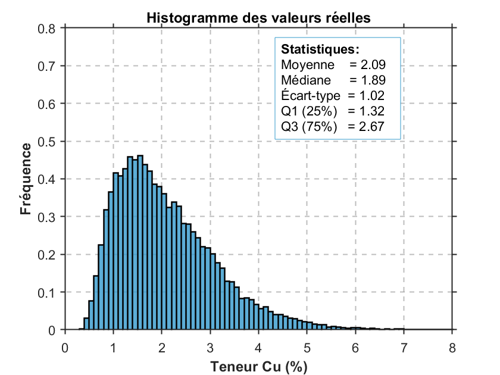
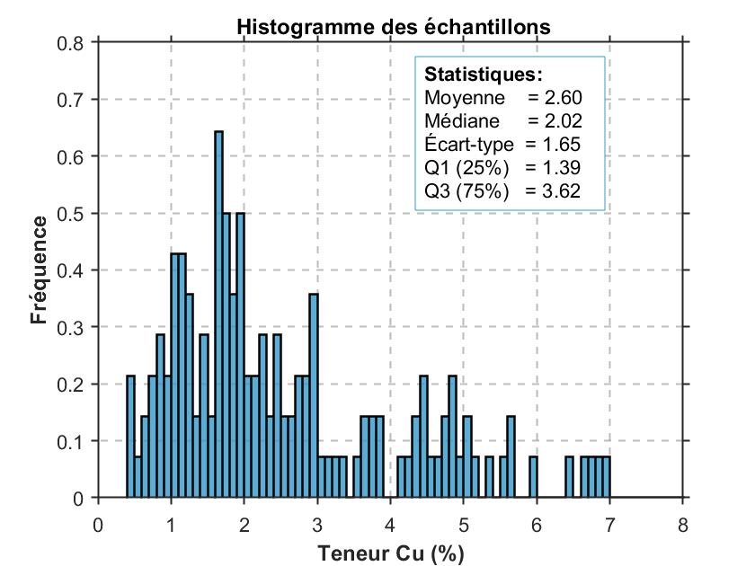
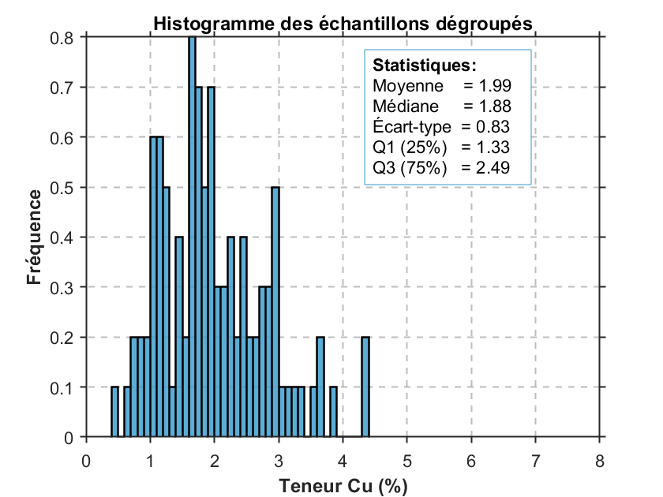

# 5.3 Débiaisement (*debiaising*) et dégroupement (*declustering*)

La dernière étapes afin d'assurer une représentativité adéquantes des
teneurs est le débiaisement et le dégroupement des données. Les données
de forage ne sont généralement pas collectées de manière aléatoire. Par
exemple, les forages sont souvent réalisés dans des zones à forte
teneur, qui sont prioritaires dans le calendrier d'exploitation. Ce
biais d'échantillonnage, bien que justifié d'un point de vue
opérationnel, fausse les statistiques globales. Il est donc nécessaire
d'ajuster les histogrammes et les statistiques descriptives afin
qu'elles soient représentatives de l'ensemble du volume d'intérêt.

## Mise en contexte

La [Fig. %s](#C5_Gisement.png) présente les teneurs en cuivre d'un gisement
synthétique suivant une distribution log-normale, de moyenne 2% et de
variance unitaire. Les cercles en surbrillance indiquent la position des
140 forages. Deux zones apparaissent comme suréchantillonnées : l'une au
centre de l'image, où 30 forages se concentrent dans une zone riche du
gisement (cercles rouges), et une autre dans le coin inférieur gauche,
où 10 forages représentent une zone de faible teneur (cercles bleus).

```{figure} images/C5_Gisement.png
:label: C5_Gisement.png
:align: center 
Teneurs en cuivre d'un gisement synthétique suivant une distribution log-normale, de moyenne 2% et de variance unitaire avec un échantillonnage ciblé.
```

La présence de zones de suréchantillonnage biaise le calcul de nos
statistiques descriptives (par exemple, moyenne, écart-type, quantiles).
Il va de soi que les 30 forages représentant une zone riche vont
augmenter la teneur moyenne de nos échantillons, rendant ainsi cette
moyenne non représentative de la teneur moyenne réelle du gisement. Dans
cette situation, il est nécessaire de procéder au débiaisement des
observations par le dégroupement de celles-ci.

La [Fig. %s](#C5_Histogramme) présente les histogrammes normalisés — c’est-à-dire ajustés pour permettre une comparaison équitable entre les distributions — des teneurs réelles du gisement ([Fig. %s](#C5_HistogrammeA)), des teneurs échantillonnées sans dégroupement ([Fig. %s](#C5_HistogrammeB)) et des teneurs après dégroupement ([Fig. %s](#C5_HistogrammeC)). Les statistiques descriptives sont affichées sur chaque histogramme.

La comparaison de ces statistiques permet de constater que les données brutes (figure centrale) sont fortement biaisées, en raison d'une surreprésentation des zones à haute teneur, causée par le biais d’échantillonnage. Après dégroupement, les statistiques descriptives se rapprochent nettement de celles du gisement réel : la moyenne passe de 2,60 % à 1,90 %, alors que celle du gisement est de 2,09 %. Ce rapprochement est observable pour l’ensemble des indicateurs descriptifs.

Cela illustre l’importance de corriger les biais d’échantillonnage, notamment lorsque les zones riches sont surexplorées. Dans cet exemple, l'absence de correction pourrait conduire à surestimer significativement la richesse du gisement.

::: {figure}
:label: C5_Histogramme
:align: center

(C5_HistogrammeA)=


(C5_HistogrammeB)=


(C5_HistogrammeC)=

:::

## Méthode de dégroupement

Les techniques de dégroupement visent à corriger les biais
d'échantillonnage en attribuant un poids à chaque donnée en fonction de
sa proximité avec les autres. Ces poids sont strictement positifs et
leur somme est égale à 1. Les statistiques sont ensuite calculées à
l'aide de ces poids pondérés.

On note plusieurs méthodes de dégroupement dans la littérature. Nous
nous limiterons aux trois méthodes les plus souvent implémentée dans les
logiciels de calcul de ressources et de réserves minières.

### Dégroupement polygonal

La méthode de dégroupement polygonal est sans doute la plus simple. Elle
attribue à chaque échantillon un poids proportionnel à la surface ou au
volume d'influence de celui-ci. Des études ont montré que cette approche
fonctionne bien lorsque les limites de la zone d'intérêt sont bien
définies et que le rapport entre le plus grand et le plus petit poids
est inférieur à 10 pour 1 [@Rossi2014].

La technique repose sur la construction de polygones d'influence
autour de chaque point d'échantillonnage. Ces polygones sont définis par
les médiatrices entre chaque paire de points voisins (Diagramme de
Voronoï). Un exemple simple de jeu de données avec polygones d'influence
est illustré à la [Fig. %s](#C5_Polygone.png)

```{figure} images/C5_Polygone.png
:label: C5_Polygone.png
:align: center 
```

Les polygones sont obtenues par la méthode de Voronoi, un algorithme
implémenté dans la grande majorité des logiciels. Nous verrons sa
construction en classe. Pour chaque polygone d'influence, on calcule
l'aire, puis on assigne à chaque échantillon un poids proportionnel à
l'aire de son polygone par rapport à la somme totale des aires de tous
les polygones, soit :

$$w_j = \frac{\text{A}_j}{\sum_{n=1}^{N} \text{A}_n}$$

où $w_j$ est le poids associé à l'échantillon $j$, $\text{A}_j$ est
l'aire de son polygone d'influence, et $N$ est le nombre total
d'échantillons.

La [Fig. %s](#C5_PolygoneDeclus.png) présente 27 données de forages et les
poids leurs étant associée par la méthode des polygone d'influence. On
peut constater que les poids sont les plus faible au centre ou plus de
données sont présente que sur les frontières ou les volumes sont plus
importants.

```{figure} images/C5_PolygoneDeclus.png
:label: C5_PolygoneDeclus.png
:align: center 
```

Cela constitue une grande limitation de la méthode des polygones. L'aire
associée aux échantillons périphériques est en effet très sensible à la
localisation de la frontière. La question de savoir comment définir
correctement cette frontière est complexe, car celle-ci est rarement
bien définie, surtout lorsqu'on s'éloigne du cœur du gisement. Ainsi, si
la frontière est située loin des données, les échantillons périphériques
se voient attribuer une quantité importante de poids, car l'aire de
leurs polygones d'influence augmente. En général, cette forte
sensibilité à la localisation de la limite est perçue comme une
faiblesse de la méthode de dégroupement polygonal. Une technique
courante consiste alors à appliquer une frontière fixe, correspondant à
la zone d'intérêt. Celle-ci peut être définie par des critères
géologiques, les limites de concessions, etc. Cette approche peut être
pertinente selon le contexte du problème. Une autre technique consiste à
attribuer une distance maximale d'influence aux échantillons, limitant
ainsi leur poids en fonction de cette distance.

### Dégroupement par plus proche voisin

La technique de dégroupement par voisin le plus proche est couramment
utilisée dans l'estimation des ressources et elle est similaire à la
méthode polygonale. La différence réside dans le fait qu'elle est
appliquée à une grille régulière de blocs ou de nœuds de grille. À
chaque bloc, le point le plus proche du jeu de données à dégrouper est
attribué. Comme elle s'applique directement sur les mêmes blocs utilisés
pour estimer les ressources, cette méthode est plus pratique dans le
cadre de l'estimation des ressources.

La [Fig. %s](#C5_PlusProcheDeclus.png) présente les mêmes 27 données de
forage que dans l'exemple précédent. Cette fois-ci, nous assignons
directement à chaque bloc le point de forage (cercles noirs) le plus
proche du centre du bloc (cercles rouges). Avec une densité de forages
très régulière, la méthode de dégroupement par voisin le plus proche est
pratiquement similaire à la méthode de dégroupement polygonal.
L'avantage de cette approche réside dans le fait que les données sont
directement associées au même support que celui utilisé pour les
opérations minières et le calcul des ressources.

```{figure} images/C5_PlusProcheDeclus.png
:label: C5_PlusProcheDeclus.png
:align: center 
```

### Dégroupement par cellules

La technique de dégroupement par cellules est une autre méthode
couramment utilisée et sûrement l'une des plus populaire. Le
dégroupement par cellules fonctionne comme suit :

1.  Diviser le volume d'intérêt en une grille de cellules
    $l = 1, \dots, L$.

2.  Compter les cellules occupées $L_o$ et le nombre de données dans
    chaque cellule occupée $n_{l_o}$, $l_o = 1, \dots, L_o$.

3.  Attribuer un poids à chaque donnée en fonction du nombre de données
    dans la même cellule. Par exemple, pour une donnée $i$ se trouvant
    dans la cellule $l$, le poids de dégroupement par cellule est donné
    par :
    $$w_i = \frac{1}{n_l \cdot L_o} \quad \text{si} \quad i \in l$$ Les
    poids sont supérieurs à zéro et leur somme est égale à un. Chaque
    cellule occupée se voit attribuer le même poids. Une cellule non
    occupée ne reçoit aucun poids.

La [Fig. %s](#C5_CellulesDeclus.png) présente les mêmes 27 données de forage
que dans les deux exemples précédents. Cette fois-ci, nous
comptabilisons le nombre de données situées à l'intérieur de chaque
cellule (délimitées par des encadrés noirs). Pour chaque cellule, un
poids provisoire est attribué à chaque point selon le principe suivant :
si une seule donnée est présente dans la cellule, son poids provisoire
est égal à 1 ; s'il y a deux données, chacune reçoit un poids de $1/2$ ;
plus généralement, pour $n$ données dans une cellule, chaque point
reçoit un poids provisoire de $1/n$.

Une fois ces poids provisoires calculés pour l'ensemble des données, ils
sont normalisés de manière à ce que leur somme soit égale à 1, en
divisant chaque poids par le nombre total de cellules occupées.

On observe également que certaines cellules ne contiennent aucune
donnée : dans ce cas, aucun poids n'est attribué, ce qui est représenté
visuellement par un cercle rouge vide.

```{figure} images/C5_CellulesDeclus.png
:label: C5_CellulesDeclus.png
:align: center 
```

Les poids de dégroupement attribués aux données dépendent de la taille
des cellules et de l'origine de la grille. Il est important de noter que
cette grille n'est qu'un outil intermédiaire pour calculer des poids de
dégroupement, et ne correspond pas à la grille finale utilisée pour la
modélisation du gisement.

Si les cellules sont très petites, chaque donnée se retrouve dans une
cellule unique, et toutes les données ont le même poids.

Si les cellules sont très grandes, toutes les données pourrait tomber
dans une unique cellule et reçoivent là encore un poids égal.

Le choix de la taille, de la forme et de l'origine de la grille demande
des tests de sensibilité. On cherche souvent à ajuster la taille des
cellules pour obtenir environ une donnée par cellule dans les zones
faiblement échantillonnées, ou à calquer la grille sur un maillage de
sondages quasi-régulier s'il existe.

Il est essentiel de vérifier la sensibilité des résultats aux variations
de la taille des cellules. Si une petite variation modifie fortement le
résultat, c'est sans doute dû à une ou deux données avec des valeurs
extrêmes mal pondérées.

Il est aussi courant d'ajuster les poids de manière à minimiser ou
maximiser la moyenne dégroupée, selon que le sur-échantillonnage se
produit dans des zones à forte ou faible teneur. On peut alors tracer
l'évolution de la moyenne dégroupée en fonction de la taille des
cellules pour guider le choix optimal (voir
[Fig. %s](#C5_CellSizeVsMean.png)).

Enfin, la forme des cellules doit s'adapter à la géométrie des données.
Par exemple, si les données sont plus denses dans une direction (par
exemple $X$), la taille des cellules dans cette direction doit être
réduite. On appelle ce concept l'anisotropie, et il s'applique à toute
méthode de déviation et de regroupement. Nous verrons en détail la notion d'anisotropie lorsque nous discuterons du variogramme.

```{figure} images/C5_CellSizeVsMean.png
:label: C5_CellSizeVsMean.png
:align: center 
```


