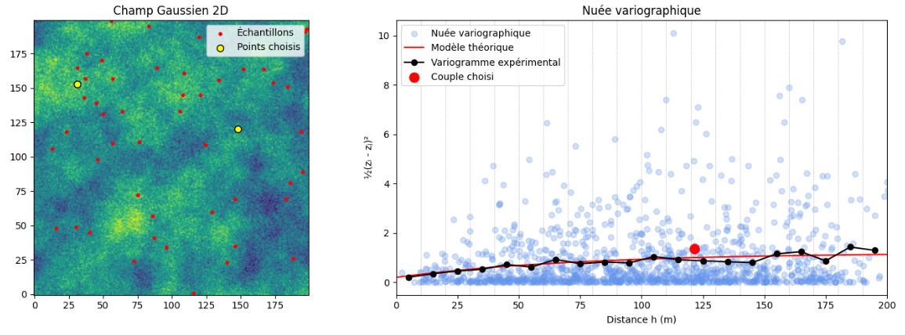

# 6.2 Estimation du variogramme

Le variogramme se calcule à partir des données observées grâce à la formule suivante :

$$
\gamma(h) = \frac{1}{2 N(h)} \sum_{i=1}^{N(h)} [Z(x_i + h) - Z(x_i)]^2
$$

où :

- $N(h)$ est le nombre de paires de points séparées par une distance $h$.

Cette formule est la version discrète de la définition théorique du variogramme présentée précédemment. Pour estimer le variogramme, il est donc essentiel d’identifier toutes les paires de points dont la distance correspond (ou est proche) à $h$.

Le variogramme ainsi calculé est appelé **variogramme expérimental**.


## Variogramme expérimental directionnel


Pour un champ donné, rien n'assure que la continuité soit identique dans toutes les directions. Par exemple, il se pourrait que des teneurs montrent une meilleure continuité parallèlement à la stratigraphie que perpendiculairement à celle-ci. De même, pour la contamination par des hydrocarbures, on pourrait observer une meilleure continuité horizontalement que verticalement en raison de la gravité. Si le nombre d'observations le permet (typiquement au moins 50, préférablement 100), on peut chercher à vérifier ce point en calculant le variogramme expérimental dans différentes directions.

On peut ainsi calculer le variogramme selon certaines directions spécifiques :

$$
\gamma(h, \theta) = \frac{1}{2N(h, \theta)} \sum_{i=1}^{N(h, \theta)} [Z(x_i + h) - Z(x_i)]^2
$$

où :

- $N(h, θ)$ est le nombre de paires séparées de $h$ dans la direction $\theta$.


En pratique, le choix de la tolérance sur $h$ et $\theta$ est crucial, car il permet de garantir que les paires de points sélectionnées sont suffisamment représentatives pour chaque classe de distance et direction. Cela permet de maintenir un équilibre entre la précision de l'estimation et la quantité de données disponibles. Une tolérance trop stricte peut réduire le nombre de paires, rendant l'estimation du variogramme moins fiable, tandis qu'une tolérance trop large peut inclure des points trop éloignés, faussant ainsi la modélisation des relations spatiales. 

La [Fig. %s](#C6_tolerance) illustre ce concept en montrant, pour différentes tolérances de distance ($h$) et d'angle ($\theta$), la sélection des points dans un cône de tolérance centré sur un point de référence. Chaque figure représente une variation des tolérances $h$ et $\theta$, visualisant l'impact de ces paramètres sur les points retenus pour le calcul du variogramme. Plus la tolérance est large, plus les points sélectionnés s'étendent dans l'espace, et inversement.

Une fois que le variogramme expérimental a été calculé pour chaque classe de tolérance, un modèle théorique est ajusté pour représenter la covariance entre les points. Ce modèle permet ensuite de prédire les relations spatiales pour des distances et directions non mesurées directement, facilitant les analyses géostatistiques à une échelle plus large. Ainsi, l'image sert à visualiser le rôle essentiel des tolérances dans la construction du variogramme expérimental, illustrant visuellement la manière dont elles influencent la sélection des points et, par conséquent, les résultats finaux de l'analyse géostatistique.

```{figure} images/C6_tolerance.PNG
:label: C6_tolerance
:align: center
Illustration de la tolérance angulaire en 2D.
```

## Nuée variographique

En géostatistique, la nuée variographique est un nuage de points représentant la variabilité des données en fonction de leur distance $h$. Il s'agit d'un autre moyen de représenter nos données pour le calcul du variogramme expérimental. 

Pour un jeu de données de la variable aléatoire $Z$ aux emplacements $x_1, \ldots, x_n$, la nuée variographique est constituée des points dont :

- l’abscisse correspond à la distance entre deux points, c’est-à-dire $|x_i - x_j|$, ou simplement la distance $h$ entre ces deux points
- l’ordonnée correspond au carré de la différence des valeurs mesurées, soit $\frac{1}{2} \left[ Z(x_i) - Z(x_j) \right]^2$.

Cette représentation graphique illustre toutes les contributions individuelles au calcul du variogramme expérimental. Lorsqu’on choisit une tolérance sur la distance, on forme des classes (ou *bins*) d’une certaine largeur. On sélectionne alors tous les points du nuage appartenant à cette classe, et en calculant leur moyenne, on obtient la valeur du variogramme expérimental pour cette classe. La distance représentative de la classe correspond au centre de gravité du nuage des points pour cette classe.

On peut visualiser la nuée variographique sous forme de nuage de points. La [Fig. %s](#C6_nuee) présente plusieurs nuée variographique en fonction de la largeur de la tolérence sur la distance. On peut identifier notre variogramme expérimentale (courbe noir), le modèele théorique (courbe rouge) et la nuée de point. Ici, le variogramme est dit omnidirectional, car il ne dépend pas de l'angle $\theta$, mais seulement de la distance. 


::: {figure}
:label: C6_nuee
:align: center

(C6_nueeA)=


(C6_nueeB)=


(C6_nueeC)=


:::

## Exemple numérique du calcul du variogramme expérimental

### Exemple directionnel simple 2D 
Soit une matrice de données $3 \times 3$ :

$$
\begin{bmatrix}
3 & 6 & 5 \\
7 & 2 & 2 \\
4 & \text{NaN} & 0
\end{bmatrix}
$$

La distance entre deux éléments consécutifs, horizontalement ou verticalement, est de 1 m. La valeur `NaN` indique une donnée manquante.

Nous cherchons à calculer le variogramme expérimental dans la direction horizontale pour une distance de 1 m. La première étape revient à identifier les paires de points respectant ces contraintes. Ainsi, on considère les paires de points alignés horizontalement : $(3, 6)$, $(6, 5)$, $(7, 2)$, $(2, 2)$ pour un nombre de paires : $N(h_h=1) = 4$. Le variogramme expérimental est alors :

$$
\gamma(h_h=1) = \frac{1}{2 N(h_h=1)} \sum [Z(x + h) - Z(x)]^2 = \frac{1}{8}[(3 - 6)^2 + (6 - 5)^2 + (7 - 2)^2 + (2 - 2)^2] = \frac{1}{8}[9 + 1 + 25 + 0] = 4.375
$$

Pour $h = 2$, nous avons les paires de points suivantes : $(3, 5)$, $(7, 2)$ et $(4, 0)$, pour un total de nombre de paires : $N(h_h = 2) = 3$. Le variogramme expérimental est alors :

$$
\gamma(h_h = 2) = \frac{1}{6}[(3 - 5)^2 + (7 - 2)^2 + (4 - 0)^2] = \frac{1}{6}[4 + 25 + 16] = 7.5
$$

| $h$ | $\gamma(h_h)$ | $N(h_h)$ |
|------|-------------|--------|
| 1    | 4.375       | 4      |
| 2    | 7.5         | 3      |

---

Pour la direction verticale avec $h_v = 1$, nous avons les paires suivantes : $(3, 7)$, $(6, 2)$, $(5, 2)$, $(7, 4)$ et $(2, 0)$ pour $N(h_v=1) = 5$. Le variogramme expérimental pour cette classe est alors :

$$
\gamma(h_v=1) = \frac{1}{10}[(3 - 7)^2 + (6 - 2)^2 + (5 - 2)^2 + (7 - 4)^2 + (2 - 0)^2] = \frac{1}{10}[16 + 16 + 9 + 9 + 4] = 5.4
$$

De même, pour $h_v=2$, nous avons les paires : $(3, 4)$ et $(5, 0)$ pour $N(h_v=2) = 2$ et la valeur suivante pour le variogramme expérimental :

$$
\gamma(h_v=2) = \frac{1}{4}[(3 - 4)^2 + (5 - 0)^2] = \frac{1}{4}[1 + 25] = 6.5
$$

| $h$ | $\gamma(h_v)$ | $N(h_v)$ |
|------|-------------|--------|
| 1    | 5.4         | 5      |
| 2    | 6.5         | 2      |

Il est aussi possible de calculer le variogramme pour une direction diagonale à 45°, ce qui donne les paires diagonales (distance $\sqrt{2} \approx 1.41$) suivantes : $(3, 2)$, $(6, 2)$ et $(2, 0)$ pour $N(h_{45°} \approx 1.41) = 3$ et la valeur de variogramme expérimentale suivante :

$$
\gamma(h_{45°} \approx 1.41) = \frac{1}{6}[(3 - 2)^2 + (6 - 2)^2 + (2 - 0)^2] = \frac{1}{6}[1 + 16 + 4] = 3.5
$$

Pour $h_{45°} \approx 2.82$ (deux pas diagonaux), nous avons une paire : $(3, 0)$ pour la valeur de variogramme expérimentale suivante :

$$
\gamma(h_{45°} \approx 2.82) = \frac{1}{2}(3 - 0)^2 = \frac{1}{2}(9) = 4.5
$$

| $h$   | $\gamma(h_{45°})$ | $N(h_{45°})$ |
|-------|-------------|--------|
| 1.41  | 3.5         | 3      |
| 2.82  | 4.5         | 1      |

---


### Exemple 1D : Comparaison de deux séries

Soient les deux séries suivantes :

- Série 1 : `0 1 2 3 2 1 0`  
- Série 2 : `3 1 0 2 1 2 0`

Ces deux séries ont la même moyenne et la même variance, mais leur structure spatiale est différente. La première série est plus continue que la seconde, car les valeurs de son variogramme augmentent de manière plus graduelle avec la distance. En comparaison, la seconde série présente des valeurs de variogramme très proches les unes des autres, ce qui suggère une absence de structure spatiale claire.

Leurs variogrammes :

| $h$ | $\gamma(h)$ - Série 1 | $\gamma(h)$ - Série 2 |
|-----|------------------------|------------------------|
| 1   | 0.5                    | 1.25                   |
| 2   | 1.6                    | 1.2                    |
| 3   | 2.5                    | 1.13                   |
