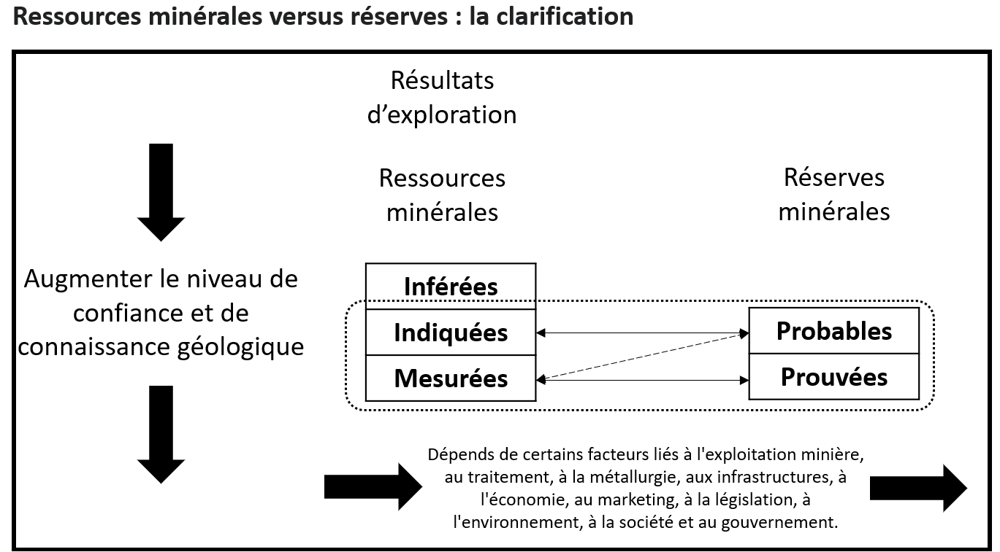

## Classification des ressources et des réserves minières

L'estimation d'un gisement minier repose toujours sur des données géologiques incomplètes et incertaines. Il faut donc des définitions normalisées pour communiquer, de manière claire et cohérente, le niveau de confiance associé aux ressources et aux réserves minérales.

Au Canada, les définitions utilisées pour classer les ressources et les réserves minérales proviennent de l'Institut canadien des mines, de la métallurgie et du pétrole, aussi appelé ICM ou CIM (*Canadian Institute of Mining, Metallurgy and Petroleum*). Elles servent ensuite de référence dans les rapports techniques préparés conformément à la norme NI 43-101.

L'estimation et la divulgation des ressources et des réserves minérales s'appuient généralement sur un modèle de blocs, lequel peut être considéré comme une discrétisation tridimensionnelle de l'enveloppe minéralisée. Ce modèle constitue le support numérique utilisé pour représenter la distribution spatiale des propriétés géologiques, géotechniques et économiques du gisement.

### Introduction aux modèles de blocs

Un modèle de blocs est une représentation discrétisée du volume étudié. Puisqu'il n'est pas possible d'estimer directement une teneur en tout point du sous-sol, le gisement est subdivisé en blocs de dimensions définies, par exemple 15 m × 15 m × 15 m. Une valeur, estimée ou simulée, est ensuite attribuée à chacun de ces blocs à partir des données disponibles, des interprétations géologiques et des méthodes d'estimation retenues. Combinée au volume du bloc et à sa densité, la teneur ainsi attribuée permet de calculer directement le tonnage de métal qu'il contient.

Chaque bloc constitue donc une unité de calcul à laquelle peuvent être associées différentes propriétés : teneur, densité, type de roche, caractéristiques géophysiques, données géochimiques ou type d'altération. Il peut également porter des variables catégorielles ou probabilistes, comme la probabilité d'appartenance à une zone minéralisée, à une unité géologique donnée, ou à une classe de potentiel de drainage minier acide (DMA) ou de drainage neutre contaminé (DNC).

{#fig-bloc-modele width=80%}

L'objectif est ensuite d'estimer les propriétés de chacun de ces blocs à partir des données disponibles. Comme les forages n'observent qu'une faible portion du gisement, les valeurs attribuées aux blocs doivent être déduites des observations existantes, de l'interprétation géologique et, le cas échéant, par des méthodes géostatistiques.

Le modèle de blocs devient alors un outil de planification minière. Dans certaines méthodes d'exploitation, notamment lorsqu'on cherche à extraire préférentiellement les zones les plus riches du gisement, les décisions peuvent être prises à l'échelle des blocs. On parle alors d'**exploitation sélective**.

En exploitation sélective, l'idée est de séparer les parties du gisement qui valent la peine d'être exploitées de celles qui ne le sont pas. Le modèle de blocs permet d'effectuer cette sélection. Chaque bloc est évalué selon sa teneur et sa valeur économique : les blocs rentables peuvent être envoyés au concentrateur, tandis que les blocs moins intéressants sont dirigés vers la halde à stérile ou exclus du plan d'exploitation. Le plus petit volume qu'on peut ainsi trier comme minerai ou comme stérile porte un nom : l'**unité d'exploitation sélective** (*selective mining unit*, SMU). Nous reviendrons sur le rôle du support du bloc au chapitre consacré à la variance de bloc.

Il faut aussi garder à l'esprit qu'atteindre un bloc rentable suppose souvent d'extraire d'abord le stérile qui le recouvre ou l'entoure : un bloc riche enfoui sous une épaisse couverture stérile n'a pas la même valeur qu'un bloc riche affleurant. La rentabilité dépend donc de la teneur moyenne du gisement et de l'organisation spatiale des teneurs. Deux gisements de même distribution peuvent présenter des réalités minières opposées : si les blocs à forte teneur forment une zone continue, ils sont faciles à isoler et à exploiter; s'ils sont dispersés et mêlés à des blocs pauvres, l'extraction sélective devient beaucoup moins efficace. La continuité spatiale des zones riches compte autant que la moyenne.

Dans ce manuel, nous utiliserons ce cadre simplifié pour introduire les notions de ressources, de réserves et d'estimation géostatistique. Il faut toutefois retenir que le choix réel d'une méthode d'exploitation dépend de nombreux facteurs, dont la géométrie du gisement, sa profondeur, la distribution des teneurs, les contraintes géotechniques, les coûts d'extraction et le modèle de blocs construit.

## 🧮 Atelier interactif 1.1 — Modèle de blocs 3D {.unnumbered}

Explorez huit gisements de cuivre synthétiques en 3D, chacun généré à partir d'une fonction de covariance différente, qui gouverne la continuité spatiale du gisement. Le menu déroulant *Style de gisement* permet de passer d'un scénario à l'autre.

Pour chaque scénario, ajustez la teneur de coupure pour voir quels blocs seraient considérés comme économiquement exploitables, et utilisez le bouton « Nouveau gisement » pour régénérer une réalisation différente du même style. La forme du gisement (son enveloppe), les forages et la topographie sont également régénérés. Faites pivoter le modèle (glisser) et zoomez (molette) pour comparer la forme et la continuité du gisement entre les scénarios.

La version web de ce document permet de manipuler directement cet atelier en 3D.



### Ressources et réserves

Une **ressource minérale** est une concentration de matière minéralisée présentant des perspectives raisonnables d'extraction économique. Elle repose sur les informations géologiques, les données d'échantillonnage et l'estimation des teneurs : elle décrit le potentiel géologique du gisement.

Une **réserve minérale** est la partie d'une ressource mesurée ou indiquée dont l'extraction économique est démontrée par une étude technique et économique. Elle correspond à la portion réellement exploitable de ce potentiel, compte tenu de facteurs miniers, métallurgiques, économiques, environnementaux, sociaux, juridiques et réglementaires.

### Catégories de ressources et de réserves 

Les ressources minérales sont classées en trois catégories reconnues à l'échelle internationale et utilisées dans les rapports conformes à la norme NI 43-101. Ces catégories reflètent des niveaux croissants de confiance géologique.

Ce niveau de confiance ne se résume toutefois pas à une règle numérique unique. Il dépend de plusieurs éléments, tels que la qualité des données, leur densité, leur répartition dans le gisement, la méthode d'estimation utilisée et la compréhension géologique du dépôt. Il repose ainsi sur le jugement professionnel de la personne qualifiée qui a préparer le rapport.

Les définitions présentées ici sont adaptées des CIM Definition Standards, auxquels renvoie la NI 43-101. D'autres codes, comme le JORC en Australasie ou le SME aux États-Unis, suivent une logique comparable.

::: {#def-ressources-inferees}
## Ressources Inférées

Partie d'une ressource minérale dont la quantité et la teneur sont estimées sur la base de preuves géologiques et d'un échantillonnage limité. Ces preuves sont suffisantes pour inférer, mais non pour démontrer de façon fiable, la continuité géologique et celle des teneurs. Le niveau de confiance est donc faible. Typiquement, les données proviennent d'affleurements, de tranchées, de travaux de développement ou de forages. La confiance accordée à ces estimations n'est pas suffisante pour permettre une analyse économique — aucune réserve minérale ne peut être définie à partir de cette catégorie.
:::

::: {#def-ressources-indiquees}
## Ressources Indiquées

Partie d'une ressource minérale pour laquelle la quantité, la teneur, la densité, la forme et les caractéristiques physiques sont estimées avec un niveau de confiance raisonnable. Les données sont suffisamment abondantes et bien réparties pour supposer la continuité géologique et/ou minéralisée, sans pour autant pouvoir la démontrer entièrement. Ce niveau de confiance permet généralement une première analyse économique et la planification préliminaire du projet minier.
:::

::: {#def-ressources-mesurees}
## Ressources Mesurées

Partie d'une ressource minérale pour laquelle les paramètres géologiques (quantité, teneur, densité, forme, propriétés physiques) sont estimés avec un haut niveau de confiance. Les données disponibles sont suffisamment abondantes et rapprochées pour démontrer clairement la continuité géologique et/ou la continuité de la minéralisation. Ce niveau de certitude permet une planification minière détaillée ainsi qu'une évaluation économique fiable du gisement.
:::

Le passage d'une ressource mesurée ou indiquée à une réserve doit être démontré par une étude de préfaisabilité ou de faisabilité, qui établit qu'au moment de la déclaration l'extraction est raisonnablement justifiée. La @fig-reserves-ressources illustre les facteurs modificateurs qui gouvernent ce passage.

{#fig-reserves-ressources}

Comme les ressources, les réserves se déclinent en catégories de confiance, qui héritent de la catégorie de la ressource dont elles proviennent.

::: {#def-reserve-prouvee}
## Réserve prouvée

Partie économiquement exploitable d'une ressource mesurée, dont l'extraction au moment de la déclaration est démontrée par au moins une étude de préfaisabilité. C'est la catégorie de réserve au plus haut niveau de confiance.
:::

::: {#def-reserve-probable}
## Réserve probable

Partie économiquement exploitable d'une ressource indiquée — et, dans certaines circonstances, mesurée —, également démontrée par au moins une étude de préfaisabilité. Une ressource inférée, elle, ne peut jamais être convertie en réserve.
:::

Au regard de ces définitions, une certaine subjectivité demeure et se reflète dans la lecture des rapports techniques conformes à la NI 43-101. Certaines compagnies minières fondent leurs estimations des ressources et des réserves sur des critères qualitatifs, tandis que d'autres recourent à des méthodes quantitatives rigoureuses. En vertu même de ces définitions, toute approche permettant d'en évaluer le niveau de confiance pourrait être acceptée.

## 🧮 Atelier interactif 1.2 — Classification 3D des ressources : la passe d'estimation et son impact {.unnumbered}

Cet atelier reprend en 3D le même gisement que l'atelier précédent : seule la légende change, puisqu'elle représente maintenant la classe de ressource de chaque bloc (*Mesuré*, *Indiqué*, *Inféré*, *Non classé*) plutôt que sa teneur.

Les deux critères de classification sont affichés côte à côte, calculés sur le même gisement et les mêmes forages : seule la règle de classification diffère.

- **Passe d'estimation (géométrique)** — vue de gauche. Autour de chaque bloc, on vérifie, dans 8 octants, la présence d'un forage (composite) : *Mesuré* si tous les octants en ont un dans le rayon $x$, *Indiqué* si au moins 5 en ont un dans le rayon $2x$, *Inféré* si au moins 1 en a un, sinon *Non classé*.
- **Efficacité de krigeage (KE)** — vue de droite. L'efficacité du krigeage, $\mathrm{KE} = 1 - \sigma_{OK}^2 / \sigma^2$, mesure la réduction de la variance obtenue grâce au krigeage, une méthode d'estimation géostatistique. *Mesuré* si $\mathrm{KE} \ge 0,6$, *Indiqué* entre 0,2 et 0,6, *Inféré* entre 0 et 0,2, sinon *Non classé*.

Faites pivoter l'un des deux modèles — ils tournent ensemble pour faciliter la comparaison — et ajustez le rayon $x$ de la passe d'estimation. Les cases *Mesuré / Indiqué / Inféré* permettent d'isoler une classe à la fois dans les deux vues. Comparez : le critère géométrique dépend surtout de la densité et de la disposition des forages, tandis que le critère KE tient également compte de la continuité spatiale du gisement.

Consulté la version web du document pour l'atelier.



Cet exercice illustre bien la part de jugement professionnel évoquée plus haut : selon le critère retenu, géométrique ou fondé sur l'efficacité de krigeage, la même réalité géologique peut donner lieu à des classifications différentes. Cette diversité d'approches se retrouve d'ailleurs, d'une compagnie minière à l'autre, dans la lecture des rapports techniques conformes à la NI 43-101. 

### Disponibilité des rapports techniques NI 43-101

Les rapports techniques conformes à la NI 43-101 sont publics et peuvent être consultés librement, notamment sur le site SEDAR+ (le portail de Dépôt, de Déclaration et de Recherche d'information sur les marchés des capitaux du Canada, accessible à l'adresse [SEDAR+](https://www.sedarplus.ca/accueil/)).

