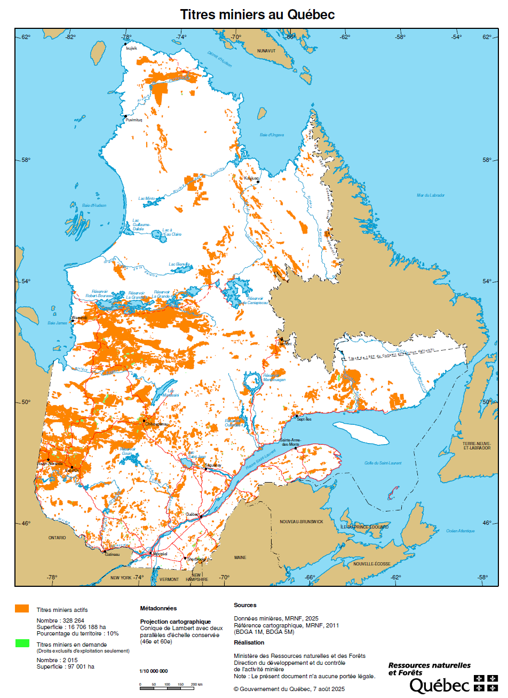
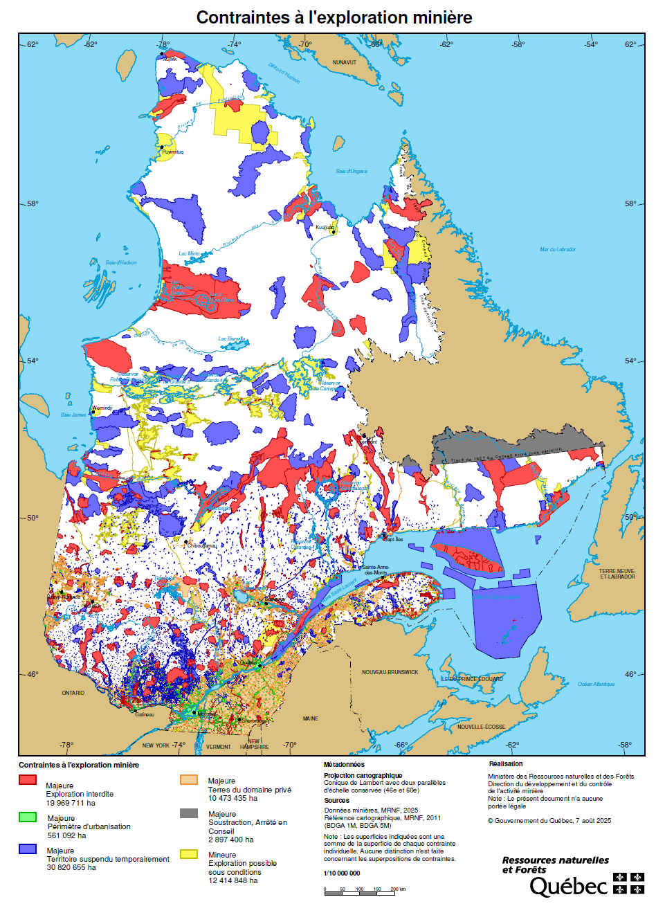
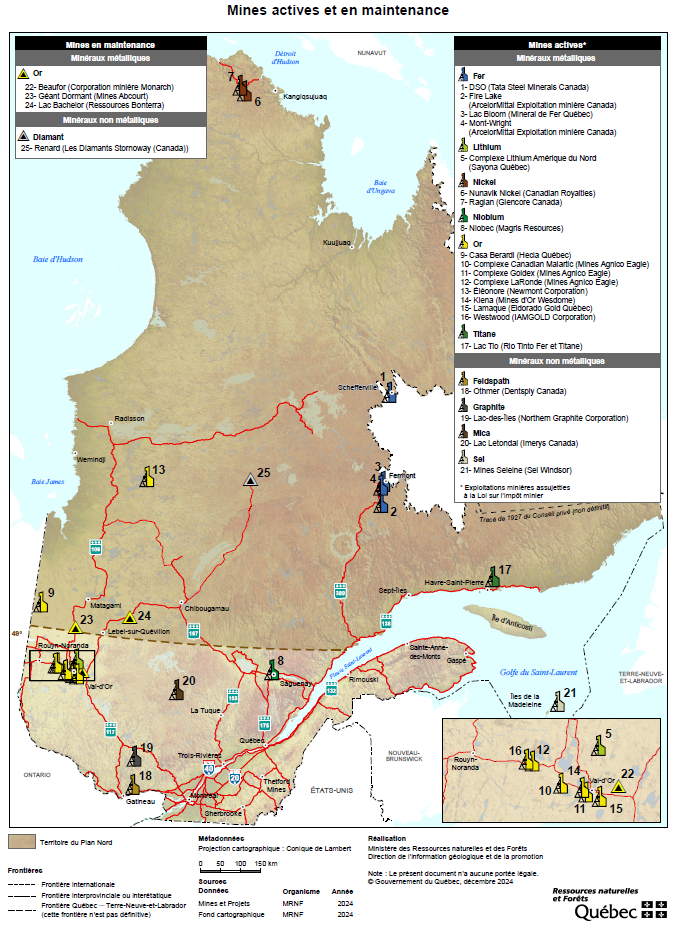
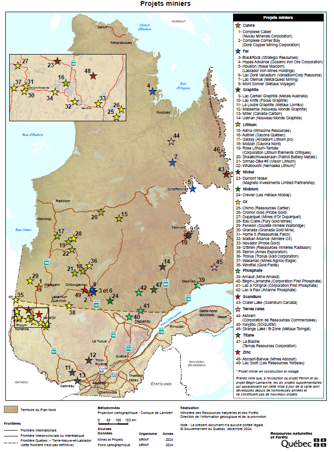

## Loi sur les mines du Québec

Au Québec, l'exploration et l'exploitation minières s'inscrivent dans un cadre légal défini principalement par la Loi sur les mines. Ce cadre fixe les droits d'exploration, les conditions d'exploitation, les autorisations requises ainsi que les obligations de fermeture et de restauration des sites.

La Loi sur les mines complète ainsi le rapport technique NI 43-101. Ce dernier répond surtout à la question « que sait-on du projet et avec quel niveau de confiance? », tandis que la Loi répond à une autre : « quels droits, quelles obligations et quelles autorisations encadrent les activités minières sur le territoire québécois? »

Concrètement, la Loi sur les mines définit les droits permettant d'explorer ou d'exploiter les substances minérales, dont le droit exclusif d'exploration (DEE), anciennement appelé « claim », et les différents baux d'exploitation. Elle s'applique aux terres publiques et privées et couvre également des substances de surface comme le sable et le gravier.

L'obtention d'un DEE confère à son titulaire un droit exclusif d'exploration sur le territoire visé. Ce droit ne signifie toutefois pas que toutes les activités peuvent être exercées librement. Les travaux plus importants, et à plus forte raison l'exploitation d'une mine, doivent respecter d'autres exigences et obtenir les autorisations nécessaires auprès des autorités compétentes.

L'application de la Loi sur les mines diffère entre les régions de la Baie-James et du Nord québécois, en raison de conventions spécifiques conclues, notamment la Convention de la Baie-James et du Nord québécois ainsi que celle du Nord-est québécois.

La Loi sur les mines encadre les différentes étapes d'un projet minier :

- **Enregistrement** : obtention d'un DEE sur un territoire donné;  
- **Exploration minière** : recherche et prospection des minéraux;  
- **Exploitation minière** : développement des installations et extraction des ressources (mines, carrières, sablières);  
- **Clôture des opérations minières** : fermeture des sites et réhabilitation des terrains.

Face à une forte augmentation du nombre de DEE au cours des cinq dernières années, ainsi qu'aux préoccupations soulevées par la société civile, le gouvernement a lancé une vaste consultation en 2023, puis a déposé le projet de loi 63 au printemps 2024.

L'un des changements visibles porte sur le vocabulaire utilisé. Le terme « claim », longtemps employé, a été remplacé par « droit exclusif d'exploration » ou DEE. Les deux expressions renvoient essentiellement au même type de droit, à savoir celui d'explorer un territoire donné afin d'y rechercher des substances minérales.

Toutefois, afin de préserver la cohérence avec certains contextes historiques, des documents antérieurs ou des rapports techniques plus anciens, le terme « claim » pourra encore être utilisé dans la pratique professionnelle.

### Droit minier québécois actuel

Le régime minier au Québec s'appuie encore en grande partie sur le principe du libre accès. Ce système permet à toute personne d'obtenir un DEE, sauf pour certaines substances exclues par la loi, telles que le pétrole, le gaz naturel, la saumure ou certains matériaux de construction. Le fonctionnement repose sur le principe du premier arrivé, premier servi : la première personne à faire la demande obtient l'exclusivité d'explorer un territoire donné et, en cas de découverte, a la priorité pour entamer les démarches d'exploitation.

Sur un terrain privé, le détenteur d'un DEE ne peut pas simplement entrer sur le site sans autorisation. Il doit d'abord obtenir l'accord du propriétaire. Certaines règles particulières peuvent également s'appliquer dans les zones périurbaines ou dans des secteurs où des droits existent déjà. En règle générale, les substances minérales relèvent du domaine public, mais la loi prévoit quelques exceptions, notamment en cas de droits acquis.

Le DEE est aujourd'hui le seul titre d'exploration pour la recherche de substances minérales. Son mode d'acquisition principal est la désignation sur carte, qui tend à devenir exclusif, bien que le jalonnement reste autorisé dans certaines zones pendant une période transitoire. En territoire arpenté, les DEE coïncident avec les lots et les rangs; en territoire non arpenté, ils couvrent une superficie de 30 secondes de latitude (environ 926 mètres) sur 30 secondes de longitude (environ 655 mètres à la latitude 45°), ce qui correspond à une superficie variant de 40 à 61 hectares selon la latitude. Aucun DEE ne peut être obtenu sur un terrain déjà visé par un autre DEE ou par un bail minier. La carte des titres miniers (@fig-carte-dee) illustre l'étendue de ces droits sur le territoire québécois.

Les titulaires d'un DEE doivent réaliser des travaux statutaires dont le coût minimal varie selon la superficie du terrain, le nombre de périodes de validité écoulées — chaque période étant d'une durée de deux ans — et la localisation du DEE par rapport au 52^e^ parallèle. À titre d'exemple, pour un DEE de 40 hectares situé au sud du 52ᵉ parallèle, le montant minimal exigé est de 1 200 $ pour chacune des trois premières périodes de validité. Il passe ensuite à 1 800 $ pour chacune des trois périodes suivantes, puis atteint un plafond de 2 500 $ pour les périodes subséquentes (tiré du M-13.1, r. 2 - Règlement sur les mines - À jour au 1er février 2026^[https://www.legisquebec.gouv.qc.ca/fr/document/rc/M-13.1,%20r.%202/]).

Ces travaux peuvent comprendre des études techniques réalisées par un professionnel, la prospection géologique, géophysique ou géochimique, le levé de lignes, le décapage ou l'excavation de roches, l'échantillonnage, le forage et l'analyse de carottes, ainsi que des études de faisabilité ou des travaux de restauration. Les dépenses excédentaires peuvent être reportées sur des périodes futures ou imputées à d'autres DEE.

Les tableaux suivants présentent les dépenses minimales exigées selon la localisation et la superficie du terrain :

::: {#tbl-couts-nord}
| Nombre de périodes de validité du DEE | Moins de 25 ha | 25 à 45 ha | Plus de 45 ha |
|---------------------------------------|----------------|------------|---------------|
| 1                                     | 48 $           | 120 $      | 135 $         |
| 2                                     | 160 $          | 400 $      | 450 $         |
| 3                                     | 320 $          | 800 $      | 900 $         |
| 4                                     | 480 $          | 1 200 $    | 1 350 $       |
| 5                                     | 640 $          | 1 600 $    | 1 800 $       |
| 6                                     | 750 $          | 1 800 $    | 1 800 $       |
| 7 et plus                             | 1 000 $        | 2 500 $    | 2 500 $       |

Coût minimum des travaux au nord du 52^e^ degré de latitude selon la superficie du terrain faisant l'objet du DEE (M-13.1, r. 2 - Règlement sur les mines - À jour au 1er février 2026).
:::

::: {#tbl-couts-sud}
| Nombre de périodes de validité du DEE | Moins de 25 ha | 25 à 100 ha | Plus de 100 ha |
|---------------------------------------|----------------|-------------|----------------|
| 1                                     | 500 $          | 1 200 $     | 1 800 $        |
| 2                                     | 500 $          | 1 200 $     | 1 800 $        |
| 3                                     | 500 $          | 1 200 $     | 1 800 $        |
| 4                                     | 750 $          | 1 800 $     | 2 700 $        |
| 5                                     | 750 $          | 1 800 $     | 2 700 $        |
| 6                                     | 750 $          | 1 800 $     | 2 700 $        |
| 7 et plus                             | 1 000 $        | 2 500 $     | 3 600 $        |

Coût minimum des travaux au sud du 52^e^ degré de latitude selon la superficie du terrain faisant l'objet du DEE (M-13.1, r. 2 - Règlement sur les mines - À jour au 1er février 2026).
:::

En plus des dépenses liées aux travaux d'exploration, le titulaire d'un DEE doit également payer des frais d'inscription et de renouvellement. Ces frais varient selon la superficie du terrain, sa localisation et le nombre de DEE inscrits simultanément sur un même feuillet cartographique.

Par exemple, avec la tarification en vigueur au 1^er^ janvier 2026, l'inscription d'un DEE de 25 à 45 hectares coûte 149,00 $ au nord du 52e parallèle. Au sud du 52e parallèle, le coût est de 80,75 $ pour un DEE de 25 à 100 hectares. Le renouvellement suit la même logique et les montants peuvent augmenter si la demande est effectuée dans les 60 jours précédant l'expiration du titre.

Le tableau suivant résume les principaux coûts d'acquisition des DEE selon le contexte de tarification et l'indexation des droits, loyers, redevances et frais applicables en 2026^[https://www.mern.gouv.qc.ca/mines/titres-miniers/exploration/tarification-indexation-droits-loyers-redevances-frais/].

::: {#tbl-tarifs-dee}
| Article du règlement | Description | Spécification | Tarif (au 1^er^ janvier 2026) |
|----------------------|-------------|---------------|-------------------------------|
| **Droits d'inscription par droit exclusif d'exploration** | **Nord du 52^e^ degré de latitude** | De 1 à 150 droits exclusifs d'exploration | |
| | | < 25 ha | 41,50 $ |
| | | 25 à 45 ha | 149,00 $ |
| | | > 45 à 50 ha | 168,00 $ |
| | | > 50 ha | 188,00 $ |
| **Droits d'inscription par droit exclusif d'exploration** | **Nord du 52^e^ degré de latitude** | Plus de 150 droits exclusifs d'exploration (même journée, même titulaire) | |
| | | < 25 ha | 207,50 $ |
| | | 25 à 45 ha | 745,00 $ |
| | | > 45 à 50 ha | 840,00 $ |
| | | > 50 ha | 940,00 $ |
| **Droits d'inscription par droit exclusif d'exploration** | **Sud du 52^e^ degré de latitude** | De 1 à 40 droits exclusifs d'exploration | |
| | | < 25 ha | 41,50 $ |
| | | 25 à 100 ha | 80,75 $ |
| | | > 100 ha | 122,00 $ |
| **Droits d'inscription par droit exclusif d'exploration** | **Sud du 52^e^ degré de latitude** | Plus de 40 droits exclusifs d'exploration (même journée, même titulaire) | |
| | | < 25 ha | 207,50 $ |
| | | 25 à 100 ha | 403,75 $ |
| | | > 100 ha | 610,00 $ |
| **Droits pour le renouvellement par droit exclusif d'exploration** | **Nord du 52^e^ degré de latitude** | | |
| | | < 25 ha | 41,50 $ |
| | | 25 à 45 ha | 149,00 $ |
| | | > 45 à 50 ha | 168,00 $ |
| | | > 50 ha | 188,00 $ |
| **Droits pour le renouvellement par droit exclusif d'exploration** | **Sud du 52^e^ degré de latitude** | | |
| | | < 25 ha | 41,50 $ |
| | | 25 à 100 ha | 80,75 $ |
| | | > 100 ha | 122,00 $ |
| **Frais d'inscription au registre public des droits miniers** | | | |
| | | Par droit minier | 23,00 $ |
| | | Maximum par acte | 1 868,00 $ |
| **Droits de participation au tirage au sort** | | | |
| | | Par demande d'autorisation | 188,00 $ |
| | | Par droit minier (autres cas) | 188,00 $ |

Tarification des droits d'inscription et de renouvellement des DEE (1^er^ janvier 2026)
:::

### Permis et baux d'exploitation 

Depuis le 1^er^ janvier 2014, les loyers annuels des baux miniers sont calculés par hectare et varient selon que les terres sont concédées ou font partie du domaine de l'État. Par exemple, le montant du loyer annuel pour un bail minier est de 59,25 $/ha si le terrain est situé sur les terres du domaine de l'État ou de 28,25 $/ha si le terrain est situé sur des terres concédées ou aliénées par l'État à des fins autres que minières (M-13.1, r. 2 - Règlement sur les mines - À jour au 1er février 2026).

Le titulaire d'un DEE peut demander un bail minier lorsque les travaux ont permis de démontrer la présence de réserves exploitables, au sens de la Loi sur les mines. Cette démonstration doit être appuyée par un rapport signé par un ingénieur ou un géologue. En règle générale, la superficie du bail ne peut pas dépasser 100 hectares, sauf autorisation particulière du ministère. Le bail est accordé pour une première période de 20 ans. Il peut ensuite être renouvelé trois fois pour des périodes de 10 ans, puis prolongé par périodes de 5 ans après le troisième renouvellement.

Pour les substances minérales de surface (SMS), il existe deux types de baux : exclusifs et non exclusifs. Les loyers dépendent de la durée du bail et de la nature de la ressource. Le montant du loyer que doit acquitter le demandeur de bail exclusif pour l'exploitation de substances minérales de surface autres que la tourbe est fixé selon la durée du bail, conformément au tableau suivant :

::: {#tbl-loyers-sms}
| Durée du bail | Montant du loyer |
|---------------|------------------|
| 5 ans et moins | 3 974 $ |
| Plus de 5 ans à 6 ans | 4 766 $ |
| Plus de 6 ans à 7 ans | 5 561 $ |
| Plus de 7 ans à 8 ans | 6 361 $ |
| Plus de 8 ans à 9 ans | 7 152 $ |
| Plus de 9 ans à 10 ans | 7 946 $ |

Loyers pour baux exclusifs d'exploitation de substances minérales de surface (M-13.1, r. 2 - Règlement sur les mines - À jour au 1er février 2026)
:::

Le montant du loyer pour l'exploitation de la tourbe est de 11 919 $. Les frais à acquitter pour une demande d'augmentation de la superficie d'un territoire faisant l'objet d'un bail exclusif d'exploitation de substances minérales de surface, faite conformément à l'article 146 de la Loi, s'élèvent à 182 $.

#### Redevances sur les substances minérales de surface

Sauf exemption prévue au troisième alinéa de l'article 155 de la Loi, la redevance due par le titulaire d'un bail d'exploitation de substances minérales de surface, ou par l'exploitant ou la personne visée à l'article 223.1, est fixée selon la quantité extraite ou aliénée, comme indiqué dans le tableau ci-dessous :

::: {#tbl-redevances-sms}
| Substances minérales de surface | Montant de la redevance |
|--------------------------------|-------------------------|
| Tourbe | 0,05 $ par ballot standard de tourbe extraite |
| Sable, gravier, argile et autres dépôts meubles | 0,95 $ / m³ de substances extraites (0,36 $ / t.m.) |
| Pierre de taille | 6,00 $ / m³ de substances aliénées |
| Pierre concassée et toute pierre utilisée à des fins de construction | 0,30 $ / t.m. de substances extraites |
| Pierre et sable utilisés comme minerai de silice et toute pierre utilisée pour la fabrication du ciment (calcaire, calcite, dolomie) | 0,50 $ / t.m. de substances extraites |
| Résidus miniers inertes issus du traitement de minerai ou des opérations de pyrométallurgie et autres substances minérales de surface non mentionnées ci-dessus | 0,25 $ / t.m. de substances extraites |

Redevances pour l'exploitation de substances minérales de surface (M-13.1, r. 2 - Règlement sur les mines - À jour au 1er février 2026)

**Abréviations :** m³ = mètre cube; t.m. = tonne métrique
:::

### Modifications législatives de 2013

En décembre 2013, un premier volet de modifications à la Loi sur les mines a été adopté (loi 70). Nous résumons ici les points majeurs en deux catégories : obligations et responsabilités, ainsi que la transparence.

#### Obligations et responsabilités accrues des titulaires de droits miniers

1. Présenter, avec toute demande de bail minier, une étude de faisabilité du projet ainsi qu'une étude d'opportunité économique et de marché pour la transformation du minerai au Québec.

2. Obtenir l'approbation ministérielle d'un plan de réaménagement et de restauration minière, ainsi qu'un certificat d'autorisation délivré en vertu de la Loi sur la qualité de l'environnement.

3. Constituer, dans les trente jours suivant la délivrance du bail minier, un comité de suivi visant à favoriser l'implication de la communauté locale.

4. Fournir une garantie financière couvrant 100 % des coûts anticipés du réaménagement et de la restauration, contre 70 % auparavant.

5. Commencer les travaux de réaménagement et de restauration dans les trois ans suivant la cessation des activités, sauf prolongation accordée par le ministère.

6. Se conformer aux nouvelles sanctions en cas d'infraction, dont les amendes varient désormais de 1 000 $ à 1 000 000 $ pour une personne physique et de 3 000 $ à 6 000 000 $ pour une personne morale.

#### Transparence accrue

1. Transmettre chaque année à la ministre un rapport précisant notamment la quantité et la valeur du minerai extrait au cours de l'année précédente, ainsi que le montant des redevances versées en vertu de la Loi sur l'impôt minier.

2. Rendre publics, par l'intermédiaire du ministère, les plans de réaménagement et de restauration ainsi que tous les autres documents et renseignements obtenus des titulaires de droits miniers, à l'exception des rapports de travaux d'exploration, qui demeurent confidentiels pendant cinq ans après la date des travaux.

3. Procéder à une consultation publique dans la région concernée avant de présenter une demande de bail minier visant un projet d'exploitation d'une mine métallifère dont la capacité de production est inférieure à 2 000 tonnes métriques par jour.

4. Soumettre à la procédure d'évaluation et d'examen des impacts sur l'environnement les projets d'usines de traitement ou de mines de minerai métallifère ou d'amiante dont la capacité de traitement est de 2 000 tonnes métriques ou plus par jour, alors qu'auparavant le seuil était fixé à 7 000 tonnes métriques par jour.

5. Organiser une consultation publique, après le dépôt de la demande, pour tout projet d'exploitation de la tourbe ou tout projet nécessitant un bail minier lié à une activité industrielle ou à l'exportation commerciale.

### Modifications législatives de 2024

En novembre 2024, la Loi modifiant la Loi sur les mines et d'autres dispositions (loi 63, chapitre 36) a été adoptée et sanctionnée par l'Assemblée nationale du Québec. Elle est entrée en vigueur le 29 novembre 2024, sauf pour certaines dispositions prévoyant une date différente. Cette loi vise à moderniser la Loi sur les mines afin de mieux intégrer les préoccupations environnementales, de respecter les droits des communautés autochtones et d'améliorer la gestion du territoire. Elle en profite également pour modifier certaines terminologies, notamment en remplaçant la définition de « claim » par « droit exclusif d'exploration ».

#### Principaux changements apportés par la Loi 63 (2024)

Les modifications apportées à la Loi sur les mines en 2024 peuvent être regroupées en quelques grands thèmes. La synthèse qui suit vise à présenter les principaux changements de manière pédagogique et ne constitue pas un avis juridique.

1. **Clarification du vocabulaire minier**

Le terme « claim » est remplacé par « droit exclusif d'exploration » (DEE). Ce changement vise surtout à franciser et à clarifier le vocabulaire de la loi, sans modifier la nature générale du droit accordé.

2. **Meilleur encadrement de l'accès au territoire**

La loi introduit de nouvelles règles pour limiter ou encadrer l'activité minière dans certains territoires. Les périmètres d'urbanisation sont soustraits de l'activité minière, certaines terres privées peuvent également être exclues, et les territoires incompatibles avec l'activité minière sont mieux définis.

3. **Participation accrue des municipalités, des communautés autochtones et du public**

Les titulaires de droits doivent mieux informer les municipalités locales et les communautés autochtones concernées, notamment par une planification annuelle des travaux d'exploration et par des séances d'information publique. La loi renforce également le rôle des comités de suivi.

4. **Renforcement des exigences environnementales**

Tous les nouveaux projets miniers doivent faire l'objet d'une évaluation environnementale. La loi prévoit aussi des mesures liées à la restauration des sites, à la surveillance post-réaménagement, aux compensations environnementales et à la responsabilité civile en cas de préjudice.

5. **Réduction de la spéculation minière**

La loi introduit des mesures visant à limiter l'acquisition ou le renouvellement de droits miniers sans travaux réels. Elle prévoit notamment des critères de qualification, des limites au paiement compensatoire utilisé pour renouveler un droit et certaines restrictions à la cession de droits.

6. **Modernisation de la gestion des droits miniers**

La loi permet de moduler certains droits et obligations, de regrouper des droits exclusifs d'exploration contigus et d'encadrer davantage les avis de début ou de reprise des travaux. Elle donne ainsi à l'État davantage de moyens pour gérer les droits miniers en fonction du contexte territorial et des intérêts publics.

7. **Valorisation des résidus miniers et économie circulaire**

La Loi 63 introduit également des mesures visant à favoriser la valorisation des résidus miniers. Un bail spécifique peut être établi pour leur exploitation, assorti d'obligations de suivi et de rapport. Cette orientation s'inscrit dans une logique d'économie circulaire.

### Cartes des titres miniers, des contraintes à l'exploration et des projets miniers au Québec

Les cartes présentées dans cette section permettent de visualiser la répartition des titres miniers, des contraintes à l'exploration, des mines actives et des principaux projets miniers au Québec. Elles offrent un aperçu du développement minier sur le territoire québécois et permettent de mieux comprendre les liens entre les droits miniers, l'occupation du territoire, les contraintes réglementaires et les activités d'exploration ou d'exploitation.

Les données cartographiques utilisées sont tirées des ressources officielles du ministère des Ressources naturelles et des Forêts du Québec (MRNF). Les cartes peuvent être consultées directement aux adresses suivantes :

- [Cartes minières — MRNF](https://mrnf.gouv.qc.ca/mines/publications/cartes-minieres/)
- [Cartes et documents GESTIM — MRNF](https://documents-gestim.mines.gouv.qc.ca/cartes)

::: {.callout-note}
Les cartes reproduites dans cette section sont présentées à des fins pédagogiques. Elles reflètent l'état des données disponibles au moment de leur consultation, soit en 2025. Comme les titres miniers, les droits d'exploration, les contraintes territoriales et les projets miniers peuvent évoluer dans le temps, il est recommandé de consulter les plateformes officielles du MRNF pour obtenir l'information la plus récente.
:::

#### Titres miniers actifs et contraintes à l'exploration

La @fig-carte-dee présente la répartition des droits exclusifs d'exploration au Québec. Les titres actifs sont représentés en orange, tandis que les titres en demande sont indiqués en vert. Cette carte illustre l'étendue importante des droits miniers sur le territoire québécois.

{#fig-carte-dee}

La @fig-carte-exclusion présente les principales contraintes à l'exploration minière. Ces contraintes incluent notamment les zones où l'exploration est interdite, les périmètres d'urbanisation, les territoires temporairement suspendus, les terres du domaine privé, les soustractions, les arrêtés en Conseil et les secteurs où l'exploration demeure possible sous certaines conditions.

{#fig-carte-exclusion}

#### Mines actives, mines en maintenance et projets miniers

La @fig-carte-mines présente les mines actives et celles en maintenance au Québec. Elle permet d'observer la diversité des substances exploitées, notamment l'or, le fer, le lithium, le nickel, le niobium, le titane, le graphite, le sel et d'autres substances minérales.

{#fig-carte-mines}

La @fig-carte-projets présente les principaux projets miniers au Québec. Elle met en évidence la diversité des substances visées par les projets en développement, notamment le cuivre, le fer, le graphite, le lithium, le nickel, le niobium, l'or, le phosphate, le scandium, les terres rares, le titane et le zinc.

{#fig-carte-projets}

