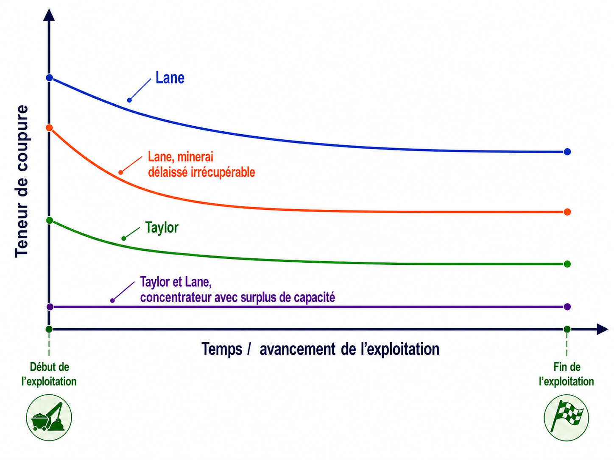

## Teneur de coupure et seuil de rentabilité

Le seuil de rentabilité (*break-even*) est la teneur pour laquelle la valeur du métal récupéré couvre exactement les coûts de traitement : en deçà, traiter un bloc génère une perte. C'est un premier critère, utile mais incomplet.

En pratique, la décision ne se limite pas à cette question. Les capacités d'extraction, de traitement et de raffinage sont limitées : traiter un bloc moins riche aujourd'hui peut repousser un bloc plus riche à plus tard. La théorie de Lane intègre cette contrainte de capacité. On ne peut pas tout extraire, tout traiter et tout vendre en même temps; il faut choisir quels blocs traiter maintenant et lesquels laisser de côté.

La teneur de coupure devient donc un choix important. Si elle est trop basse, on envoie à l'usine beaucoup de matériau qui rapporte peu. Si elle est trop élevée, on risque au contraire de rejeter du matériau qui aurait pu contribuer à la valeur du projet. Il faut donc trouver un équilibre entre la quantité de minerai traitée et la valeur que ce minerai peut réellement générer.

On peut alors écrire le problème sous la forme suivante :

$$
\max_{c}\ \text{Profit}(\tau,c)
\quad \text{avec} \quad
\text{Profit}(\tau,c) = \text{Revenus}(\tau,c) - \text{Coûts}(\tau,c)
$$

où $\tau$ représente la période d'exploitation et $c$ la teneur de coupure. L'objectif est de déterminer, pour chaque période $\tau$, la teneur de coupure $c$ qui maximise le profit ou, plus généralement, la valeur actualisée nette (VAN) du projet.

### Seuil de rentabilité (*break-even*)

Le seuil de rentabilité, ou *break-even*, est la teneur pour laquelle la valeur du métal récupéré couvre exactement le coût de traitement du matériau : le profit est alors nul. En deçà, traiter le bloc fait perdre de l'argent; au-delà, le traitement génère un profit.

Considérons une tonne de matériau de teneur $c$ envoyée au concentrateur. La masse de métal récupérée est $y\,c$, vendue au prix net $(p-k)$, tandis que le traitement de cette tonne coûte $h$. Le matériau étant déjà extrait, le coût de minage $m$ est déjà engagé et n'entre pas dans la décision de traiter ou non. Le seuil de rentabilité $c_{be}$ est atteint lorsque la valeur récupérée égale le coût de traitement :

$$
(p-k)\,y\,c_{be} = h
\qquad\Longrightarrow\qquad
c_{be} = \frac{h}{(p-k)\,y}.
$$

C'est la teneur minimale à partir de laquelle il vaut la peine de traiter le matériau.

Ce calcul ne retient que les coûts variables de traitement. Lorsque le concentrateur tourne à pleine capacité, on ajoute à $h$ la part des frais fixes attribuable à chaque tonne, ce qui relève le seuil; lorsqu'il est sous-utilisé, ces frais fixes sont déjà engagés et la décision ne dépend plus que des coûts variables additionnels, ce qui l'abaisse.

Tant que les prix, les coûts et les paramètres métallurgiques restent stables, ce seuil varie peu. Il peut néanmoins évoluer au cours de la vie de la mine, en particulier lorsqu'on actualise les revenus futurs : il tend alors à diminuer avec le temps, comme le montre la @fig-evolution-temps.

### Approche de Lane

La théorie de Lane généralise cette réflexion en intégrant explicitement un coût d'opportunité. Ce coût représente la valeur économique associée à la conservation d'une partie du gisement en vue d'une exploitation ultérieure plutôt que de l'exploiter immédiatement.

L'ajout de ce coût modifie la logique de décision. Un bloc rentable aujourd'hui doit encore être comparé à la valeur qu'il pourrait générer plus tard, dans une stratégie d'exploitation optimale. La teneur de coupure obtenue par la méthode de Lane est donc généralement plus élevée que le simple seuil de rentabilité, car elle tient compte de cette valeur du minerai laissé en place.

À mesure que l'exploitation progresse, la quantité de minerai restant dans le gisement diminue. Le coût d'opportunité associé au minerai non encore exploité diminue donc lui aussi, ce qui peut entraîner une baisse progressive de la teneur de coupure optimale au fil du temps.

{#fig-evolution-temps}

### Autres facteurs influençant la teneur de coupure

La teneur de coupure n'est pas une valeur fixe pour toute la durée d'une mine. Elle dépend des paramètres économiques et opérationnels utilisés dans le calcul. Si ces paramètres changent, la teneur de coupure peut aussi changer.

Le prix du métal joue évidemment un rôle important. Si le prix diminue, il faut généralement une teneur plus élevée pour que le traitement d'un bloc reste rentable. À l'inverse, si le prix augmente, des blocs moins riches peuvent devenir intéressants à traiter. Il faut toutefois faire attention à ne pas réagir trop vite à chaque variation du marché. Une baisse ou une hausse temporaire du prix ne veut pas nécessairement dire qu'il faut modifier immédiatement toute la stratégie d'exploitation.

La gestion des stocks peut aussi modifier la façon de réfléchir à la teneur de coupure. Dans certaines mines, un matériau légèrement en deçà de la teneur de coupure n'est pas forcément envoyé directement à la halde à stériles. Il peut être mis en réserve, par exemple dans une pile de stockage, ou encore faire l'objet d'une réexploitation ultérieure dans un halde à stériles ou un parc à résidus, puis être traité plus tard si les conditions deviennent plus favorables. Par exemple, une hausse du prix du métal, une meilleure récupération ou une baisse des coûts peut rendre ce matériau rentable à l'avenir. Cela permet parfois d'utiliser une teneur de coupure plus élevée à court terme, sans perdre complètement la possibilité de valoriser ce matériau plus tard.

Les coûts utilisés dans le calcul peuvent également évoluer. Les coûts variables de minage, de traitement et le coût d'opportunité ne sont pas nécessairement constants dans le temps. Ils peuvent changer avec l'avancement de la fosse, l'ajout de nouvelles zones exploitables, les capacités de production disponibles, l'inflation ou encore certains problèmes opérationnels. La teneur de coupure calculée à un moment donné reflète donc les conditions du projet à ce moment précis.

Ici, on garde le problème simple. On suppose que les paramètres sont connus et on regarde comment ils influencent la teneur de coupure. L'objectif n'est pas de faire toute l'analyse financière d'une mine, mais de comprendre la logique derrière une question très concrète : est-ce que ce bloc vaut la peine d'être traité ou non? Et pourquoi?

Enfin, l'application de ces méthodes suppose que le modèle de ressources est suffisamment fiable. Le choix d'une teneur de coupure repose en effet sur la distribution des teneurs estimées par le modèle de blocs. Si ces estimations sont biaisées ou trop incertaines, la stratégie d'exploitation peut être mal orientée. Les questions liées à la qualité des estimations, à l'effet de support, à l'effet d'information et aux méthodes géostatistiques seront abordées dans les chapitre 6 à 9.

Pour le reste de ce chapitre, nous supposerons donc que les estimations des ressources sont disponibles et établies selon les règles de l'art. Lorsque cette hypothèse ne sera pas respectée, nous préciserons les conséquences possibles sur le calcul de la teneur de coupure et sur les décisions minières.