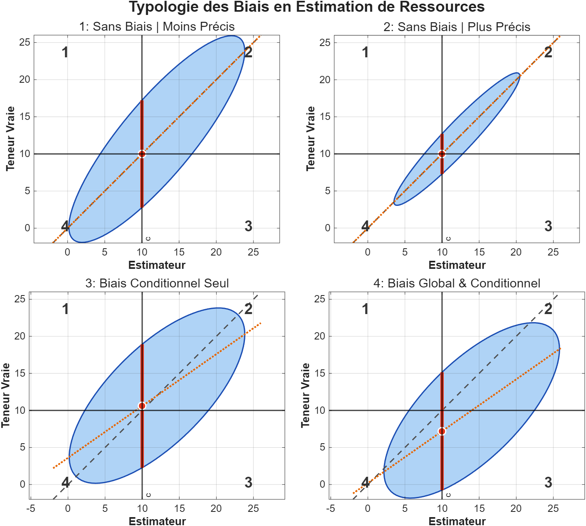

## Importance de la qualité de l'estimation des teneurs

La qualité de l'estimation des teneurs a des conséquences économiques directes. La sélection s'effectue toujours à partir de valeurs estimées, alors que le métal contenu dans les blocs sélectionnés dépend de la teneur réelle et non de la teneur estimée. Deux paramètres influencent la qualité de l'estimation :

- la quantité (et la qualité) d'information disponible
- la qualité de la méthode d'estimation utilisée

En général, les estimateurs peuvent être plus ou moins précis et présenter ou non un biais. Le meilleur estimateur est le plus précis possible et sans biais.

Le biais peut être global ou conditionnel :

- **Biais global** : la moyenne de tous les estimés ne coïncide pas avec la moyenne du gisement.
- **Biais conditionnel** : la moyenne des blocs pour lesquels l'estimateur prend une valeur donnée ne coïncide pas avec cette valeur.

Cette dernière propriété est plus difficile à rencontrer que le biais global, c'est-à-dire qu'un estimateur peut à la fois être globalement sans biais et présenter un biais fortement conditionnel.

Le biais global est généralement lié à la qualité des données prélevées, et on ne peut y changer grand-chose. Il est souvent rencontré lors de l'échantillonnage des forages de production ou des galeries. Par exemple, l'échantillonnage peut ne pas représenter équitablement l'ensemble des granulométries présentes (phénomène de ségrégation), ce qui introduit généralement un biais. Au contraire, l'échantillonnage de carottes est généralement sans biais, du moins lorsque la récupération de la carotte est complète.

Le biais conditionnel, lui, est davantage lié au type d'estimateur choisi. L'un des estimateurs présentant le moins de biais conditionnel est le krigeage (que nous verrons au chapitre 9); le krigeage simple en est même théoriquement exempt. Toutes les méthodes basées sur des extensions géométriques (par exemple, plus proche voisin, inverse de la distance, méthodes des sections, méthodes des triangles, que nous verrons au chapitre 5) présentent habituellement un biais conditionnel, qui peut être assez important.

Toute opération sélective s'effectue à partir de valeurs estimées, jamais à partir des vraies valeurs des blocs. Le diagramme suivant (@fig-biais) aide à comprendre les conséquences importantes de cet état de fait :

{#fig-biais}

Les ellipses représentent l'ensemble des valeurs possibles de l'estimateur et les vraies valeurs. 

Dans chaque diagramme, l'axe horizontal porte la teneur estimée par le modèle et l'axe vertical la teneur vraie du bloc; la diagonale à 45° correspond au cas idéal où l'estimé égale la valeur réelle. Les deux droites tracées à la teneur de coupure $c$ découpent le plan en quatre cadrans :

- **cadran 1** (estimé $< c$, vrai $\geq c$) : bloc rejeté vers la halde alors qu'il était réellement du minerai — *minerai perdu*;
- **cadran 2** (estimé $\geq c$, vrai $\geq c$) : bloc sélectionné et réellement minerai — *bien classé*;
- **cadran 3** (estimé $\geq c$, vrai $< c$) : bloc envoyé au concentrateur alors qu'il était stérile — *dilution*;
- **cadran 4** (estimé $< c$, vrai $< c$) : bloc rejeté et réellement stérile — *bien classé*.

Les cadrans 2 et 4 regroupent les blocs correctement classés, tandis que les cadrans 1 et 3 correspondent aux deux types d'erreurs de sélection. Le taux de mauvaise classification est la proportion de blocs mal classés, soit $(1+3)/(1+2+3+4)$.

Les deux diagrammes du haut montrent des estimateurs sans biais et des estimateurs conditionnels sans biais. Ils sont sans biais, car la valeur moyenne sur l'axe des x est égale à celle sur l'axe des y. Ils sont sans biais conditionnel, car si l'on trace une droite parallèle à l'axe des y (fixant la valeur estimée), la moyenne obtenue tombe sur la droite à 45° (c.-à-d. que la moyenne des vraies valeurs est égale à l'estimée pour chaque valeur estimée).

Le diagramme de gauche correspond à un estimateur moins précis que celui de droite : ses cadrans d'erreur 1 et 3 sont plus peuplés, donc son taux de mauvaise classification est plus élevé. On sélectionne mieux les blocs à traiter dans le cas de droite, avec moins de dilution et une meilleure récupération du métal.

Dans les deux cas, on obtiendra, à peu près, ce que l'estimateur avait prévu en termes de tonnage et de teneur au-dessus de la teneur de coupure. La différence entre les deux estimateurs est ici sans doute due essentiellement à la quantité d'information disponible. Ceci démontre qu'il peut être très rentable d'obtenir cette information.

Le cas des deux estimateurs du bas est plus grave. Celui de gauche est sans biais global, mais présente un biais conditionnel prononcé. Celui de droite est globalement et conditionnellement biaisé.

Dans les deux cas, pour un tonnage fixé, on récupérera beaucoup moins de métal que prévu lors de l'estimation (dilution liée à la nature statistique). Ces deux graphes correspondent à la situation la plus courante dans les mines. L'exemple de droite correspond à l'estimation que l'on pourrait obtenir à partir de données fortement biaisées, comme celles parfois rencontrées lors de forages de production.

