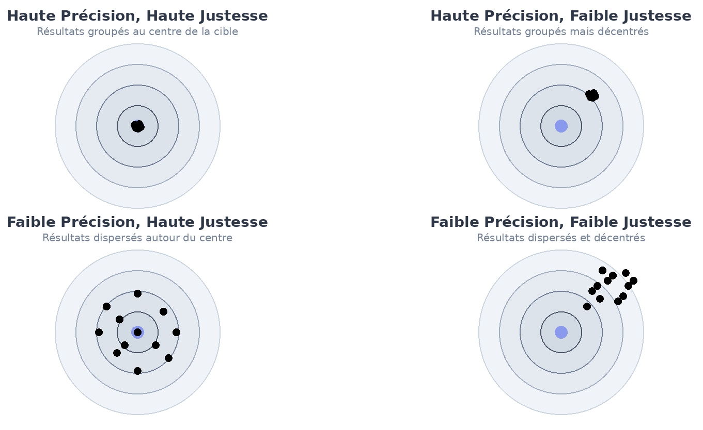
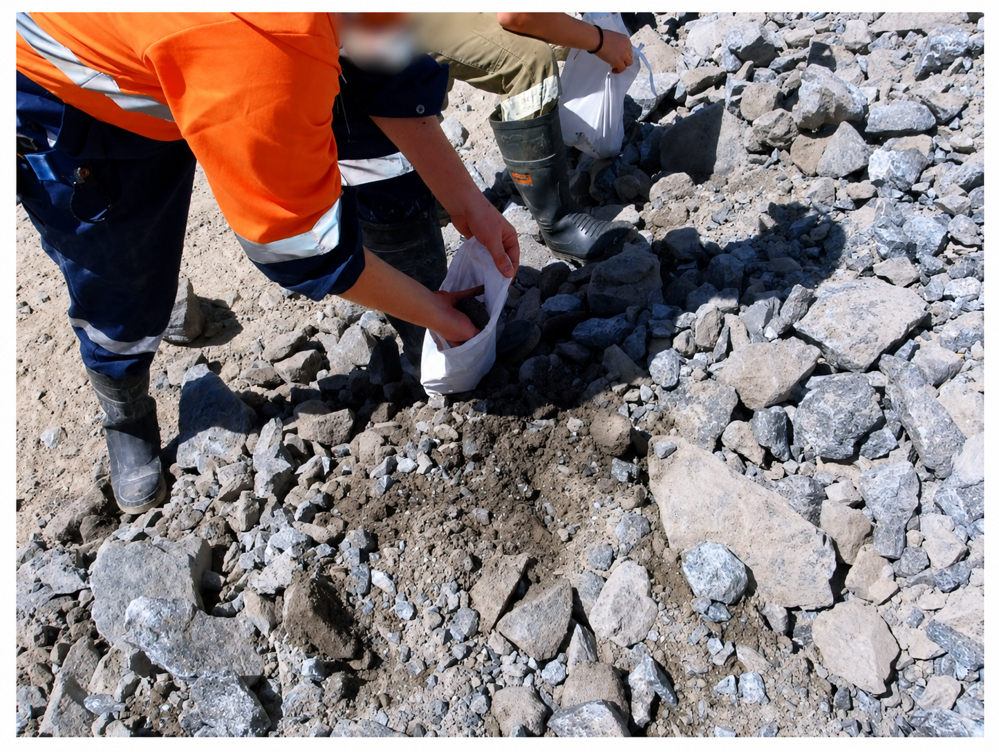
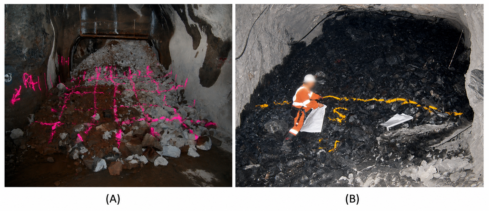
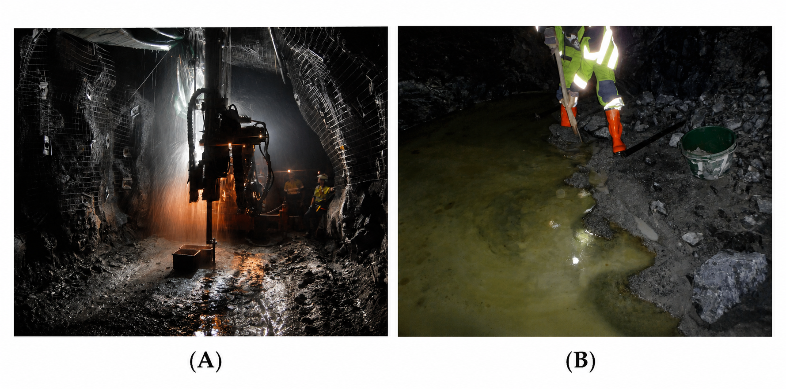

## Méthodologie, traçabilité et chaîne d'erreurs

La distribution des teneurs d'un gisement n'est jamais observée directement. Elle est reconstruite à partir d'une chaîne d'opérations : acquisition des données, échantillonnage, préparation des échantillons, analyse chimique, validation des résultats et, éventuellement, estimation géostatistique. Or la théorie de Lane suppose cette distribution suffisamment précise pour fixer une teneur de coupure optimale.

Chaque étape de cette chaîne peut introduire une erreur, du forage jusqu'à l'estimation finale. Ces erreurs s'additionnent d'une étape à l'autre, et l'une des plus importantes provient souvent de la toute première : l'échantillonnage. Une erreur commise à ce stade ne peut plus être corrigée par la suite et se retrouve directement dans le modèle de ressources. D'où l'importance de comprendre et de documenter chaque étape de la chaîne avant l'estimation.

Ce chapitre s'intéresse à l'une des premières étapes de ce processus : l'échantillonnage. En contexte minier, un échantillon est une petite quantité de matière censée représenter un ensemble plus vaste, appelé **lot**. Ce lot peut correspondre, par exemple, à une face de galerie, aux *cuttings* d'un forage de production, au minerai contenu dans un wagonnet ou à une carotte de forage aux diamants.

Une fois l'échantillon prélevé, il doit être préparé puis analysé en laboratoire afin d'en déterminer la teneur. Cette teneur mesurée est ensuite utilisée pour représenter un volume de roche bien plus grand que celui de l'échantillon lui-même. Il s'agit donc déjà d'un problème d'estimation : on cherche à déduire une propriété du lot à partir d'une petite fraction de la matière.

Prenons l'exemple d'une carotte de forage de 3 m de longueur et de 48 mm de diamètre (taille NQ) obtenue par forage au diamant. Supposons que l'on souhaite déterminer sa teneur en or afin de contribuer à l'estimation des ressources minérales. En laboratoire, l'analyse ne sera généralement pas réalisée sur toute la carotte. Celle-ci devra être concassée, divisée, broyée et réduite jusqu'à obtenir une petite masse de poudre, parfois de seulement quelques grammes, qui sera effectivement analysée.

Ainsi, on part d'une carotte de plusieurs kilogrammes, mais l'analyse en laboratoire porte finalement sur seulement quelques grammes de poudre. Il y a donc une étape importante de réduction entre les deux. Si cette étape est mal réalisée, les quelques grammes analysés ne refléteront pas fidèlement le lot de départ, c'est-à-dire la teneur réelle de la carotte. On peut alors obtenir une teneur biaisée ou très variable, même si le laboratoire effectue correctement son analyse.

C'est précisément ce problème qui a conduit au développement de la théorie de l'échantillonnage des matières morcelées, formulée par Pierre Gy. Cette théorie fournit un cadre pour comprendre, quantifier et réduire les erreurs d'échantillonnage afin d'obtenir des échantillons aussi représentatifs que possible de la réalité terrain.

### Notions de biais, de précision et de justesse

Avant d'aborder la théorie de l'échantillonnage et le contrôle de la qualité, il est essentiel de distinguer trois notions fondamentales : le biais, la précision et la justesse. Ces concepts permettent d'évaluer la qualité d'une mesure et la fiabilité des données utilisées pour estimer les ressources minérales (@fig-biais).

La **justesse** (*accuracy*)  indique si les mesures sont proches de la vraie valeur. Si un appareil ou une méthode donne des résultats qui, en moyenne, tombent près de cette valeur, on dira que le système de mesure est juste.

La **précision** (*precision*) décrit plutôt la dispersion des mesures répétées entre elles. Un système est précis lorsque les mesures obtenues à répétition sont peu dispersées, même si elles ne sont pas nécessairement centrées sur la valeur réelle. Autrement dit, si l'on mesure plusieurs fois le même échantillon et que l'on obtient des résultats très similaires, le système présente une bonne précision. Cela ne garantit toutefois pas que ces résultats soient justes : ils peuvent être répétables, mais systématiquement trop élevés ou trop faibles.

Le **biais** correspond à une erreur systématique qui déplace les mesures dans une direction donnée par rapport à la valeur réelle. Un système biaisé peut donc produire des résultats très cohérents entre eux, mais systématiquement trop élevés ou trop faibles.

Ces notions sont souvent illustrées par l'analogie d'une cible, où le regroupement des impacts traduit la précision et leur proximité du centre, la justesse (@fig-biais) :

- **en haut à gauche** — impacts regroupés et centrés : bonne précision et bonne justesse (le cas recherché);
- **en haut à droite** — impacts regroupés mais décalés du centre : bonne précision, mais biais important;
- **en bas à gauche** — impacts dispersés autour du centre : bonne justesse, mais faible précision;
- **en bas à droite** — impacts dispersés et décalés : système à la fois peu précis et biaisé.

Dans un contexte minier, cette distinction est importante. Un laboratoire peut produire des résultats très répétables, donc précis, tout en étant biaisé si ses analyses surestiment ou sous-estiment systématiquement les teneurs réelles. À l'inverse, des résultats non biaisés mais très dispersés demeurent difficiles à exploiter pour prendre des décisions fiables.

Lorsque les mesures sont à la fois justes et précises, on parle d'exactitude : les résultats sont alors proches de la valeur réelle et reproductibles.

{#fig-biais}

### Traçabilité

Dès que le matériau *in situ* est identifié, une chaîne d'opérations s'amorce : prélèvement, identification, transport, entreposage, préparation, division, broyage et analyse en laboratoire. À chacune de ces étapes, des erreurs peuvent être introduites. Certaines sont aléatoires, mais plusieurs peuvent être systématiques, c'est-à-dire qu'elles tendent à déplacer les résultats toujours dans la même direction. C'est pourquoi un protocole rigoureux est nécessaire pour encadrer la manipulation des échantillons et documenter toutes les étapes du processus.

La **traçabilité** consiste à savoir exactement ce qui est arrivé à un échantillon, depuis son prélèvement sur le terrain jusqu'au résultat d'analyse. Chaque échantillon doit pouvoir être identifié et suivi tout au long de ces étapes, afin de rattacher son résultat à l'historique complet de sa manipulation.

Cette exigence peut sembler administrative, mais elle est essentielle. Un échantillon mal identifié, mélangé avec un autre ou mal préparé peut donner une teneur qui ne représente plus le matériau de départ. Dans ce cas, le problème ne vient pas du laboratoire : l'analyse peut être parfaitement réalisée, mais sur un échantillon qui n'est plus le bon ou qui a été modifié avant même d'y arriver. L'erreur se situe alors du côté du prélèvement et de la préparation, sous la responsabilité de la compagnie minière.

Les sources d'erreur possibles sont nombreuses. Elles peuvent provenir de la contamination par des poussières, de résidus dans les équipements, d'abrasion ou de corrosion. Elles peuvent aussi être liées à des pertes de matière, par exemple lorsque des fines sont emportées, lorsqu'une partie du matériau demeure dans le circuit de préparation ou lorsque le minéral d'intérêt est mal réparti après la division de l'échantillon. Certaines erreurs peuvent également modifier la composition chimique du matériau, notamment par oxydation.

Il y a aussi les erreurs humaines : une étiquette mal posée, un échantillon mélangé avec un autre, un équipement pas assez bien nettoyé. La plupart du temps, ce sont des erreurs involontaires. Plus rarement, il peut y avoir une action volontaire, comme une fraude ou un sabotage. C'est pour éviter ce genre de problème qu'on doit bien documenter les étapes et mettre en place des contrôles de qualité. C'est d'ailleurs la principale raison ayant mené à la création de la norme NI 43-101, adoptée à la suite du scandale Bre-X.

### Sources d'erreurs

On distingue généralement quatre grandes catégories d'erreurs dans la chaîne menant à l'estimation des ressources minières :

| Grande classe | Erreurs associées | Effet principal | Moyens de contrôle |
|---|---|---|---|
| **Précision** | Erreur fondamentale (FSE) | Variabilité aléatoire liée à l'hétérogénéité du matériau | Formule de Gy, masse suffisante, réduction granulométrique |
| **Biais** | Délimitation, extraction, pondération, préparation, ségrégation | Échantillon systématiquement non représentatif | Protocoles, prévention, homogénéisation, traçabilité, contrôle qualité |
| **Analyse** | Erreur analytique (AE) | Erreur de mesure en laboratoire | Calibration, standards, duplicatas, blancs, QA/QC |
| **Estimation** | Hétérogénéités de longue portée et périodiques | Mauvaise représentation spatiale du gisement | Géostatistique, composites, variographie, plan d'échantillonnage adapté |

: Classification simplifiée des principales erreurs affectant l'estimation des ressources minières.

i. Précision (Section 3.2)

Pour la précision, le problème vient surtout de l'erreur fondamentale d'échantillonnage. Même avec un bon protocole, on ne peut pas faire disparaître le fait que le matériau est hétérogène. Les teneurs changent d'un fragment à l'autre, les fragments n'ont pas tous la même taille, et on finit toujours par analyser seulement une petite partie du lot de départ. Cette variabilité peut être réduite, mais elle restera toujours présente.

Elle devient particulièrement importante lors des étapes de réduction de masse, telles que le concassage, le broyage ou la division, où seule une petite quantité de matériau est conservée pour l'analyse. Chaque étape peut donc introduire une incertitude qui s'accumule jusqu'au résultat final.

La théorie de Pierre Gy permet de modéliser et de quantifier ces erreurs en fonction des propriétés physiques du matériau et des méthodes de préparation employées.

ii. Biais (Section 3.1.4)

Les erreurs créant des biais regroupent les erreurs de délimitation, d'extraction, de pondération, de préparation et de ségrégation. Contrairement à l'erreur fondamentale, qui dépend surtout de l'hétérogénéité naturelle du matériau, ces erreurs sont principalement liées aux choix et aux pratiques d'échantillonnage sur le terrain. Elles relèvent donc directement du contrôle de l'ingénieur : définition du volume à prélever, méthode d'extraction, masse prélevée, homogénéisation, manutention, préparation et traçabilité.

Ces biais peuvent être évalués en comparant les résultats obtenus à partir de duplicatas et d'échantillons de contrôle. Sur le terrain, l'observation de la méthode de prélèvement, la vérification des masses, le contrôle des pertes de fines, la vérification de la constance des largeurs de rainure et la documentation des conditions de prélèvement permettent également d'identifier les sources potentielles de biais.

Ces erreurs doivent surtout être évitées dès le prélèvement. Une fois qu'un échantillon est mal délimité, incomplet ou mal documenté, il devient difficile de corriger le problème plus tard. Un protocole clair sert donc à limiter le risque de travailler avec un échantillon non représentatif.

iii. Analyse (Section 3.3)

Même avec un bon échantillon, il peut encore y avoir des erreurs au laboratoire. Le problème peut venir de la calibration des appareils, d'une contamination, de la méthode d'analyse ou d'une manipulation mal faite. Dans ce cas, l'échantillon est représentatif, mais la teneur mesurée peut quand même être faussée.

C'est pour cette raison que les programmes QA/QC sont essentiels. Les standards certifiés, les blancs, les duplicatas et les réanalyses permettent de vérifier si le laboratoire produit des résultats cohérents. Ils servent aussi à détecter une contamination, une dérive dans les mesures ou un problème de précision.

L'ingénieur ne contrôle pas directement chaque étape réalisée au laboratoire. Par contre, il doit s'assurer que les bons contrôles sont prévus, que le laboratoire est fiable et que les résultats QA/QC sont réellement examinés avant d'utiliser les données dans une estimation.

iv. Estimation (Chapitre 6 à 9)

Les erreurs d'estimation apparaissent plus tard, lorsque les données sont utilisées pour construire un modèle du gisement. À ce stade, le problème ne vient pas nécessairement d'un mauvais échantillon ou d'une mauvaise analyse. Il peut venir du fait que les données disponibles ne décrivent pas assez bien la variabilité réelle du gisement.

Par exemple, une tendance géologique peut être mal représentée, une limite entre deux domaines peut être placée au mauvais endroit, ou une alternance de veines et de lithologies peut être trop simplifiée dans le modèle. Dans ce cas, même avec des échantillons bien prélevés et bien analysés, l'estimation peut rester problématique si le modèle géologique ne respecte pas bien l'organisation du gisement.

Ces questions seront reprises plus loin dans le livre, notamment dans les chapitres consacrés à la modélisation spatiale : le variogramme, le krigeage et la simulation.

### Les sources de biais et les méthodes d'échantillonnages

En contexte minier, une **méthode d'échantillonnage** correspond à l'ensemble des choix permettant de prélever une portion (ou un lot) de minerai ou de matériau afin d'en estimer les caractéristiques, notamment la teneur moyenne en éléments d'intérêt.  Ce lot peut être une carotte, une face de galerie, des cuttings, un tas de minerai ou encore du matériau sur un convoyeur. On parle de biais lorsque l'échantillon ne représente pas fidèlement le lot que l'on souhaite caractériser. 

Avant de présenter les principales méthodes d'échantillonnage, il est utile de rappeler les principales familles de biais susceptibles d'en affecter la qualité.

i. **Biais liés à l'opérateur**

Ce type de biais provient directement de la personne qui prélève l'échantillon. Le problème apparaît lorsqu'on choisit, consciemment ou non, certains fragments plutôt que d'autres. Par exemple, on peut être tenté de choisir le matériau le plus visible, le plus facile à détacher ou celui qui semble le plus riche. Le résultat peut alors être un échantillon qui donne une image trop favorable ou simplement peu représentative du lot de départ.

ii. **Biais liés aux dispositifs d'échantillonnage**

Ces biais proviennent de l'outil de prélèvement lui-même. Un dispositif mal adapté récupère certains fragments plus facilement que d'autres — souvent au détriment des plus gros —, si bien que l'échantillon ne respecte plus les proportions du lot. Un tube trop étroit, une pelle trop petite ou un racleur mal conçu sur un convoyeur en sont des exemples typiques. Pour éviter ce biais, le dispositif doit donner à chaque fragment la même chance d'être prélevé, ce qui suppose de l'adapter au type de matériau, à la taille des fragments et à la façon dont le lot se présente.

iii. **Biais liés aux propriétés mécaniques du matériau**

Les différentes phases d'une roche ne se fragmentent pas de la même façon. Un minéral tendre ou ductile — l'or natif, la molybdénite, la galène — s'écrase et s'étale plutôt que de se casser : il peut adhérer aux outils, contaminer l'échantillon suivant (*smearing*) ou se perdre dans les fines. Une gangue dure ou cassante se brise au contraire en éclats susceptibles d'être projetés hors de l'échantillon. Comme l'élément d'intérêt est souvent porté par une phase distincte de la gangue, cette fragmentation différentielle enrichit ou appauvrit sélectivement l'échantillon en cet élément. Le biais dépend donc moins de la dureté globale de la roche que du comportement mécanique du minéral.

iv. **Biais liés à la ségrégation granulométrique et à la densité des particules**

Un lot fragmenté est rarement homogène : sous l'effet des vibrations, de la gravité et des courants d'eau ou d'air, les particules se réorganisent selon leur taille et leur densité. Les fines migrent vers le bas ou sont emportées, tandis que les grains grossiers et les minéraux lourds — souvent porteurs de l'élément d'intérêt, comme l'or natif ou la galène — se concentrent dans des zones distinctes. La composition varie alors d'un point à l'autre du lot. Prélever l'échantillon à un seul endroit revient dès lors à échantillonner une fraction non représentative : c'est l'erreur de ségrégation (ou de groupement) décrite par la théorie de Gy. Pour la limiter, on homogénéise le matériau avant le prélèvement, ou l'on constitue l'échantillon à partir de plusieurs incréments répartis sur l'ensemble du lot.

v. **Autres sources de biais**

Certains biais dépendent directement de la minéralogie ou de la lithologie du gisement. Des minéraux solubles, comme certains sels ou sulfates, peuvent se dissoudre partiellement lors d'un forage à l'eau ou pendant l'entreposage, ce qui abaisse la teneur mesurée. À l'inverse, des minéraux denses comme l'or natif ou la galène tendent à se ségréger par gravité dans les *cuttings* ou la boue de forage, et se retrouvent alors sur- ou sous-représentés dans l'échantillon. Sur un affleurement, les lithologies plus tendres s'érodent plus vite et deviennent moins visibles : on risque de n'échantillonner que la roche résistante, plus dure, et donc de fausser la composition réelle. Ces biais n'obéissent pas à une règle générale; il faut les reconnaître selon le contexte du projet et adapter la méthode d'échantillonnage en conséquence.

Voici une liste non exhaustive de méthodes d'échantillonnage utilisées en contexte minier et des biais qui peuvent leur être associés. Les figures des sections suivantes sont tirées de l'article de Dominy et al. (2018), qui présente l'intégration de la théorie de l'échantillonnage dans les stratégies de contrôle des teneurs en mines souterraines. Elles s'appliquent aussi au mine à ciel ouvert.

> Dominy, S., Glass, H., O'Connor, L., Lam, C., Purevgerel, S., & Minnitt, R. (2018). [*Integrating the Theory of Sampling into Underground Mine Grade Control Strategies*](https://doi.org/10.3390/min8060232). *Minerals*, 8(6), 232.

#### Méthode 1: Échantillonnage linéaire (*Linear Sampling*)

L'échantillonnage linéaire regroupe les méthodes qui prélèvent le matériau le long d'une ligne ou d'une bande tracée sur une face rocheuse. Selon la continuité du prélèvement et la surface couverte, on distingue l'échantillonnage par écaille, par cannelure et par panneau.

##### Méthode 1{,}1: Échantillonnage par écaille (*Chip Sampling*)

L'échantillonnage par écaille consiste à prélever une série d'éclats de roche le long d'une bande continue ou semi-continue, généralement à l'aide d'un marteau et d'un ciseau. Lorsque les éclats sont prélevés de façon discontinue, ils constituent plutôt une série d'échantillons ponctuels, qui s'apparentent davantage à des spécimens qu'à un échantillon représentatif.

Cette méthode est souvent utilisée lorsque la minéralisation est exposée sur une face rocheuse et que l'on souhaite obtenir une première estimation de la teneur sur une zone donnée. Comme le montre la @fig-echantillonnage-cannelure1, le prélèvement peut suivre une ligne ou une bande tracée sur la paroi afin de guider l'échantillonnage et de limiter les variations dans la zone prélevée.

{#fig-echantillonnage-cannelure1}

L'orientation de la bande d'échantillonnage doit être adaptée à la géologie. Selon la disposition du corps minéralisé, elle peut être horizontale, verticale ou perpendiculaire au pendage. La @fig-echantillonnage-cannelure2 illustre cette logique : le filon de quartz subvertical est échantillonné horizontalement, tandis que les veinules plus plates du mur inférieur sont échantillonnées verticalement. L'objectif est de faire correspondre l'orientation de l'échantillon à la géométrie réelle de la minéralisation.

{#fig-echantillonnage-cannelure2}

L'espacement entre les éclats peut varier selon la méthode utilisée. Les éclats peuvent être presque jointifs, formant alors une cannelure d'éclats, ou être séparés de plusieurs centimètres. Plus l'espacement est grand, plus l'échantillon risque de devenir ponctuel et moins il représente fidèlement l'ensemble de la bande minéralisée.

**Risque :** L'échantillonnage par éclats est sensible aux erreurs de délimitation et d'extraction. Ces biais peuvent être liés aux préférences de l'opérateur, à l'accessibilité des fragments ou aux variations de dureté de la roche. Par exemple, un opérateur peut, involontairement, privilégier les zones les plus visibles, les plus riches ou les plus faciles à détacher, ce qui peut produire un échantillon systématiquement non représentatif.

##### Méthode 1{,}2: Échantillonnage par cannelure (*Channel Sampling*)

L'échantillonnage par cannelure consiste à tailler une rainure continue dans la face rocheuse afin de prélever un échantillon représentatif de la zone minéralisée. Selon la géologie, cette rainure peut être orientée horizontalement, verticalement ou perpendiculairement au pendage du corps minéralisé. L'orientation doit donc être choisie en fonction de la géométrie de la minéralisation, plutôt que de la seule facilité de prélèvement.

Pour limiter les erreurs de délimitation et d'extraction, la cannelure doit conserver une largeur et une profondeur aussi constantes que possible. En général, elle mesure entre 5 et 10 cm de largeur et environ 2,5 cm de profondeur, ce qui permet d'obtenir un échantillon d'environ 3 à 6 kg par mètre.

En pratique, il est toutefois difficile de maintenir une rainure parfaitement uniforme lorsqu'elle est réalisée manuellement. Les variations de dureté de la roche, la fatigue de l'opérateur et la difficulté à conserver une profondeur constante peuvent altérer la qualité de l'échantillon. Dans certains cas, l'échantillonnage par cannelure manuelle se rapproche donc davantage d'un échantillonnage par éclats continus.

La @fig-echantillonnage-cannelure3 illustre les principales étapes d'un échantillonnage par cannelure en mine souterraine : la réalisation de la rainure, la délimitation de la zone à prélever, le détachement du matériau et sa collecte dans un contenant propre.

{#fig-echantillonnage-cannelure3}

Certaines opérations utilisent une scie diamantée pour améliorer la qualité du prélèvement. Deux coupes parallèles sont alors réalisées dans la roche, généralement à une profondeur d'environ 2,5 cm et espacées de 5 à 10 cm. Le bloc de roche situé entre les deux coupes est ensuite extrait à l'aide d'un marteau et d'un ciseau, ou d'un outil pneumatique. Cette approche permet généralement de mieux contrôler la géométrie de l'échantillon que celle obtenue avec des cannelures entièrement réalisées à la main.

**Risque :** Les principaux biais associés à l'échantillonnage par cannelure sont les erreurs de délimitation et d'extraction. Une largeur ou une profondeur variable peut surreprésenter certaines lithologies, notamment les roches plus tendres, qui se détachent plus facilement que les roches dures. À l'inverse, les zones plus compétentes peuvent être sous-échantillonnées si elles sont difficiles à tailler. La perte de fines, la contamination par du matériau provenant des parois voisines ou une collecte incomplète du matériau peuvent également modifier la teneur mesurée. Ces biais doivent être limités par une cannelure bien délimitée, une profondeur constante, une récupération complète du matériau et un nettoyage adéquat de la zone de prélèvement.

##### Méthode 1{,}3: Échantillonnage d'un panneau (*Panel Sampling*)

L'échantillonnage d'un panneau consiste à prélever du matériau sur une surface délimitée de la face rocheuse, plutôt que le long d'une seule ligne comme dans le cas d'une cannelure. Le panneau est généralement tracé à la peinture sur la paroi afin de délimiter clairement la zone à échantillonner. Cette méthode est particulièrement utile lorsque la minéralisation est diffuse, irrégulière ou répartie dans plusieurs veinules sur une surface, plutôt que concentrée dans une structure linéaire.

Deux variantes peuvent être distinguées. Dans un échantillon de copeaux-panneau, seuls certains fragments sont prélevés à l'intérieur du panneau; la proportion de roche effectivement échantillonnée demeure alors limitée, souvent inférieure à 50 % de la surface. Dans un échantillon de panneau-canal, les fragments sont prélevés de manière plus continue sur l'ensemble de la surface du panneau; la proportion de roche échantillonnée est alors plus élevée et peut dépasser 50 %. Cette seconde approche est généralement plus représentative, mais elle demande plus de temps et un meilleur contrôle de la profondeur et de la récupération du matériau.

La @fig-echantillonnage-Panneaux illustre les principales étapes de cette méthode : la délimitation du panneau, le prélèvement du matériau sur la paroi, l'accumulation des fragments récupérés et l'utilisation d'une bâche ou d'un tapis pour limiter les pertes et la contamination.

{#fig-echantillonnage-Panneaux}

**Risque :**  
L'échantillonnage par panneau est sensible aux erreurs de délimitation, d'extraction et de ségrégation. Un panneau mal défini peut exclure des zones minéralisées ou inclure trop de matériau stérile. De plus, les variations de dureté ou de fracturation peuvent entraîner une profondeur de prélèvement inégale : les roches tendres ou friables risquent d'être surreprésentées, tandis que les zones plus dures peuvent être sous-échantillonnées. La perte ou la contamination du matériau est aussi un risque important. Les fragments peuvent tomber au sol, se mélanger à des débris ou être contaminés par des poussières. L'utilisation d'une bâche ou d'un tapis propre permet de mieux récupérer le matériau et de limiter ces biais.

#### Méthode 2: Échantillonnage sur place ou en vrac (*Grab Sampling*)

L'échantillonnage sur place, ou *grab sampling*, consiste à prélever manuellement une ou plusieurs petites quantités de roche fragmentée dans un tas de minerai, un point de soutirage, une benne, un camion ou un wagonnet. Cette méthode est souvent utilisée pour le contrôle de teneur lorsque l'accès au front est difficile, lorsque les conditions de sécurité limitent l'échantillonnage direct ou lorsqu'aucune autre donnée n'est disponible. Elle permet d'obtenir rapidement une indication de la teneur, mais demeure peu représentative si elle n'est pas strictement encadrée.

La @fig-grab-stockpile illustre un exemple d'échantillonnage ponctuel réalisé sur un tas de minerai en surface. Ce type de prélèvement est simple et rapide, mais il montre aussi la difficulté à représenter l'ensemble du volume à partir de fragments accessibles uniquement en surface. Les particules fines ou les fragments plus riches visuellement peuvent être surreprésentés, tandis que les blocs grossiers sont souvent ignorés.

{#fig-grab-stockpile}

La @fig-grab-drawpoint présente un exemple de prélèvement à un point de soutirage, où une grille peut être utilisée pour répartir les prises sur la surface du tas. Cette approche améliore la couverture spatiale du prélèvement, mais ne permet pas d'échantillonner l'intégralité du volume du tas. L'échantillon demeure donc fortement influencé par la position des fragments visibles et accessibles.

{#fig-grab-drawpoint}

**Risque :** l'échantillonnage ponctuel est très sensible aux erreurs de délimitation, d'extraction, de ségrégation et à l'erreur fondamentale. Comme seuls quelques kilogrammes sont généralement prélevés pour représenter parfois plusieurs tonnes de minerai, l'échantillon peut être fortement biaisé. Les fines peuvent être enrichies en minéraux d'intérêt, les blocs grossiers peuvent être sous-échantillonnés, et l'opérateur peut involontairement choisir les fragments les plus visibles ou les plus minéralisés. Cette méthode doit donc être utilisée avec prudence, idéalement avec plusieurs prises réparties, une masse suffisante, des duplicatas et une caractérisation granulométrique.

#### Méthode 3: Échantillons de forage (*Drilling Methods*)

Les méthodes de forage permettent d'obtenir des échantillons en profondeur ou dans des zones difficilement accessibles par les méthodes de prélèvement direct. Elles sont généralement utilisées pour le contrôle des teneurs, la planification minière et la caractérisation géologique.

##### Méthode 3{,}1: Forage carotté au diamant (*Diamond Core Drilling*)

Les échantillons obtenus par forage au diamant sont généralement considérés comme parmi les plus fiables, surtout lorsque la récupération de la carotte dépasse 85 %. Une bonne récupération permet de limiter les erreurs de délimitation et d'extraction, tout en offrant une observation directe de la géologie, des structures et de la qualité du massif rocheux. La carotte peut également être orientée dans l'espace, ce qui facilite l'interprétation géologique en trois dimensions.

Dans les terrains fracturés ou instables, il peut toutefois être nécessaire d'utiliser des carottes de plus grand diamètre ou des techniques de forage à triple tube afin d'améliorer la récupération. Dans les terrains gonflants, l'utilisation de boues de forage adaptées peut aussi être requise. Malgré sa qualité, le forage au diamant fournit un volume d'échantillon relativement faible, par exemple d'environ 3 kg/m pour un diamètre BQ, et d'environ 15 kg/m pour un diamètre PQ. Dans les milieux très hétérogènes, cette faible masse peut rendre certains échantillons localement peu représentatifs.

Cette méthode demeure également plus lente et plus coûteuse que d'autres techniques de forage, ce qui peut en limiter l'utilisation lorsque des forages très rapprochés sont nécessaires. Elle reste néanmoins largement utilisée en mine pour le contrôle des teneurs, la caractérisation géologique et la planification à court et moyen terme.

##### Méthode 3{,}2: Forage à circulation inverse (*Reverse Circulation Drilling*)

Le forage à circulation inverse permet de prélever un volume d'échantillon plus important, généralement compris entre 35 et 45 kg/m, en moins de temps et à moindre coût. Les trous peuvent également être orientés perpendiculairement à la minéralisation, ce qui améliore la représentativité géométrique de l'échantillonnage. Les fragments produits sont généralement de petite taille et relativement homogènes.

Cette méthode présente toutefois certaines limites. Sur des terrains de mauvaise qualité, la récupération peut être insuffisante, ce qui accroît le risque d'erreur d'extraction. Les fragments de forage RC fournissent des informations utiles sur la teneur, mais ne permettent pas d'observer les structures géologiques avec le même niveau de détail qu'une carotte de forage.

Un point critique concerne le sous-échantillonnage du matériau récupéré. Même si le forage RC produit un bon échantillon primaire, une erreur fondamentale importante peut survenir si une fraction trop faible est prélevée pour l'analyse. Par exemple, prélever seulement 5 kg à partir d'un composite initial de 40 kg peut entraîner une incertitude élevée, surtout dans un minerai d'or grossier. L'analyse de duplicatas est donc une bonne pratique pour évaluer empiriquement la qualité du protocole RC.

##### Méthode 3{,}3: forage avec récupération des boues (*Sludge Drilling*)

Le forage avec récupération des boues ou des *cuttings* (*sludge sampling* ou *blasthole drill sampling*) consiste à forer des trous ouverts à l'aide d'un jumbo, d'une foreuse long trou ou d'une foreuse pneumatique, puis à récupérer les fragments produits dans des contenants ou des dispositifs placés sous le trou (@fig-cuttings). La masse d'échantillon obtenue varie selon l'équipement utilisé, allant d'environ 2 kg/m pour les foreuses pneumatiques à près de 12 kg/m pour les foreuses long trou.

Traditionnellement, le matériau est collecté par longueur de tige, par exemple tous les 1,2 à 1,8 m. Dans certains cas, les *cuttings* peuvent également être récupérés sur un anneau complet de forage, ce qui peut entraîner la production de plusieurs tonnes de matériau primaire. Ce volume doit ensuite être réduit par fractionnement, soit sous terre, soit en surface, avant l'analyse. Cette étape de réduction est critique, car un sous-échantillon trop petit peut entraîner une erreur fondamentale importante.

Cette méthode présente toutefois plusieurs limites. La récupération complète du matériau est difficile, les fines peuvent être perdues et l'échantillon peut être contaminé par du matériau provenant des parois du trou. Les erreurs de délimitation, d'extraction et de préparation peuvent donc être importantes, surtout lorsque les fragments sont simplement ramassés au sol après le forage.

Le forage avec récupération des boues est surtout utilisé pour vérifier la position d'une zone minéralisée, confirmer que des trous de mine traversent le minerai ou obtenir une indication ponctuelle de la teneur. En raison de ses biais potentiels et de la qualité parfois faible des échantillons, cette méthode est rarement utilisée directement pour appuyer une estimation des ressources.

{#fig-cuttings}

#### Méthode 4 : Autres méthodes d'échantillonnage

Certaines méthodes d'échantillonnage ne visent pas directement une face rocheuse ou une structure géologique précise, mais plutôt le minerai déjà abattu, transporté ou traité. Elles sont utiles pour le suivi de production, la réconciliation des teneurs ou le contrôle à l'entrée du concentrateur. Leur principale limite est qu'elles représentent souvent un flux ou un lot de production, plutôt qu'une position géologique précise dans le gisement.

##### Méthode 4{,}1 : Échantillonnage systématique de la production

L'échantillonnage systématique de la production consiste à prélever du minerai pendant le chargement du matériau abattu. Le prélèvement peut se faire à la pelletée, par exemple une pelletée toutes les *n* pelletées, ou encore par wagonnet, en sélectionnant certains wagonnets qui sont ensuite vidés sur une aire réservée.

Cette méthode permet d'obtenir une estimation de la teneur du minerai extrait, mais elle dépend fortement de l'homogénéité du matériau abattu. Après un tir, le minerai ne se mélange pas toujours de façon uniforme : certaines portions de la volée peuvent être plus riches ou plus pauvres que d'autres. La teneur peut donc varier fortement d'un wagonnet à l'autre. De plus, la position du minerai dans la volée influence la granulométrie et la composition du matériau échantillonné.

**Risque :**  Le principal risque est d'obtenir un échantillon qui représente seulement une partie du tir ou du chargement. Une distribution non homogène du minerai peut entraîner une surreprésentation ou une sous-représentation de certaines zones, notamment si le protocole de prélèvement n'est pas strictement systématique.

##### Méthode 4{,}2 : Échantillonnage de convoyeur (*Conveyor Belt Sampling*)

L'échantillonnage de convoyeur consiste à prélever automatiquement une portion du minerai transporté sur une courroie. Cette méthode permet d'échantillonner un flux de matériau en continu ou à intervalles réguliers. Elle est particulièrement utile pour estimer la teneur moyenne de grands volumes de minerai ou pour contrôler la teneur à l'entrée du concentrateur.

Lorsqu'il est bien conçu, un système d'échantillonnage sur convoyeur peut être très représentatif du flux de production, car il intercepte une partie du matériau en mouvement. Il est toutefois moins utile pour relier une teneur à une position précise dans le gisement, puisque le minerai transporté peut provenir de plusieurs fronts, chantiers ou zones de production.

**Risque :** La principale limite est la perte d'information spatiale. La provenance exacte de l'échantillon est souvent difficile, voire impossible, à déterminer. Cette méthode est donc pertinente pour le contrôle global du flux de minerai, mais moins adaptée à la caractérisation géologique détaillée du gisement.

##### Méthode 4{,}3 : Analyseurs en continu (*On-stream Analyzers*)

Les analyseurs en continu mesurent la composition du minerai directement dans le flux de production, souvent à l'entrée du concentrateur. Ils utilisent différentes propriétés physiques ou chimiques, par exemple des sondes gamma-gamma, des méthodes électromagnétiques ou la fluorescence X. Leur principal avantage est de fournir une information rapide et continue sur la teneur du minerai.

Ces instruments sont utiles pour le suivi en temps réel des procédés, l'ajustement des opérations et le contrôle de la qualité du minerai alimentant l'usine. Ils ne remplacent toutefois pas complètement les analyses de laboratoire, car leur réponse dépend des conditions de mesure, de la granulométrie, de l'humidité, de la calibration et de la position du minerai par rapport à la sonde.

**Risque :**  Les principaux biais proviennent de la position du minerai dans le flux, de la granulométrie, de l'humidité et des variations de composition du matériau. Le signal mesuré peut différer selon que les particules sont en surface ou en profondeur. Des recalibrations régulières sont donc nécessaires pour maintenir la fiabilité des mesures.

