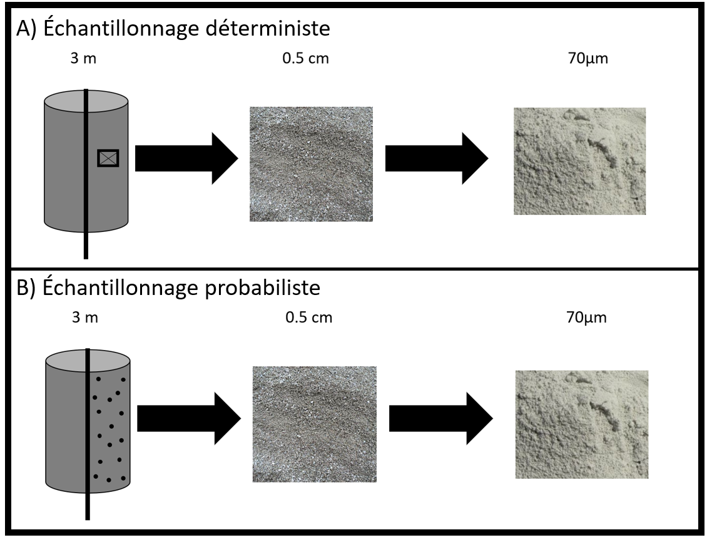
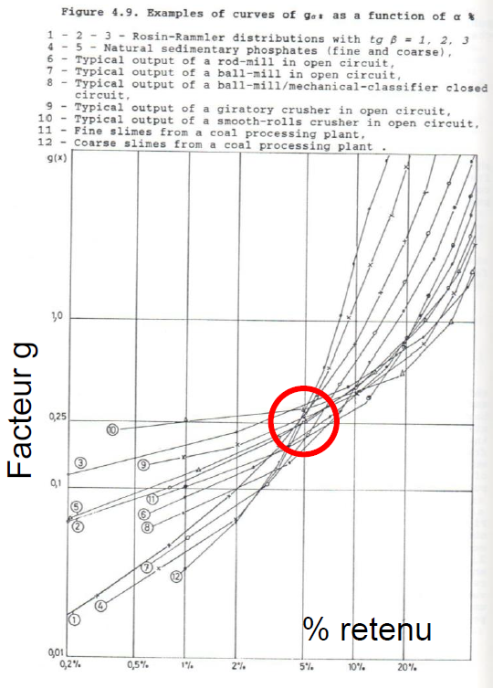
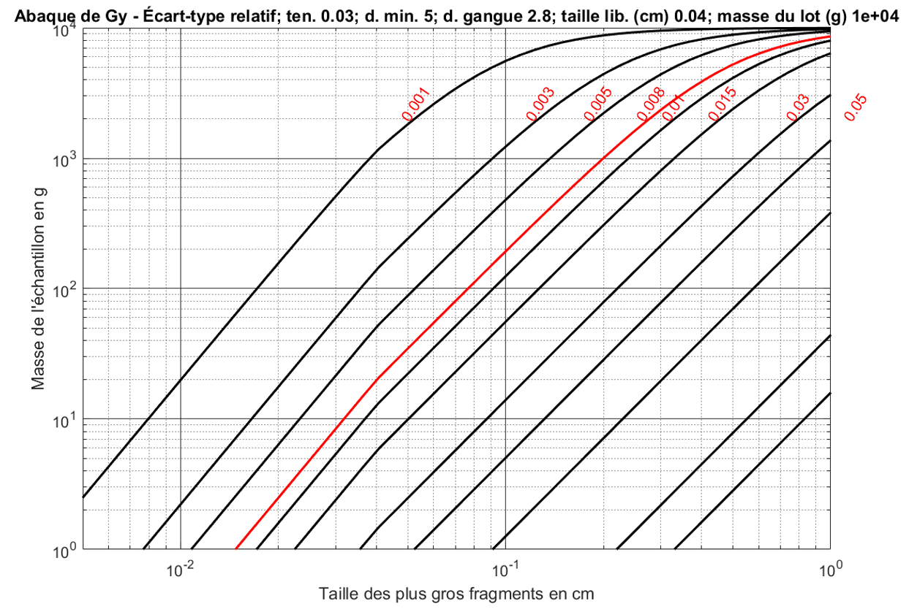
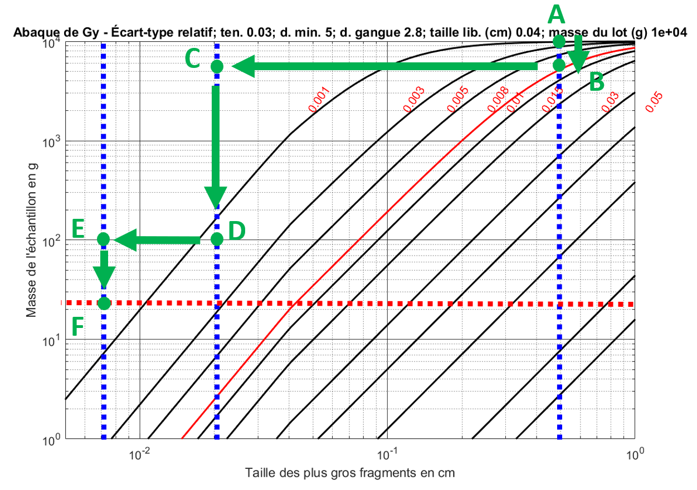

## Théorie de l'échantillonnage des matières morcelées

La théorie de l'échantillonnage des matières morcelées quantifie l'erreur fondamentale, celle qui naît de l'hétérogénéité du lot. Même avec un bon protocole, le matériau n'est jamais parfaitement homogène : les fragments n'ont pas tous la même taille ni la même teneur. C'est cette variabilité résiduelle qui produit l'erreur fondamentale d'échantillonnage.

C'est précisément cette incertitude que la théorie de l'échantillonnage des matières morcelées cherche à quantifier. Pierre Gy, ingénieur des mines, a abordé le problème de l'échantillonnage sous un angle statistique. Il a développé une formule permettant d'estimer la **précision relative** d'un échantillon représentant un lot donné, en fonction de la taille des fragments, de la masse de l'échantillon et du lot, ainsi que de différents paramètres minéralogiques et granulométriques.

Cette théorie permet donc de passer d'une approche principalement qualitative de l'échantillonnage — identifier les biais et les méthodes à risque — à une approche quantitative, où l'on peut estimer l'erreur attendue et ajuster la masse ou la préparation de l'échantillon en conséquence. La présentation retenue ici est simplifiée pour le cours; les ouvrages de référence en donnent le développement complet.

> Gy, P. (1982). *Sampling of Particulate Materials: Theory and Practice* (2e éd.). Elsevier.

### Échantillon probabiliste

La formule de Gy permet d'estimer la précision relative d'un échantillon. Mais pour que ce calcul ait un sens, l'échantillon doit être probabiliste. Cela veut dire que chaque fragment du lot doit avoir une chance d'être inclus dans l'échantillon final. Si certains fragments ne peuvent pas être prélevés dès le départ, l'échantillonnage n'est plus probabiliste : la formule de Gy ne s'applique alors plus, car elle ne décrit que l'erreur d'un prélèvement associé à un échantillonnage probabiliste sans biais.

::: {.callout-note collapse="true"}
## Échantillon probabiliste

Un échantillon probabiliste est un échantillon dans lequel chaque élément du lot a une probabilité non nulle d'être sélectionné.

L'échantillonnage est considéré comme non biaisé lorsque tous les fragments ont la même probabilité d'être sélectionnés.
:::

La @fig-echantillon illustre cette distinction. Dans un échantillonnage déterministe, une portion précise de la carotte est sélectionnée selon un choix imposé, par exemple parce qu'elle semble plus minéralisée, plus accessible ou plus intéressante visuellement. Ce type de sélection peut introduire un biais important, car certaines parties de la carotte n'ont aucune chance d'être analysées. À l'inverse, dans un échantillonnage probabiliste, chaque fragment de la carotte peut, en principe, contribuer à l'échantillon final.

En pratique, on envoie souvent une demi-carotte à l'analyse et on conserve l'autre moitié en carothèque. Cette moitié peut servir plus tard pour vérifier les observations, refaire certaines analyses ou réaliser d'autres essais si nécessaire.

De plus en plus de compagnies numérisent aujourd'hui les carottes à l'aide de photographies en haute résolution, d'imagerie géophysique ou d'autres méthodes d'acquisition numérique. Ces approches facilitent l'archivage et peuvent réduire les contraintes d'entreposage. Elles ne remplacent toutefois pas entièrement l'échantillon physique : l'observation directe d'une carotte par une personne expérimentée demeure importante, notamment pour interpréter les textures, les structures et certains détails géologiques difficiles à automatiser.

{#fig-echantillon}

### Équation de Gy

Soit un certain lot de minerai, par exemple, une demi-carotte de forage. Supposons que l'on concasse cette carotte jusqu'à ce que la taille des plus gros fragments soit de $d$ (en cm). On définit $d = d_{5\%}$ comme la taille du tamis qui retient uniquement les 5 % des fragments les plus gros, c'est-à-dire ceux qui représentent 5 % du poids total du lot.

Si l'on prélève un échantillon de masse $M_e$ (habituellement faible en rapport avec la masse $M_L$ du lot qu'il représente), alors la variance relative (sans unité) de l'erreur d'échantillonnage, $s_r^2$, peut s'écrire comme suit :

$$
s_r^2 = \frac{s^2}{a_L^2} = K\,l\,\frac{d^3}{M_e} \left(1 - \frac{M_e}{M_L} \right) \approx K\,l\,\frac{d^3}{M_e}
$${#eq-Gy}

où $M_e$ est la masse de l'échantillon, en grammes. $M_L$ est la masse du lot échantillonné, généralement beaucoup plus grande que $M_e$, également exprimée en grammes. $l$ est le facteur de libération, sans unité. $K$ est une constante dont l'unité est $\text{g/cm}^3$. $a_L$ est la concentration du constituant d'intérêt (exprimée en fraction)

Physiquement, l'erreur décrite par cette équation provient du caractère aléatoire de la sélection d'un nombre fini de fragments. La taille des fragments intervient au cube ($d^3$) parce que la masse d'un fragment croît comme le cube de son diamètre : un gros fragment porte à lui seul une part importante du métal, de sorte que le prendre ou le laisser modifie fortement la teneur de l'échantillon. Concasser plus finement — c'est-à-dire réduire $d$ — réduit l'erreur de façon très marquée. À l'inverse, augmenter la masse de l'échantillon $M_e$ revient à prélever davantage de fragments, dont les fluctuations individuelles se moyennent : la variance décroît comme $1/M_e$, comme pour une moyenne en fonction du nombre d'observations.

Le facteur de libération $l$, compris entre 0 et 1, mesure le degré de libération du minéral d'intérêt dans la gangue. Lorsqu'il forme des grains distincts ($l \to 1$), sa teneur varie fortement d'un fragment à l'autre et l'erreur est maximale; lorsqu'il est finement disséminé dans la roche ($l \to 0$), tous les fragments ont une teneur voisine et l'erreur devient faible. Le terme $(1 - M_e/M_L)$ n'est qu'une correction de population finie, négligeable dès que l'échantillon est petit devant le lot, tandis que la constante $K$ regroupe les propriétés du matériau, indépendantes de la masse prélevée : forme des fragments, étalement granulométrique, densité et teneur en minéral.

À noter que l'approximation n'est valable que lorsque $M_e \ll M_L$.

#### Détermination du facteur de libération $l$

La valeur du facteur de libération $l$ est donnée par :

$$
l = 
\begin{cases}
1, & \text{si } d \leq d_0 \\
\left( d_0/d \right)^{0{,}5}, & \text{si } d > d_0
\end{cases}
$$ {#eq-facteur_l}

où $d_0$ représente la taille à laquelle le constituant d'intérêt est entièrement libéré de la gangue. Il s'agit, par exemple, de la taille à laquelle l'or disséminé dans la pyrite devient natif. L'or est alors entièrement libéré de la pyrite. Remarque, le facteur $l$ est sans unité.

En pratique, la taille de libération $d_0$ se déduit de l'observation minéralogique du minerai, par exemple à l'aide de la microscopie ou de la minéralogie automatisée; les laboratoires fournissent souvent cette information. La forme $l = \left( d_0/d \right)^{0{,}5}$ retenue ici est l'expression classique de Gy; des formulations révisées du facteur de libération ont depuis été proposées (François-Bongarçon et Gy, 2001).

#### Détermination de la constante $K$

La constante $K$ regroupe plusieurs facteurs et peut s'écrire comme :

$$K = f \cdot g \cdot (\mu\delta)$$ {#eq-constante_K}

avec $f$ un facteur de forme, défini comme le rapport du volume d'un fragment au volume du plus petit cube qui le contient entièrement. $f$ est sans dimension. $g$ est un facteur de distribution décrivant l'uniformité de la taille des fragments et donc lié à la courbe granulométrique. $g$ est sans unité. $(\mu\delta)$ est un paramètre qui combine les effets de la teneur et des masses spécifiques du minéral. $\mu\delta$ est exprimée en unités de masse spécifique ($\text{g/cm}^3$).

##### Détermination du facteur de forme

Le facteur de forme $f$ est le rapport entre le volume d'un fragment et celui du plus petit cube qui le contient entièrement. Par exemple, pour un fragment sphérique de diamètre 1 cm, le plus petit cube qui peut contenir cette sphère a un côté de 1 cm. Le volume de la sphère est alors $\frac{4\pi r^3}{3} = \frac{4\pi \cdot 0{,}5^3}{3} \approx 0{,}524 \,\text{cm}^3$, tandis que le volume du cube est de 1 $\text{cm}^3$, ce qui donne $f \approx 0{,}524$.

Pour un minéral fibreux (comme l'amiante) ou tabulaire (par exemple le mica), le facteur de forme est beaucoup plus faible, généralement compris entre $f = 0{,}1$ et $f = 0{,}2$. 

Après de nombreuses analyses en laboratoire sur divers minéraux, une valeur recommandée pour la plupart des minerais est $f = 0{,}5$. Il convient toutefois de noter que ce n'est pas une règle universelle, et qu'il est préférable de consulter la littérature pour identifier le facteur approprié au matériau étudié. 

Par souci de simplicité, nous utiliserons ici systématiquement la valeur :
$$
f = 0{,}5
$$ {#eq-facteur_f}

##### Détermination du facteur de distribution

Le facteur de distribution $g$ mesure l'uniformité de la courbe granulométrique. Il peut être estimé à partir des diamètres caractéristiques de la distribution, soit $d_{5\%}$ et $d_{95\%}$, selon la règle suivante : $$g =
\begin{cases}
    0{,}25, & \text{si aucune calibration n'est effectuée} \\
    0{,}40, & \text{si } \frac{d_{95\%}}{d_{5\%}} > 4 \\
    0{,}50, & \text{si } 4 > \frac{d_{95\%}}{d_{5\%}} > 2 \\
    0{,}75, & \text{si } 2 > \frac{d_{95\%}}{d_{5\%}} > 1 \\
    1{,}00, & \text{si } \frac{d_{95\%}}{d_{5\%}} = 1
\end{cases}$$ 

Cependant, la calibration précise des courbes granulométriques est relativement rare dans les laboratoires miniers en raison du temps et des coûts qu'elle implique. Une compagnie minière peut devoir faire analyser plusieurs milliers de carottes, et elle ne dispose généralement pas du temps ni des ressources nécessaires pour établir une courbe granulométrique détaillée pour chaque échantillon afin d'estimer précisément le facteur $g$.

D'ailleurs, l'utilisation du $d_{5\%}$ dans la formule de Gy n'est pas anodine. De nombreuses analyses expérimentales ont été menées en laboratoire pour établir une corrélation entre la distribution granulométrique et le facteur de distribution (@fig-facteur-g). Il a été observé que, pour un grand nombre d'échantillons, la valeur du facteur $g$ tend à se rapprocher de 0{,}25 lorsqu'on utilise $d_{5\%}$ dans les calculs. Ainsi, pour des raisons de simplicité et d'efficacité, nous adopterons systématiquement, dans nos calculs, la valeur :
$$
g = 0{,}25
$$ {#eq-facteur_g}

{#fig-facteur-g}

##### Détermination du facteur $(\mu\delta)$

Le facteur $\mu\delta$ est un paramètre qui combine les effets de la teneur et des masses spécifiques. Il est défini comme :
$$
\mu\delta = \frac{1-a_L}{a_L}  \Big[(1-a_L)\delta_a + a_L\delta_g \Big]
$$ {#eq-facteur_mu_delta}

où $\delta_a$ désigne la masse spécifique du constituant d'intérêt et $\delta_g$ celle de la gangue (toutes deux en $\text{g/cm}^3$), et $a_L$ la concentration du constituant d'intérêt, exprimée en fraction (10 % = 0{,}10, 10 ppm = 0{,}00001).

::: {.callout-note}
## Remarque 1
La gangue est constituée de toute la matière qui n'est pas le constituant d'intérêt.
:::

::: {.callout-note}
## Remarque 2
Le constituant d'intérêt est le minéral qui contient le métal recherché. Par exemple : pour le cuivre : la chalcopyrite (CuFeS2); pour le zinc : la sphalérite (ZnS); pour l'or : la pyrite (FeS2), ou parfois l'or natif.
:::

**Exemple :** Soit une analyse indiquant une teneur en cuivre (Cu) de 5 %. Le cuivre provient de la chalcopyrite, de formule CuFeS2. La valeur de $a_L$ doit donc représenter la fraction massique de chalcopyrite, et non celle de cuivre. Il faut donc convertir la teneur en cuivre en teneur équivalente en chalcopyrite, en utilisant les masses molaires.

La masse molaire de la chalcopyrite est donnée par :
$$M_{\text{CuFeS}_2} = M_{\text{Cu}} + M_{\text{Fe}} + 2\,M_{\text{S}} = 63{,}5 + 55{,}8 + 2 \times 32{,}1 = 183{,}5~\text{g/mol}.$$

Le rapport massique du cuivre dans la chalcopyrite est donc :
$$\frac{M_{\text{Cu}}}{M_{\text{CuFeS}_2}} = \frac{63{,}5}{183{,}5} \approx 0{,}35.$$

Ainsi, une teneur de 5 % en cuivre correspond à une teneur de :
$$a_L = \frac{5~\%}{0{,}35} \approx 14~\% \quad \text{de chalcopyrite}.$$

Cette valeur est utilisée pour le calcul du facteur $\mu\delta$.

Cette relation est vraie uniquement si le cuivre n'est présent que dans la chalcopyrite.

## 🧮 Atelier interactif 3.1 — Calculateur de la théorie de Gy {.unnumbered}

Ce calculateur permet d'estimer l'erreur fondamentale d'échantillonnage pour un seul échantillon à partir des paramètres de la théorie de Gy. En modifiant les caractéristiques du lot, du matériau et de l'échantillon, vous pouvez observer en temps réel l'effet de ces paramètres sur la variance d'échantillonnage.

Il s'agit également d'un outil de validation que vous pouvez utiliser pour vérifier vos calculs et vous accompagner dans la résolution des exercices.

Cet outil n'est manipulable que dans la version web de ce document.



### Exemples d'application

#### Exemple 1 - Mine de Murdochville

La mine de Murdochville fait sauter chaque semaine un volume d'environ $60\,\text{m} \times 40\,\text{m} \times 10\,\text{m}$. Le minerai est contenu dans la chalcopyrite, dont la masse spécifique est de $4{,}2\,\text{g/cm}^3$, tandis que celle de la roche encaissante, la gangue, est de $3\,\text{g/cm}^3$. Les plus gros blocs résultant du sautage ont un diamètre d'environ $0{,}5\,\text{m}$. On déverse le minerai dans un concasseur qui réduit la taille des blocs à environ $10\,\text{cm}$. La taille de libération de la chalcopyrite est d'environ $1\,\text{mm}$. La teneur du volume sauté devrait se situer entre 1 % et 5 % de Cu.

**Problème :** Quelle masse d'échantillon la mine devrait-elle prélever pour connaître, avec une précision relative de $20\,\%$ (i.e. $s_r/a_L = 0{,}2$), la teneur en cuivre du volume sauté, dans les deux cas suivants :

1.  échantillonnage directement au chargeur, avant le concassage;

2.  échantillonnage après le concassage, sur le convoyeur menant au concentrateur.

##### Solution

Nous supposons que $M_e \ll M_L$ et utilisons la formule simplifiée.

##### a) Échantillonnage avant le concassage

On pose :
$$f = 0{,}5, \quad g = 0{,}25, \quad d = 0{,}5\,\text{m}, \quad l = \left( \frac{1\,\text{mm}}{500\,\text{mm}} \right)^{0{,}5} \approx 0{,}0447$$

La teneur en chalcopyrite est estimée entre :
$$a_L = \frac{1\,\%}{0{,}35} \approx 2{,}86\,\%, \quad \text{et} \quad a_L = \frac{5\,\%}{0{,}35} \approx 14{,}3\,\%$$

En substituant dans l'expression du facteur $\mu\delta$, on trouve :
$$\mu\delta \in [24{,}1, \, 141{,}5]$$

On impose une précision relative $s_r = 0{,}2 \Rightarrow s_r^2 = 0{,}2^2 = 0{,}04$. En remplaçant dans la formule de variance :

$$0{,}04 = \mu\delta \cdot l \cdot f \cdot g \cdot \frac{d^3}{M_e}$$

$$M_e = \mu\delta \cdot l \cdot f \cdot g \cdot \frac{d^3}{0{,}04}
= \mu\delta \cdot 0{,}0447 \cdot 0{,}5 \cdot 0{,}25 \cdot \frac{0{,}5^3}{0{,}04}
\Rightarrow M_e \in [421\,\text{kg},\,2470\,\text{kg}]$$

##### b) Échantillonnage après le concassage

Seuls $d$ et $l$ changent :

$$d = 0{,}1\,\text{m}, \quad l = \left( \frac{1\,\text{mm}}{100\,\text{mm}} \right)^{0{,}5} = 0{,}1$$

$$M_e = \mu\delta \cdot 0{,}1 \cdot 0{,}5 \cdot 0{,}25 \cdot \frac{0{,}1^3}{0{,}04}
\Rightarrow M_e \in [7{,}5\,\text{kg},\,44\,\text{kg}]$$

On constate donc qu'il est beaucoup plus économique d'échantillonner sur le convoyeur que d'échantillonner aux points de soutirage de la mine. De plus, lors de l'échantillonnage au soutirage, les fragments les plus gros ne peuvent être retenus, ce qui introduit un biais dans la méthode et affecte à la fois la teneur estimée et la variance d'échantillonnage. L'échantillonnage aux points de soutirage comporte également un risque opérationnel, puisqu'il peut interférer avec la production minière.

#### Exemple 2 - Gisement d'or disséminé

Dans un gisement d'or, l'or est disséminé et emprisonné dans la structure de la pyrite (densité de la pyrite : 5; densité des roches volcaniques : 3). On prélève des carottes de 1 mètre que l'on divise en deux demi-carottes. On broie ensuite une demi-carotte en fragments de 2,5 mm et on prélève environ 100 g pour analyse. La procédure est-elle adéquate si la demi-carotte présente une teneur en or de 5 ppm, avec une taille de libération de la pyrite $d_0 = 0{,}1$ mm, un facteur de forme $f = 0{,}5$, un facteur de distribution $g = 0{,}75$ et une concentration moyenne de 50 ppm d'or dans la pyrite?

**Solution**: Comme l'or n'est pas libre mais entièrement contenu dans la pyrite, c'est la pyrite qui joue le rôle de constituant d'intérêt dans la formule de Gy : les grains d'or accompagnent les grains de pyrite lors du prélèvement, et c'est donc la libération de la pyrite qui gouverne l'erreur. Il faut alors connaître la proportion de pyrite dans la roche.

Or, l'or présente en moyenne 50 ppm dans la pyrite. Si la roche entière ne contient que 5 ppm d'or, c'est qu'elle renferme une fraction de pyrite égale à $a_L = 5/50 = 0{,}1$, soit 10 % de pyrite en masse. C'est cette valeur que l'on introduit dans le calcul :

$$\mu\delta = 43{,}2, \quad \text{avec} \quad a_L = 0{,}1,\ \delta_a = 5,\ \delta_g = 3$$

On a également :

$$l = (0{,}1/2{,}5)^{0{,}5} = 0{,}2, \quad f = 0{,}5, \quad g = 0{,}75.$$

En appliquant la formule de la précision relative ($s_r^2$) :

$$s_r^2 = \frac{43{,}2 \times 0{,}2 \times 0{,}5 \times 0{,}75 \times 0{,}25^3}{100} = 0{,}0005$$

d'où :

$$s_r = \sqrt{s_r^2} = \sqrt{0{,}0005} = 0{,}02$$

La procédure est excellente : elle permet une précision de l'ordre de 2 %.

#### Exemple 3 - Gisement d'or natif

Reprenons le même gisement qu'à l'exemple 2, mais supposons cette fois que l'or se présente sous forme native (pépites et paillettes), avec une taille de libération de 0,01 mm. La procédure de prélèvement reste la même (broyage à 2,5 mm, 100 g analysés). Est-elle toujours adéquate?

Cette fois, l'or n'est plus emprisonné dans la pyrite : il forme ses propres grains. Le constituant d'intérêt est donc l'or lui-même, et sa concentration dans la roche entre directement dans la formule, soit $a_L = 5\ \text{ppm} = 5 \times 10^{-6}$ (au lieu des 10 % de pyrite de l'exemple précédent).

Comme $a_L$ est très petit, le facteur minéralogique se simplifie en $\mu\delta \approx \delta_a / a_L$ :

$$\mu\delta \approx \frac{19}{5 \times 10^{-6}} = 3{,}8 \times 10^6 \qquad (\delta_a = 19 : \text{densité de l'or})$$

Le facteur de libération vaut $l = (0{,}001/0{,}25)^{0{,}5} = 0{,}063$; l'or se présentant en paillettes, on pose un facteur de forme $f = 0{,}2$, et le facteur de distribution reste $g = 0{,}75$.

En appliquant la formule de la précision relative :

$$s_r^2 = \frac{3{,}8 \times 10^6 \times 0{,}063 \times 0{,}2 \times 0{,}75 \times 0{,}25^3}{100} = 5{,}61$$

$$s_r = \sqrt{5{,}61} = 2{,}37$$

La procédure est cette fois inadéquate. Avec un écart-type relatif de l'ordre de 237 %, la teneur mesurée se situera approximativement entre 0 et 30 ppm dans 95 % des cas, alors que la vraie teneur est de 5 ppm. À teneur identique, le simple fait que l'or soit natif plutôt qu'inclus dans la pyrite rend l'échantillonnage beaucoup plus difficile : c'est l'effet pépite. Pour retrouver une précision acceptable, il faudrait analyser toute la demi-carotte, ou broyer bien plus finement que 2,5 mm avant de prélever les 100 g. Nous verrons graphiquement comment poser ce type de diagnostic.

### Procédures multistages

Les procédures d'échantillonnage nécessitent presque toujours plusieurs étapes successives de broyage et d'échantillonnage. Par exemple, une demi-carotte peut être broyée à 2{,}5 mm, puis un sous-échantillon de 100 g est prélevé. Ce dernier est ensuite broyé à 0{,}5 mm, puis un prélèvement de 30 g est broyé à 0{,}1 mm, avant de prélever un dernier sous-échantillon de 5 g destiné à l'analyse.

On reconnaît ainsi trois étapes de broyage (2{,}5 mm, 0{,}5 mm et 0{,}1 mm) et trois étapes de sous-échantillonnage (100 g, 30 g et 5 g). Chaque étape de sous-échantillonnage introduit une erreur d'échantillonnage, dont on peut calculer la variance à l'aide des équations présentées précédemment. Ces sous-échantillonnages étant réalisés de manière indépendante, les erreurs associées sont également indépendantes. Par conséquent, les variances relatives s'additionnent — ce point mérite d'être souligné, car ce sont bien les variances qui s'additionnent, et non les écarts-types. Or, la formule de Gy fournit un écart-type relatif. Il ne faut donc pas oublier de convertir les écarts-types en variances avant de les additionner.

Dans une procédure d'échantillonnage, c'est donc le maillon faible --- c'est-à-dire l'étape de sous-échantillonnage générant la plus grande erreur --- qui sera responsable de la majorité de la variance totale de l'erreur. Il est essentiel d'identifier ce maillon faible afin d'apporter les ajustements nécessaires et améliorer la représentativité de l'échantillon.

Sur un graphique où l'on porte en abscisse (*x*) la taille des plus gros fragments ($d$) et en ordonnée (*y*) la masse de l'échantillon ($M_e$), on peut représenter chaque étape de concassage ou de broyage par un segment horizontal, et chaque étape de sous-échantillonnage par un segment vertical. Il est possible de superposer à ce graphique les courbes de variance relative correspondant à chaque taille et chaque masse d'échantillon (voir section suivante). Cela permet de détecter aisément les étapes critiques nécessitant des améliorations afin d'obtenir un échantillon plus représentatif.

### Représentation graphique

Les facteurs ayant le plus d'influence sur la variance d'échantillonnage sont nettement la taille des plus gros fragments ($d$) et la masse de l'échantillon ($M_e$). Sur des échelles log-log, la variance d'échantillonnage varie linéairement avec la taille des fragments et la masse de l'échantillon.

On peut ainsi construire une série de droites sur ce graphique, ayant une pente de 3 lorsque $d < d_0$ et de 2{,}5 lorsque $d > d_0$, ces droites représentant des configurations assurant une variance d'échantillonnage constante à chaque étape d'un sous-échantillonnage.

La @fig-abaque-gy présente des isocontours (i.e., des plages de valeur pour $M_e$ et $d$ qui fournissent le même écart-type relatif $s_r$) pour les paramètres suivants : $M_L = 10\,000$ g, $d_0=0{,}04$ cm, $\delta_g=2{,}8$, $\delta_a=5$, $f=0{,}5$, $g=0{,}5$, $a_L=0{,}03$.

{#fig-abaque-gy}

À partir de cette représentation graphique, il est facile, lorsqu'on connaît la procédure d'échantillonnage en plusieurs étapes (*multistage*), de la représenter et d'observer visuellement, sans calcul, si elle est adéquate.

Par exemple, considérons l'analyse d'une carotte de 10 000 g ($M_L = 10\ 000$). Trois étapes successives de concassage et de broyage sont réalisées pour réduire la taille des fragments à $d = 0{,}5$ cm, puis à $d = 0,02$ cm, et finalement à $d = 0{,}007$ cm. À chaque étape, une fraction du lot est prélevée : 5300 g lors de la première étape, 100 g lors de la deuxième, et enfin 25 g lors de l'analyse finale. 

La @fig-abaque-gy-ex illustre cette procédure. On part du point A avec une carotte de 10 000 g broyée à une taille de 0,5 cm. On prélève alors 5300 g, ce qui nous amène verticalement au point B. Ce lot est ensuite broyé à une taille de 0,02 cm, nous plaçant au point C. À partir de là, 100 g sont échantillonnés, ce qui nous mène au point D. Ces 100 g sont alors broyés à une taille de 0,007 cm (point E), puis un échantillon final de 25 g est prélevé pour l'analyse (point F).

{#fig-abaque-gy-ex}

::: {.callout-warning}
## Validité de l'abaque
Les isocontours de l'abaque de Gy sont calculés à partir de la masse du lot initial (ici, $M_L = M_{L,1} = 10\,000$ g), qui intervient dans le terme de correction $(1 - M_e/M_L)$. Ils ne sont donc rigoureusement exacts que pour la première étape d'échantillonnage. Aux étapes suivantes, le lot réel est plus petit (ici, 5300 g, puis 100 g), et la valeur exacte de $s_r$ doit être recalculée avec la masse du lot propre à chaque étape.

L'abaque sert donc de visualisation rapide: il permet de représenter la procédure et de vérifier rapidement, à l'œil, si elle est adéquate. On ne peut toutefois pas y lire directement la valeur de $s_r$ pour les étapes subséquentes — seul le calcul numérique permet de retrouver la valeur exacte de la variance relative totale.
:::

On note que trois étapes d'échantillonnage sont effectuées. Ce sont uniquement ces étapes d'échantillonnage qui entraînent une erreur d'échantillonnage. Nous supposons qu'aucune perte de matériau n'a lieu lors des étapes de concassage ou de broyage. Ainsi, la variance relative totale peut être obtenue en additionnant les variances relatives associées à chacune des trois étapes d'échantillonnage :

$$s_r^2 = s_{r,1}^2 + s_{r,2}^2 + s_{r,3}^2$$

Exemple : Supposons que l'on souhaite un écart-type relatif inférieur à 0,008 (ligne rouge sur la @fig-abaque-gy-ex). Pour vérifier rapidement si la procédure est adéquate, sans effectuer le calcul complet, il suffit de s'assurer que les points B, D et F (correspondant aux étapes d'échantillonnage) se situent tous au-dessus de la courbe rouge, et qu'au plus un seul point s'en approche. C'est le cas dans cet exemple, ce qui permet de valider la procédure. Cette règle visuelle découle directement de l'additivité des variances. Un point situé au-dessus de la courbe rouge correspond à une étape dont la variance est inférieure à la cible ($s_{r,i} < 0{,}008$) : plus le point est haut, plus la variance de l'étape est faible. Mais comme les trois variances s'additionnent, on ne peut pas se permettre que les trois étapes soient simultanément proches de la courbe : trois contributions égales à $0{,}008$ donneraient un écart-type total de $\sqrt{3 \times 0{,}008^2} \approx 0{,}014$, bien au-dessus de la cible. En exigeant que les trois points soient au-dessus de la courbe et qu'au plus un seul la frôle, on garantit que la somme des variances reste sous la cible, sans avoir à faire le calcul.

### Calcul de l'erreur d'échantillonnage global ($s_r$) de l'exemple

Données : $$\begin{aligned}
a_L &= 0{,}03 \\
f &= 0{,}5 \\
g &= 0{,}25 \\
\delta_a &= 5 \ \text{g/cm}^3 \\
\delta_g &= 2{,}8 \ \text{g/cm}^3 \\
d_0 &= 0{,}04 \ \text{cm}\end{aligned}$$

Calcul de $\mu\delta$ :
$$\mu\delta = \frac{1 - a_L}{a_L} \cdot \left[ (1 - a_L) \cdot \delta_a + a_L \cdot \delta_g \right]
= \frac{1 - 0{,}03}{0{,}03} \cdot \left[ (1 - 0{,}03) \cdot 5 + 0{,}03 \cdot 2{,}8 \right]
= 159{,}5$$

Calcul de $K$ : $$K = \mu\delta \cdot f \cdot g 
= 159{,}5 \cdot 0{,}5 \cdot 0{,}25 
= 19{,}94 \ \text{g/cm}^3$$

Calcul des $s_r$ pour chaque étape d'échantillonnage. Noter que la masse du lot ($M_L$), la masse d'échantillon ($M_e$), la taille ($d$) et le facteur de libération ($l$) varient en fonction de l'étape d'échantillonnage.

-   **Étape B**\
    $M_e = 5300$ g, $M_L = 10000$ g, $d = 0{,}5$ cm\
    $l = \left( \frac{0{,}04}{0{,}5} \right)^{0{,}5} = 0{,}2828$\
    $s_r^2 = \frac{19{,}94 \times 0{,}2828 \times 0{,}5^3}{5300} \left(1 - \frac{5300}{10000}\right) = 6{,}25 \times 10^{-5}$\
    $\Rightarrow s_r = 0{,}008$

-   **Étape D**\
    $M_e = 100$ g, $M_L = 5300$ g, $d = 0{,}02$ cm\
    $l = 1$\
    $s_r^2 = \frac{19{,}94 \times 1 \times 0{,}02^3}{100} \left(1 - \frac{100}{5300} \right) = 1{,}56 \times 10^{-6}$\
    $\Rightarrow s_r = 0{,}001$

-   **Étape F**\
    $M_e = 25$ g, $M_L = 100$ g, $d = 0{,}007$ cm\
    $l = 1$\
    $s_r^2 = \frac{19{,}94 \times 1 \times 0{,}007^3}{25} \left(1 - \frac{25}{100} \right) = 2{,}05 \times 10^{-7}$\
    $\Rightarrow s_r = 0{,}0005$

**Erreur globale :**\
$s_{r,\text{global}}^2 = 6{,}25 \times 10^{-5} + 1{,}56 \times 10^{-6} + 2{,}05 \times 10^{-7} = 6{,}43 \times 10^{-5}$\
$\Rightarrow s_{r,\text{global}} = 0{,}008$

Le calcul complet montre clairement que l'échantillonnage à l'étape B introduit le plus de variance. L'erreur relative finale, $s_{r,\text{global}}$, est pratiquement égale à celle de l'étape B, $s_{r,1}$. À noter que, dans cet exemple, les valeurs apparaissent égales en raison des arrondis, ce qui n'est pas le cas en réalité.

## 🧮 Atelier interactif 3.2 — Procédures multistages. Calcul de l'erreur d'échantillonnage. {.unnumbered}

Cet atelier permet de visualiser les différentes étapes du calcul de l'erreur d'échantillonnage selon la théorie de Gy. Il peut également être utilisé comme calculateur pour valider vos résultats et vous accompagner dans la résolution des exercices.

La version web de ce document donne accès à la pleine interactivité de cet atelier.



