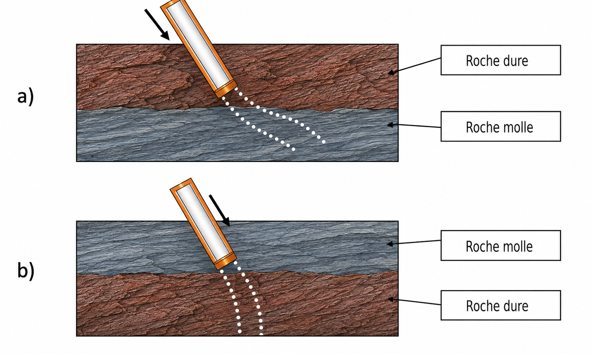
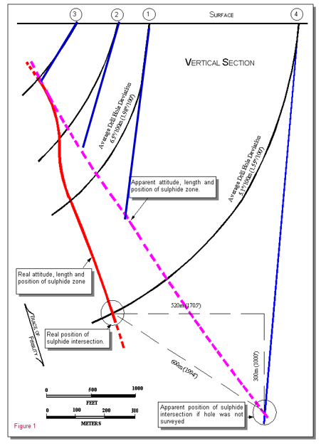

## Déviation des forages et levé

Lors de l'estimation des ressources et des réserves minérales, il est nécessaire de connaître la localisation exacte $(x, y, z)$ des teneurs afin d'interpoler les données à des coordonnées non observées. Cependant, il n'est pas rare que les forages dévient, modifiant les coordonnées initialement prévues. Il faut alors assurer le suivi des déviations et en mesurer l'orientation et la direction (i.e., azimut et plongée) afin de corriger les coordonnées.

### Mise en contexte

La déviation d'un trou de forage dépend de la nature des roches traversées, de la technique de forage utilisée, ainsi que de sa profondeur et de son inclinaison initiale. Si le trou est foré parallèlement à la schistosité ou à la structure naturelle de la roche, il tendra à suivre les plans de faiblesse (p. ex., d'une roche dure à une roche molle). En revanche, s'il est foré à un angle plus élevé, il tendra à se dévier perpendiculairement à ces plans de faiblesse (p. ex., d'une roche molle à une roche dure). Ces deux cas typiques sont illustrés à la @fig-img-deviation.

::: {#fig-img-deviation}
{#fig-img-deviation-a}
:::

Un exemple célèbre illustrant l'importance de la mesure des déviations est celui de la mine de Louvicourt. Les forages ont dévié de manière significative et l'arpentage a été mal réalisé. En conséquence, une forte surestimation des réserves minérales a été constatée. La minière pensait disposer d'une veine minéralisée de plus de 40 Mt, soit une durée de vie de la mine de 25 ans. Les réserves réelles se sont avérées d'environ 15 Mt (une diminution de 25 Mt), avec une durée de vie réduite à 10 ans.

La @fig-impact-dev illustre cette problématique. Les ingénieurs croyaient avoir affaire à une veine dont la longueur correspondait à la ligne rose, avec des forages supposés non déviés (lignes bleues). Cependant, les forages ont en réalité montré des déviations importantes (lignes noires), et la longueur réelle de la minéralisation est beaucoup plus courte (ligne rouge). On observe clairement une surestimation de la longueur de la veine minéralisée par rapport à la vérité.

{#fig-impact-dev fig-align="center"}

### Suivi des déviations

Pour estimer correctement les tonnages et les teneurs, il faut connaître avec précision la position des échantillons dans l'espace. Chaque teneur, associée à une profondeur le long du forage, doit être convertie en coordonnées cartésiennes $(x, y, z)$ pour entrer dans un modèle géostatistique.

Pour y parvenir, il faut d'abord connaître la position du collet du forage. Cette position doit être levée avec précision et intégrée au système de coordonnées approprié. Ensuite, il faut reconstruire la trajectoire du trou à partir des mesures de déviation. Un forage est rarement parfaitement droit : il dévie sous l'effet du dispositif de forage et des roches rencontrées.

Le levé des collets de forage est généralement réalisé à l'aide d'une station totale ou d'un GPS de haute précision. Les coordonnées obtenues doivent être intégrées dans un système de référence unique, afin d'éviter les erreurs de positionnement entre les forages, la topographie et le modèle géologique. Les altitudes des collets doivent aussi être comparées à la topographie locale; un écart de plus d'une demi-hauteur de gradin, soit environ 2 m, est généralement considéré comme problématique et peut indiquer une erreur de levé ou de saisie.

Les déviations sont mesurées à différentes profondeurs de forage. Selon le contexte, on peut utiliser des instruments magnétiques, des gyroscopes ou des mesures de type *single-shot* ou *multi-shot*. Ces mesures fournissent l'azimut et l'inclinaison du trou. On peut ensuite reconstruire la trajectoire du forage en 3D et replacer correctement les intervalles échantillonnés.

Il faut faire attention, car un forage peut dévier bien plus qu'on ne le pense. C'est souvent le cas pour les forages inclinés, profonds ou réalisés dans des roches aux propriétés très variables. La trajectoire peut être influencée par les contrastes de dureté, les plans de faiblesse ou certaines structures géologiques. Les instruments magnétiques peuvent également être perturbés par des minéraux tels que la magnétite ou la pyrrhotite. Dans certains cas, il faut aussi corriger les azimuts en tenant compte de la déclinaison magnétique.

Si les déviations ne sont pas correctement suivies, un intervalle minéralisé peut être placé au mauvais endroit dans le modèle. L'erreur peut atteindre plusieurs mètres. Ce déplacement fausse l'interprétation géologique et l'estimation des ressources.

### Méthode de calcul des déviations

Pour utiliser les données de forage dans un modèle 3D, il faut convertir les profondeurs mesurées le long du trou en coordonnées $(x, y, z)$. Cette étape s'appelle le désondage, ou *desurveying*.

Au départ, les analyses sont seulement placées selon leur profondeur dans le forage. Par exemple, les analyses chimiques peuvent n'être réalisées que sur un intervalle compris entre 120 m et 150 m le long du trou. Cette information indique où il se situe dans le forage, mais pas exactement où il se trouve dans l'espace. Si le forage est incliné ou s'il dévie avec la profondeur, l'intervalle ne sera pas directement sous le collet. Il faut donc reconstruire la trajectoire du trou pour placer correctement les échantillons dans le modèle.

Le désondage utilise donc les mesures de déviation prises le long du forage. Ces mesures indiquent l'azimut et l'inclinaison du trou à différentes profondeurs.

::: {#def-azimut}
## Azimut
Angle horizontal donnant la direction du forage, mesuré dans le plan horizontal à partir du nord, dans le sens horaire, et exprimé en degrés (0° à 360°). Un azimut de 0° pointe vers le nord, 90° vers l'est, 180° vers le sud et 270° vers l'ouest.
:::

::: {#def-inclinaison}
## Inclinaison (plongée)
Angle vertical entre la trajectoire du forage et le plan horizontal, exprimé en degrés. Un trou horizontal a une inclinaison de 0° et un trou vertical dirigé vers le bas une inclinaison de 90° (comptée négativement, −90°, dans plusieurs logiciels : la convention de signe doit toujours être vérifiée).
:::

À partir de ces informations, il devient possible de reconstruire la trajectoire du forage et de calculer la position du centre de chaque composite.

Prenons un exemple concret. Le tableau ci-dessous donne les mesures de déviation d'un forage, relevées au collet puis à 40 m, 100 m et 120 m de profondeur : à chaque station, on enregistre l'azimut et l'inclinaison du trou.

::: {#def-collet}
## Collet et arpentage
Le collet est le point où le forage débute en surface. Ses coordonnées $(x_0, y_0, z_0)$ — est, nord et élévation — sont déterminées par arpentage et constituent le point de départ à partir duquel toute la trajectoire du forage est reconstruite.
:::

| Point de mesure | Azimut | Inclinaison |
| :--- | :---: | :---: |
| Collet | $103^\circ$ | $53^\circ$ |
| 40 m | $107^\circ$ | $58^\circ$ |
| 100 m | $120^\circ$ | $65^\circ$ |
| 120 m | $135^\circ$ | $72^\circ$ |

: Mesures de déviation d'un forage. {#tbl-deviation}

L'orientation du trou n'est donc connue qu'à ces quatre stations. Le désondage part du collet, dont les coordonnées $(x_0, y_0, z_0)$ sont connues par arpentage, puis cumule les déplacements le long du trou à partir des mesures de déviation. Pour placer un échantillon situé entre deux stations, il faut interpoler la trajectoire; on obtient alors les coordonnées $(x, y, z)$ du centre d'un composite, par exemple un intervalle situé autour de 110 m de profondeur.

Plusieurs méthodes permettent d'effectuer ce calcul. Les plus utilisées dans les logiciels miniers sont la méthode de la courbure minimale et la méthode d'équilibre tangentielle. La différence tient à la façon d'interpoler la trajectoire entre deux stations : la méthode d'équilibre tangentielle relie les stations par des segments rectilignes, tandis que la courbure minimale les relie par un arc de cercle, ce qui suit mieux une trajectoire courbe. La courbure minimale est généralement considérée comme la plus précise des deux dans la littérature. Cependant, nous utiliserons la méthode d'équilibre tangentielle, car elle est simple à appliquer et permet de bien comprendre le principe du désondage. À noter que lorsque les mesures de déviation sont suffisamment rapprochées, les différentes méthodes de désondage deviennent pratiquement équivalentes.

### Méthode d'équilibre tangentielle (*Balanced Tangential Method*)

La méthode d'équilibre tangentielle est utilisée pour calculer les coordonnées 3D d'un forage à partir des mesures de déviation. Elle suppose que la moitié de la distance mesurée (*Measured Depth*, ou $MD/2$) suit l'orientation du point supérieur (azimut, inclinaison), et que l'autre moitié suit l'orientation du point inférieur. Cela implique que l'on doit identifier le point médian entre deux points de mesure. Prenons l'exemple précédent. La première section, allant de 0 m à 40 m, comprendra deux déviations de 20 m chacune : l'une avec l'inclinaison et l'azimut du collet, l'autre avec l'azimut et l'inclinaison mesurés à 40 m.

Les formules utilisées pour calculer les coordonnées $x$, $y$ et $z$ sont les suivantes :

$$\begin{aligned}
\Delta x &= \frac{MD}{2} \cdot \cos(I_1) \cdot \sin(Az_1) + \frac{MD}{2} \cdot \cos(I_2) \cdot \sin(Az_2) \\
\Delta y &= \frac{MD}{2} \cdot \cos(I_1) \cdot \cos(Az_1) + \frac{MD}{2} \cdot \cos(I_2) \cdot \cos(Az_2) \\
\Delta z &= \frac{MD}{2} \cdot \sin(I_1) + \frac{MD}{2} \cdot \sin(I_2)\end{aligned}$$

Dans ces équations, $MD$ représente la distance mesurée entre deux points de déviation. $I_1$ et $Az_1$ correspondent à l'inclinaison et l'azimut du point supérieur, tandis que $I_2$ et $Az_2$ désignent les paramètres du point inférieur.

Ces incréments $(\Delta x, \Delta y, \Delta z)$ se cumulent à partir du point précédent. Connaissant les coordonnées du collet $(x_0, y_0, z_0)$, la position de la première station, à 40 m, s'obtient par simple addition :

$$
x_1 = x_0 + \Delta x, \qquad y_1 = y_0 + \Delta y, \qquad z_1 = z_0 - \Delta z
$$

où $\Delta z$ est la composante verticale descendante (on la soustrait si $z$ désigne l'élévation). On répète ensuite l'opération de section en section : la section 40–100 m donne $(x_2, y_2, z_2) = (x_1, y_1, z_1) + (\Delta x, \Delta y, \Delta z)$, puis 100–120 m, et ainsi de suite jusqu'à reconstruire toute la trajectoire du trou. Chaque échantillon est alors positionné en cumulant les déplacements depuis le collet.

#### Exemple numérique

Considérons les mesures aux profondeurs de 0 m ($I_1 = 53^\circ$, $Az_1 = 103^\circ$) et de 40 m ($I_2 = 58^\circ$, $Az_2 = 107^\circ$). La distance mesurée est de $MD = 40$ m.

Calculs :

$$\begin{aligned}
\Delta x &= \frac{40}{2} \cdot \cos(53^\circ) \cdot \sin(103^\circ) + \frac{40}{2} \cdot \cos(58^\circ) \cdot \sin(107^\circ) \\
        &\approx \frac{40}{2} \cdot 0{,}6018 \cdot 0{,}9744 + \frac{40}{2} \cdot 0{,}5299 \cdot 0{,}9563 \\
        &\approx 11{,}73 + 10{,}13 = 21{,}86\,\text{m} \\
\Delta y &= \frac{40}{2} \cdot \cos(53^\circ) \cdot \cos(103^\circ) + \frac{40}{2} \cdot \cos(58^\circ) \cdot \cos(107^\circ) \\
        &\approx \frac{40}{2} \cdot 0{,}6018 \cdot (-0{,}2250) + \frac{40}{2} \cdot 0{,}5299 \cdot (-0{,}2924) \\
        &\approx -2{,}71 - 3{,}10 = -5{,}81\,\text{m} \\
\Delta z &= \frac{40}{2} \cdot \sin(53^\circ) + \frac{40}{2} \cdot \sin(58^\circ) \\
        &\approx \frac{40}{2} \cdot 0{,}7986 + \frac{40}{2} \cdot 0{,}8480 = 32{,}93\,\text{m}\end{aligned}$$

Le déplacement du forage entre les profondeurs 0 m et 40 m est d'environ : $\Delta x = 21{,}86$ m, $\Delta y = -5{,}81$ m et $\Delta z = 32{,}93$ m. En répétant ce processus jusqu'à 120 m à partir de mesures successives, le profil 3D du sondage sera construit et les coordonnées des points de mesure seront déterminées.

L'atelier interactif ci-dessous est un calculateur basé sur la méthode d'équilibre tangentielle qui vous permet d'introduire manuellement le nombre de points de mesure (Longueur, Azimut, Inclinaison) et d'obtenir la localisation de n'importe quel composite le long du forage $(x, y, z)$.

<!-- W1 : Déviation des forages -->
## 🧮 Atelier interactif 4.1 — Déviation des forages (méthode tangentielle équilibrée) {.unnumbered}

::: {.content-visible when-format="html"}
Entrez les mesures de déviation (profondeur, azimut, inclinaison) et visualisez la trajectoire 3D du forage. Calculez les coordonnées de n'importe quel composite le long du forage.

:::

::: {.content-visible unless-format="html"}
Cet atelier interactif est disponible uniquement dans la version web du chapitre. Il permet d'entrer les mesures de déviation (profondeur, azimut, inclinaison), de visualiser la trajectoire 3D du forage et de calculer les coordonnées d'un composite le long du forage.
:::
