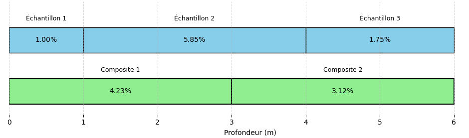
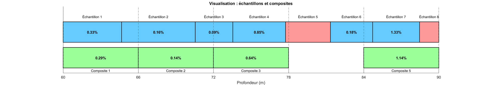
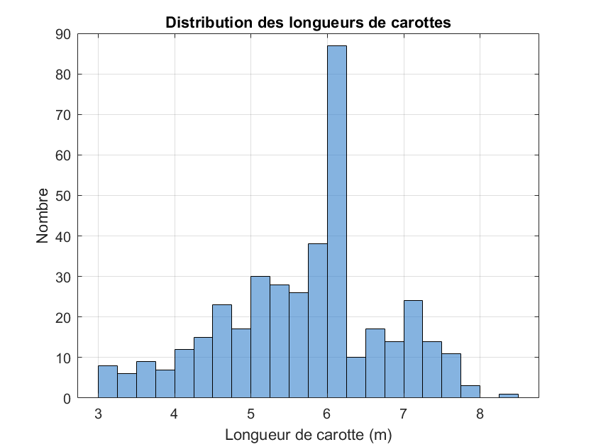

## Régularisation des teneurs

Une étape importante avant de calculer les ressources et les réserves minérales consiste à régulariser les teneurs mesurées sur des supports de longueur et volume variables. Il s'agit d'une pratique courante en estimation des ressources, considérée comme essentielle pour produire des estimations non biaisées. 

::: {#def-support}
## Support
Volume — avec sa forme et son orientation — sur lequel une teneur est mesurée ou définie. Deux teneurs ne sont directement comparables que si elles partagent le même support.
:::

En général, les carottes de forage (ou les supports) sont collectées sur des longueurs différentes (ou à des intervalles irréguliers) en raison des variations des propriétés mécaniques des lithologies traversées, des stratégies d'échantillonnage et de la sélection des supports envoyés en analyse. En d'autres mots, nous n'analysons que rarement l'intégralité des carottes d'un forage et celles-ci n'ont pas toutes la même longueur.

Une sélection est souvent effectuée afin d'envoyer uniquement les carottes jugées pertinentes pour l'analyse, introduisant ainsi un biais de sélection potentiel. La longueur des échantillons dépend aussi de plusieurs facteurs géomécaniques (qualité du massif rocheux) et opérationnels (p. ex., l'expérience du foreur).

En géostatistique, il est primordial que les échantillons aient des supports identiques (voir l'effet de support du chapitre 6), c'est-à-dire que leur représentativité soit équivalente. Autrement dit, toutes les teneurs mesurées doivent correspondre à la même taille de support (par exemple, des carottes de 3 m, avec une densité et un volume identiques). Si les supports diffèrent, il faut procéder à une régularisation afin d'obtenir des composites de même longueur. Ainsi, un composite est un échantillon artificiel obtenu par l'agrégation de plusieurs échantillons (ici, des carottes de forage), souvent de longueurs variables, afin de former des segments de longueur uniforme.

Le composite est généralement calculé comme une moyenne pondérée par la longueur des échantillons et peut également tenir compte de la densité spécifique, des variations de volume ou du taux de récupération du carottage. La régularisation peut répondre à divers objectifs : obtenir une valeur représentative à l'intersection d'un corps minéralisé, créer des composites lithologiques ou métallurgiques, produire des composites réguliers le long des trous, par gradin (*bench* en anglais), par section, par haute teneur, ou encore des composites minimaux en longueur et en teneur. Chacun de ces types de composites répond à des besoins spécifiques selon les contextes d'étude. Les composites de longueur régulière ou en gradins sont les plus fréquemment utilisés pour l'estimation des ressources.

### Exemple simplifié : composites réguliers

Considérons un trou de forage traversant un corps minéralisé, dans lequel trois échantillons de longueurs différentes ont été prélevés. L'échantillon 1 présente une longueur de 1 m et une teneur de 1{,}00 %, l'échantillon 2 une longueur de 3 m et une teneur de 5{,}85 %, et l'échantillon 3 une longueur de 2 m et une teneur de 1{,}75 %. 

Sans régularisation, si l'on calcule simplement la moyenne des teneurs (sans pondération par la longueur), on obtient :

$$\text{Moyenne non pondérée} = \frac{1{,}0 + 5{,}85 + 1{,}75}{3} = \frac{8{,}6}{3} = 2{,}87 \%$$

Cependant, cette valeur ne reflète pas le fait que les longueurs des échantillons sont inégales. Supposons maintenant que l'on veuille créer des composites de 3 mètres. Le premier composite sera constitué de l'échantillon 1 (1 m) et d'une partie de l'échantillon 2 (2 m). La teneur du composite 1 sera obtenue par une moyenne pondérée par la longueur :

$$z_1 = \frac{1 \times 1{,}00 + 2 \times 5{,}85}{1 + 2} = \frac{12{,}7}{3} \approx 4{,}23 \%$$

De même, le second composite sera constitué d'une partie de l'échantillon 2 (1 m) et de l'intégralité de l'échantillon 3 (2 m). La teneur du composite 2 sera aussi obtenue par une moyenne pondérée par la longueur :

$$z_2 = \frac{1 \times 5{,}85 + 2 \times 1{,}75}{1 + 2} = \frac{9{,}35}{3} \approx 3{,}12 \%$$

Maintenant que les supports sont tous les mêmes, on peut procéder au calcul de la moyenne sans risque d'introduire un biais :

$$\text{Moyenne régularisée} = \frac{z_1 + z_2}{2} = \frac{4{,}23 + 3{,}12}{2} = 3{,}68 \%$$

On constate ici que la moyenne régularisée diffère de la moyenne non pondérée. Cette différence illustre l'impact de la régularisation : en tenant compte des longueurs réelles des échantillons, on obtient une estimation plus représentative de la teneur du gisement. La @fig-composite illustre le calcul effectué ci-haut.

{#fig-composite fig-align="center"}

### Exemple simplifié : densité

La densité des carottes, au même titre que leur longueur, intervient dans la régularisation des teneurs. Supposons qu'un bloc de minerai de 1 m³ contient 3 % de cuivre. Nous voulons calculer la quantité de cuivre en fonction de la densité du minerai.

Si la densité du minerai est de 3{,}5 tonnes par mètre cube (t/m³), la masse totale du minerai dans 1 m³ est de 3{,}5 tonnes. La quantité de cuivre sera alors :

$$\text{Quantité de cuivre} = 3\% \times 3{,}5 \, \text{t} = 0{,}03 \times 3{,}5 \, \text{t} = 0{,}105 \, \text{t} = 105 \, \text{kg}$$

Si la densité du minerai est de 3{,}2 t/m³, la masse totale du minerai dans 1 m³ est de 3{,}2 tonnes. La quantité de cuivre sera alors :

$$\text{Quantité de cuivre} = 3\% \times 3{,}2 \, \text{t} = 0{,}03 \times 3{,}2 \, \text{t} = 0{,}096 \, \text{t} = 96 \, \text{kg}$$

Ainsi, pour 1 m³ de minerai à la densité de 3{,}5 t/m³, la quantité de cuivre est de 105 kg, mais elle chute à 96 kg lorsque la densité est de 3{,}2 t/m³. Bien que la teneur en cuivre soit constante à 3%, la quantité de cuivre dans 1 m³ de minerai varie en fonction de la densité. Plus la densité est faible (3{,}2 t/m³ contre 3{,}5 t/m³), moins il y a de métal dans un volume donné de minerai. Il est donc très important de tenir compte de la densité lors de l'estimation des ressources et des réserves minières. À noter que souvent, les variations de densité peuvent être considérées comme négligeables.

### Accumulation (teneur × épaisseur)

Dans les gisements tabulaires ou filoniens — veines d'or, reefs de platine, certaines latérites nickelifères ou gisements d'uranium de type *roll-front* —, la régularisation classique par composites est mal adaptée. Les intercepts minéralisés sont étroits et de longueur irrégulière, on n'en compte souvent qu'un seul par forage, et les teneurs varient fortement, les intercepts les plus minces étant parfois les plus riches. Dans ces conditions, on travaille plutôt avec l'**accumulation**, aussi appelée variable teneur–épaisseur (*grade–thickness*, ou GT).

L'accumulation est le produit de la teneur par l'épaisseur de l'intercept :

$$
GT = \text{teneur} \times \text{épaisseur}
$$

Cette quantité est proportionnelle au contenu en métal de l'intercept. On l'estime indépendamment de l'épaisseur, puis la teneur finale en un point ou un bloc s'obtient en divisant l'accumulation estimée par l'épaisseur estimée. L'épaisseur doit être l'épaisseur vraie, c'est-à-dire mesurée normalement au pendage, et non la longueur apparente le long du forage.

Cette approche est particulièrement utile lorsque la teneur et l'épaisseur ne sont pas fortement corrélées. Au lieu d'estimer directement la teneur, on travaille avec le produit teneur × épaisseur. Cette variable est souvent moins variable que la teneur seule, ce qui peut rendre l'estimation plus stable. Cela évite aussi de donner trop de poids à quelques fortes teneurs locales.

### Importance de la régularisation

Bien que la régularisation ne soit pas toujours indispensable pour estimer les ressources, elle s'impose dans la majorité des cas. Elle permet d'uniformiser le support des données — c'est-à-dire leur taille ou leur volume — et de corriger les intervalles d'échantillonnage partiels, ce qui facilite une estimation plus cohérente. La plupart des logiciels d'estimation considèrent d'ailleurs que les données sont issues de supports de taille constante, ce qui oblige à former des composites.

La régularisation a aussi un effet très concret : elle lisse une partie de l'information brute. Les teneurs deviennent alors plus comparables entre elles, parce qu'elles sont ramenées sur un même support. Ce support devrait rester cohérent avec la sélectivité réelle de la mine. Par exemple, en mine à ciel ouvert, la hauteur des gradins peut guider le choix de la longueur des composites. En mine souterraine, on peut plutôt se baser sur l'épaisseur des tranches ou sur l'unité exploitée.

Le choix des composites influence directement le modèle de ressources. Il faut donc faire attention à la longueur choisie, aux limites géologiques et aux intervalles incomplets ou manquants. Si les composites sont mal définis, on peut trop lisser les teneurs, mélanger des zones qui devraient rester séparées ou donner un poids trop important à certains intervalles. Les composites conditionnent donc directement l'estimation qui suit.

### Régularisation par trou de forage

Nous répondrons à ces questions à l'aide d'un exemple numérique. Dans cette lecture, nous privilégierons la méthode de régularisation par trou de forage (*downhole compositing*). Il existe d'autres approches, notamment la régularisation par bancs ou par domaines géologiques, qui tiennent compte de critères de sélectivité liés aux opérations minières ou à la géologie du gisement.

La régularisation par bancs (*bench compositing*) regroupe tous les intervalles compris entre l'élévation supérieure et l'élévation inférieure d'un banc, et place le centre du composite au milieu du banc. Elle est commode en mine à ciel ouvert lorsque les forages sont presque verticaux, mais elle se dégrade dès que les forages sont inclinés : pour un forage à 45°, un banc de 10 m intègre plus de 14 m de carotte. On la limite donc en pratique aux forages dont l'inclinaison ne dépasse pas environ 70°, et on l'évite lorsque le jeu de données mêle des forages verticaux et inclinés. La régularisation par trou de forage, elle, compose toujours la même longueur le long du trou et ne dépend pas de l'inclinaison : le centre du composite correspond exactement à la position des échantillons combinés. C'est cette robustesse qui en fait la méthode privilégiée ici. Bien la maîtriser suffit généralement à comprendre les principes des autres méthodes de régularisation.

### Exemple numérique de régularisation par trou de forage

L'exemple suivant illustre un cas typique de régularisation par trou (*down-the-hole*), avec des échantillons dont la longueur des carottes varie entre 3 et 7 m. Certains intervalles contiennent des données manquantes, soit en raison d'une perte d'information, soit en raison d'une non-analyse de l'échantillon. Nous appliquons une régularisation à longueur constante de 6 m. La longueur optimale de 6 m permet ici de réduire la variabilité sans perdre en sélectivité. La méthode utilisée est la régularisation par longueur constante en suivant la longueur du forage. Bien que le respect des limites géologiques ne soit pas pris en compte ici, on peut tronquer les composites à ces limites si nécessaire. Concernant la gestion des données manquantes, les composites contenant des zones sans données sont conservés si la portion valide couvre au moins 50 % de la longueur nominale. Ce seuil de 50 % est un usage courant dans l'industrie, mais il reste arbitraire : une étude de corrélation entre la longueur de composite et la teneur peut justifier un seuil plus bas lorsque cette corrélation est faible. En deçà du seuil retenu, le composite est ignoré.

### Exemples de calcul de composites

La @fig-regularisation-large présente les résultats de la régularisation pour les distances de 60 m à 90 m. Il y a ainsi 5 composites à former (30/6 = 5). Nous expliquerons le calcul pour le composite 2 et 4.

Le Composite 2 couvre l'intervalle de profondeur de 66 à 72 m. Sa teneur est calculée comme la moyenne pondérée des teneurs selon la formule suivante :

$$
\text{Teneur composite 2} = \frac{\sum_i \text{Teneur}_i \times \text{Longueur}_i}{\sum_i \text{Longueur}_i} = \frac{0{,}16 \times 4{,}5 + 0{,}09 \times 1{,}5}{6} = \frac{0{,}855}{6} \approx 0{,}14\ \%
$$

où les longueurs et teneurs considérées ne correspondent qu'aux portions valides. Le Composite 4 couvre l'intervalle de 78 m à 84 m. Bien qu'il croise également des carottes d'échantillonnage, la longueur totale des portions valides dans cet intervalle est inférieure à 3 m (moins de 50 % de la longueur nominale). En vertu du critère fixé, ce composite est donc ignoré et marqué comme `NaN` (non défini).

{#fig-regularisation-large fig-align="center"}

### Choix de la longueur des composites

La longueur de composite choisie dans cet exemple est de 6 m. Ce choix repose d'abord sur l'analyse de la distribution des longueurs des échantillons bruts, qui montre une concentration marquée autour de cette valeur (@fig-distribution-carotte). Cela reflète une trame d'échantillonnage déjà assez régulière dans les forages. Du point de vue géostatistique, cette régularisation à 6 m permet de réduire la variabilité locale tout en maintenant une sélectivité suffisante pour distinguer les structures géologiques majeures. Une régularisation efficace vise d'ailleurs à augmenter le support d'échantillonnage, et non à le réduire.

{#fig-distribution-carotte fig-align="center"}

<!-- W3 : Composite (régularisation) -->
## 🧮 Atelier interactif 4.2 — Régularisation et composite {.unnumbered}

::: {.content-visible when-format="html"}
Ajoutez ou modifiez des échantillons de longueurs variables et observez la formation des composites de longueur fixe. Ajustez la longueur du composite et le seuil de couverture minimale.

:::

::: {.content-visible unless-format="html"}
Cet atelier interactif est disponible uniquement dans la version web du chapitre. Il permet d'ajouter ou de modifier des échantillons de longueurs variables et d'observer la formation de composites de longueur fixe.
:::

Au-delà de son effet sur la moyenne, la régularisation modifie aussi la variabilité spatiale du jeu de données : en moyennant les teneurs sur un support plus grand, les composites lissent les valeurs extrêmes et réduisent la variance par rapport aux carottes originales. C'est la part la plus erratique de la variabilité, celle qui se manifeste à très courte distance, qui est le plus atténuée lorsque les composites sont longs. Cet effet du support sur la variabilité spatiale sera étudié plus loin dans le livre, une fois les outils d'analyse de la continuité spatiale — le variogramme — formellement introduits.

Pour l'instant, il faut surtout retenir que la régularisation est nécessaire, mais qu'elle change aussi les statistiques des données. Maintenant que toutes les teneurs reposent sur un support commun, elles sont enfin comparables entre elles : on peut alors décrire rigoureusement leur distribution — forme, tendance centrale, dispersion, valeurs extrêmes. C'est l'objet de l'analyse exploratoire des données, présentée dans la section suivante.

