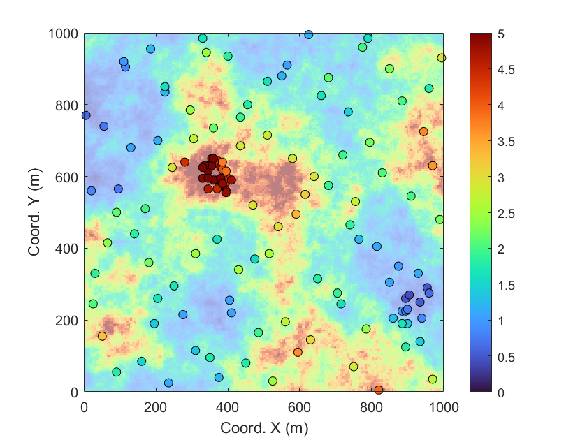
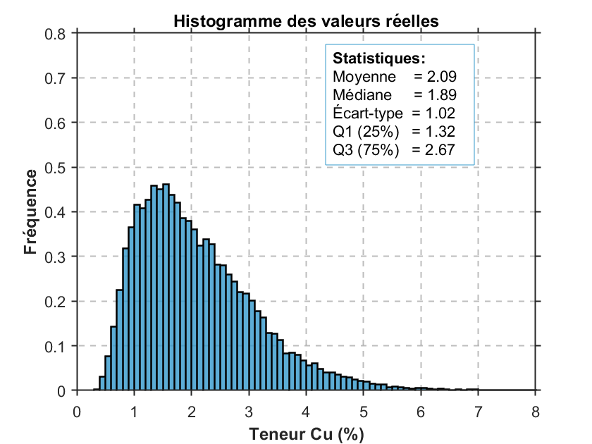
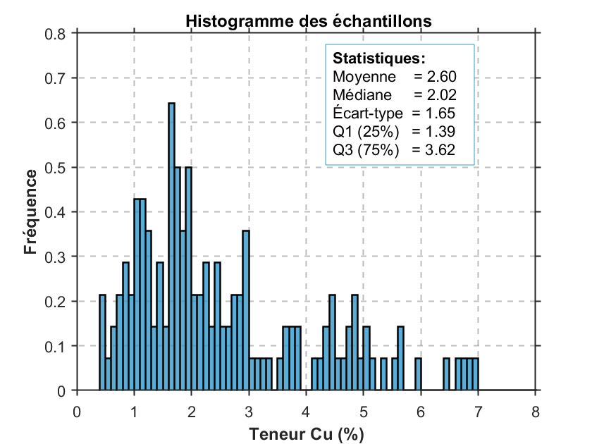
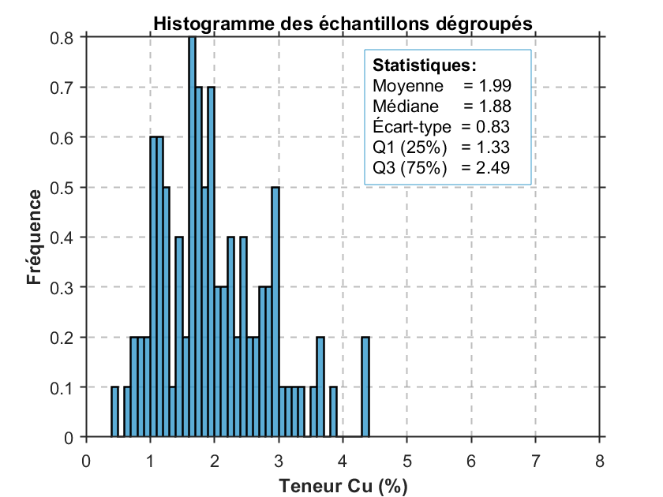
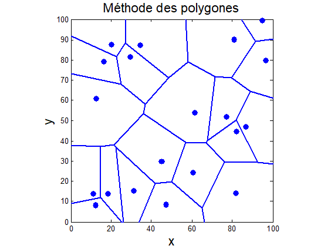
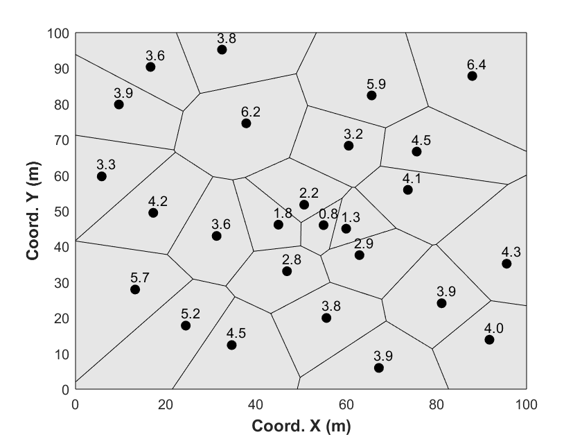
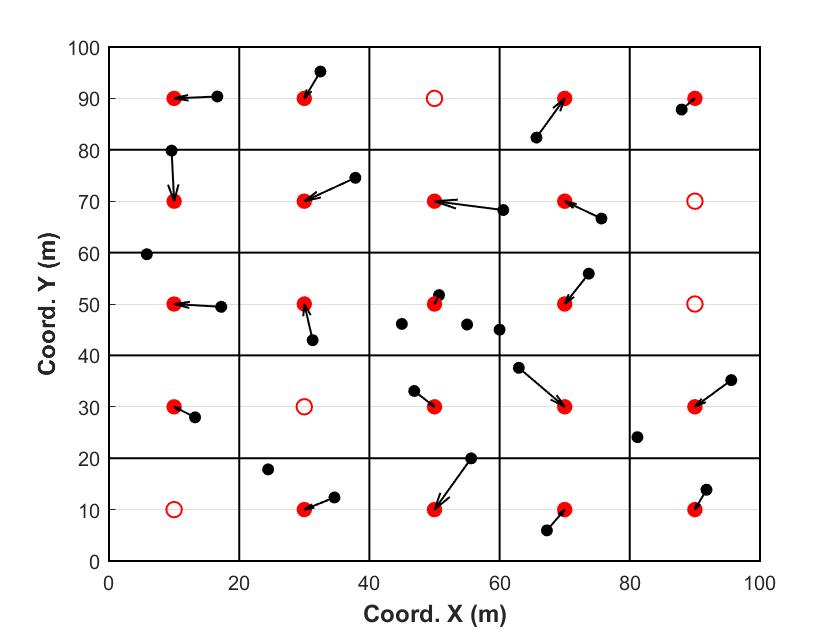
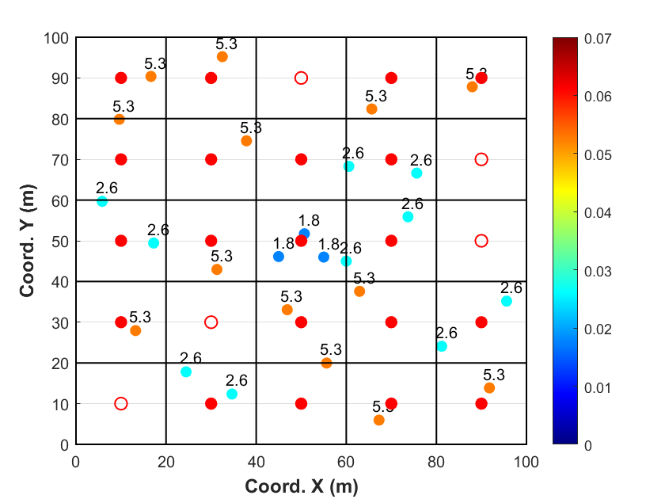
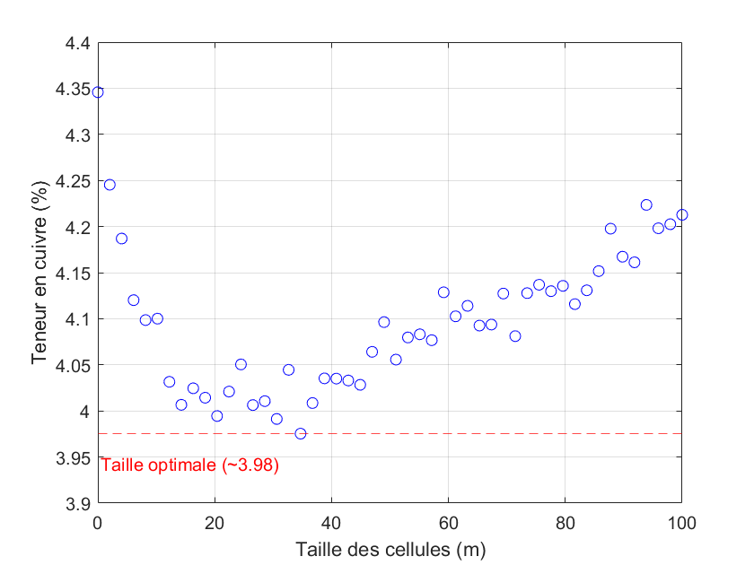

## Débiaisement (*debiasing*) et dégroupement (*declustering*)

La dernière étape, afin d'assurer une représentativité adéquate des teneurs, consiste en le débiaisement et le dégroupement des données. Le débiaisement est l'objectif — rendre les statistiques représentatives de l'ensemble du volume d'intérêt —, et le dégroupement en est la principale technique : il pondère les données selon leur densité spatiale. Les données de forage ne sont généralement pas collectées de manière aléatoire. Par exemple, les forages sont souvent réalisés dans des zones à forte teneur, qui sont prioritaires dans le calendrier d'exploitation. Ce biais d'échantillonnage, bien que justifié d'un point de vue opérationnel, fausse les statistiques globales. Il est donc nécessaire d'ajuster les histogrammes et les statistiques descriptives afin qu'elles soient représentatives de l'ensemble du volume d'intérêt.

### Mise en contexte

La @fig-gisement présente les teneurs en cuivre d'un gisement synthétique suivant une distribution log-normale, de moyenne théorique 2 % et de variance unitaire. Les cercles surlignés indiquent la position des 140 forages. Deux zones apparaissent comme suréchantillonnées : l'une au centre de l'image, où 30 forages se concentrent dans une zone riche du gisement (cercles rouges), et l'autre dans le coin inférieur gauche, où 10 forages représentent une zone à faible teneur (cercles bleus).

{#fig-gisement fig-align="center"}

La présence de zones de suréchantillonnage biaise le calcul de nos statistiques descriptives (par exemple, la moyenne, l'écart-type et les quantiles). Il va de soi que les 30 forages représentant une zone riche vont augmenter la teneur moyenne de nos échantillons, rendant ainsi cette moyenne non représentative de la teneur moyenne réelle du gisement. Dans cette situation, il est nécessaire de procéder au débiaisement des observations par leur dégroupement.

La @fig-histogramme présente les histogrammes normalisés — c'est-à-dire ajustés pour permettre une comparaison équitable entre les distributions — des teneurs réelles du gisement (@fig-histogramme-a), des teneurs échantillonnées sans dégroupement (@fig-histogramme-b) et des teneurs après dégroupement (@fig-histogramme-c). Les statistiques descriptives sont affichées sur chaque histogramme.

La comparaison de ces statistiques permet de constater que les données brutes (figure centrale) sont fortement biaisées, en raison d'une surreprésentation des zones à haute teneur, due au biais d'échantillonnage. Après dégroupement, les statistiques descriptives se rapprochent nettement de celles du gisement réel : la moyenne passe de 2,60 % à 1,90 %, alors que celle de la réalisation simulée est de 2,09 %. Le dégroupement corrige donc l'essentiel du biais, même s'il le sur-corrige légèrement ici (la moyenne théorique du modèle valant 2 %). Ce rapprochement est observable pour l'ensemble des indicateurs descriptifs. Cela illustre l'importance de corriger les biais d'échantillonnage, notamment lorsque les zones riches sont surexplorées. Dans cet exemple, l'absence de correction pourrait entraîner une surestimation significative de la richesse du gisement.

::: {#fig-histogramme layout-ncol=3}
{#fig-histogramme-a}

{#fig-histogramme-b}

{#fig-histogramme-c}

Comparaison des histogrammes de teneur.
:::

### Méthode de dégroupement

Les techniques de dégroupement visent à corriger les biais d'échantillonnage en attribuant un poids à chaque donnée en fonction de sa proximité avec les autres données. Ces poids sont strictement positifs et leur somme est égale à 1. La moyenne dégroupée s'écrit alors

$$\bar z_w = \sum_{i=1}^{N} w_i\, z_i,$$

et la variance dégroupée

$$s_w^2 = \sum_{i=1}^{N} w_i\, (z_i - \bar z_w)^2,$$

chaque échantillon comptant selon son poids $w_i$ plutôt qu'également ($1/N$). On recense plusieurs méthodes de dégroupement dans la littérature. Nous nous limiterons aux trois méthodes les plus couramment implémentées dans les logiciels de calcul des ressources et des réserves minières.

#### Dégroupement polygonal

La méthode de dégroupement polygonal est sans doute la plus simple. Elle attribue à chaque échantillon un poids proportionnel à sa surface ou à son volume d'influence. En pratique minière, cette approche fonctionne bien lorsque les limites de la zone d'intérêt sont clairement définies et que le rapport entre le plus grand et le plus petit poids est inférieur à 10 à 1.

La technique repose sur la construction de polygones d'influence autour de chaque point d'échantillonnage. Ces polygones sont définis par les médiatrices des segments reliant chaque paire de points voisins (Diagramme de Voronoï). Un exemple simple de jeu de données avec polygones d'influence est illustré à la @fig-polygone.

{#fig-polygone fig-align="center"}

Les polygones sont obtenus par la méthode de Voronoi, un algorithme implémenté dans la grande majorité des logiciels. Pour chaque polygone d'influence, on calcule l'aire, puis on assigne à chaque échantillon un poids proportionnel à l'aire de son polygone par rapport à la somme totale des aires de tous les polygones, soit :

$$w_j = \frac{A_j}{\sum_{n=1}^{N} A_n}$$

où $w_j$ est le poids associé à l'échantillon $j$, $A_j$ est l'aire de son polygone d'influence, et $N$ est le nombre total d'échantillons. La @fig-polygone-declus présente 27 données de forage et les poids associés à ces forages, obtenus par la méthode des polygones d'influence. On constate que les poids sont les plus faibles au centre, où plus de données sont présentes, que sur les frontières, où les volumes sont plus importants.

{#fig-polygone-declus fig-align="center"}

La méthode des polygones a toutefois une limite importante. Les échantillons en bordure peuvent recevoir un poids très différent selon la frontière choisie. Si la frontière est placée loin des données, un échantillon isolé peut finir par représenter une trop grande surface.

Le problème est que cette frontière n'est pas toujours facile à définir. Elle peut dépendre du modèle géologique, de la zone d'intérêt ou même des limites de la concession. Pour éviter de donner trop d'importance aux points périphériques, on peut fixer une frontière claire dès le départ ou limiter la portée d'influence de chaque échantillon.

#### Dégroupement par plus proche voisin

La technique de dégroupement par le voisin le plus proche est couramment utilisée pour l'estimation des ressources et est similaire à la méthode polygonale. La différence tient au fait qu'elle s'applique à une grille régulière de blocs ou de nœuds. À chaque bloc, le point le plus proche du jeu de données à dégrouper est attribué.

La @fig-proche-declus présente les mêmes 27 données de forage que dans l'exemple précédent. Cette fois-ci, nous assignons directement à chaque bloc le point de forage (cercles noirs) le plus proche du centre du bloc (cercles rouges). Avec une densité de forages très régulière, la méthode de dégroupement par le voisin le plus proche est pratiquement équivalente à celle par polygones. L'avantage de cette approche réside dans le fait que les données sont directement associées au même support que celui utilisé pour les opérations minières et le calcul des ressources. Le poids d'un échantillon est alors la proportion de blocs qui lui sont attribués : $w_i = m_i / M$, où $m_i$ est le nombre de blocs dont il est le plus proche voisin et $M$ le nombre total de blocs.

{#fig-proche-declus fig-align="center"}

#### Dégroupement par cellules

La technique de dégroupement par cellules est une autre méthode couramment utilisée et sûrement l'une des plus populaires. Le processus consiste d'abord à diviser le volume d'intérêt en une grille de cellules, indexée par $l = 1, \dots, L$. On procède ensuite au comptage des cellules occupées $L_o$ et du nombre de données dans chaque cellule occupée $n_{l_o}$. Enfin, un poids est attribué à chaque donnée en fonction du nombre de données présentes dans la même cellule. Pour une donnée $i$ se trouvant dans la cellule $l$, le poids est donné par :

$$w_i = \frac{1}{n_l \cdot L_o} \quad \text{si} \quad i \in l$$

Les poids sont supérieurs à zéro et leur somme est égale à 1. Chaque cellule occupée se voit attribuer le même poids. Une cellule non occupée ne subit aucun poids.

La @fig-cellule-declus présente les mêmes 27 données de forage. Nous comptabilisons le nombre de données présentes dans chaque cellule (délimitée par des encadrés noirs). Pour chaque cellule, un poids provisoire est attribué : si une seule donnée est présente, son poids est 1; s'il y en a deux, chacune reçoit 1/2. Plus généralement, pour $n$ données, chaque point reçoit $1/n$. Une fois ces poids provisoires calculés, ils sont normalisés par le nombre total de cellules occupées. On observe que certaines cellules ne contiennent aucune donnée, auquel cas aucun poids n'est attribué.

{#fig-cellule-declus fig-align="center"}

Les poids dépendent de la taille des cellules et de l'origine de la grille. Cette grille est un outil intermédiaire et ne correspond pas à la grille finale de modélisation. Si les cellules sont très petites, chaque donnée est isolée et toutes ont le même poids. À l'inverse, si elles sont trop grandes, toutes les données pourraient se regrouper dans une même cellule et recevoir un poids identique.

Le choix des paramètres nécessite des tests de sensibilité. On cherche souvent à ajuster la taille de la grille afin d'obtenir environ une donnée par cellule dans les zones faiblement échantillonnées. Il est essentiel de vérifier la sensibilité aux variations : si une petite variation modifie fortement le résultat, cela peut être dû à des valeurs extrêmes mal pondérées. En pratique, on ne règle pas les poids directement, mais la taille des cellules : on trace la moyenne dégroupée en fonction de cette taille (@fig-size-vs-mean) et l'on retient la taille qui **minimise** cette moyenne lorsque le suréchantillonnage cible les zones riches (ou qui la **maximise** lorsqu'il cible les zones pauvres). C'est la taille qui corrige le mieux le biais.

La dépendance à l'origine de la grille se traite de la même manière. À taille de cellule fixée, déplacer l'origine modifie les poids; pour éviter cet artéfact, on balaie plusieurs origines décalées et on moyenne les poids obtenus pour chaque décalage. Enfin, la forme des cellules doit s'adapter à l'anisotropie des données; si elles sont plus denses dans une direction, la taille des cellules dans cette direction doit être réduite.

{#fig-size-vs-mean fig-align="center"}

<!-- W4 : Dégroupement -->
## 🧮 Atelier interactif 4.4 — Dégroupement par cellules {.unnumbered}

::: {.content-visible when-format="html"}
Explorez l'effet de la taille des cellules sur la moyenne dégroupée. Un gisement synthétique spatialement corrélé est échantillonné avec un biais préférentiel vers les zones riches. Ajustez les paramètres et observez la correction du biais.

:::

::: {.content-visible unless-format="html"}
Cet atelier interactif n'est disponible que dans la version web du chapitre. Il permet d'explorer l'effet de la taille des cellules sur la moyenne dégroupée et d'observer la correction d'un biais d'échantillonnage préférentiel.
:::

