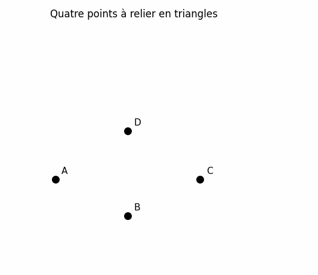
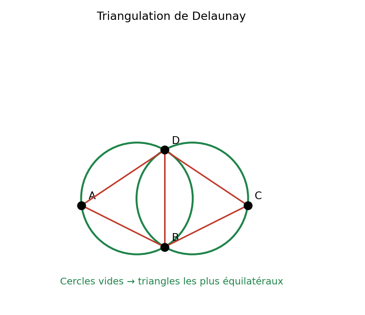
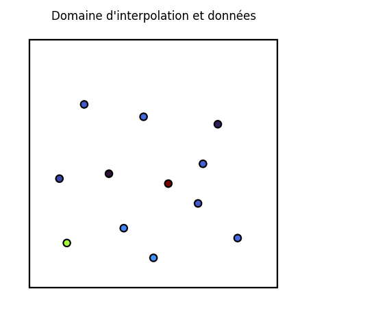
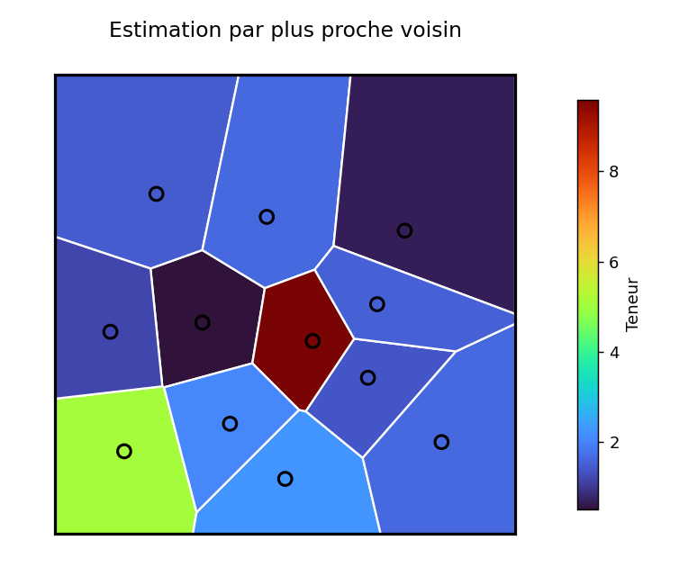

## Méthode des polygones (plus proche voisin)

### Principe

La méthode des polygones attribue à chaque point d'échantillonnage une **zone d'influence** constituée de l'ensemble des points du plan qui lui sont plus proches qu'à tout autre échantillon. Ces zones forment un pavage du plan appelé **diagramme de Voronoï** (ou polygones de Thiessen).

La teneur estimée est constante à l'intérieur de chaque polygone et égale à la teneur mesurée au point d'échantillonnage correspondant. Le volume associé à un polygone est le produit de sa surface par l'épaisseur de la veine mesurée au point d'échantillonnage situé dans ce polygone.

### Construction des polygones de Voronoï

La construction la plus courante procède en deux étapes :

1. **Triangulation de Delaunay.** On relie les points d'échantillonnage en triangles de manière à maximiser les angles minimaux (triangles aussi équilatéraux que possible). Une triangulation de Delaunay est unique et se caractérise par la propriété suivante : le cercle circonscrit à chaque triangle ne contient aucun autre point d'échantillonnage. Des algorithmes très efficaces permettent de construire cette triangulation en quelques secondes, même pour plusieurs milliers de points. Ce critère du cercle circonscrit vide, qui garantit des triangles aussi équilatéraux que possible, est illustré à la @fig-delaunay-critere.

2. **Polygones de Voronoï.** Les polygones sont construits comme le **dual** de la triangulation de Delaunay. Pour chaque arête de la triangulation, on trace la médiatrice (perpendiculaire passant par le point médian du segment). Les intersections de ces médiatrices définissent les sommets des polygones. Chaque polygone entoure un point d'échantillonnage et contient tous les points du plan qui lui sont plus proches qu'à tout autre échantillon. La @fig-voronoi-construction illustre l'ensemble de la construction, de la triangulation aux zones d'influence colorées par la teneur du plus proche voisin.

> **Dualité Delaunay–Voronoï.** Deux points d'échantillonnage sont voisins de Voronoï (leurs polygones partagent une arête) si et seulement s'ils sont reliés par une arête dans la triangulation de Delaunay. Les sommets des polygones de Voronoï correspondent aux centres des cercles circonscrits aux triangles de Delaunay.

::: {.content-visible when-format="html"}
{#fig-delaunay-critere}
:::

::: {.content-visible unless-format="html"}
{#fig-delaunay-critere}
:::

::: {.content-visible when-format="html"}
{#fig-voronoi-construction}
:::

::: {.content-visible unless-format="html"}
{#fig-voronoi-construction}
:::

### Poids d'estimation

Dans cette méthode, pour l'estimation d'un point $\mathbf{x}_0$ situé dans le polygone associé au point $\mathbf{x}_i$ :

$$
\lambda_i = 1, \quad \lambda_j = 0 \quad \text{pour tout } j \neq i
$$

L'estimation est donc simplement $Z_0^* = Z_i$ : la valeur du plus proche voisin.

### Propriétés importantes

L'influence d'un échantillon s'étend sur tout son polygone de Voronoï et s'annule à la frontière du polygone, c'est-à-dire à l'intersection des médiatrices des segments reliant les échantillons voisins. L'étendue de cette zone d'influence ne dépend que du patron d'échantillonnage, et non des valeurs observées.

Les échantillons situés en bordure du domaine sont plus délicats à traiter. Comme ils ne sont pas entourés d'autres échantillons, leur polygone ne se ferme pas naturellement. Il faut donc imposer une limite, soit avec une distance maximale d'influence, soit avec une limite géologique lorsque celle-ci est connue.

Ce choix peut influencer le résultat. Si la limite est trop éloignée, un échantillon isolé peut recevoir trop de poids et faire varier le tonnage estimé en bordure du gisement. La @fig-voronoi-bordure illustre cet effet : pour un même jeu de données, la cellule du point de bordure (contour noir épais) s'étend et son poids augmente fortement lorsque la frontière s'éloigne.

{#fig-voronoi-bordure}

### Avantages et limites

**Avantages**: La méthode des polygones est simple à mettre en œuvre et à interpréter, et ne demande aucun paramètre à ajuster. Elle donne des résultats satisfaisants pour des minéralisations continues, à variation graduelle, ainsi que pour des échantillonnages denses et réguliers. Elle est particulièrement utile pour des estimations préliminaires rapides, y compris sur des données irrégulières : le tonnage s'obtient alors en sommant les aires des polygones, multipliées par l'épaisseur et la densité. Pour ces mêmes raisons de simplicité et d'efficacité, elle est très employée en environnement et pour l'estimation des sols contaminés, où elle permet de délimiter rapidement les zones à traiter.

**Limitations**: Ses limites tiennent surtout à sa nature purement géométrique. L'estimation est discontinue aux frontières des polygones : un léger déplacement du point estimé peut faire basculer brusquement la valeur. Elle génère aussi un fort biais conditionnel, la qualité de l'estimation dépendant à la fois de la position des observations et des valeurs mesurées. Surtout, elle néglige l'effet de support : la distribution des valeurs estimées reste semblable à celle des valeurs ponctuelles observées, alors qu'un bloc minier, de volume fini, varie moins qu'un échantillon ponctuel — un écart que la géostatistique corrige (chapitre 6). Enfin, les données redondantes, proches les unes des autres, ne sont pas dépondérées : leur zone d'influence individuelle est réduite, mais la redondance d'information qu'elles portent n'est pas explicitement pénalisée.

<!-- W1 : Polygones de Thiessen -->
## 🧮 Atelier interactif 5.1 — Polygones de Thiessen (Voronoï) {.unnumbered}

::: {.content-visible when-format="html"}
Cliquez sur le canevas pour placer des points d'échantillonnage. Chaque point se voit attribuer une teneur aléatoire et une zone d'influence (polygone de Voronoï). Basculez entre la vue polygones, la triangulation de Delaunay, ou les deux superposées.


:::

::: {.content-visible unless-format="html"}
Cet atelier interactif est disponible uniquement dans la version web du chapitre. Il permet de placer des points d'échantillonnage, de visualiser les polygones de Voronoï associés et d'explorer leur lien avec la triangulation de Delaunay.
:::

