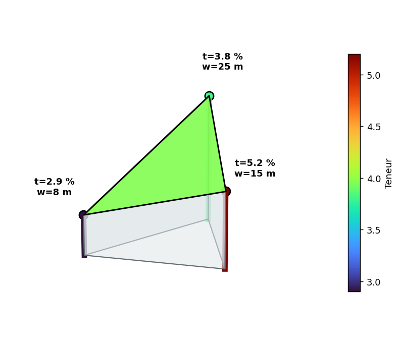

## Méthode des triangles

### Principe

Avec la méthode des triangles, on relie les points d'échantillonnage trois par trois pour découper le domaine en triangles. La teneur à l'intérieur d'un triangle est ensuite calculée à partir des teneurs mesurées aux trois sommets.

Chaque triangle représente aussi un volume. On peut le voir comme un prisme triangulaire, dont la base est le triangle et dont l'épaisseur est définie à partir des valeurs observées aux sommets.

### Construction de la triangulation

Tout comme la méthode des polygones, la triangulation de Delaunay est la méthode de référence pour construire les triangles. Elle est unique et produit les triangles les plus équilatéraux possibles, ce qui améliore la qualité de l'interpolation. Rappelons qu'une triangulation de Delaunay est obtenue lorsque le cercle circonscrit à chaque triangle ne contient aucun autre point d'échantillonnage.

Dans certains cas, on peut choisir de tracer les triangles parallèlement à la direction de continuité de la minéralisation, lorsque celle-ci est connue. Ainsi, on adapte la création des triangles en fonction de la géologie.

### Calcul de la teneur moyenne du triangle

Notons $t_i$ la teneur et $w_i$ l'épaisseur (ou, si la densité varie, le produit épaisseur × densité) au sommet $i$ du triangle ($i = 1, 2, 3$). Chaque sommet porte ainsi une teneur *et* une épaisseur : le triangle définit un prisme dont la hauteur varie d'un sommet à l'autre (@fig-prisme-triangle).

{#fig-prisme-triangle}

La teneur moyenne du prisme est le rapport entre le métal qu'il contient et son volume :

$$
\bar t = \frac{\displaystyle\int_T t\,w\,\mathrm{d}A}{\displaystyle\int_T w\,\mathrm{d}A} = \frac{\text{métal total}}{\text{volume total}}.
$$

Le numérateur intègre l'accumulation $t\,w$ (le métal par unité de surface), le dénominateur l'épaisseur $w$. Le résultat dépend donc de la façon dont on suppose que la teneur et l'épaisseur varient dans le triangle. Deux hypothèses sont couramment retenues, d'où deux méthodes.

#### Méthode 1 : Moyenne pondérée par l'épaisseur

**Hypothèse :** l'épaisseur $w$ et l'accumulation $a = t \cdot w$ varient toutes deux linéairement entre les sommets du triangle. Autrement dit, la teneur en un point du triangle dépend à la fois de l'épaisseur de la veine (ou de l'unité géologique) et de la quantité totale de métal accumulée jusqu'à cette localisation.

Sous cette hypothèse, le volume du prisme est égal à l'aire du triangle $A$ multipliée par l'épaisseur moyenne :

$$
V = A \times \frac{w_1 + w_2 + w_3}{3}
$$

L'intégrale de l'accumulation $t \cdot w$ sur le triangle vaut $A \times \frac{t_1 w_1 + t_2 w_2 + t_3 w_3}{3}$, de sorte que la teneur moyenne est :

$$
\bar{t} = \frac{\displaystyle\sum_{i=1}^{3} t_i \, w_i}{\displaystyle\sum_{i=1}^{3} w_i}
$$

Les poids implicites sont :

$$
\lambda_i = \frac{w_i}{\displaystyle\sum_{j=1}^{3} w_j}, \quad i = 1, 2, 3
$$

> **Remarque.** La teneur estimée par cette formule est la teneur moyenne sur l'ensemble du triangle, et non la teneur en un point particulier.

#### Méthode 2 : Méthode des « % »

**Hypothèse :** la teneur $t$ et l'épaisseur $w$ varient toutes deux linéairement entre les sommets (mais leur produit $t \cdot w$ n'est pas linéaire).

L'intégrale du produit de deux fonctions linéaires sur un triangle donne :

$$
\int_T t \cdot w \, dA = \frac{A}{12} \left[ \left(\sum_{i=1}^{3} t_i\right)\left(\sum_{i=1}^{3} w_i\right) + \sum_{i=1}^{3} t_i w_i \right]
$$

En divisant par le volume $V = A \times \frac{\sum w_i}{3}$, on obtient la teneur moyenne :

$$
\bar{t} = \frac{\left(\displaystyle\sum_{i=1}^{3} t_i\right) + \dfrac{\displaystyle\sum_{i=1}^{3} t_i w_i}{\displaystyle\sum_{i=1}^{3} w_i}}{4}
$$

Le numérateur se lit comme la somme des trois teneurs brutes plus la moyenne pondérée par l'épaisseur, le tout divisé par 4 (soit $3 + 1$). Les poids implicites sur les teneurs sont :

$$
\lambda_i = \frac{1}{4} + \frac{w_i}{4\displaystyle\sum_{j=1}^{3} w_j}, \quad i = 1, 2, 3
$$

On vérifie que $\sum \lambda_i = \frac{3}{4} + \frac{1}{4} = 1$.

> **Remarque.** Comme pour la méthode 1, cette formule donne la teneur moyenne sur tout le triangle, et non en un point particulier. Elle diffère de la méthode 1 lorsque l'épaisseur varie entre les sommets : la méthode 1 suppose que le produit $t \cdot w$ est linéaire (ce qui n'est pas le cas si $t$ et $w$ sont chacun linéaires), tandis que la méthode 2 est exacte sous l'hypothèse de linéarité séparée de $t$ et $w$.

### Exemple numérique

Trois sommets d'un triangle présentent les données suivantes :

| Sommet | Teneur $t_i$ | Épaisseur $w_i$ |
|--------|-------------|-----------------|
| 1 | 2,9 % | 8 m |
| 2 | 5,2 % | 15 m |
| 3 | 3,8 % | 25 m |

**Moyenne arithmétique simple :** $(2{,}9 + 5{,}2 + 3{,}8)/3 = 3{,}97$ %

**Épaisseur moyenne :** $(8 + 15 + 25)/3 = 16$ m

**Méthode 1 (moyenne pondérée) :**

$$
\bar{t} = \frac{2{,}9 \times 8 + 5{,}2 \times 15 + 3{,}8 \times 25}{8 + 15 + 25} = \frac{23{,}2 + 78{,}0 + 95{,}0}{48} = 4{,}09\,\%
$$

**Méthode 2 (méthode des %) :**

$$
\bar{t} = \frac{(2{,}9 + 5{,}2 + 3{,}8) + 4{,}09}{4} = \frac{11{,}9 + 4{,}09}{4} = 4{,}00\,\%
$$

On observe que les trois estimations — moyenne simple, méthode 1 et méthode 2 — diffèrent légèrement. L'écart provient de la variation d'épaisseur entre les sommets : les sommets épais (25 m) reçoivent un poids plus élevé dans la méthode pondérée, favorisant la teneur du sommet 3.

### Interpolation ponctuelle par coordonnées barycentriques

Si l'on souhaite estimer la teneur en un point particulier $\mathbf{x}$ situé à l'intérieur d'un triangle (et non la moyenne sur le triangle), on utilise les **coordonnées barycentriques** $\lambda_1$, $\lambda_2$ et $\lambda_3$ du point par rapport aux trois sommets. La teneur interpolée s'écrit alors :

$$
t(\mathbf{x}) = \lambda_1 t_1 + \lambda_2 t_2 + \lambda_3 t_3
$$

avec :

$$
\lambda_1 + \lambda_2 + \lambda_3 = 1
\qquad \text{et} \qquad
\lambda_i \geq 0
$$

si le point $\mathbf{x}$ est situé à l'intérieur du triangle.

#### Calcul des coordonnées barycentriques

Soient les sommets du triangle $\mathbf{x}_1 = (x_1, y_1)$, $\mathbf{x}_2 = (x_2, y_2)$ et $\mathbf{x}_3 = (x_3, y_3)$, et un point $\mathbf{x} = (x, y)$. Les coordonnées barycentriques sont données par :

$$
\lambda_1 =
\frac{
(y_2 - y_3)(x - x_3) + (x_3 - x_2)(y - y_3)
}{
(y_2 - y_3)(x_1 - x_3) + (x_3 - x_2)(y_1 - y_3)
}
$$

$$
\lambda_2 =
\frac{
(y_3 - y_1)(x - x_3) + (x_1 - x_3)(y - y_3)
}{
(y_2 - y_3)(x_1 - x_3) + (x_3 - x_2)(y_1 - y_3)
}
$$

$$
\lambda_3 = 1 - \lambda_1 - \lambda_2
$$

Ces coefficients représentent les poids relatifs des trois sommets dans l'interpolation du point considéré.

Cette interpolation est linéaire à l'intérieur de chaque triangle et assure la continuité aux arêtes partagées entre triangles adjacents.

On peut aussi la voir comme une double interpolation linéaire (@fig-barycentrique). Pour estimer la teneur au point $P$, on interpole d'abord linéairement le long du côté $B$–$C$ afin d'obtenir la teneur au point $D$, où la droite $A$–$P$ coupe ce côté, puis on interpole une seconde fois le long de $A$–$D$, entre la teneur de $A$ et celle de $D$. Le résultat est identique à la formule barycentrique.

{#fig-barycentrique}

<!-- W2 : Triangles (TIN) -->
## 🧮 Atelier interactif 5.2 — Méthode des triangles (TIN) {.unnumbered}

::: {.content-visible when-format="html"}
Placez des points et observez la triangulation de Delaunay. Comparez la teneur moyenne par triangle avec l'interpolation barycentrique continue. Survolez un triangle pour voir les poids et la teneur interpolée.


:::

::: {.content-visible unless-format="html"}
Cet atelier interactif est disponible uniquement dans la version web du chapitre. Il permet d'observer la triangulation de Delaunay, de comparer la teneur moyenne par triangle à l'interpolation barycentrique continue et d'interpréter les poids associés.
:::

