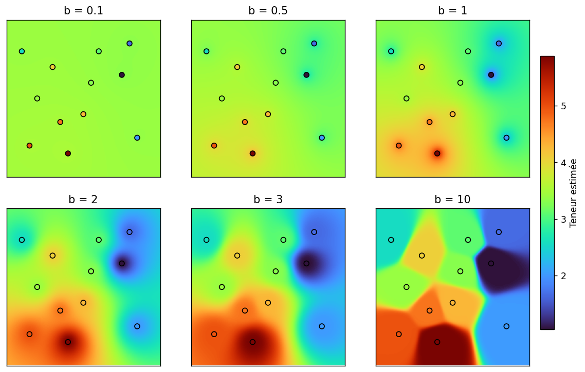
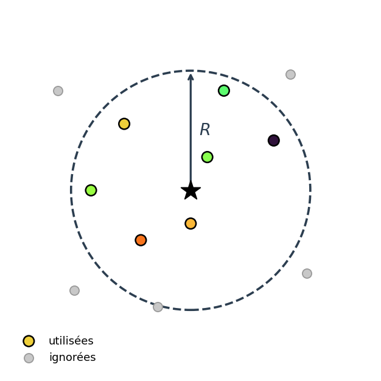
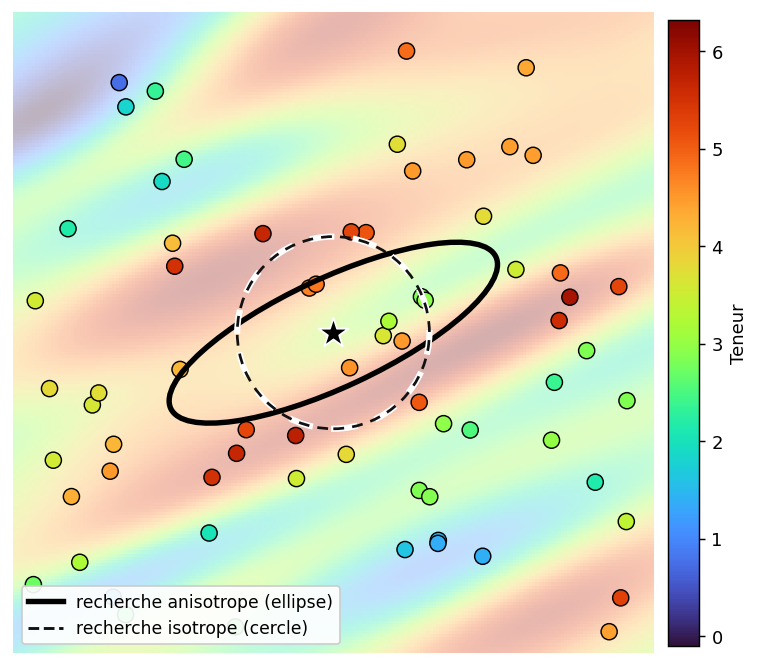

## Méthode de l'inverse de la distance

### Principe

Dans cette méthode, on estime la valeur en un point $\mathbf{x}_0$ à partir des observations voisines. L'idée est simple : plus une observation est proche du point à estimer, plus elle reçoit un poids important. À l'inverse, une observation éloignée aura moins d'influence.

L'estimation s'écrit :

$$
Z_0^* = \frac{\displaystyle\sum_{i=1}^{n} \dfrac{Z_i}{d_i^b}}{\displaystyle\sum_{i=1}^{n} \dfrac{1}{d_i^b}}
= \sum_{i=1}^{n} \lambda_i Z_i
$$

où $d_i = |\mathbf{x}_i - \mathbf{x}_0|$ est la distance entre l'observation $\mathbf{x}_i$ et le point à estimer $\mathbf{x}_0$. Le paramètre $b \geq 0$ contrôle l'importance donnée à la distance. Plus $b$ est grand, plus les points proches dominent l'estimation.

Les poids normalisés sont donnés par :

$$
\lambda_i =
\frac{1/d_i^b}{\displaystyle\sum_{j=1}^{n} 1/d_j^b}
$$

Ces poids somment à 1, ce qui permet d'écrire l'estimation comme une moyenne pondérée des observations.

Lorsque le point à estimer correspond exactement à une donnée, la distance devient nulle. Cette donnée prend alors tout le poids dans le calcul, et l'estimation devient simplement la valeur observée. Pour éviter qu'un point très proche domine complètement les autres, certaines implémentations ajoutent une petite constante à la distance.

### Rôle de l'exposant $b$

Le choix de l'exposant contrôle la rapidité avec laquelle l'influence d'une observation décroît avec la distance :

- **$b = 0$** : tous les poids sont égaux → l'estimation est la moyenne arithmétique de toutes les données.
- **$b = 1$** : décroissance linéaire de l'influence. Surface assez lisse.
- **$b = 2$** : choix classique, offrant un bon compromis entre fidélité locale et lissage.
- **$b$ élevé** ($b > 3$) : les points très proches dominent fortement l'estimation, créant des « plateaux » autour de chaque donnée avec un effet dit « d'œil de bœuf ».
- **$b \to \infty$** : l'estimation converge vers la valeur du plus proche voisin, c'est-à-dire la méthode des polygones.

La @fig-idw-exposant illustre ces comportements sur un même jeu de données.

{#fig-idw-exposant}

### Exemple numérique

On dispose de 5 observations autour d'un point $\mathbf{x}_0$ à estimer :

| Observation | Distance $d_i$ (m) | Teneur $t_i$ (%) |
|-------------|--------------------:|------------------:|
| 1 | 40 | 1,0 |
| 2 | 40 | 1,0 |
| 3 | 30 | 1,5 |
| 4 | 35 | 1,5 |
| 5 | 20 | 3,0 |

Avec $b = 2$ :

$$
Z_0^* = \frac{1{,}0/40^2 + 1{,}0/40^2 + 1{,}5/30^2 + 1{,}5/35^2 + 3{,}0/20^2}{1/40^2 + 1/40^2 + 1/30^2 + 1/35^2 + 1/20^2} = 2{,}05\,\%
$$

L'observation 5, la plus proche ($d_5 = 20$ m) et la plus riche ($t_5 = 3{,}0$ %), domine l'estimation avec un poids $\lambda_5 \approx 0{,}44$. Les deux observations les plus éloignées ($d_1 = d_2 = 40$ m) reçoivent à l'inverse le poids le plus faible, $\lambda_1 = \lambda_2 \approx 0{,}11$ chacune.

### Paramètres d'ajustement

On peut raffiner la méthode par les ajustements suivants :

**(1) Distance maximale de recherche.** Puisque l'influence d'un point devient négligeable à grande distance, on peut exclure les observations situées au-delà d'un rayon maximal. Cela accélère les calculs et évite d'inclure des données non pertinentes. La @fig-idw-recherche illustre ce principe.

{#fig-idw-recherche}

**(2) Anisotropie géométrique.** Si la minéralisation présente une direction de continuité préférentielle, on peut utiliser une **distance anisotrope**. En 2D, après rotation du système de coordonnées pour aligner les axes avec les directions principales de la minéralisation :

$$
d = \sqrt{\Delta x^2 + r^2 \, \Delta y^2}
$$

où $r$ est le **rapport d'anisotropie** (rapport de la portée dans la direction de faible continuité sur la portée dans la direction de forte continuité). Lorsque $r = 1$, on retrouve la distance isotrope. Lorsque $r > 1$, les observations situées dans la direction $y$ sont perçues comme plus éloignées, réduisant leur influence. La généralisation en 3D est directe. L'effet est illustré à la @fig-idw-anisotropie.

{#fig-idw-anisotropie}

**(3) Choix de l'exposant.** Le choix de $b$ est habituellement guidé par les connaissances géologiques du gisement (degré de continuité spatiale) et peut être optimisé par validation croisée.

### Estimation de blocs

La méthode de l'inverse de la distance est d'abord une méthode d'estimation ponctuelle. Si on veut estimer un bloc, il faut donc représenter ce bloc par plusieurs points. On estime chacun de ces points, puis on prend la moyenne des valeurs obtenues. Cette moyenne donne ensuite l'estimation du bloc.

### Validation croisée

La validation croisée permet de tester la méthode avec les données déjà disponibles (@fig-idw-validation). On prend une donnée connue, on la met temporairement de côté, puis on essaie de la retrouver avec les autres données. On répète ensuite l'opération pour chaque point.

Pour chaque position $\mathbf{x}_i$, on compare donc la valeur mesurée $Z_i$ avec la valeur estimée $Z_i^*$ obtenue sans utiliser cette donnée. Les erreurs de validation croisée sont alors :

$$
e_i = Z_i - Z_i^*
$$

et on calcule des statistiques sur ces erreurs : moyenne (qui doit être proche de 0), variance (la plus faible possible), etc. On peut répéter le processus en modifiant les paramètres de la méthode (exposant $b$, rayon de recherche, anisotropie) et retenir la configuration qui donne les meilleures statistiques d'erreur.

Ce principe de validation croisée s'applique à toutes les méthodes d'estimation, y compris les méthodes géostatistiques.

{#fig-idw-validation}

### Limites de la méthode

- **Effet d'œil de bœuf.** L'IDW produit des artefacts circulaires (ou elliptiques en présence d'anisotropie) autour de chaque point de données, particulièrement visibles pour les valeurs élevées de $b$.
- **Pas de prise en compte de la configuration spatiale.** Deux observations proches l'une de l'autre fournissent une information redondante, mais l'IDW ne les dépondère pas : chacune reçoit un poids qui ne dépend que de sa distance au point à estimer, indépendamment de la présence des autres observations. Le krigeage, en revanche, tient compte de cette redondance.
- **Pas de mesure d'incertitude.** L'IDW ne fournit pas directement une variance d'estimation. (Note : il serait possible d'en calculer une, mais cela nécessiterait de modéliser la fonction de covariance des données ou le variogramme, ce que nous verrons ultérieurement.)

> **Note pratique.** Un survol des études de faisabilité récentes déposées sur SEDAR indique que le krigeage ordinaire et l'inverse de la distance sont de loin les méthodes les plus utilisées pour l'estimation des ressources.

<!-- W3 : Inverse de la distance -->
## 🧮 Atelier interactif 5.3 — Inverse de la distance (IDW) {.unnumbered}

::: {.content-visible when-format="html"}
Placez des points et ajustez l'exposant $b$ pour observer son effet sur la surface interpolée. Avec $b = 0$, on obtient la moyenne arithmétique; avec $b$ élevé, on s'approche du plus proche voisin.


:::

::: {.content-visible unless-format="html"}
Cet atelier interactif est disponible uniquement dans la version web du chapitre. Il permet d'explorer l'effet de l'exposant $b$ sur l'interpolation par inverse de la distance et de comparer cette méthode à la moyenne arithmétique et au plus proche voisin.
:::

