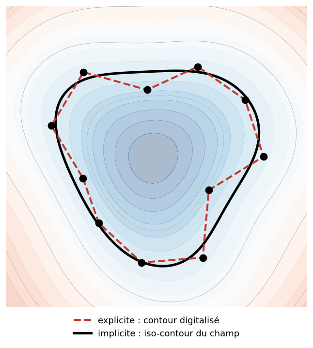
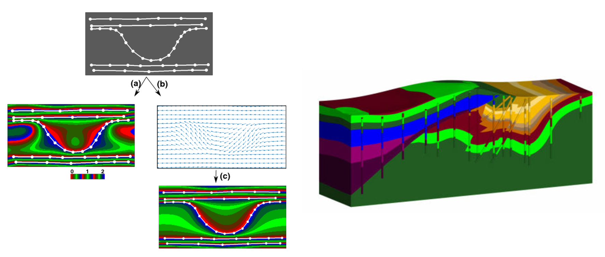
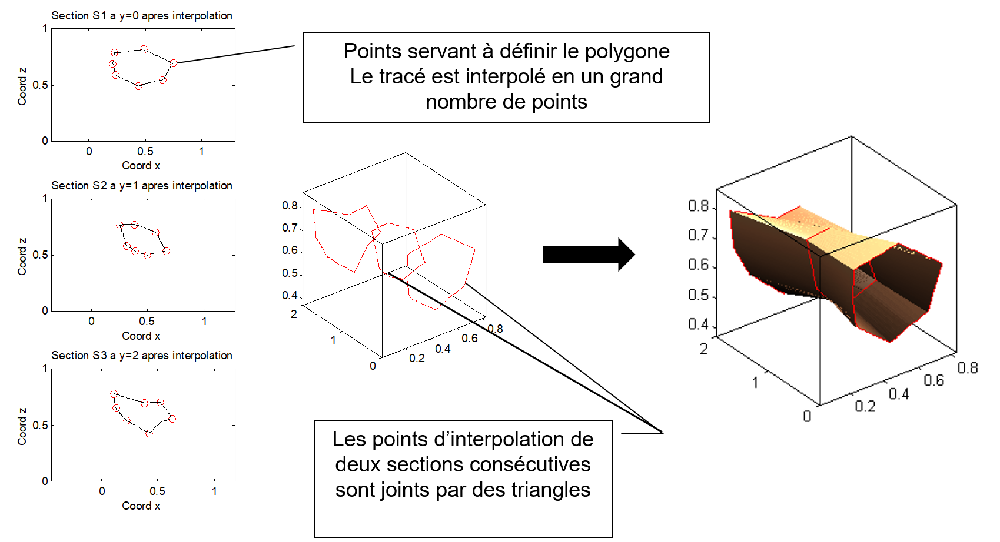
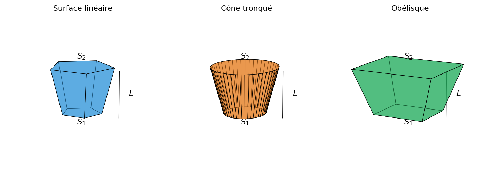

## La méthode des sections

La méthode des sections consiste à découper le gisement en une série de sections, souvent parallèles entre elles. Sur chaque section, on délimite les zones de minerai, puis on estime le volume total à partir des surfaces obtenues et des distances entre les sections.

Cette méthode est surtout utilisée pour des gisements qui se suivent bien dans une direction, par exemple des veines ou des lentilles. Les sections sont généralement tracées perpendiculairement à la direction principale du corps minéralisé.

### Approche moderne

Pour ce type de gisements, les logiciels modernes de calcul des ressources procèdent habituellement en trois étapes :

1. Un **modèle de blocs** du gisement est construit à l'aide d'une méthode d'interpolation (inverse de la distance ou krigeage).
2. Un **solide** est construit à partir des teneurs mesurées sur les carottes, d'une teneur de coupure spécifiée et de l'interprétation géologique.
3. Le modèle de blocs est intersecté avec le solide, et la teneur pour l'ensemble du solide est la moyenne des blocs contenus dans l'enveloppe.

> **Remarque.** Anciennement, les teneurs des forages servaient à estimer directement les teneurs des surfaces, lesquelles servaient ensuite à estimer les teneurs des volumes. Aujourd'hui, on préfère découper le volume en blocs et l'estimer par géostatistique ou par l'inverse de la distance.

### Modélisation explicite et implicite

La méthode des sections est l'exemple type de la **modélisation explicite** : le géologue interprète et digitalise à la main les contours de la minéralisation sur chaque coupe, puis le logiciel relie ces contours pour former les solides. Cette approche laisse un contrôle total à l'interprète et intègre facilement sa connaissance géologique, mais elle est longue, en partie subjective, et doit être largement refaite chaque fois que de nouvelles données arrivent.

La **modélisation implicite** procède autrement : la limite de la minéralisation n'est plus dessinée, mais définie par une fonction mathématique — un champ scalaire ajusté aux données, souvent par fonctions de base radiale. Les surfaces sont ensuite extraites comme des iso-contours de ce champ (@fig-modelisation-2d). Cette approche est plus rapide, reproductible et se met à jour automatiquement lorsqu'on ajoute des forages, au prix d'un contrôle manuel moins direct. Elle s'est largement répandue avec des logiciels comme *Leapfrog* et permet de construire directement des modèles géologiques 3D (@fig-modele3d-implicite).

{#fig-modelisation-2d}

{#fig-modele3d-implicite}

En pratique, les deux approches sont complémentaires : la modélisation implicite fournit rapidement une première enveloppe, que le géologue ajuste ensuite explicitement là où l'interprétation l'exige.

### Construction des solides

La construction des solides s'effectue selon les étapes suivantes.

#### Étape 1 : Zones minéralisées par forage

Pour une section donnée, on représente la trace des forages dans celle-ci. On spécifie habituellement une distance de tolérance, de part et d'autre de la section, pour considérer qu'un forage ou une partie de forage appartient à la section. Chaque analyse est représentée le long du forage, et on détermine les portions situées au-dessus de la teneur de coupure.

#### Étape 2 : Surfaces minéralisées par section

On superpose la géologie connue (lorsque disponible). En considérant la géologie et l'ensemble des portions de forage au-dessus de la teneur de coupure, on délimite une ou plusieurs surfaces minéralisées pour chaque section. On évite de créer des surfaces trop petites qui ne pourraient pas être exploitées. Dans la construction des surfaces, on évite d'extrapoler à des distances trop grandes par rapport aux forages, surtout lors de la fermeture de la surface, là où il n'y a pas de forages pour guider l'interprétation.

#### Étape 3 : Construction des volumes

Les logiciels construisent des solides en 3D à partir des polygones délimitant les surfaces minéralisées sur chaque section (@fig-sections-solide) :

- Chaque polygone est discrétisé en une série de points.
- Deux polygones de sections voisines sont joints par des triangles afin de fermer le vide entre les sections. Le solide est délimité par un ensemble de facettes triangulaires.
- Les sections de bout constituent un cas particulier : l'utilisateur doit fournir un point ou une surface de fermeture pour chaque extrémité.

{#fig-sections-solide}

#### Étape 4 : Intersection avec le modèle de blocs

On détermine si chaque bloc est à l'intérieur ou à l'extérieur du solide formé. On calcule la moyenne des blocs intérieurs au solide. Chaque bloc peut comporter une estimation de la teneur seule (si la densité est constante) ou une estimation conjointe de la teneur et de la densité.

### Méthodes « manuelles » : estimation entre deux sections

Lorsque l'on ne dispose pas d'un logiciel de modélisation 3D, on peut obtenir des estimations approximatives en calculant la teneur moyenne et le volume entre chaque paire de sections consécutives. On note :

- $S_1$, $S_2$ : surfaces minéralisées des deux sections;
- $t_1$, $t_2$ : teneurs moyennes sur chaque section;
- $L$ : distance entre les deux sections.

Deux hypothèses sont possibles pour la variation de la teneur entre les sections :

- **Changement brusque** : la teneur $t_1$ s'applique à la première moitié du volume (de la section 1 jusqu'à la mi-distance) et $t_2$ à la seconde moitié.
- **Changement graduel (linéaire)** : la teneur varie linéairement entre $t_1$ et $t_2$.

De même, pour le calcul du volume, trois hypothèses géométriques sont courantes :

- **Surface linéaire** : la surface de la section varie linéairement de $S_1$ à $S_2$.
- **Cône tronqué** : la section est circulaire et le rayon varie linéairement.
- **Obélisque** : la section est rectangulaire ($a_i \times b_i$) et les côtés varient linéairement.

### Formules entre deux sections

Le tableau suivant présente les formules classiques de volume et de teneur moyenne pour les combinaisons les plus courantes. La densité est supposée constante. Les trois hypothèses géométriques sont illustrées à la @fig-sections-formes.

{#fig-sections-formes}

Ici, **B** désigne une teneur variant de façon brusque entre les sections et **L** une variation linéaire; pour l'obélisque, $S_i = a_i \times b_i$.

| Méthode (volume) | Teneur | Volume | Teneur moyenne $\bar t$ |
|---|:--:|---|---|
| Surface brusque | B | $\dfrac{(S_1+S_2)\,L}{2}$ | $\dfrac{S_1 t_1 + S_2 t_2}{S_1+S_2}$ |
| Surface lin. | B | $\dfrac{(S_1+S_2)\,L}{2}$ | $\dfrac{(3S_1+S_2)\,t_1+(3S_2+S_1)\,t_2}{4\,[S_1+S_2]}$ |
| Surface lin. | L | | $\dfrac{(2S_1+S_2)\,t_1+(2S_2+S_1)\,t_2}{3\,[S_1+S_2]}$ |
| Cône tronqué | B | $\dfrac{(S_1+S_2+\sqrt{S_1S_2})\,L}{3}$ | $\dfrac{(7S_1+S_2+4\sqrt{S_1S_2})\,t_1+(7S_2+S_1+4\sqrt{S_1S_2})\,t_2}{8\,[S_1+S_2+\sqrt{S_1S_2}]}$ |
| Cône tronqué | L | | $\dfrac{(3S_1+S_2+2\sqrt{S_1S_2})\,t_1+(3S_2+S_1+2\sqrt{S_1S_2})\,t_2}{4\,[S_1+S_2+\sqrt{S_1S_2}]}$ |
| Obélisque | B | $\dfrac{(2S_1+2S_2+a_1b_2+a_2b_1)\,L}{6}$ | $\dfrac{a_1b_1(7t_1+t_2)+(2t_1+2t_2)(a_2b_1+a_1b_2)+a_2b_2(t_1+7t_2)}{8a_1b_1+8a_2b_2+4a_1b_2+4a_2b_1}$ |
| Obélisque | L | | $\dfrac{a_1b_1(3t_1+t_2)+(t_1+t_2)(a_2b_1+a_1b_2)+a_2b_2(t_1+3t_2)}{4a_1b_1+4a_2b_2+2a_1b_2+2a_2b_1}$ |

> **Remarque.** En pratique, les méthodes les plus utilisées sont : (1) surface linéaire avec teneur brusque, (2) surface linéaire avec teneur linéaire, et (3) cône tronqué avec teneur brusque. Les formules de l'obélisque sont rarement utilisées car elles nécessitent de connaître les dimensions individuelles des sections, au-delà de leur seule surface.

### Exemple numérique

Données : $S_1 = 600\;\text{m}^2$, $S_2 = 1\,200\;\text{m}^2$, $t_1 = 2\,\%\;\text{Cu}$, $t_2 = 4\,\%\;\text{Cu}$, $L = 20\;\text{m}$.

Pour l'obélisque : $a_1 = 30\;\text{m}$, $b_1 = 20\;\text{m}$, $a_2 = 40\;\text{m}$, $b_2 = 30\;\text{m}$.

| Méthode | Volume (× 10³ m³) | Teneur moyenne (%) |
|---------|:---:|:---:|
| Surface brusque | 18,00 | 3,33 |
| Surface lin., teneur linéaire | 18,00 | 3,11 |
| Cône tronqué, teneur brusque | 17,66 | 3,17 |
| Cône tronqué, teneur linéaire | 17,66 | 3,11 |
| Obélisque, teneur brusque | 17,67 | 3,17 |
| Obélisque, teneur linéaire | 17,67 | 3,11 |

**Observations :**

- La différence la plus importante entre les estimés de teneur provient de l'hypothèse de changement brusque (3,33 %) versus graduel (3,11 %) de la teneur. L'écart entre les hypothèses géométriques de volume (surface linéaire, cône, obélisque) est secondaire.
- Les volumes diffèrent légèrement entre les méthodes (de 17,66 à 18,00 × 10³ m³), mais l'impact sur la teneur moyenne est faible.
- En pratique, le choix entre ces formules a moins d'influence sur le résultat final que la qualité de la délimitation des surfaces minéralisées et le choix de la teneur de coupure.

### Sections de bout

Les sections de bout (première et dernière) nécessitent un traitement particulier, car il n'y a pas de section voisine d'un côté. On peut :

- Prolonger la section de bout sur une demi-distance vers l'extérieur (hypothèse conservatrice).
- Fermer le solide en un point (volume du cône).
- Utiliser une distance d'extrapolation basée sur les connaissances géologiques.

## 🧮 Atelier interactif 5.4 — Modèle de blocs vs approximation par formes {.unnumbered}

::: {.content-visible when-format="html"}
Deux vues 3D synchronisées : faire pivoter l'une fait pivoter l'autre (cliquez-glissez, molette pour zoomer). À gauche, le **modèle de blocs réaliste** : les teneurs proviennent d'un vrai **champ gaussien log-normal** (simulé par FFT-MA, comme dans les autres sections du livre), dont la moyenne locale suit une transition graduelle de $t_1$ vers $t_2$. C'est la « réalité » de référence : son volume et sa teneur moyenne s'obtiennent par comptage des blocs. À droite, la même enveloppe est approximée par les formules, qui résument la transition de façon brusque (marche) ou linéaire (rampe) et le volume par surface linéaire ou cône tronqué. L'écart entre la réalité et l'approximation, affiché en pourcentage, montre la différence d'hypothèse et de teneur calculée. Le bouton « Nouveau champ » tire une autre réalisation; ajustez aussi les surfaces, les teneurs, la distance, la forme et la taille des blocs. La taille des blocs étant fixe, augmenter la distance $L$ ou la section augmente automatiquement leur nombre, comme dans un vrai modèle de blocs.


:::

::: {.content-visible unless-format="html"}
Cet atelier interactif est disponible uniquement dans la version web du chapitre. Il compare, pour deux sections parallèles, l'estimation des ressources par un modèle de blocs (intersection d'une grille avec le solide) et par les formules d'approximation (surface linéaire, cône tronqué).
:::
