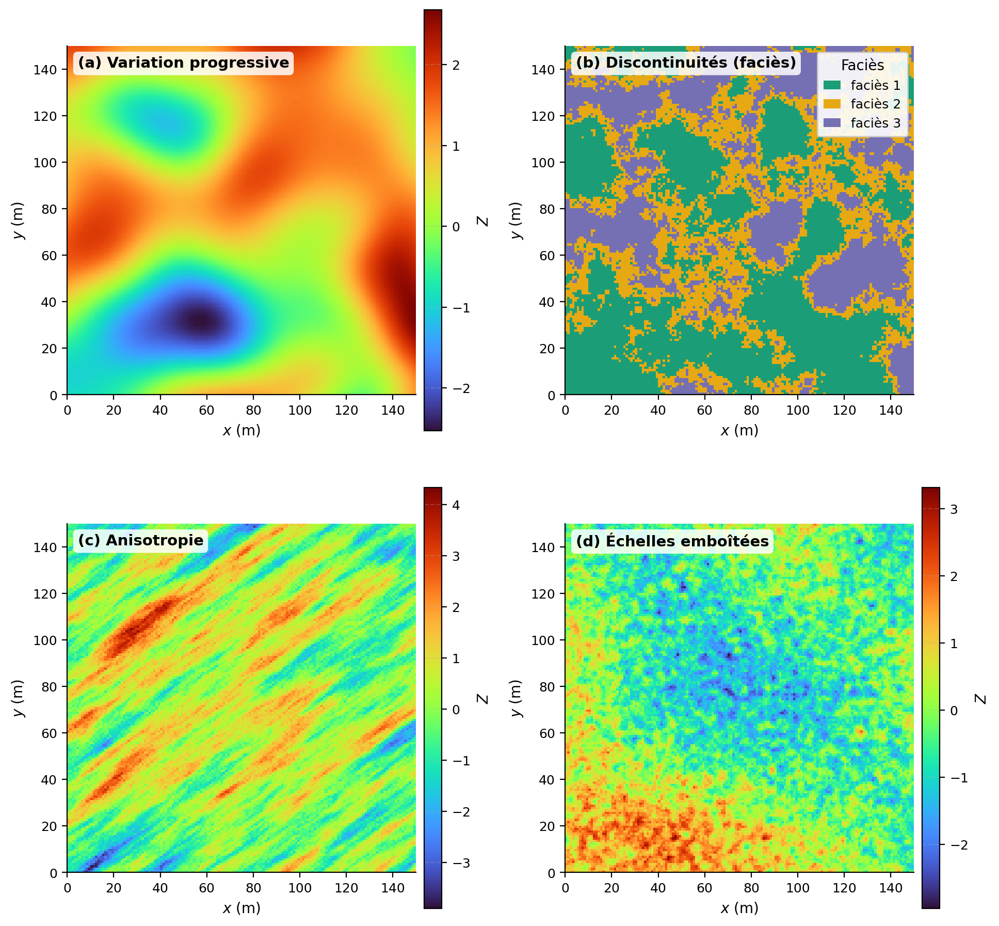
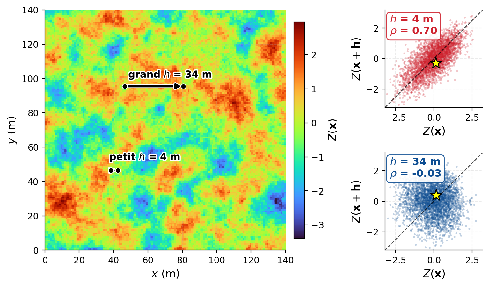
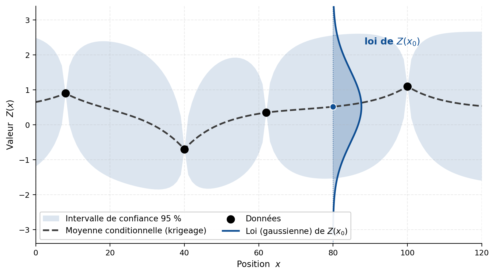

## Pourquoi la géostatistique ?

Les méthodes d’interpolation déterministes attribuent une valeur aux positions non échantillonnées selon une règle mathématique ou géométrique. Plusieurs d’entre elles utilisent la distance aux observations, mais elles ne reposent pas sur un modèle probabiliste de la variabilité spatiale.

Elles ne permettent donc pas, à elles seules, de quantifier l’incertitude associée à une estimation. Elles ne décrivent pas non plus explicitement la dépendance entre les observations ni la redondance de l’information lorsque plusieurs données sont rapprochées ou présentent une organisation spatiale similaire.

La géostatistique aborde le problème dans un cadre probabiliste. Elle cherche d’abord à caractériser la structure spatiale du phénomène, puis à utiliser cette structure pour estimer les valeurs inconnues et quantifier l’incertitude associée à ces estimations. Cette incertitude demeure conditionnelle aux données disponibles, au modèle spatial retenu et aux hypothèses sur lesquelles repose l’analyse.

Le passage de la variable régionalisée à la fonction aléatoire constitue le principal changement de perspective introduit dans ce chapitre.

### Variable régionalisée et dépendance spatiale

Un phénomène est dit régionalisé lorsqu’il se déploie dans un domaine spatial et que ses propriétés varient selon la position. La teneur d’un gisement, l’altitude d’une surface ou la conductivité hydraulique d’un aquifère sont des exemples de phénomènes régionalisés.

Une variable régionalisée est une fonction numérique qui décrit l’une des propriétés de ce phénomène.

::: {.callout-note title="Définition — Variable régionalisée"}
Une variable régionalisée, notée $z(\mathbf{x})$, est une fonction définie dans un domaine spatial ($D$), qui associe une valeur à chaque position ($\mathbf{x}$). Elle représente le phénomène réel étudié, dont seule une partie est généralement observée[^1].
:::

La variable régionalisée peut présenter une organisation spatiale : ses valeurs peuvent varier progressivement, présenter des discontinuités, des anisotropies ou plusieurs échelles de variabilité (@fig-c6-formes-organisation). La proximité entre deux observations n’implique donc pas nécessairement qu’elles soient semblables, même si cette propriété est fréquente pour de nombreux phénomènes naturels.

{#fig-c6-formes-organisation fig-align="center" width="100%"}

Pour représenter cette organisation dans un cadre probabiliste, la géostatistique introduit la notion de dépendance spatiale.

::: {.callout-note title="Définition — Dépendance spatiale"}
La dépendance spatiale désigne la relation statistique entre les valeurs du phénomène à différentes positions. Elle décrit la manière dont cette relation évolue en fonction du vecteur de séparation entre les positions, notamment de sa distance et de son orientation.
:::

Selon les hypothèses retenues, cette dépendance peut être caractérisée par la covariance, la corrélation ou le variogramme (@fig-c6-correlation-distance). Dans la suite de cet ouvrage, le variogramme sera principalement utilisé pour décrire l’évolution de la variabilité en fonction de la séparation spatiale.

{#fig-c6-correlation-distance fig-align="center" width="90%"}

### Fonction aléatoire

La variable régionalisée $z(\mathbf{x})$ représente une réalité unique, mais seulement partiellement connue. Dans un gisement, par exemple, les teneurs existent dans l’ensemble du volume, mais elles ne sont observées qu’aux emplacements échantillonnés. Les données disponibles ne permettent donc pas de déterminer de manière unique les valeurs situées entre les forages.

Pour représenter cette information incomplète, la variable régionalisée est considérée comme une réalisation d’une fonction aléatoire $Z(\mathbf{x})$.

::: {.callout-note title="Définition — Fonction aléatoire"}
Une fonction aléatoire, notée ${Z(\mathbf{x}), \mathbf{x}\in D}$, est une famille de variables aléatoires indexées par la position. À chaque position $\mathbf{x}$ correspond une variable aléatoire $Z(\mathbf{x})$, tandis que les relations entre les différentes positions sont décrites par leurs lois de probabilité conjointes.
:::

Une réalisation de cette fonction aléatoire correspond à une fonction spatiale particulière $z(\mathbf{x})$. Dans le cadre géostatistique, le phénomène réel est considéré comme l’une de ces réalisations, tandis que les autres représentent les configurations permises par le modèle probabiliste.

Lorsqu’elles sont conditionnées aux observations, ces réalisations doivent reproduire les données disponibles et respecter la structure spatiale retenue. Leur dispersion permet alors de caractériser l’incertitude dans les secteurs non échantillonnés (@fig-c6-fonction-aleatoire).

{#fig-c6-fonction-aleatoire fig-align="center" width="70%"}

Cette approche ne signifie pas que le gisement est aléatoire dans la réalité. La fonction aléatoire constitue plutôt un modèle probabiliste de l’information incomplète dont on dispose. Comme une seule réalisation du phénomène est observable, l’inférence de ses propriétés nécessite des hypothèses supplémentaires, notamment des hypothèses de stationnarité, qui seront introduites au prochain chapitre.

::: {.callout-note title="Définition — Géostatistique"}
La géostatistique est un ensemble de méthodes probabilistes fondées sur la théorie des fonctions aléatoires. Elle vise à caractériser la variabilité spatiale, à estimer ou à simuler des variables régionalisées et à quantifier l’incertitude associée aux valeurs non observées[^2].
:::

### Applications

Dans de nombreux domaines, la géostatistique répond à une même problématique : caractériser un phénomène spatial à partir d’un nombre limité d’observations localisées.

En géologie minière, elle permet d’estimer la distribution des teneurs entre les forages, de quantifier les ressources et d’évaluer l’incertitude associée au modèle. Les mêmes principes sont appliqués en hydrogéologie pour modéliser les propriétés des aquifères, en géotechnique pour représenter les propriétés des sols et des roches, en géophysique pour interpréter la structure du sous-sol à partir de mesures indirectes, et en environnement pour délimiter les zones contaminées.

Dans tous ces domaines, la géostatistique vise à représenter la variabilité spatiale, à estimer les valeurs non observées et à quantifier l’incertitude associée aux résultats.

### Origines : effet de support et effet d’information

Le cadre théorique de la géostatistique a été développé par Georges Matheron à partir des travaux réalisés dans les mines d’or sud-africaines, notamment ceux de l’ingénieur minier Daniel Krige. Ces travaux ont mis en évidence plusieurs difficultés propres à l’estimation des ressources, dont deux demeurent centrales : l’effet de support et l’effet d’information.

- Comment la distribution des teneurs se modifie-t-elle lorsque celles-ci sont définies sur des volumes de tailles différentes?

::: {.callout-note title="Définition — Effet de support"}
L’effet de support désigne la modification de la distribution statistique d’une variable lorsque la taille ou la géométrie du volume sur lequel elle est définie varie. L’augmentation du support entraîne généralement une diminution de la variance et une atténuation des valeurs extrêmes.
:::

Une teneur mesurée sur un petit échantillon peut ainsi être très élevée ou très faible, tandis que la teneur moyenne d’un grand bloc varie généralement moins. Ce changement influence directement les quantités de matériau situées au-dessus d’une teneur de coupure.

- Comment l’information disponible au moment de la sélection influence-t-elle les quantités de minerai effectivement récupérables?

::: {.callout-note title="Définition — Effet d'information"}
L’effet d’information désigne l’écart entre une sélection fondée sur la teneur réelle des unités minières et une sélection fondée sur des teneurs estimées à partir d’une information limitée. Les erreurs d’estimation peuvent entraîner le classement de minerai comme stérile, ou de stérile comme minerai, particulièrement pour les blocs dont la teneur est proche de la teneur de coupure.
:::

L’effet d’information dépend notamment de la quantité et de la qualité des données disponibles, de leur configuration spatiale et de la méthode d’estimation employée. Une information plus précise améliore la sélection des unités minières et réduit les erreurs de classification.

La suite de ce chapitre présente ces deux effets dans le contexte de l’estimation des ressources minières. Les principes introduits demeurent toutefois applicables à d’autres problèmes de modélisation spatiale.

[^1]: La géostatistique s'applique également aux séries temporelles. La variable régionalisée peut alors représenter, par exemple, la teneur du minerai alimentant un concentrateur au fil du temps, dont on étudie la variabilité afin d’optimiser le traitement chimique au concentrateur.

[^2]: La discipline permet aussi l'estimation, la simulation et la modélisation conjointe de plusieurs variables régionalisées : c'est le cas multivarié.

