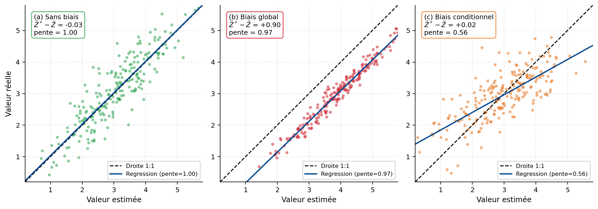

## Effet d'information

Dans un gisement, la teneur réelle de chaque unité minière n’est pas connue au moment de planifier l’exploitation. La sélection du minerai et du stérile repose donc sur des teneurs estimées à partir des forages et du modèle géostatistique.

Si les teneurs réelles de tous les blocs étaient connues, la sélection pourrait être effectuée directement en fonction de la teneur de coupure. En pratique, l’information disponible est limitée et les estimations comportent une incertitude. Certains blocs sont alors classés du mauvais côté de la teneur de coupure. Cette différence entre une sélection fondée sur une information parfaite et une sélection fondée sur les estimations disponibles constitue l’effet d’information.

::: {.callout-note title="Définition — Effet d’information"}
L’effet d’information désigne la modification des résultats de la sélection du minerai lorsque celle-ci est fondée sur des teneurs estimées plutôt que sur les teneurs réelles des unités minières. Il se manifeste notamment par des erreurs de classification entre le minerai et le stérile.
:::

L’importance de cet effet dépend de la quantité de données, mais également de leur qualité, de leur répartition spatiale, de la continuité des teneurs et de la méthode d’estimation employée. Deux campagnes comprenant le même nombre de forages ne fournissent donc pas nécessairement le même niveau d’information. Des forages regroupés dans un secteur déjà bien connu peuvent être largement redondants, tandis que quelques forages bien positionnés peuvent réduire davantage l’incertitude.

L’objectif d’une campagne de forage n’est donc pas uniquement d’accumuler des observations, mais d’améliorer la connaissance du gisement aux endroits où cette information influence le plus l’estimation et les décisions minières. Le choix de l’emplacement des nouveaux forages doit toutefois tenir compte de leur coût, de leur accessibilité et des objectifs du projet.

### Information limitée, erreurs et biais

Même lorsque les analyses sont réalisées correctement, les forages ne donnent accès qu’à une partie du gisement. Une incertitude subsiste entre les observations parce que les teneurs ne sont pas connues partout. Cette incertitude d’estimation suffit à produire un effet d’information.

D’autres sources d’incertitude peuvent s’y ajouter, notamment :

- les erreurs de localisation;
- les erreurs d’échantillonnage et de préparation des carottes;
- les erreurs analytiques en laboratoire;
- les incertitudes liées à l’interprétation géologique;
- les approximations introduites par le modèle et la méthode d’estimation.

Ces différentes sources ne produisent pas nécessairement un biais systématique. Une erreur correspond à l’écart entre une valeur observée ou estimée et la valeur réelle. Un biais apparaît lorsque cet écart présente une tendance systématique, par exemple lorsque les teneurs sont généralement surestimées.

Il faut également distinguer le biais global du biais conditionnel. Une méthode peut préserver correctement la teneur moyenne du gisement tout en surestimant les fortes teneurs et en sous-estimant les faibles teneurs, ou inversement. Les estimations peuvent donc être globalement non biaisées, sans reproduire fidèlement la variabilité locale (@fig-c6-biais).

{#fig-c6-biais fig-align="center" width="100%"}

### Erreurs de classification

Supposons que la teneur de coupure soit fixée à 2 ppm. Les blocs dont la teneur estimée dépasse 2 ppm sont sélectionnés pour le traitement, tandis que les autres sont classés comme stériles ou dirigés vers une autre destination.

Deux erreurs de classification peuvent alors se produire :

- un bloc dont la teneur estimée dépasse 2 ppm peut avoir une teneur réelle inférieure à ce seuil; du matériau non rentable est alors traité;
- un bloc dont la teneur estimée est inférieure à 2 ppm peut avoir une teneur réelle supérieure à ce seuil; du minerai potentiellement valorisable est alors rejeté ou laissé en place.

Ces situations correspondent respectivement à des faux positifs et à des faux négatifs. Elles réduisent l’efficacité de la sélection par rapport à une situation théorique où les teneurs réelles seraient parfaitement connues.

Comme le montre la @fig-information, les teneurs estimées sont comparées aux teneurs réelles. La droite 1:1 représente une correspondance parfaite entre les deux valeurs. Un point situé sous cette droite correspond à une surestimation de la teneur, tandis qu’un point situé au-dessus correspond à une sous-estimation.

La dispersion autour de la droite 1:1 représente l’incertitude d’estimation. Une droite de régression différente de la droite 1:1 peut également indiquer un biais conditionnel ou un lissage des estimations. Elle ne suffit toutefois pas, à elle seule, à démontrer l’existence d’un biais sur la teneur moyenne du gisement.

![L’effet d’information. Les décisions de sélection reposent sur les teneurs estimées, alors que la classification correcte dépend des teneurs réelles. Les points bleus représentent des blocs sélectionnés pour le traitement dont la teneur réelle est inférieure à la teneur de coupure. Les points rouges représentent des blocs rejetés dont la teneur réelle dépasse cette teneur. La droite 1:1 correspond à une estimation parfaite; la dispersion autour de cette droite illustre l’incertitude d’estimation. Un écart entre la droite de régression et la droite 1:1 peut traduire un biais conditionnel ou un effet de lissage, sans nécessairement indiquer un biais sur la moyenne globale. Dans un monde idéal, la régression serait de la forme $Y = aX + b$ avec $a = 1$ et $b = 0$ (c'est-à-dire $\mathbb{E}[Z^*] = \mathbb{E}[Z_{\text{vrai}}]$). En pratique, la pente $a$ est inférieure à 1 et $b$ est non nul : il existe généralement toujours un biais.](images/C6_Information.png){#fig-information fig-align="center"}

## 🧮 Atelier interactif 6.2 — Effet d'information {.unnumbered}

::: {.content-visible when-format="html"}
Dans cet atelier, vous pouvez modifier le biais, le bruit ajouté aux estimations et la teneur de coupure. Observez comment ces paramètres modifient le champ estimé, la relation entre les teneurs réelles et estimées ainsi que la classification des blocs.

Les points bleus représentent les blocs qui seraient traités alors que leur teneur réelle est inférieure à la teneur de coupure. Les points rouges représentent les blocs qui seraient rejetés alors que leur teneur réelle dépasse cette teneur. La droite 1:1 permet de visualiser une correspondance parfaite, tandis que la dispersion des points et la droite de régression renseignent sur les erreurs d’estimation et les éventuels biais conditionnels.


:::

::: {.content-visible unless-format="html"}
Cet atelier interactif n'est disponible que dans la version web du chapitre. 
:::
