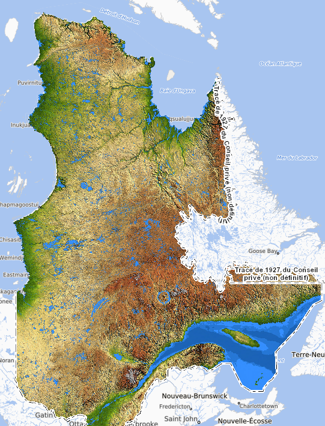
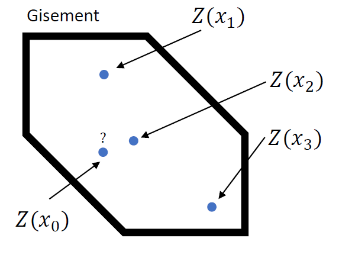

## Principe général

Le variogramme repose sur l’idée que la relation entre deux valeurs dépend de leur séparation dans l’espace. Cette notion rejoint la première loi de la géographie formulée par Waldo Tobler :

> « Toutes choses sont liées, mais elles le sont d’autant plus qu’elles sont proches »

Dans de nombreux phénomènes naturels, deux observations rapprochées tendent ainsi à présenter des valeurs plus semblables que deux observations éloignées. Cette propriété n’est toutefois ni systématique ni identique dans toutes les directions : elle dépend de l’organisation spatiale du phénomène étudié.

En géostatistique, cette organisation est décrite par la continuité spatiale. Lorsqu’une teneur élevée est observée à une position donnée, les teneurs voisines peuvent être similaires si la minéralisation présente une continuité suffisante. À mesure que la distance augmente, cette similarité tend généralement à diminuer.

Le relief fournit un exemple intuitif. Dans une plaine, l’altitude varie peu entre deux positions rapprochées, ce qui traduit une forte continuité spatiale. Dans un relief accidenté, elle peut changer rapidement sur de courtes distances, ce qui indique une continuité plus faible. Le variogramme permet de quantifier cette évolution de la variabilité en fonction de la distance et de l’orientation.

La carte topographique du Québec présentée à la @fig-topographie illustre cette organisation spatiale. Les plaines, les régions montagneuses et certaines grandes structures géologiques se distinguent par leurs formes, leurs orientations et leurs échelles de variation. L’observation de la distribution spatiale de l’altitude permet ainsi d’identifier différentes structures du relief.

{#fig-topographie fig-align="center"}

Dans un gisement, l’objectif est similaire : il s’agit de caractériser l’organisation spatiale des teneurs. Le gisement présente-t-il une variabilité faible ou élevée? Les teneurs varient-elles progressivement ou de manière discontinue? Certaines directions présentent-elles une continuité plus importante que d’autres?

Chaque phénomène géologique possède une organisation spatiale particulière, définie notamment par ses échelles de variabilité, ses directions privilégiées et son degré de continuité. Le variogramme constitue l’un des principaux outils utilisés pour caractériser cette organisation. Il décrit comment la dissimilarité entre les valeurs évolue avec leur séparation spatiale et fournit ainsi l’information nécessaire aux méthodes géostatistiques d’estimation et de simulation.

### Exemple de continuité spatiale

Considérons quatre positions $\mathbf{x}_0$, $\mathbf{x}_1$, $\mathbf{x}_2$ et $\mathbf{x}_3$ présentées à la @fig-gisement. La teneur est observée aux positions $\mathbf{x}_1$, $\mathbf{x}_2$ et $\mathbf{x}_3$, mais elle est inconnue en $\mathbf{x}_0$.

En notant la variable régionalisée par $z(\mathbf{x})$, le problème consiste à estimer $z(\mathbf{x}_0)$ à partir des valeurs observées $z(\mathbf{x}_1)$, $z(\mathbf{x}_2)$ et $z(\mathbf{x}_3)$.

Une première approche pourrait consister à accorder davantage de poids à $\mathbf{x}_2$, puisqu’il s’agit du point géométriquement le plus proche de $\mathbf{x}_0$. Cette décision suppose toutefois que la continuité spatiale soit identique dans toutes les directions.

Considérons plutôt un gisement tabulaire dont la continuité principale est orientée verticalement. Dans ce cas, la valeur observée en $\mathbf{x}_1$ peut être plus représentative de la teneur en $\mathbf{x}_0$ que celle observée en $\mathbf{x}_2$, même si $\mathbf{x}_1$ est situé à une plus grande distance euclidienne.

La distance géométrique ne suffit donc pas à déterminer l’information apportée par une observation. Il faut également tenir compte de l’orientation et de l’intensité de la continuité spatiale. Le variogramme permet précisément de quantifier cette dépendance en fonction du vecteur de séparation entre les positions. Cette information sera ensuite utilisée pour déterminer les poids attribués aux données lors de l’estimation.

{#fig-gisement fig-align="center"}
