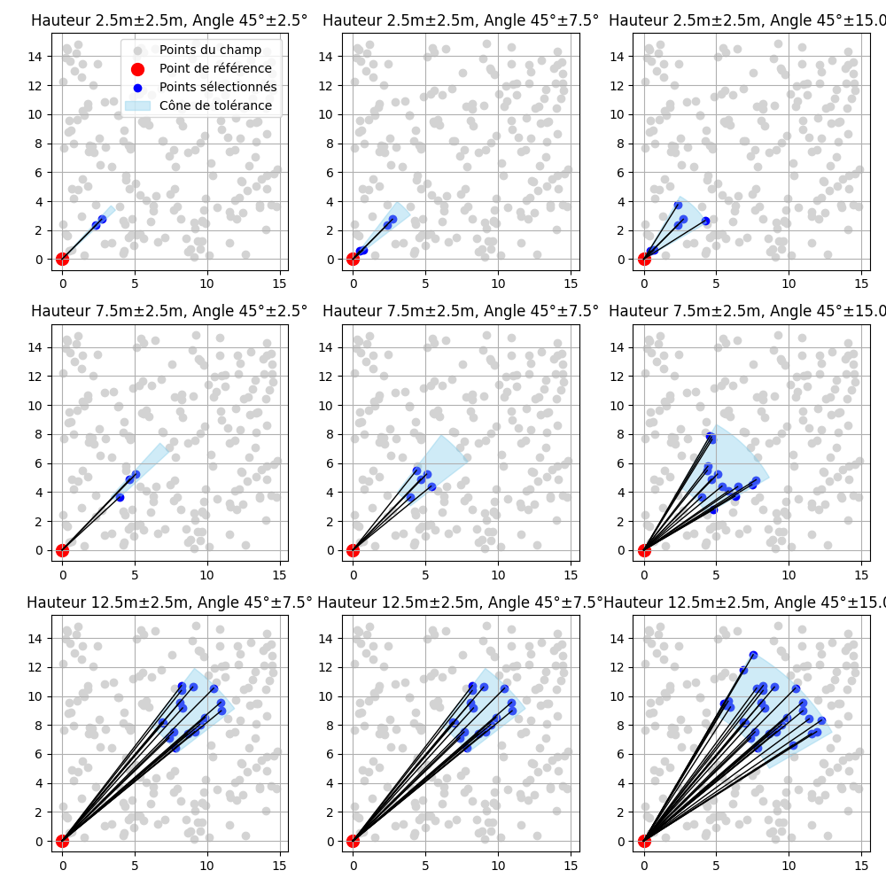
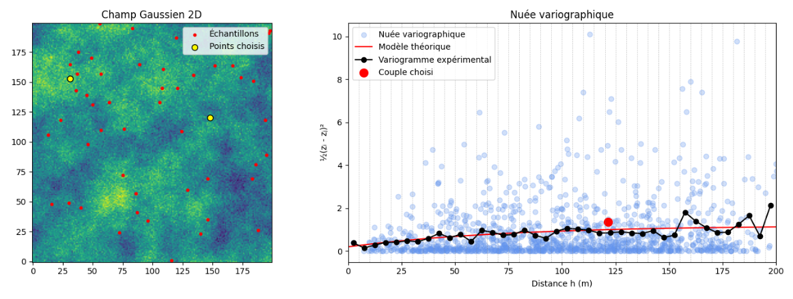
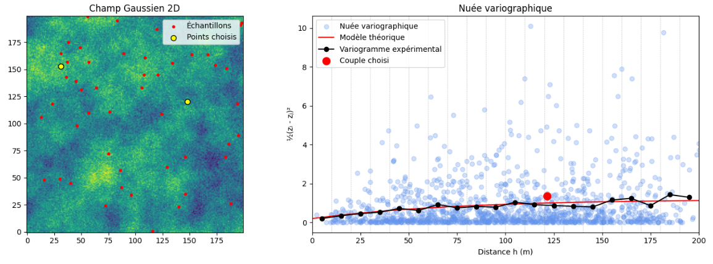
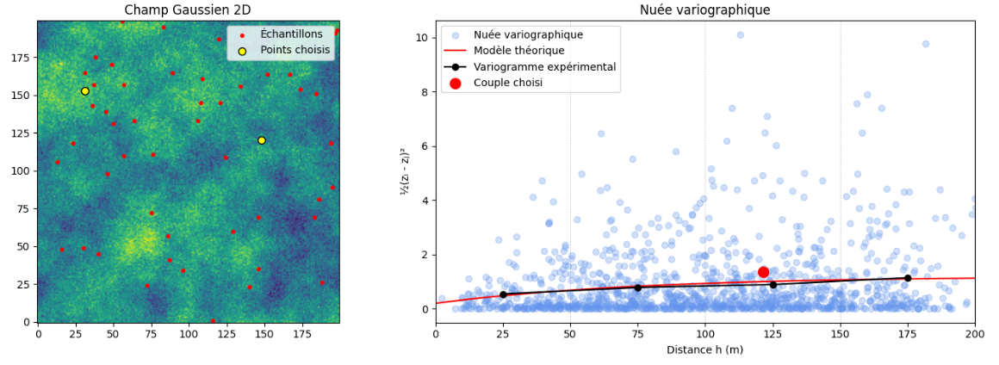

## Variogramme et nuée variographique

### Définition du variogramme

Dans de nombreux phénomènes spatiaux, les valeurs observées à faible distance tendent à être plus semblables que celles observées à grande distance. La question est alors la suivante : comment quantifier cette continuité spatiale? 

Une approche consiste à comparer les valeurs prises par la variable régionalisée à différentes positions et à étudier comment leurs écarts évoluent en fonction de la distance et de la direction qui séparent ces positions.

::: {.callout-note title="Définition — Variogramme"}
Le variogramme est une fonction qui caractérise la structure spatiale d’une variable régionalisée. Il décrit comment la dissimilarité moyenne entre deux valeurs évolue en fonction de la distance et de la direction de séparation entre elles.
:::

Considérons une fonction aléatoire $Z(\mathbf{x})$. En pratique, nous ne disposons pas de plusieurs réalisations indépendantes du même gisement, mais d’une seule réalisation observée à un nombre limité de positions.

Pour estimer la structure spatiale à partir de ces données, il faut pouvoir considérer que des paires séparées par un même vecteur $\mathbf{h}$ renseignent sur une même relation spatiale, même si elles se trouvent à différents endroits du domaine. Cette propriété nécessite certaines hypothèses de stationnarité.

::: {.callout-note title="Hypothèse — Stationnarité d’ordre 2"}
La fonction aléatoire $Z(\mathbf{x})$ est dite stationnaire d’ordre 2 lorsque :

- son espérance est constante dans le domaine :

$$
\mathbb{E}[Z(\mathbf{x})]=m;
$$

- sa covariance entre deux positions dépend uniquement de leur vecteur de séparation $\mathbf{h}$, et non de leur position absolue :

$$
\operatorname{Cov}\left[Z(\mathbf{x}),Z(\mathbf{x}+\mathbf{h})\right]
=
C(\mathbf{h}).
$$

La variance est alors finie et constante :

$$
C(\mathbf{0})=\operatorname{Var}[Z(\mathbf{x})].
$$
:::

Sous cette hypothèse, le variogramme est défini par :

$$
\gamma(\mathbf{h})
=
\frac{1}{2}
\operatorname{Var}
\left[
Z(\mathbf{x}+\mathbf{h})-Z(\mathbf{x})
\right].
$$

Comme l’espérance des accroissements est nulle, cette expression peut aussi s’écrire :

$$
\gamma(\mathbf{h})
=
\frac{1}{2}
\mathbb{E}
\left[
\left(
Z(\mathbf{x}+\mathbf{h})-Z(\mathbf{x})
\right)^2
\right].
$$

Dans le cas d’une fonction aléatoire stationnaire d’ordre 2, le variogramme et la covariance sont liés par :

$$
\gamma(\mathbf{h})=C(\mathbf{0})-C(\mathbf{h}).
$$

Si la covariance tend vers zéro lorsque la distance devient grande, le variogramme tend vers $C(\mathbf{0})$, qui correspond à la variance de la variable. Cette valeur limite est appelée le **palier**.

La stationnarité d’ordre 2 n’est toutefois pas toujours une hypothèse appropriée. Certains phénomènes ne présentent pas de variance globale finie ou constante, alors que leurs différences entre positions demeurent statistiquement modélisables. On adopte alors une hypothèse plus faible : l’hypothèse intrinsèque.

::: {.callout-note title="Hypothèse — Hypothèse intrinsèque"}
La fonction aléatoire $Z(\mathbf{x})$ vérifie l’hypothèse intrinsèque lorsque ses accroissements sont stationnaires :

- leur espérance est nulle :

$$
\mathbb{E}
\left[
Z(\mathbf{x}+\mathbf{h})-Z(\mathbf{x})
\right]
=
0;
$$

- leur variance est finie et dépend uniquement du vecteur de séparation $\mathbf{h}$ :

$$
\operatorname{Var}
\left[
Z(\mathbf{x}+\mathbf{h})-Z(\mathbf{x})
\right]
=
2\gamma(\mathbf{h}).
$$
:::

L’hypothèse intrinsèque est plus générale que la stationnarité d’ordre 2. Toute fonction aléatoire stationnaire d’ordre 2 vérifie l’hypothèse intrinsèque, mais l’inverse n’est pas nécessairement vrai.

Sous l’hypothèse intrinsèque, la variance ponctuelle de $Z(\mathbf{x})$ peut ne pas être définie ou ne pas être constante, alors que la variance de ses accroissements demeure définie. Le variogramme peut alors croître sans atteindre de palier, comme dans le cas de certains modèles linéaires ou de puissance.

Dans cet ouvrage, le terme *variogramme* désigne la fonction comportant le facteur $\frac{1}{2}$. Cette fonction est aussi appelée *semi-variogramme* dans certains domaines.

Pour une distance donnée, le variogramme mesure donc la dissimilarité moyenne entre des valeurs séparées par cette distance. Si les positions sont proches et que la variable présente une forte continuité spatiale, leurs écarts devraient généralement être faibles. Lorsque la distance augmente, ces écarts tendent à augmenter jusqu’à ce que la relation spatiale devienne faible ou négligeable.

Cette idée peut également être illustrée à l’aide d’un nuage de décalage. Pour un vecteur $\mathbf{h}$ donné, on représente $Z(\mathbf{x})$ sur un axe et $Z(\mathbf{x}+\mathbf{h})$ sur l’autre. Lorsque $\mathbf{h}$ est petit, les points tendent à se concentrer près de la diagonale. Lorsque la distance augmente, le nuage se disperse progressivement, ce qui correspond généralement à une augmentation du variogramme.

{#fig-hscatter fig-align="center"}

### Variogramme expérimental

Le variogramme défini précédemment est une propriété théorique de la fonction aléatoire. En pratique, les espérances et les variances qui interviennent dans sa définition sont inconnues. Nous ne disposons que d’un nombre limité de valeurs observées $z(\mathbf{x}_i)$.

Il faut donc estimer le variogramme à partir des paires de données disponibles.

::: {.callout-note title="Définition — Variogramme expérimental"}
Le variogramme expérimental, noté $\widehat{\gamma}$, est un estimateur du variogramme calculé à partir des observations disponibles.
:::

Pour une classe de vecteurs de séparation centrée sur $\mathbf{h}_k$, le variogramme expérimental est calculé par :

$$
\widehat{\gamma}(\mathbf{h}_k)
=
\frac{1}{2N_k}
\sum_{(i,j)\in\mathcal{P}_k}
\left[
z(\mathbf{x}_j)-z(\mathbf{x}_i)
\right]^2,
$$

où :

- $\mathcal{P}_k$ est l’ensemble des paires dont le vecteur de séparation est suffisamment proche de $\mathbf{h}_k$;
- $N_k$ est le nombre de paires contenues dans cet ensemble.

Pour chaque paire, on calcule l’écart entre les deux valeurs, on élève cet écart au carré, puis on fait la moyenne des contributions obtenues. Le facteur $\frac{1}{2}$ provient de la définition du variogramme.

Comme les données ne sont généralement pas séparées par des distances exactement identiques, les paires sont regroupées en classes de distance et, au besoin, de direction.

### Effet de la direction : anisotropie

La continuité spatiale n’est pas nécessairement identique dans toutes les directions. Dans un gisement stratifié, par exemple, les teneurs peuvent être plus continues parallèlement à la stratification que dans la direction perpendiculaire. Dans un panache de contamination, la continuité peut également différer entre les directions longitudinale, transversale et verticale.

Pour étudier cette variation directionnelle, on calcule des variogrammes selon différentes orientations :

$$
\widehat{\gamma}(h_k,\theta)
=
\frac{1}{2N(h_k,\theta)}
\sum_{(i,j)\in\mathcal{P}(h_k,\theta)}
\left[
z(\mathbf{x}_j)-z(\mathbf{x}_i)
\right]^2.
$$

Ici, $\mathcal{P}(h_k,\theta)$ contient les paires dont la distance est proche de $h_k$ et dont l’orientation est proche de la direction $\theta$.

En deux dimensions, l’orientation est souvent exprimée par un azimut, mesuré à partir du nord dans le sens horaire. Comme l’ordre des deux points d’une paire ne modifie pas leur contribution au variogramme, les vecteurs opposés sont équivalents :

$$
\gamma(\mathbf{h})=\gamma(-\mathbf{h}).
$$

Ainsi, une direction de $30^\circ$ et une direction de $210^\circ$ représentent le même axe. Il suffit donc généralement d’étudier les orientations comprises entre $0^\circ$ et $180^\circ$.

### Choix des tolérances

En pratique, il est rare de trouver plusieurs paires exactement séparées par une distance $h$ et orientées précisément selon une direction $\theta$. Des tolérances sont donc utilisées pour regrouper les paires suffisamment semblables.

Les principaux paramètres de sélection sont :

- la distance cible, ou pas de calcul;
- la tolérance sur la distance;
- la tolérance angulaire;
- la largeur maximale, ou *bandwidth*, autour de l’axe directionnel.

Une tolérance trop faible peut produire des classes contenant peu de paires, ce qui rend le variogramme expérimental instable. À l’inverse, une tolérance trop large peut regrouper des paires qui ne représentent pas la même échelle ou la même direction de continuité.

Le choix des tolérances constitue donc un compromis entre la précision spatiale et la stabilité statistique. Elles doivent permettre de conserver un nombre suffisant de paires dans chaque classe sans masquer les structures directionnelles présentes dans les données.

La @fig-tolerance illustre ce principe. Pour chaque point de référence en rouge, les points bleus représentent les observations retenues selon la distance cible et les tolérances choisies. Une ouverture angulaire plus grande augmente le nombre de paires, mais réduit la précision directionnelle du calcul.

{#fig-tolerance fig-align="center"}

### Nuée variographique

Avant de regrouper les paires en classes de distance, il est utile d’examiner leurs contributions individuellement. Cette représentation est appelée **nuée variographique**.

Pour chaque paire de positions $(\mathbf{x}_i,\mathbf{x}_j)$, on calcule :

- la distance entre les deux positions :

$$
h_{ij}
=
\left\lVert
\mathbf{x}_j-\mathbf{x}_i
\right\rVert;
$$

- la contribution variographique de la paire :

$$
\gamma_{ij}
=
\frac{1}{2}
\left[
z(\mathbf{x}_j)-z(\mathbf{x}_i)
\right]^2.
$$

Chaque paire produit un point dans la nuée variographique. La distance $h_{ij}$ est placée en abscisse et la contribution $\gamma_{ij}$ en ordonnée.

Il ne s’agit pas d’une variance calculée à partir d’une seule paire, mais d’une contribution individuelle au calcul du variogramme expérimental.

La nuée variographique constitue ainsi une représentation brute de toutes les différences observées. Elle est généralement très dispersée, puisque deux paires séparées par une distance semblable peuvent traverser des structures géologiques différentes ou contenir des valeurs très contrastées.

Le variogramme expérimental est obtenu en regroupant les contributions de la nuée par classes de distance, puis en calculant leur moyenne dans chaque classe.

La largeur de ces classes influence le résultat :

- des classes trop étroites contiennent peu de paires et produisent un variogramme instable;
- des classes trop larges mélangent des distances différentes et peuvent masquer certaines caractéristiques de la structure spatiale.

La @fig-nuee montre l’effet de différentes largeurs de classes sur le regroupement des contributions variographiques.

::: {#fig-nuee layout-ncol=1}
{#fig-nueeA}

{#fig-nueeB}

{#fig-nueeC}

Comparaison de la nuée variographique et du variogramme expérimental selon différentes largeurs de classes.
:::

## 🧮 Atelier interactif 7.1 — Nuée variographique {.unnumbered}

::: {.content-visible when-format="html"}
Échantillonnez aléatoirement un champ simulé et observez les contributions variographiques $(h_{ij},\gamma_{ij})$ de chaque paire ainsi que la construction du variogramme expérimental. Faites varier le nombre de points et le nombre de classes afin d’observer leur influence sur la stabilité et la précision du résultat.


:::

::: {.content-visible unless-format="html"}
Cet atelier interactif n'est disponible que dans la version web du chapitre.
:::

### Exemples numériques simplifiés

#### Exemple 1D : effet de la distance

Considérons la série suivante, échantillonnée tous les mètres :

$$
z(x)=\{1,\ 1,\ 2,\ 2,\ 3,\ 3\}.
$$

Les six valeurs sont situées aux positions $x=0$, $1$, $2$, $3$, $4$ et $5$ m.

Pour une distance $h=1$ m, les cinq paires sont :

$$
(1,1),\qquad
(1,2),\qquad
(2,2),\qquad
(2,3),\qquad
(3,3).
$$

Le variogramme expérimental vaut :

$$
\widehat{\gamma}(1)
=
\frac{1}{2\times 5}
\left[
(1-1)^2
+
(1-2)^2
+
(2-2)^2
+
(2-3)^2
+
(3-3)^2
\right]
=
0{,}20.
$$

Pour une distance $h=2$ m, les quatre paires sont :

$$
(1,2),\qquad
(1,2),\qquad
(2,3),\qquad
(2,3).
$$

On obtient :

$$
\widehat{\gamma}(2)
=
\frac{1}{2\times 4}
\left[
(1-2)^2
+
(1-2)^2
+
(2-3)^2
+
(2-3)^2
\right]
=
0{,}50.
$$

Pour une distance $h=3$ m, les trois paires sont :

$$
(1,2),\qquad
(1,3),\qquad
(2,3).
$$

Ainsi :

$$
\widehat{\gamma}(3)
=
\frac{1}{2\times 3}
\left[
(1-2)^2
+
(1-3)^2
+
(2-3)^2
\right]
=
1{,}00.
$$

Les autres distances peuvent être calculées de la même manière :

| Distance $h$ | Nombre de paires | $\widehat{\gamma}(h)$ |
|:---|---:|---:|
| 1 m | 5 | 0,20 |
| 2 m | 4 | 0,50 |
| 3 m | 3 | 1,00 |
| 4 m | 2 | 2,00 |
| 5 m | 1 | 2,00 |

Le variogramme est faible à courte distance, car les valeurs voisines sont souvent identiques ou peu différentes. Il augmente ensuite avec la distance, puisque les paires comparent progressivement les faibles valeurs du début de la série aux valeurs plus élevées de sa fin.

Cet exemple montre que le variogramme traduit la perte progressive de similarité entre les observations lorsque leur distance augmente. Il montre aussi que le nombre de paires diminue avec la distance, ce qui rend généralement les dernières valeurs du variogramme expérimental moins robustes.

#### Exemple 2D : effet de l’orientation

Considérons maintenant la grille suivante, dont l’espacement est de 1 m dans les directions horizontale et verticale :

$$
\begin{bmatrix}
1 & 1 & 1 \\
3 & 3 & 3 \\
5 & 5 & 5
\end{bmatrix}.
$$

Les valeurs sont constantes le long des lignes, mais augmentent verticalement. La continuité est donc plus forte horizontalement que verticalement.

##### Direction horizontale

Pour une distance horizontale de 1 m, les six paires sont :

$$
(1,1),\ (1,1),\ (3,3),\ (3,3),\ (5,5),\ (5,5).
$$

Toutes les différences sont nulles :

$$
\widehat{\gamma}_{\mathrm{H}}(1)
=
\frac{1}{2\times 6}
\sum_{i=1}^{6}(0)^2
=
0.
$$

Le variogramme horizontal est donc nul à cette distance, ce qui traduit une continuité parfaite dans cette direction dans cet exemple.

##### Direction verticale

Pour une distance verticale de 1 m, les six paires sont :

$$
(1,3),\ (1,3),\ (1,3),\ (3,5),\ (3,5),\ (3,5).
$$

Chaque différence vaut 2. Le variogramme vertical est donc :

$$
\widehat{\gamma}_{\mathrm{V}}(1)
=
\frac{1}{2\times 6}
\left[
6\times(2)^2
\right]
=
2.
$$

| Direction | Distance | Nombre de paires | $\widehat{\gamma}(h)$ |
|:---|---:|---:|---:|
| Horizontale | 1 m | 6 | 0,00 |
| Verticale | 1 m | 6 | 2,00 |

Pour une même distance de 1 m, le variogramme est nul horizontalement et égal à 2 verticalement. La variable est donc beaucoup plus continue dans la direction horizontale.

Cet exemple illustre l’anisotropie : la continuité spatiale dépend de la direction. Un variogramme directionnel permet de détecter cette différence et de la représenter dans le modèle spatial.

::: {.callout-note title="À retenir"}
Le variogramme augmente lorsque les valeurs séparées par une distance donnée deviennent plus différentes. Si cette augmentation varie selon la direction, le phénomène présente une anisotropie.
:::
