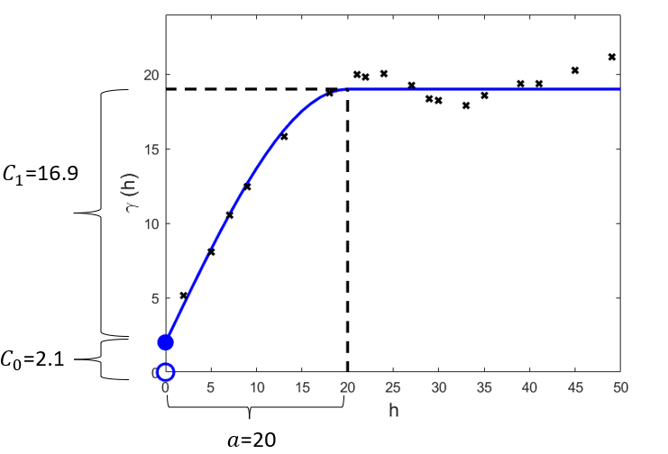
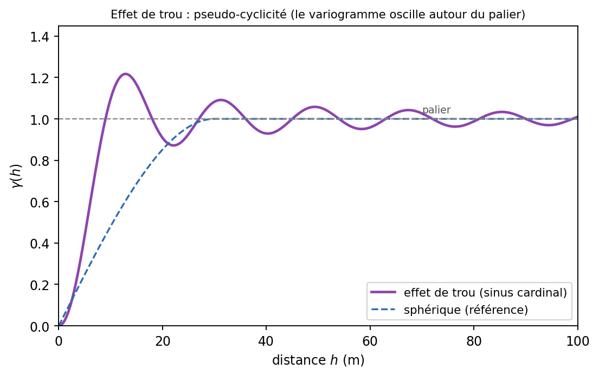
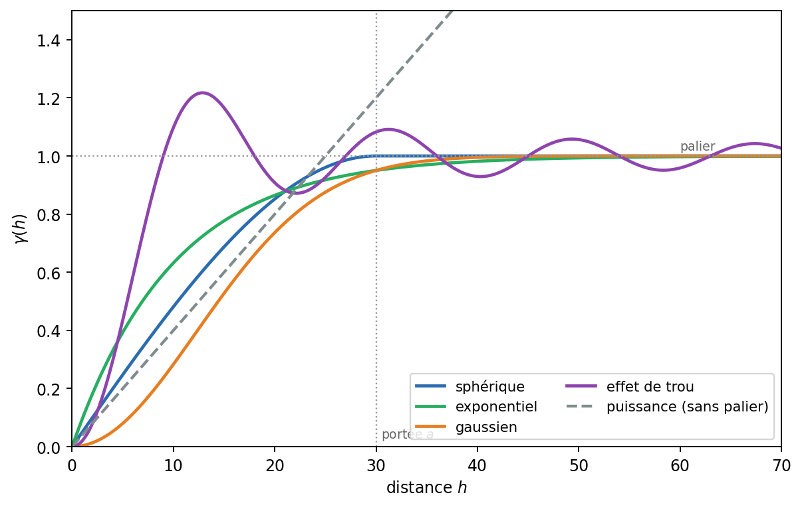
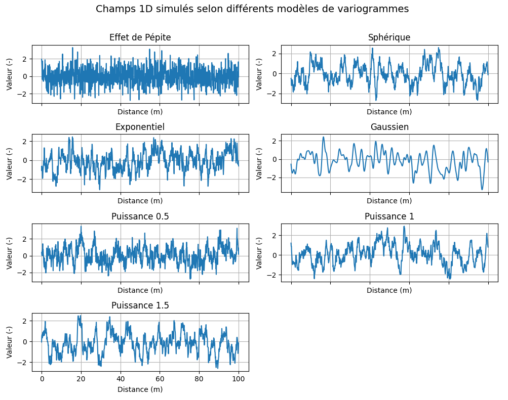
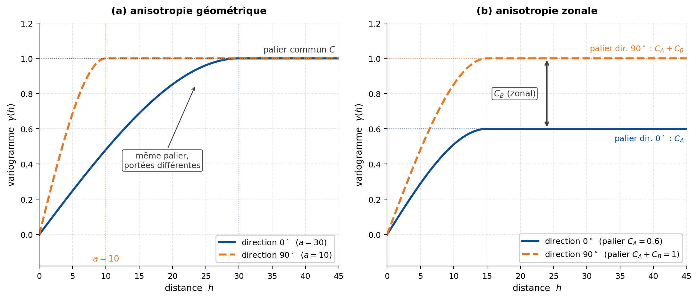
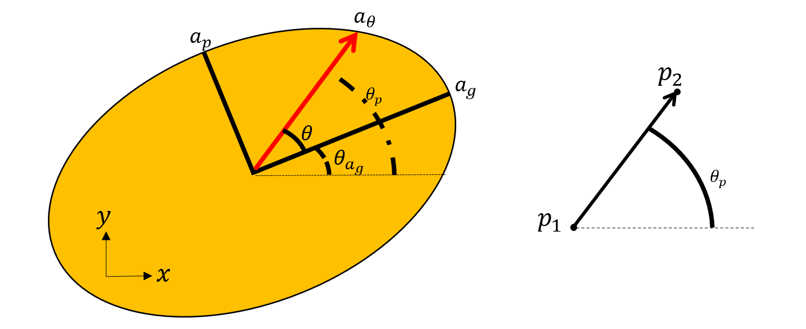
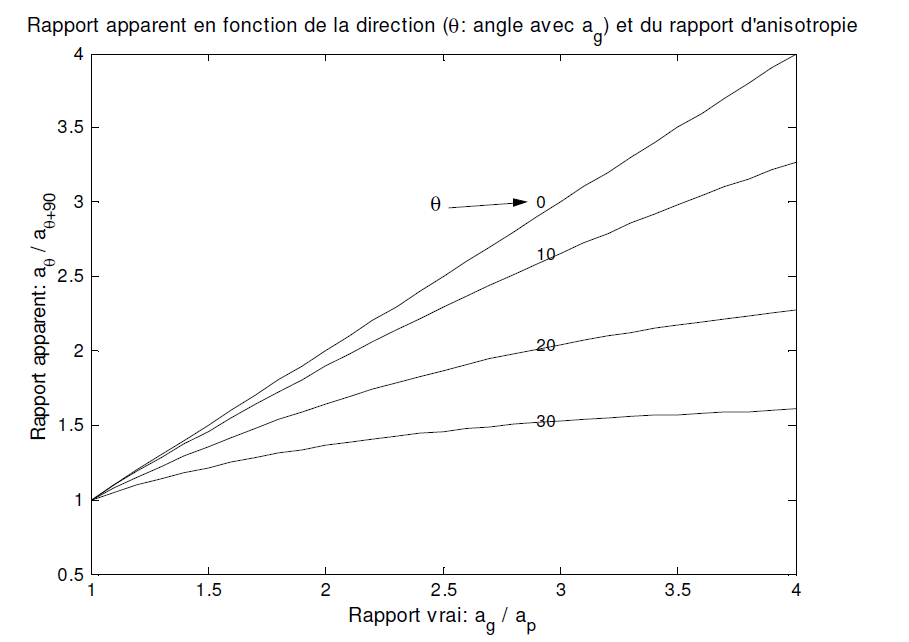
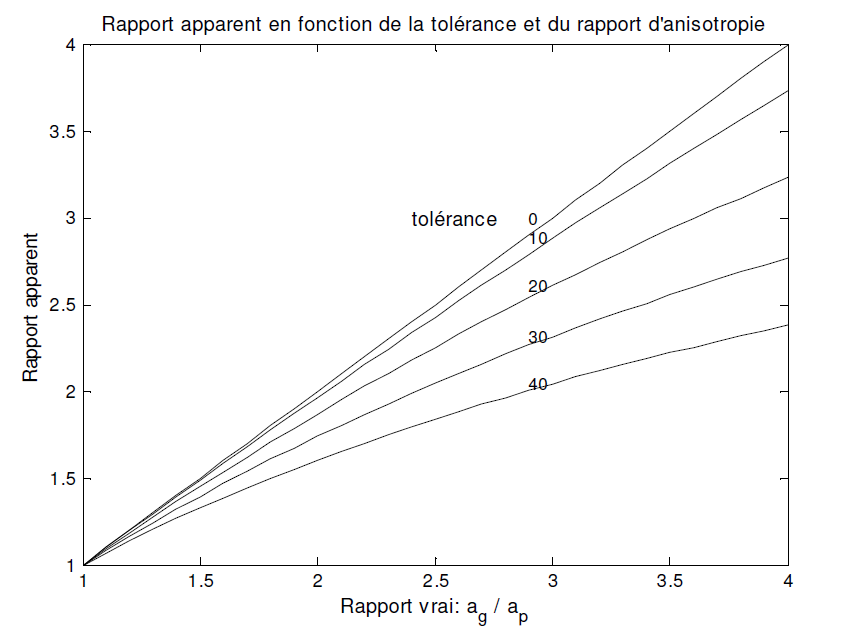

## Modèles mathématiques admissibles

Une fois le variogramme expérimental calculé, il faut lui ajuster un modèle théorique. Ce modèle est une fonction analytique définie pour toute distance et toute direction. Il permet de représenter la structure spatiale au-delà des seules classes du variogramme expérimental et sera utilisé dans les méthodes d’estimation et de simulation.

Avant de présenter les principaux modèles, il convient de préciser les paramètres qui décrivent un variogramme.

### Paramètres du variogramme

Dans un cas isotrope, ou en une dimension, un variogramme est généralement décrit à l’aide de trois paramètres principaux :

- **Effet de pépite** (*nugget effect*), noté $C_0$ : discontinuité du variogramme à l’origine. Par définition, $\gamma(\mathbf{0})=0$, mais, en présence d’un effet de pépite,

$$
\lim_{\substack{\mathbf{h}\to\mathbf{0}\\\mathbf{h}\neq\mathbf{0}}}
\gamma(\mathbf{h})
=
C_0.
$$

Cette discontinuité peut représenter une variabilité à une échelle plus fine que celle de l’échantillonnage, des erreurs de mesure, ou une combinaison des deux.

- **Palier total** (*total sill*), noté $C_{\mathrm{tot}}$ : valeur vers laquelle le variogramme tend ou se stabilise lorsque la corrélation spatiale devient négligeable. Pour un modèle emboîté comprenant un effet de pépite et $n$ structures spatiales,

$$
C_{\mathrm{tot}}
=
C_0+\sum_{i=1}^{n} C_i,
$$

où les $C_i$ sont les paliers partiels des structures.

- **Portée** (*range*) : distance caractérisant l’étendue de la continuité spatiale. Pour un modèle à portée finie, comme le modèle sphérique, elle correspond à la distance à laquelle le palier est atteint. Pour un modèle asymptotique, comme les modèles exponentiel et gaussien, on utilise plutôt une **portée effective**, souvent définie comme la distance à laquelle 95 % du palier est atteint.

Dans un modèle isotrope, ces paramètres sont identiques dans toutes les directions. En deux ou trois dimensions, la continuité peut toutefois varier selon l’orientation. Le modèle doit alors comprendre des portées directionnelles et les angles qui définissent les axes principaux de l’anisotropie.

{#fig-varioparam fig-align="center"}

### Conditions d’admissibilité des modèles

Toute fonction croissante ne peut pas être utilisée comme modèle de variogramme. Le modèle doit respecter des conditions mathématiques qui garantissent la cohérence des variances et des systèmes de krigeage.

#### Admissibilité d’une covariance

Considérons une combinaison linéaire de variables aléatoires :

$$
L
=
\sum_{i=1}^{n}
\lambda_i Z(\mathbf{x}_i).
$$

Sa variance doit être positive ou nulle :

$$
\operatorname{Var}(L)
=
\sum_{i=1}^{n}
\sum_{j=1}^{n}
\lambda_i\lambda_j
C(\mathbf{x}_i-\mathbf{x}_j)
\geq 0.
$$

La fonction de covariance $C(\mathbf{h})$ doit donc être **définie positive**.

#### Admissibilité d’un variogramme

Dans le cadre intrinsèque, la covariance n’est pas nécessairement définie. On travaille alors directement avec le variogramme. Pour tout ensemble de coefficients dont la somme est nulle,

$$
\sum_{i=1}^{n}\lambda_i=0,
$$

le variogramme doit satisfaire :

$$
\sum_{i=1}^{n}
\sum_{j=1}^{n}
\lambda_i\lambda_j
\gamma(\mathbf{x}_i-\mathbf{x}_j)
\leq 0.
$$

Le variogramme est alors dit **conditionnellement négatif semi-défini**.

Lorsque la covariance existe, les deux formulations sont équivalentes. En utilisant

$$
\gamma(\mathbf{h})
=
C(\mathbf{0})-C(\mathbf{h}),
$$

le terme constant $C(\mathbf{0})$ disparaît lorsque la somme des poids est nulle.

En pratique, l’admissibilité n’est généralement pas vérifiée directement. On utilise des familles de modèles dont la validité est connue. Les propriétés suivantes sont notamment utiles :

- une somme de modèles de variogramme admissibles, avec des coefficients positifs, demeure admissible;
- une somme de modèles de covariance admissibles, avec des coefficients positifs, demeure admissible;
- un produit de modèles de covariance admissibles demeure admissible;
- chaque structure d’un modèle emboîté peut posséder ses propres paramètres et sa propre anisotropie.

L’admissibilité dépend aussi de la dimension. Un modèle valide en trois dimensions l’est également dans les dimensions inférieures, mais un modèle valide uniquement en une dimension n’est pas nécessairement admissible en deux ou trois dimensions.

### Modèles classiques de variogramme

Les modèles suivants sont couramment utilisés en géostatistique. Dans les modèles stationnaires, le variogramme et la covariance sont liés par :

$$
\gamma(\mathbf{h})
=
C(\mathbf{0})-C(\mathbf{h}).
$$

Dans les équations ci-dessous, $C$ représente le palier partiel de la structure considérée. Un effet de pépite $C_0$ peut être ajouté séparément au modèle.

#### Effet de pépite pur

Le modèle de pépite pure est défini par :

$$
\gamma(\mathbf{h})
=
\begin{cases}
0, & \text{si } \mathbf{h}=\mathbf{0},\\
C_0, & \text{si } \mathbf{h}\neq\mathbf{0}.
\end{cases}
$$

La covariance correspondante est :

$$
C(\mathbf{h})
=
\begin{cases}
C_0, & \text{si } \mathbf{h}=\mathbf{0},\\
0, & \text{si } \mathbf{h}\neq\mathbf{0}.
\end{cases}
$$

Deux positions distinctes ne présentent alors aucune covariance spatiale. Ce modèle représente un bruit spatial non corrélé ou une variabilité entièrement située sous l’échelle d’observation.

::: {.callout-important title="Effet de pépite"}
L’effet de pépite n’est pas la valeur du variogramme exactement à l’origine. Le variogramme satisfait toujours $\gamma(\mathbf{0})=0$. L’effet de pépite correspond au saut entre cette valeur et le variogramme observé pour une distance non nulle tendant vers zéro.
:::

#### Modèle sphérique

Le modèle sphérique s’écrit :

$$
\gamma(h)
=
\begin{cases}
C
\left[
\frac{3h}{2a}
-
\frac{1}{2}
\left(
\frac{h}{a}
\right)^3
\right],
& 0<h\leq a,\\
C,
& h>a,\\
0,
& h=0.
\end{cases}
$$

La covariance correspondante est :

$$
C(h)
=
\begin{cases}
C
\left[
1-\frac{3h}{2a}
+
\frac{1}{2}
\left(
\frac{h}{a}
\right)^3
\right],
& 0\leq h\leq a,\\
0,
& h>a.
\end{cases}
$$

Le modèle sphérique :

- atteint exactement son palier à la distance $a$;
- possède une pente non nulle à l’origine;
- est fréquemment utilisé pour représenter des structures géologiques présentant une portée finie.

#### Modèle exponentiel

Le modèle exponentiel est asymptotique : il tend vers son palier sans jamais l’atteindre exactement.

Deux conventions sont couramment utilisées.

##### Convention fondée sur la longueur caractéristique

Dans cette convention,

$$
\gamma(h)
=
C
\left[
1-\exp\left(-\frac{h}{a}\right)
\right],
$$

et

$$
C(h)
=
C
\exp\left(-\frac{h}{a}\right).
$$

À la distance $h=a$, le variogramme atteint :

$$
1-\exp(-1)
\approx
0{,}632
$$

du palier. La portée effective à 95 % vaut approximativement :

$$
a_{95}
\approx
3a.
$$

##### Convention fondée sur la portée effective

Si le paramètre $a$ représente directement la portée effective à 95 %, le modèle s’écrit :

$$
\gamma(h)
=
C
\left[
1-\exp\left(-\frac{3h}{a}\right)
\right],
$$

et

$$
C(h)
=
C
\exp\left(-\frac{3h}{a}\right).
$$

::: {.callout-important}
Les deux conventions sont utilisées dans les logiciels et dans la littérature. Il faut toujours vérifier la définition du paramètre $a$ avant de comparer des portées obtenues avec différents outils. Dans cet ouvrage, la convention fondée sur la portée effective à 95 % est utilisée.
:::

Le modèle exponentiel présente une croissance approximativement linéaire à l’origine et produit des champs relativement rugueux à courte distance.

#### Modèle gaussien

Le modèle gaussien est également asymptotique.

##### Convention fondée sur la longueur caractéristique

$$
\gamma(h)
=
C
\left[
1-\exp\left(
-\left(\frac{h}{a}\right)^2
\right)
\right],
$$

et

$$
C(h)
=
C
\exp\left(
-\left(\frac{h}{a}\right)^2
\right).
$$

##### Convention fondée sur la portée effective

Si $a$ représente la portée effective à 95 % :

$$
\gamma(h)
=
C
\left[
1-\exp\left(
-3\left(\frac{h}{a}\right)^2
\right)
\right],
$$

et

$$
C(h)
=
C
\exp\left(
-3\left(\frac{h}{a}\right)^2
\right).
$$

Le modèle gaussien présente une croissance parabolique à l’origine. Il décrit donc une très forte continuité à courte distance et produit des champs beaucoup plus lisses que les modèles sphérique ou exponentiel.

Un modèle gaussien sans pépite peut conduire à des matrices de covariance mal conditionnées lorsque plusieurs données sont très rapprochées. L’ajout d’une petite pépite peut alors améliorer la stabilité numérique, mais il doit rester justifié par les données et non être ajouté systématiquement.

#### Modèle de puissance

Le modèle de puissance s’écrit :

$$
\gamma(h)
=
k h^\alpha,
$$

avec, dans l’usage courant,

$$
0<\alpha<2.
$$

Ce modèle :

- ne possède pas de palier;
- relève du cadre intrinsèque;
- ne possède pas de covariance stationnaire associée;
- est utilisé lorsque la continuité spatiale ne présente pas de portée apparente à l’échelle étudiée.

Le cas $\alpha=1$ correspond au modèle linéaire. La valeur $\alpha=2$ constitue un cas limite admissible dans certains cadres théoriques, mais elle correspond à une structure très particulière, associée à un gradient aléatoire parfaitement régulier. Elle est généralement exclue des modèles de puissance usuels employés pour représenter une variabilité spatiale stationnaire ou intrinsèque ordinaire.

#### Modèle à effet de trou

Certains phénomènes présentent une organisation pseudo-périodique. Le variogramme peut alors dépasser son palier, redescendre, puis osciller avec une amplitude qui diminue progressivement. Ce comportement est appelé **effet de trou**.

Un modèle classique est fondé sur le sinus cardinal :

$$
C(h)
=
C
\frac{\sin(h/a)}{h/a}.
$$

Le variogramme correspondant est :

$$
\gamma(h)
=
C
\left[
1-
\frac{\sin(h/a)}{h/a}
\right].
$$

À l’origine, on utilise la limite :

$$
\lim_{h\to0}
\frac{\sin(h/a)}{h/a}
=
1.
$$

L’effet de trou peut représenter une alternance plus ou moins régulière de structures, par exemple des bancs riches et pauvres ou des lentilles espacées de façon répétitive.

Un creux dans un variogramme expérimental ne suffit toutefois pas à démontrer un effet de trou. Il peut aussi résulter d’un faible nombre de paires, de classes de distance inadéquates ou d’un variogramme bruité. L’interprétation doit donc être cohérente avec la géologie et, idéalement, être observée dans plusieurs directions ou plusieurs ensembles de données.

{#fig-effet-trou fig-align="center"}

La @fig-modeles compare le comportement des principaux modèles. Le modèle gaussien est parabolique à l’origine, tandis que les modèles sphérique et exponentiel présentent une pente non nulle. Le modèle de puissance ne possède pas de palier et le modèle à effet de trou oscille autour de celui-ci.

{#fig-modeles fig-align="center"}

La forme du variogramme à l’origine contrôle la régularité du champ modélisé :

- avec une pépite pure, deux positions distinctes, même très rapprochées, peuvent présenter des valeurs très différentes;
- avec une croissance linéaire à l’origine, comme pour les modèles sphérique et exponentiel, le champ est continu en moyenne quadratique mais présente une variabilité marquée à courte distance;
- avec une croissance parabolique, comme pour le modèle gaussien, le champ est beaucoup plus lisse.

La @fig-simulations illustre l’effet du choix du modèle sur les champs simulés.

{#fig-simulations fig-align="center"}

## 🧮 Atelier interactif 7.3 — Modèles théoriques de variogramme {.unnumbered}

::: {.content-visible when-format="html"}
Comparez les modèles sphérique, exponentiel et gaussien pour un même palier, un même effet de pépite et une même portée effective à 95 %. Observez la différence entre leur comportement à l’origine et vérifiez l’influence de la convention utilisée pour définir le paramètre de portée.


:::

::: {.content-visible unless-format="html"}
Cet atelier interactif est disponible uniquement dans la version web du chapitre.
:::

Les modèles précédents supposent que la continuité est identique dans toutes les directions. Cette hypothèse est rarement vérifiée dans les milieux géologiques. Il faut alors introduire l’anisotropie.

### Anisotropie

La continuité spatiale d’un phénomène géologique peut varier selon la direction. Un gisement stratiforme ou lenticulaire, par exemple, présente souvent une continuité plus importante parallèlement à son axe principal que dans la direction perpendiculaire.

On distingue principalement l’anisotropie géométrique et l’anisotropie zonale (@fig-c7-anisotropie-geo-zonale).

{#fig-c7-anisotropie-geo-zonale fig-align="center" width="100%"}

#### Anisotropie géométrique

L’anisotropie géométrique apparaît lorsque la portée varie selon la direction, tandis que le palier et l’effet de pépite demeurent identiques.

Les variogrammes directionnels atteignent alors le même palier, mais à des distances différentes. La structure peut être représentée par une ellipse en deux dimensions ou par un ellipsoïde en trois dimensions.

En deux dimensions, considérons :

- une portée maximale $a_g$;
- une portée minimale $a_p$;
- deux axes principaux orthogonaux;
- un angle définissant l’orientation de l’axe de portée maximale.

La portée dans une direction formant un angle $\theta$ avec l’axe de portée maximale est :

$$
a_\theta
=
\frac{a_g a_p}
{
\sqrt{
a_p^2\cos^2(\theta)
+
a_g^2\sin^2(\theta)
}
}.
$$

Cette formule satisfait notamment :

$$
a_{\theta=0}=a_g
$$

et

$$
a_{\theta=90^\circ}=a_p.
$$

Une autre approche consiste à transformer la distance anisotrope en une distance équivalente dans un système isotrope. Pour une séparation de longueur $h$ formant un angle $\theta$ avec l’axe de portée maximale :

$$
h_g
=
\sqrt{
\left[
h\cos(\theta)
\right]^2
+
\left[
\frac{a_g}{a_p}
h\sin(\theta)
\right]^2
}.
$$

Le variogramme est ensuite évalué avec la portée maximale $a_g$ et la distance transformée $h_g$.

{#fig-anisotropie fig-align="center"}

::: {.callout-note}
Une anisotropie géométrique peut être ramenée à un modèle isotrope par une rotation suivie d’une mise à l’échelle des coordonnées.
:::

#### Exemple d’anisotropie géométrique

Considérons un modèle sphérique comprenant :

- un effet de pépite $C_0=13\ \%^2$;
- un palier partiel $C=17\ \%^2$;
- une portée maximale $a_g=100$ m orientée à $30^\circ$;
- une portée minimale $a_p=60$ m orientée à $120^\circ$.

On souhaite calculer le variogramme entre les points :

$$
(x_1,y_1)=(10,30)
$$

et

$$
(x_2,y_2)=(40,20).
$$

##### Méthode 1 — Portée directionnelle

Le vecteur de séparation est :

$$
\Delta x
=
40-10
=
30,
$$

et

$$
\Delta y
=
20-30
=
-10.
$$

La distance entre les deux points vaut :

$$
h
=
\sqrt{
(\Delta x)^2+(\Delta y)^2
}
=
\sqrt{
30^2+(-10)^2
}
=
31{,}62\ \text{m}.
$$

La direction du vecteur, selon la convention trigonométrique, est :

$$
\theta_h
=
\operatorname{atan2}(-10,30)
=
-18{,}43^\circ.
$$

L’angle aigu entre ce vecteur et l’axe de portée maximale orienté à $30^\circ$ vaut :

$$
\theta
=
48{,}43^\circ.
$$

La portée dans cette direction est donc :

$$
a_\theta
=
\frac{
100\times60
}
{
\sqrt{
60^2\cos^2(48{,}43^\circ)
+
100^2\sin^2(48{,}43^\circ)
}
}
=
70{,}80\ \text{m}.
$$

Comme $h<a_\theta$, le modèle sphérique donne :

$$
\gamma(h)
=
C_0
+
C
\left[
\frac{3h}{2a_\theta}
-
\frac{1}{2}
\left(
\frac{h}{a_\theta}
\right)^3
\right].
$$

Ainsi :

$$
\gamma(31{,}62)
=
13
+
17
\left[
\frac{3\times31{,}62}{2\times70{,}80}
-
\frac{1}{2}
\left(
\frac{31{,}62}{70{,}80}
\right)^3
\right]
\approx
23{,}63\ \%^2.
$$

##### Méthode 2 — Distance transformée

La distance équivalente dans le système isotrope est :

$$
h_g
=
\sqrt{
\left[
31{,}62\cos(48{,}43^\circ)
\right]^2
+
\left[
\frac{100}{60}
\times
31{,}62
\sin(48{,}43^\circ)
\right]^2
}.
$$

On obtient :

$$
h_g
=
44{,}67\ \text{m}.
$$

Le variogramme est ensuite calculé avec la portée maximale $a_g=100$ m :

$$
\gamma(h_g)
=
13
+
17
\left[
\frac{3\times44{,}67}{2\times100}
-
\frac{1}{2}
\left(
\frac{44{,}67}{100}
\right)^3
\right].
$$

Ainsi :

$$
\gamma(44{,}67)
\approx
23{,}63\ \%^2.
$$

Les deux méthodes conduisent au même résultat.

#### Détection de l’anisotropie géométrique

L’identification d’une anisotropie dépend fortement de la configuration des données et des paramètres utilisés pour calculer les variogrammes directionnels.

Une anisotropie peut être sous-estimée lorsque :

- les directions calculées ne correspondent pas aux axes principaux réels;
- la tolérance angulaire est trop large;
- le nombre de paires est insuffisant;
- les classes de distance ne couvrent pas correctement les portées;
- la géologie présente plusieurs structures emboîtées.

Des règles comme un nombre minimal de données ou un rapport d’anisotropie supérieur à une certaine valeur doivent être considérées comme des repères pratiques, et non comme des critères universels. La capacité à détecter une anisotropie dépend du plan d’échantillonnage, de la force de la structure et du bruit présent dans les données.

La @fig-rapport-direction illustre la différence entre le rapport d’anisotropie réel et celui observé lorsque les variogrammes ne sont pas calculés exactement selon les directions principales.

{#fig-rapport-direction fig-align="center"}

La @fig-rapport-tolerance montre l’effet de la tolérance angulaire. Une fenêtre plus large augmente le nombre de paires, mais mélange davantage les directions et réduit généralement l’anisotropie apparente.

{#fig-rapport-tolerance fig-align="center"}

#### Anisotropie zonale

L’anisotropie zonale apparaît lorsque le palier varie selon la direction. Une simple transformation géométrique des coordonnées ne suffit alors plus à rendre le modèle isotrope.

Ce comportement peut être représenté par une somme de structures possédant des anisotropies différentes. En deux dimensions, un modèle simplifié peut s’écrire :

$$
\gamma(\mathbf{h})
=
\gamma_{\mathrm{iso}}
\left(
\lVert\mathbf{h}\rVert
\right)
+
\gamma_z
\left(
\left|
\mathbf{h}\cdot\mathbf{n}
\right|
\right),
$$

où :

- $\gamma_{\mathrm{iso}}$ est une composante isotrope;
- $\gamma_z$ est une composante zonale;
- $\mathbf{n}$ est un vecteur unitaire perpendiculaire à la direction de continuité infinie de la composante zonale.

Dans la direction où $\mathbf{h}\cdot\mathbf{n}=0$, la composante zonale ne contribue pas au variogramme. Dans la direction perpendiculaire, elle augmente le palier apparent.

La modélisation d’une anisotropie zonale est généralement plus délicate que celle d’une anisotropie géométrique. Elle doit être fondée sur des variogrammes directionnels suffisamment robustes et sur une interprétation géologique cohérente.

#### Cas tridimensionnel

En trois dimensions, l’ellipse d’anisotropie devient un ellipsoïde défini par :

- trois portées principales;
- trois directions principales orthogonales;
- une convention de rotation permettant d’orienter l’ellipsoïde dans l’espace.

Selon le logiciel, l’orientation peut être décrite par trois angles d’Euler, par un azimut, un pendage et une rotation autour de l’axe principal, ou par une autre convention équivalente.

Il est essentiel de vérifier :

- l’ordre des rotations;
- le sens positif des angles;
- l’axe autour duquel chaque rotation est effectuée;
- la convention utilisée pour l’azimut et le pendage;
- le système de coordonnées et son orientation.

La modélisation 3D peut être limitée par la disposition des données. Avec des forages principalement verticaux, les paires sont nombreuses dans la direction verticale, mais souvent rares dans certaines directions horizontales. Les portées horizontales deviennent alors difficiles à estimer, surtout lorsque l’espacement entre les forages est grand.

La définition des tolérances directionnelles exige également une attention particulière. Une même tolérance angulaire ne sélectionne pas nécessairement un volume comparable autour d’un vecteur horizontal et autour d’un vecteur vertical.

## 🧮 Atelier interactif 7.4 — Anisotropie 3D {.unnumbered}

::: {.content-visible when-format="html"}
Définissez les trois portées principales de l’ellipsoïde d’anisotropie, puis modifiez ses angles d’orientation. Observez comment l’ellipsoïde et les variogrammes directionnels associés évoluent selon les paramètres choisis.


:::

::: {.content-visible unless-format="html"}
Cet atelier interactif est disponible uniquement dans la version web du chapitre.
:::

La géométrie de l’anisotropie étant établie, il reste à déterminer les paramètres du modèle à partir des données. Cette étape correspond à l’ajustement du variogramme théorique.