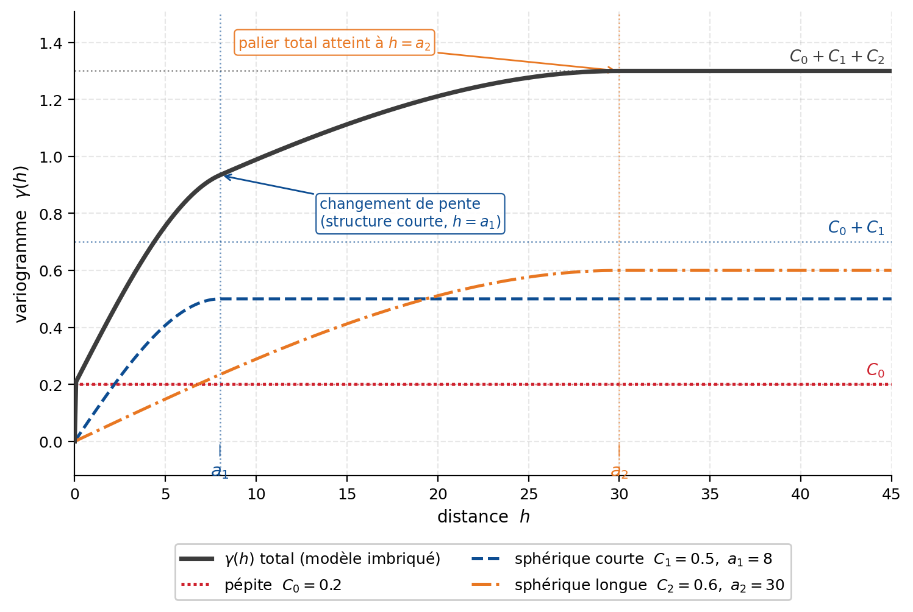

## Modèles imbriqués de variogramme

Un seul modèle élémentaire ne suffit pas toujours à représenter l’ensemble de la structure spatiale. Un phénomène peut présenter une continuité à courte distance, associée par exemple à des variations locales, ainsi qu’une continuité à plus grande distance correspondant à une organisation régionale.

Il est alors possible d’additionner plusieurs modèles admissibles. La somme obtenue est appelée **modèle imbriqué** ou **modèle emboîté**.

Un modèle comprenant un effet de pépite et $p$ structures spatiales peut s’écrire :

$$
\gamma(\mathbf{h})
=
C_0\,\mathbb{1}_{\{\mathbf{h}\neq\mathbf{0}\}}
+
\sum_{k=1}^{p}
C_k\,
g_k(\mathbf{h};\boldsymbol{\theta}_k),
$$

où :

- $C_0$ est l’effet de pépite;
- $\mathbb{1}_{\{\mathbf{h}\neq\mathbf{0}\}}$ vaut 0 à l’origine et 1 pour toute distance non nulle;
- $C_k\geq0$ est le palier partiel de la structure $k$;
- $g_k$ est un modèle de variogramme admissible normalisé entre 0 et 1;
- $\boldsymbol{\theta}_k$ regroupe les paramètres de la structure $k$, notamment sa portée et, au besoin, son anisotropie.

Comme chaque composante est admissible et que les paliers partiels sont positifs ou nuls, leur somme demeure un variogramme admissible.

Si toutes les structures possèdent un palier fini, le palier total du modèle est :

$$
C_{\mathrm{tot}}
=
C_0
+
\sum_{k=1}^{p}
C_k.
$$

Chaque structure contribue donc à une partie de la variabilité totale (@fig-c7-variogramme-imbrique).

{#fig-c7-variogramme-imbrique fig-align="center" width="90%"}

### Exemple à deux structures

Considérons un modèle formé :

- d’un effet de pépite $C_0$;
- d’une structure sphérique de courte portée $a_1$ et de palier partiel $C_1$;
- d’une structure exponentielle de plus longue portée $a_2$ et de palier partiel $C_2$.

Le modèle s’écrit :

$$
\gamma(h)
=
C_0\,\mathbb{1}_{\{h>0\}}
+
C_1\,g_{\mathrm{sph}}(h;a_1)
+
C_2\,g_{\mathrm{exp}}(h;a_2),
$$

avec :

$$
a_1<a_2.
$$

La première structure contrôle principalement la croissance du variogramme aux faibles distances. La seconde prolonge cette croissance à une échelle plus grande jusqu’au palier total :

$$
C_{\mathrm{tot}}
=
C_0+C_1+C_2.
$$

Le variogramme peut ainsi présenter plusieurs changements de pente correspondant à différentes échelles de continuité.

| Composante | Paramètre principal | Contribution au modèle |
|:---|:---|:---|
| Effet de pépite | $C_0$ | Variabilité non résolue à très courte distance |
| Structure 1 | $C_1$, $a_1$ | Continuité à courte distance |
| Structure 2 | $C_2$, $a_2$ | Continuité à plus grande distance |

### Interprétation et ajustement

L’ajout d’une structure doit être justifié par une caractéristique persistante du variogramme expérimental, par exemple :

- un changement net de pente;
- plusieurs échelles de continuité;
- des comportements directionnels différents selon la distance;
- une interprétation géologique plausible.

Chaque structure peut posséder sa propre portée et sa propre anisotropie. Une structure à courte portée peut, par exemple, être presque isotrope, tandis qu’une structure à grande portée peut être fortement anisotrope.

Cette souplesse augmente toutefois le nombre de paramètres à estimer. Des modèles différents peuvent alors produire des courbes très semblables, surtout lorsque certaines classes de distance contiennent peu de paires. Il faut donc privilégier le modèle le plus simple qui représente adéquatement les principales caractéristiques observées.

::: {.callout-important}
Les différentes structures d’un modèle imbriqué ne correspondent pas nécessairement à des processus géologiques distincts. Elles constituent d’abord une représentation mathématique de plusieurs échelles de continuité. Toute interprétation géologique doit être appuyée par des informations indépendantes.
:::

Si l’une des composantes ne possède pas de palier, comme un modèle de puissance, le modèle imbriqué complet ne possède pas non plus de palier total fini.

## 🧮 Atelier interactif 7.7 — Calculateur de variogramme imbriqué {.unnumbered}

::: {.content-visible when-format="html"}
Combinez jusqu’à trois structures spatiales — sphérique, exponentielle ou gaussienne — avec un effet de pépite global afin de construire un modèle imbriqué. Chaque structure contribue au modèle selon son propre palier partiel et sa propre portée. Observez comment leur superposition produit plusieurs échelles de continuité et détermine le palier total.


:::

::: {.content-visible unless-format="html"}
Cet atelier interactif est disponible uniquement dans la version web du chapitre. Il montre comment plusieurs structures admissibles peuvent être additionnées pour représenter différentes échelles de continuité spatiale.
:::
