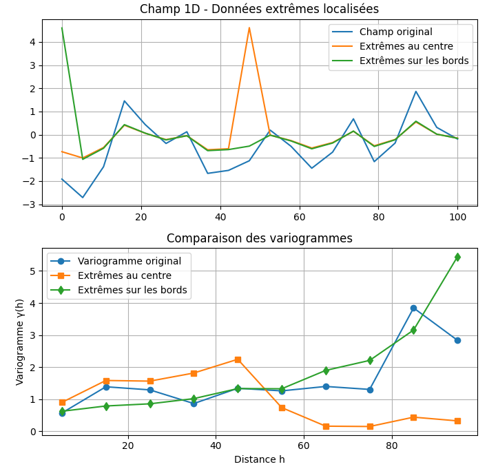
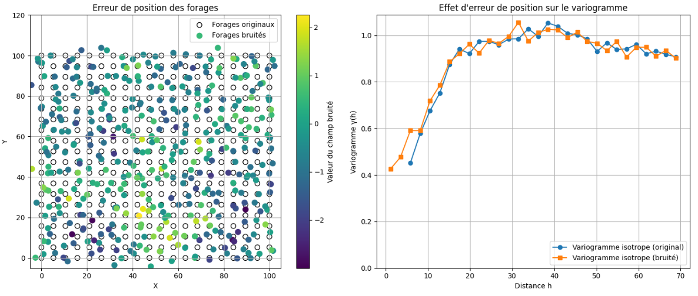
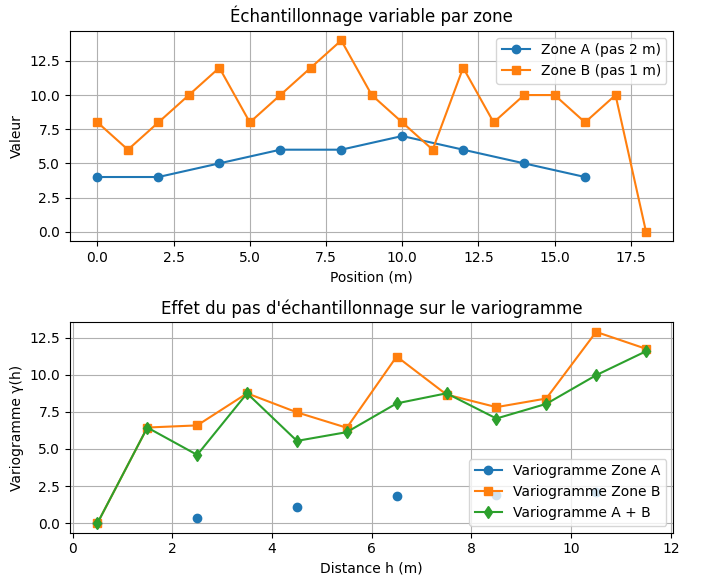
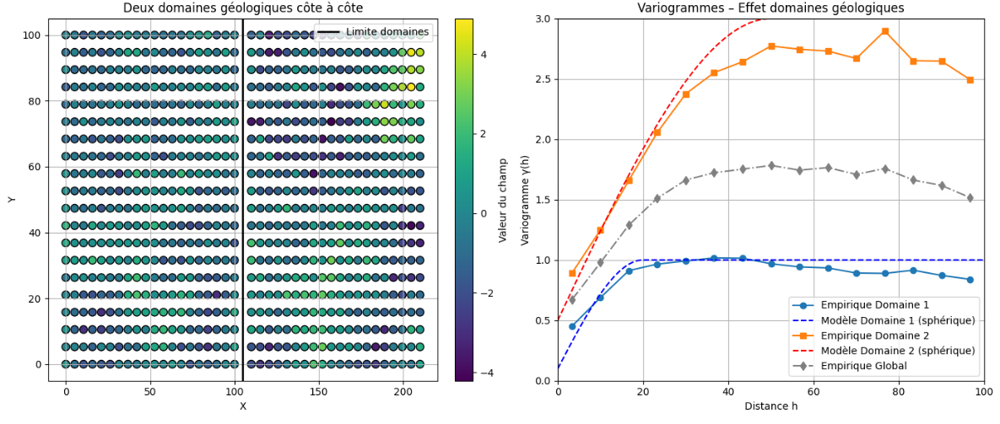
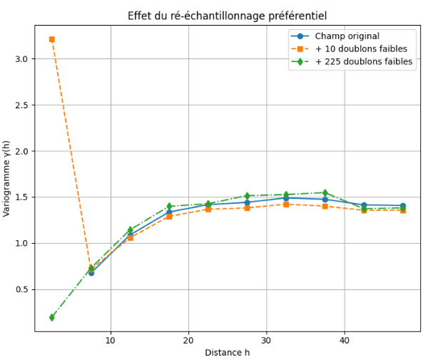
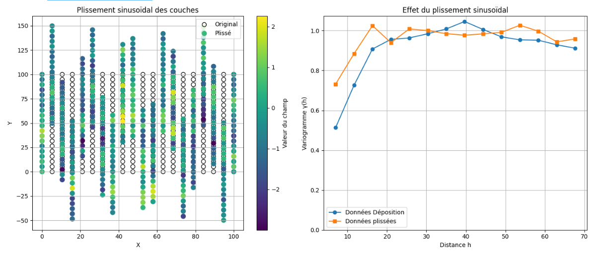
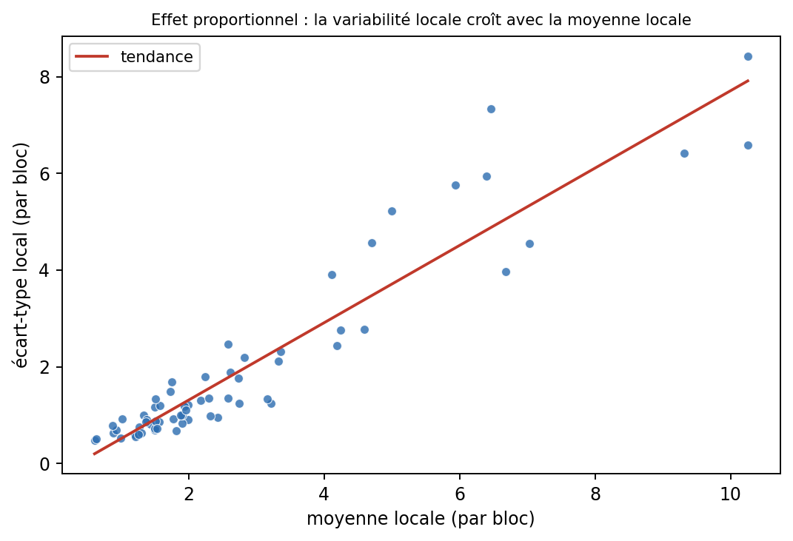

## Problèmes courants et solutions possibles

Le variogramme expérimental peut être déformé par la distribution des valeurs, la géométrie de l’échantillonnage, les erreurs de localisation ou le mélange de populations différentes. Ces effets doivent être diagnostiqués avant l’ajustement du modèle.

### Données extrêmes

Le variogramme repose sur des différences au carré. Une valeur extrême peut donc produire de très grandes contributions, surtout si elle participe à plusieurs paires d’une même classe de distance.

Son influence dépend aussi de sa position dans le domaine. Une valeur extrême située au centre participe généralement à davantage de paires qu’une valeur située en bordure, mais la répartition de ces paires entre les classes peut produire des formes très différentes.

La @fig-extreme compare l’effet d’une valeur extrême selon sa position dans le domaine.

{#fig-extreme fig-align="center"}

Avant toute correction, il faut déterminer si la valeur est :

- une erreur de saisie, de localisation ou d’analyse;
- une observation valide appartenant au même domaine géologique;
- une observation valide provenant d’une population différente.

Une valeur ne doit être supprimée que si une erreur est démontrée. Lorsqu’elle est valide, plusieurs analyses peuvent être comparées :

- variogramme avec et sans la valeur, à des fins de diagnostic;
- estimateur robuste;
- transformation de la variable;
- séparation des domaines;
- traitement particulier des valeurs fortement asymétriques.

L’écrêtage ou la transformation logarithmique modifient la variable étudiée. Ils doivent donc être justifiés et leur effet sur l’estimation finale doit être évalué.

### Erreurs de localisation

Une erreur de position modifie à la fois la distance et la direction associées à une paire. Elle brouille principalement la structure à courte distance et peut augmenter l’effet de pépite apparent.

La @fig-erreur-loc compare un variogramme calculé avec des positions exactes à celui obtenu après perturbation des coordonnées.

{#fig-erreur-loc fig-align="center"}

Ce problème est particulièrement important en trois dimensions, notamment lorsque la trajectoire des forages est mal connue.

Les principales mesures préventives sont :

- vérifier les coordonnées et les unités;
- contrôler les levés d’arpentage;
- utiliser les trajectoires corrigées des forages;
- conserver l’information sur l’incertitude de position;
- réaliser une analyse de sensibilité lorsque cette incertitude est importante.

### Échantillonnage non uniforme

Des pas d’échantillonnage différents modifient le nombre et la répartition des paires. Une zone densément échantillonnée peut alors dominer le variogramme combiné.

La @fig-pas illustre le mélange de deux zones ayant des pas et des structures différents.

{#fig-pas fig-align="center"}

Avant de calculer le variogramme, il faut distinguer trois situations :

1. les données ont des espacements différents, mais un support comparable;
2. les données ont des supports différents;
3. les zones appartiennent à des domaines géologiques différents.

Les solutions possibles comprennent :

- le calcul de variogrammes séparés par domaine;
- la mise sur un support commun par composition;
- l’utilisation d’une stratégie de pondération ou de désagrégation;
- une analyse de sensibilité à la densité d’échantillonnage.

La décimation peut être utile pour un diagnostic, mais elle élimine de l’information et ne devrait pas constituer la solution par défaut.

### Mélange de domaines géologiques

Un variogramme calculé sur plusieurs domaines peut combiner des moyennes, des variances et des structures spatiales différentes. Les paires qui traversent une limite géologique peuvent alors produire de fortes différences qui ne représentent pas la continuité à l’intérieur de chaque domaine.

La @fig-domaines montre qu’un variogramme global peut paraître régulier tout en masquant deux structures distinctes.

{#fig-domaines fig-align="center"}

La définition des domaines doit donc précéder la modélisation du variogramme. Les diagnostics utiles comprennent :

- les statistiques par domaine;
- les cartes et coupes géologiques;
- les variogrammes calculés séparément;
- les paires qui traversent les limites;
- les résultats de validation croisée par domaine.

La validation croisée peut révéler certains problèmes, mais elle ne remplace pas la définition géologique des populations stationnaires.

### Échantillonnage préférentiel

Un échantillonnage supplémentaire est souvent réalisé autour des valeurs élevées. Cette stratégie augmente le nombre de paires à courte distance dans les zones riches et peut modifier artificiellement le variogramme.

La @fig-doublons compare un échantillonnage initial, un ré-échantillonnage préférentiel et un ré-échantillonnage plus uniforme.

{#fig-doublons fig-align="center"}

Ce problème ne provient pas seulement du nombre de données, mais du lien entre la densité d’échantillonnage et la valeur observée.

Les options possibles sont :

- distinguer les données initiales des données de suivi;
- vérifier la comparabilité des supports;
- utiliser des poids de déclustering;
- calculer des variogrammes sur plusieurs sous-échantillons;
- comparer les résultats avec et sans les données de suivi.

Une décimation systématique peut réduire le biais, mais elle doit être utilisée avec prudence, puisqu’elle élimine également de l’information pertinente.

### Coordonnées géologiques

La continuité spatiale peut être plus simple dans un repère lié à la géologie que dans les coordonnées cartésiennes originales. C’est notamment le cas pour les unités plissées, les veines courbes, les chenaux ou les panaches suivant une trajectoire d’écoulement.

La @fig-plissement illustre l’effet d’un déplissement sur le variogramme.

{#fig-plissement fig-align="center"}

Une transformation des coordonnées peut réduire des distances artificiellement grandes entre des points qui sont proches dans le repère géologique. Elle exige toutefois :

- une interprétation structurale fiable;
- une transformation continue;
- une conservation raisonnable des distances locales;
- une validation de la géométrie transformée.

Le déplissement ne doit pas être utilisé uniquement pour améliorer l’apparence du variogramme. Il doit correspondre à une hypothèse géologique défendable.

## 🧮 Atelier interactif 7.9 — Erreurs et effets géologiques {.unnumbered}

::: {.content-visible when-format="html"}
Choisissez un effet dans le menu et comparez le variogramme de référence au variogramme perturbé. Les cas proposés comprennent le mélange de domaines, les erreurs de localisation et de mesure, l’anisotropie masquée, le plissement, les données extrêmes, les pas d’échantillonnage variables et le ré-échantillonnage préférentiel.


:::

::: {.content-visible unless-format="html"}
Cet atelier interactif est disponible uniquement dans la version web du chapitre.
:::

## Variogrammes relatifs {.unnumbered}

::: {.callout-tip title="Complément d’information"}
Cette section présente un outil de diagnostic utile pour certaines variables positives et fortement asymétriques. Elle peut être ignorée en première lecture.
:::

### Effet proportionnel

Un effet proportionnel est présent lorsque la variabilité locale augmente avec le niveau moyen de la variable. Les zones à forte teneur sont alors plus variables que les zones à faible teneur.

Dans le cas où l’écart-type local est approximativement proportionnel à la moyenne locale,

$$
\sigma_{\mathrm{local}}
\propto
m_{\mathrm{local}},
$$

la variance locale est approximativement proportionnelle au carré de cette moyenne :

$$
\sigma_{\mathrm{local}}^2
\propto
m_{\mathrm{local}}^2.
$$

Un variogramme global peut alors être dominé par les zones de forte moyenne et devenir difficile à comparer entre les secteurs.

### Normalisation relative

Le variogramme relatif vise à représenter la variabilité par rapport au niveau moyen de la variable.

Une forme globale consiste à diviser le variogramme par le carré de la moyenne :

$$
\widehat{\gamma}_{R}(\mathbf{h})
=
\frac{
\widehat{\gamma}(\mathbf{h})
}{
\overline{z}^{\,2}
}.
$$

Cette normalisation ne modifie pas la forme du variogramme global. Elle change seulement son échelle et facilite la comparaison entre des domaines ayant des moyennes différentes.

Une normalisation locale peut être appliquée en calculant séparément le variogramme dans plusieurs zones, puis en divisant chaque résultat par le carré de la moyenne correspondante.

Une autre forme est le variogramme relatif par paires :

$$
\widehat{\gamma}_{P}(\mathbf{h})
=
\frac{1}{2N(\mathbf{h})}
\sum_{(i,j)\in\mathcal{P}(\mathbf{h})}
\frac{
\left[
z(\mathbf{x}_j)-z(\mathbf{x}_i)
\right]^2
}{
\left[
\dfrac{
z(\mathbf{x}_j)+z(\mathbf{x}_i)
}{2}
\right]^2
}.
$$

Cette forme normalise chaque contribution par le niveau moyen de la paire. Elle est très sensible aux dénominateurs faibles ou nuls et doit donc être réservée aux variables strictement positives, avec un traitement explicite des valeurs proches de zéro.

### Interprétation

Les variogrammes relatifs sont principalement des outils de diagnostic. Ils peuvent aider à :

- comparer des structures entre des domaines de moyennes différentes;
- détecter un effet proportionnel;
- identifier une portée ou une anisotropie masquée par l’hétéroscédasticité.

Leur palier est sans dimension et ne représente pas directement la variance de la variable originale. Un variogramme relatif ne doit donc pas être utilisé directement dans un krigeage ordinaire sur l’échelle originale sans définir explicitement le modèle de variance locale et la manière de remettre les résultats à l’échelle.

Dans plusieurs cas, une transformation logarithmique, une modélisation par domaines ou un modèle non stationnaire constitue une solution plus cohérente.

{#fig-effet-proportionnel fig-align="center"}