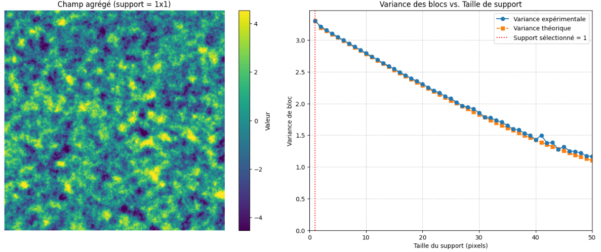
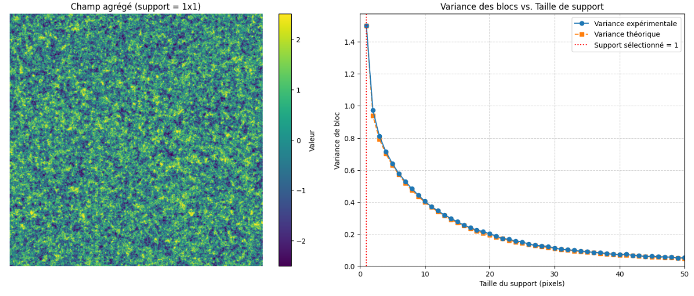
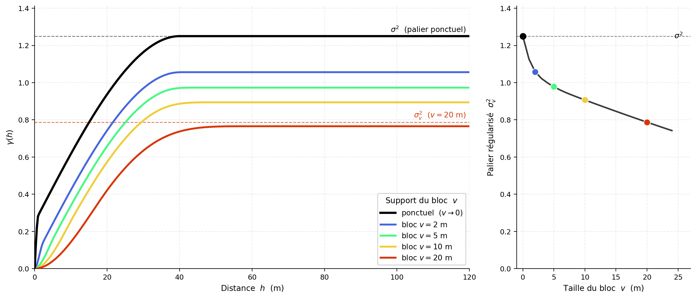

## Variances de blocs

Jusqu’à présent, le variogramme a été considéré sur un support quasi ponctuel, correspondant au volume d’une carotte ou d’un composite. Ce support n’est pas réellement ponctuel, mais il peut être approximé comme tel lorsqu’il est très petit par rapport aux dimensions des blocs et aux échelles de continuité du gisement.

Le support d’exploitation est toutefois beaucoup plus grand. Dans une mine, les décisions portent généralement sur des blocs de dimensions significatives, par exemple $5\ \text{m}\times5\ \text{m}\times5\ \text{m}$. Il faut donc passer du support des données au support des blocs : c’est le **changement de support**.

La question est alors la suivante : comment utiliser le variogramme établi à partir des données pour quantifier la variabilité des teneurs moyennes des blocs?

Deux notions complémentaires interviennent :

- **Variance de bloc** : décrit la variabilité des teneurs moyennes de blocs de support $v$ dans un domaine stationnaire théoriquement infini. Elle correspond à $D^2(v\mid\infty)$ et n’est définie au sens strict que lorsque la variance globale est finie, donc lorsque le variogramme possède un palier.

- **Variance de dispersion** : décrit la variabilité des petites unités de support $v$ à l’intérieur d’un volume fini $V$. Elle correspond à $D^2(v\mid V)$ et peut être calculée même lorsque le variogramme ne possède pas de palier.

Ces notions interviennent notamment dans :

- l’évaluation des réserves récupérables;
- l’analyse des piles d’homogénéisation;
- l’étude de la variabilité de la production;
- le calcul des variances d’estimation.

### Définition de la teneur d’un bloc

Soit $Z(\mathbf{x})$ une fonction aléatoire définie au support ponctuel. Considérons un support $v$ centré à la position $\mathbf{x}$, noté $v_{\mathbf{x}}$.

La teneur moyenne du bloc est :

$$
Z_v(\mathbf{x})
=
\frac{1}{|v|}
\int_{v_{\mathbf{x}}}
Z(\mathbf{u})\,d\mathbf{u},
$$

où $|v|$ représente le volume, l’aire ou la longueur du support, selon la dimension du problème.

Cette relation indique que la teneur du bloc est la moyenne des valeurs ponctuelles qui le composent.

Sous stationnarité d’ordre 2, l’espérance est conservée lors du changement de support :

$$
\mathbb{E}
\left[
Z_v(\mathbf{x})
\right]
=
m.
$$

### Variance de bloc

La variance de bloc est la variance des teneurs moyennes de blocs de support $v$ dans un domaine théoriquement infini :

$$
\sigma_v^2
=
D^2(v\mid\infty)
=
\operatorname{Var}
\left[
Z_v(\mathbf{x})
\right].
$$

En remplaçant $Z_v(\mathbf{x})$ par sa définition, on obtient :

$$
\sigma_v^2
=
\operatorname{Var}
\left[
\frac{1}{|v|}
\int_{v_{\mathbf{x}}}
Z(\mathbf{u})\,d\mathbf{u}
\right].
$$

Sous stationnarité d’ordre 2 :

$$
\sigma_v^2
=
\frac{1}{|v|^2}
\iint_{v_{\mathbf{x}}\times v_{\mathbf{x}}}
C(\mathbf{u}-\mathbf{u}')
\,d\mathbf{u}\,d\mathbf{u}'.
$$

La variance d’un bloc est donc la covariance moyenne entre toutes les paires de points appartenant au bloc.

### Covariance et variogramme moyens

Pour deux supports $A$ et $B$, la covariance moyenne est définie par :

$$
\overline{C}(A,B)
=
\frac{1}{|A|\,|B|}
\iint_{A\times B}
C(\mathbf{x}-\mathbf{y})
\,d\mathbf{x}\,d\mathbf{y}.
$$

De manière analogue, le variogramme moyen est :

$$
\overline{\gamma}(A,B)
=
\frac{1}{|A|\,|B|}
\iint_{A\times B}
\gamma(\mathbf{x}-\mathbf{y})
\,d\mathbf{x}\,d\mathbf{y}.
$$

La variance de bloc s’écrit donc simplement :

$$
\sigma_v^2
=
\overline{C}(v,v).
$$

Lorsque le variogramme possède un palier $C(\mathbf{0})=\sigma^2$, la variance de bloc peut aussi être calculée à partir du variogramme ponctuel :

$$
\sigma_v^2
=
\sigma^2
-
\overline{\gamma}(v,v).
$$

Autrement dit :

$$
\sigma_v^2
=
\sigma^2
-
\frac{1}{|v|^2}
\iint_{v\times v}
\gamma(\mathbf{u}-\mathbf{u}')
\,d\mathbf{u}\,d\mathbf{u}'.
$$

Le terme $\overline{\gamma}(v,v)$ représente la variabilité moyenne à l’intérieur du bloc. Cette variabilité est moyennée lors du passage du support ponctuel au support de bloc; elle est donc retranchée de la variance ponctuelle.

La variance de bloc dépend :

- de la taille du support;
- de sa forme;
- de son orientation;
- du modèle de variogramme;
- de l’anisotropie.

Deux blocs de même volume peuvent ainsi présenter des variances différentes s’ils n’ont pas la même géométrie ou la même orientation par rapport aux directions de continuité.

### Exemple 1 — Modèle sphérique

La @fig-C8_Bloc compare la variance de bloc mesurée sur un grand champ simulé à la variance calculée à partir du variogramme ponctuel.

Le modèle utilisé est sphérique et isotrope, avec une portée de 15 pixels, un palier total unitaire et aucun effet de pépite.

Les deux courbes sont très proches. Les écarts résiduels proviennent de la taille finie du champ simulé et de l’approximation numérique des intégrales.

{#fig-C8_Bloc fig-align="center"}

### Exemple 2 — Modèle exponentiel avec effet de pépite

La @fig-C8_BlocBruit présente le même exercice pour un modèle exponentiel isotrope comprenant :

- une portée effective de 50 pixels;
- un palier structuré $C_1=1$;
- un effet de pépite $C_0=0{,}5$;
- une variance ponctuelle totale $C(\mathbf{0})=1{,}5$.

La variance diminue rapidement lorsque le support augmente. La composante de pépite est particulièrement atténuée par le moyennage, puisqu’elle représente une variabilité sans continuité entre des positions distinctes.

Dans une simulation discrète, la contribution résiduelle de la pépite dépend du nombre d’éléments indépendants moyennés dans chaque bloc et de la discrétisation utilisée.

{#fig-C8_BlocBruit fig-align="center"}

### Propriétés

Lorsque le support du bloc tend vers le support ponctuel :

$$
\lim_{|v|\to0}
\sigma_v^2
=
\sigma^2.
$$

La variance de bloc tend alors vers la variance ponctuelle.

Lorsque la taille du bloc augmente, la variance diminue. Si la covariance décroît suffisamment avec la distance et si le domaine moyenné devient très grand :

$$
\lim_{|v|\to\infty}
\sigma_v^2
=
0.
$$

Ces limites ne découlent pas simplement du fait que le variogramme est croissant. Elles supposent une fonction aléatoire stationnaire de variance finie et une dépendance spatiale qui s’atténue à grande distance.

L’augmentation du support agit donc comme un lissage spatial : les valeurs fortes et faibles sont moyennées, ce qui réduit la variabilité entre les blocs.

### Variogramme de blocs

Considérons deux blocs identiques de support $v$, centrés aux positions $\mathbf{x}$ et $\mathbf{x}+\mathbf{h}$.

Le variogramme de blocs est défini par :

$$
\gamma_v(\mathbf{h})
=
\frac{1}{2}
\operatorname{Var}
\left[
Z_v(\mathbf{x}+\mathbf{h})
-
Z_v(\mathbf{x})
\right].
$$

Il mesure la variabilité entre les teneurs moyennes de deux blocs, plutôt qu’entre deux valeurs ponctuelles.

La covariance entre les deux blocs est :

$$
C_v(\mathbf{h})
=
\frac{1}{|v|^2}
\iint_{v\times v}
C
\left(
\mathbf{h}
+
\mathbf{u}'-\mathbf{u}
\right)
\,d\mathbf{u}\,d\mathbf{u}'.
$$

Sous stationnarité d’ordre 2 :

$$
\gamma_v(\mathbf{h})
=
C_v(\mathbf{0})
-
C_v(\mathbf{h}).
$$

Comme $C_v(\mathbf{0})=\sigma_v^2$, le palier du variogramme de blocs correspond à la variance de bloc lorsque la covariance entre blocs tend vers zéro à grande distance.

En fonction du variogramme ponctuel, le variogramme de blocs s’écrit :

$$
\gamma_v(\mathbf{h})
=
\overline{\gamma}
\left(
v_{\mathbf{x}},
v_{\mathbf{x}+\mathbf{h}}
\right)
-
\overline{\gamma}(v,v).
$$

Le premier terme est la moyenne du variogramme ponctuel entre toutes les paires dont un point appartient au premier bloc et l’autre au second. Le deuxième terme est la moyenne du variogramme à l’intérieur d’un bloc.

Cette soustraction est essentielle. Elle garantit notamment que :

$$
\gamma_v(\mathbf{0})
=
0.
$$

Le variogramme de blocs (@fig-c8-regularisation) possède généralement :

- un palier plus faible que le variogramme ponctuel;
- une croissance plus progressive à courte distance;
- une forme dépendant de la taille, de la géométrie et de l’orientation des blocs.

{#fig-c8-regularisation fig-align="center" width="90%"}

## 🧮 Atelier interactif 8.1 — Variance de bloc {.unnumbered}

::: {.content-visible when-format="html"}
Un champ anisotrope est simulé à partir de portées, d’un palier, d’un effet de pépite et d’un angle réglables. En augmentant le support, observez le lissage du champ et la diminution de la variance de bloc. La variance empirique, calculée par moyennage glissant, est comparée à la variance théorique obtenue à partir de la covariance moyenne.


:::

::: {.content-visible unless-format="html"}
Cet atelier interactif n'est disponible que dans la version web du chapitre.
:::
