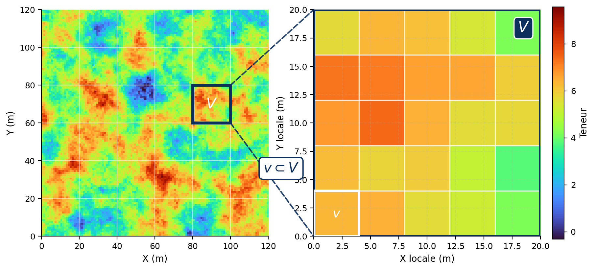

## Variance de dispersion

La variance de bloc permet de calculer la variance théorique d’une teneur de bloc dans un domaine supposé très grand. En pratique, un gisement est toujours fini. On veut donc aussi connaître l’amplitude des variations de teneur à l’intérieur d’un volume donné, par exemple une zone du gisement, un panneau ou une période de production.

Considérons un grand bloc $V_j$ découpé en petits blocs $v_i$. On a :

$$
Z(V_j) = \frac{1}{n} \sum_{i=1}^n Z(v_i)
$$

La teneur du grand bloc $V_j$ est donc la moyenne des teneurs des petits blocs $v_i$ qui le composent (@fig-c8-supports-emboites). On peut ensuite regarder à quel point les teneurs des petits blocs varient autour de cette moyenne. Cette variabilité, calculée en moyenne sur tous les blocs $V_j$ du domaine, correspond à **la variance de dispersion de $v$ dans $V$**, notée $D^2(v \mid V)$.

{#fig-c8-supports-emboites fig-align="center" width="90%"}

Soit la variance des petits blocs à l’intérieur d’un bloc $V_j$ :

$$
s^2_{v|V_j} = \frac{1}{n} \sum_{i=1}^n \left( Z(v_i) - Z(V_j) \right)^2
$$

Cette expression mesure la variabilité des teneurs des petits blocs $v_i$ autour de la teneur moyenne du grand bloc $V_j$. Comme on peut faire ce calcul pour plusieurs blocs $V_j$ dans le gisement, la variance de dispersion est définie comme la moyenne de cette quantité sur l’ensemble des blocs :

$$
D^2(v \mid V) =
\mathbb{E}_{V_j}\left[ s^2_{v|V_j} \right]
=
\mathbb{E}_{V_j}\left[
\frac{1}{n} \sum_{i=1}^n
\left( Z(v_i) - Z(V_j) \right)^2
\right]
$$

> **Variance de dispersion — Démonstration complète**
>
> Soit un bloc $V_j$ composé de $n$ sous-blocs $v_i$. On part de la variance des petits blocs autour de la moyenne du grand bloc :
>
> $$
> s^2_{v|V_j} = \frac{1}{n} \sum_{i=1}^n \left( Z(v_i) - Z(V_j) \right)^2
> $$
>
> avec :
>
> $$
> Z(V_j) = \frac{1}{n} \sum_{i=1}^n Z(v_i)
> $$
>
> On développe le carré :
>
> $$
> \left( Z(v_i) - Z(V_j) \right)^2 = Z(v_i)^2 - 2Z(v_i)Z(V_j) + Z(V_j)^2
> $$
>
> En remplaçant dans la somme et en utilisant le fait que $Z(V_j)$ est la moyenne des $Z(v_i)$, on obtient :
>
> $$
> s^2_{v|V_j} = \frac{1}{n} \sum_{i=1}^n Z(v_i)^2 - Z(V_j)^2
> $$
>
> On prend ensuite l’espérance sur l’ensemble des blocs $V_j$ :
>
> $$
> \mathbb{E}*{V_j} \left[ s^2*{v|V_j} \right] =
> \frac{1}{n} \sum_{i=1}^n \mathbb{E}[Z(v_i)^2]
> \mathbb{E}[Z(V_j)^2]
> $$
>
> En utilisant :
>
> $$
> \mathbb{E}[X^2] = \operatorname{Var}(X) + (\mathbb{E}[X])^2
> $$
>
> on obtient :
>
> $$
> \mathbb{E}*{V_j} \left[ s^2*{v|V_j} \right] =
> \frac{1}{n} \sum_{i=1}^n
> \left( \operatorname{Var}(Z(v_i)) + m^2 \right)
> \left( \operatorname{Var}(Z(V_j)) + m^2 \right)
> $$
>
> Les termes en $m^2$ s’annulent, car les petits blocs et les grands blocs ont la même moyenne sous l’hypothèse de stationnarité. Il reste :
>
> $$
> \mathbb{E}*{V_j} \left[ s^2*{v|V_j} \right] =
> \frac{1}{n} \sum_{i=1}^n \operatorname{Var}(Z(v_i))
> \operatorname{Var}(Z(V_j))
> $$
>
> Si les sous-blocs $v_i$ ont le même support, alors :
>
> $$
> \operatorname{Var}(Z(v_i)) = \operatorname{Var}(Z(v))
> $$
>
> et :
>
> $$
> \operatorname{Var}(Z(V_j)) =
> \frac{1}{n^2}
> \sum_{i=1}^n \sum_{k=1}^n
> \operatorname{Cov}(Z(v_i), Z(v_k))
> $$
>
> On obtient donc :
>
> $$
> \mathbb{E}*{V_j} \left[ s^2*{v|V_j} \right] =
> \operatorname{Var}(Z(v)) =
> \frac{1}{n^2}
> \sum_{i=1}^n \sum_{k=1}^n
> \operatorname{Cov}(Z(v_i), Z(v_k))
> $$
>
> Le premier terme correspond à la variance des petits blocs. Le second terme correspond à la variance des grands blocs, puisque $V_j$ est formé par la moyenne des $v_i$. On peut donc écrire :
>
> $$
> D^2(v \mid V) = \bar{C}(v,v) - \bar{C}(V,V)
> $$
>
> et, avec le variogramme :
>
> $$
> D^2(v \mid V) = \bar{\gamma}(V,V) - \bar{\gamma}(v,v)
> $$
>
> **Conclusion** : la variance de dispersion est la différence entre la variance des petits blocs et celle des grands blocs.

Ainsi, la variance de dispersion s’écrit simplement :

$$
D^2(v \mid V) = \sigma_v^2 - \sigma_V^2
$$

Autrement dit, elle mesure la part de variabilité qui existe à l’échelle des petits blocs $v$, mais qui disparaît lorsqu’on passe au grand bloc $V$. Comme la variance de bloc a déjà été définie, la variance de dispersion se calcule directement par différence.

### Expressions équivalentes

Utilisant les résultats précédents concernant les variances de blocs, on peut obtenir les formulations suivantes :

$$
D^2(v \mid V) = \bar{C}(v,v) - \bar{C}(V,V)
$$

ou encore, en termes de variogramme :

$$
D^2(v \mid V) = \bar{\gamma}(V,V) - \bar{\gamma}(v,v)
$$

### Propriétés

On peut retenir trois cas limites :

- si $v \to 0$, alors $D^2(v \mid V) \to \bar{\gamma}(V,V)$ ;
- si $v \to V$, alors $D^2(v \mid V) \to 0$ ;
- si $V \to \infty$, alors $D^2(v \mid V) \to \sigma_v^2$.

Le deuxième cas est le plus intuitif : si le petit support devient identique au grand support, il n’y a plus de dispersion à mesurer entre les deux.

### Applications

Dans une mine, $v$ peut représenter la production d’une journée, alors que $V$ peut représenter une semaine ou un mois. La variance de dispersion sert alors à voir si les teneurs envoyées au concentrateur varient beaucoup d’une journée à l’autre. Si les teneurs changent trop rapidement, le procédé devient plus difficile à contrôler. Une alimentation plus régulière permet au contraire de mieux stabiliser le traitement et, idéalement, d’améliorer la récupération $y$. Dans la logique de Lane, cette récupération influence directement la valeur économique de l’exploitation.

### Additivité des dispersions

Les variances de dispersion peuvent s’additionner quand les supports sont emboîtés. C’est la relation de Krige. Si on passe d’un petit support $v_1$ à un grand support $v_n$, avec des supports intermédiaires de plus en plus grands, on peut écrire :

$$
D^2(v_1 \mid v_n) = D^2(v_1 \mid v_2) + D^2(v_2 \mid v_3) + \dots + D^2(v_{n-1} \mid v_n)
$$

où les supports sont ordonnés de $v_1$ à $v_n$ et inclus les uns dans les autres.

Cette relation dit simplement que la variabilité entre $v_1$ et $v_n$ peut être séparée en plusieurs morceaux. On regarde d’abord ce qui est perdu en passant de $v_1$ à $v_2$, puis de $v_2$ à $v_3$, et ainsi de suite. Au final, la somme de ces pertes donne la dispersion totale entre le petit support et le grand support.

#### Exemple pratique : piles de stockage

Cette relation est utile pour représenter l’effet d’une pile d’homogénéisation. On peut, par exemple, considérer :

* $v_1$ : la production journalière ;
* $v_2$ : une pile de stockage ou une production homogénéisée ;
* $v_3$ : l’alimentation mensuelle du concentrateur.

La pile agit comme un mélangeur. Elle réduit les variations de teneur entre les journées. Si l’homogénéisation est très efficace, la teneur fournie par la pile varie peu d’une journée à l’autre. Dans ce cas, la dispersion entre $v_1$ et $v_2$ devient faible :

$$
D^2(v_1 \mid v_2) \approx 0
$$

La variabilité journalière est alors presque absorbée par la pile. Il reste surtout la variabilité entre les piles ou entre les volumes alimentant le concentrateur sur une plus longue période :

$$
D^2(v_1 \mid v_3) \approx D^2(v_2 \mid v_3)
$$

En pratique, cela veut dire que la pile ne change pas la teneur moyenne du minerai, mais elle réduit les fluctuations à court terme. C’est ce qui permet d’envoyer une alimentation plus stable au concentrateur.

### Notes importantes concernant l’effet de pépite

1. Dans les relations précédentes, $\gamma(\mathbf{h})$ représente le variogramme ponctuel. Dans la pratique, ce variogramme n’est pas accessible : seul le variogramme défini sur un support « $s$ » existe (par exemple, les carottes de forage). Les relations restent valides tant que le support des données est inférieur à « $v$ ». Dans ce cas, l’effet de pépite n’intervient ni dans le calcul de la variance de bloc ni dans celui de la variance de dispersion.

2. Lorsque $v$ est proche du support des données, l’effet de pépite ne disparaît pas complètement dans la variance de bloc. On ajoute alors souvent un terme de la forme $\frac{C_0}{n}$, où $C_0$ est l’effet de pépite et $n$ le nombre de supports élémentaires dans le bloc. Plus il y a de supports dans le bloc, plus la pépite est moyennée. Pour un petit bloc, ce terme peut donc rester non négligeable.

### Remarque finale

Le calcul des variances de bloc et de la variance d’estimation ne nécessite pas de connaître explicitement les données. Seul le variogramme est requis. Ces notions ne rendent donc pas compte de l’information accrue localement, issue de l’acquisition de nouvelles données.

## 🧮 Atelier interactif 8.2 — Influence du modèle de variogramme {.unnumbered}

::: {.content-visible when-format="html"}
Trois modèles de variogramme partageant une variance globale comparable mais des structures spatiales différentes sont confrontés : un sphérique (pépite + structure), un modèle imbriqué à deux portées (sans pépite, mais avec une composante de courte distance) et un sphérique indépendant. Pour chacun, observez côte à côte le variogramme, la variance de bloc en fonction de la taille, et la dispersion $\mathrm{Var}(l\times l) - \mathrm{Var}(\text{bloc de référence})$. À palier voisin, le modèle qui place davantage de variance à courte distance produit une variance de bloc et une dispersion plus fortes : le choix du modèle, au-delà de la portée et du palier, conditionne la variance de dispersion calculée.

:::

::: {.content-visible unless-format="html"}
Cet atelier interactif n'est disponible que dans la version web du chapitre.
:::
