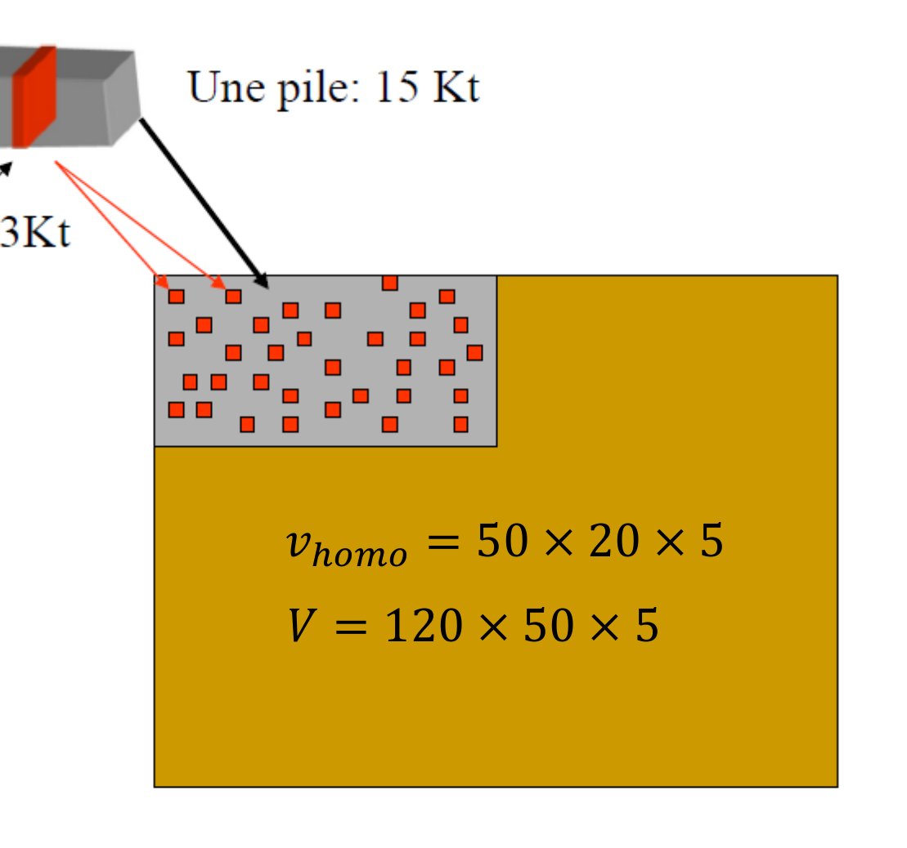

## Application de la variance de dispersion : Homogénéité du minerai {#sec-homogeneite-minerai}

La variance de dispersion mesure la variabilité des teneurs d'un support $v$ à l'intérieur d'un volume plus grand $V$. Appliquée à la production, elle quantifie directement l'homogénéité du minerai livré au concentrateur : $v$ représente la teneur d'une unité de production (par exemple une journée) et $V$ l'ensemble alimenté sur une période (par exemple un mois). Plus $D^2(v \mid V)$ est faible, plus la teneur envoyée au concentrateur est stable d'une journée à l'autre.

Cette stabilité a une valeur économique. Un concentrateur est réglé pour une teneur d'alimentation donnée ; si celle-ci fluctue, il faut ajuster continuellement le procédé, le rendement se dégrade et l'on perd du métal et de l'argent. L'intérêt de la variance de dispersion est qu'elle permet d'anticiper ces fluctuations et de comparer des stratégies d'exploitation **avant** de démarrer, à partir du seul variogramme :

$$
\text{variogramme} \;\rightarrow\; \text{variance de dispersion} \;\rightarrow\; \text{prévision des fluctuations} \;\rightarrow\; \text{design de l'exploitation.}
$$

{#fig-homogeneite-scenarios fig-align="center" width="90%"}

### Exemple : comparer quatre stratégies d'exploitation

On cherche à minimiser les fluctuations de la teneur **quotidienne** sur un mois d'exploitation d'un panneau de 90 Kt ($120 \times 50 \times 5$ m). La production quotidienne est de 3 Kt ($20 \times 10 \times 5$ m), le banc fait 5 m, et le variogramme est connu : sphérique isotrope, de portée $a_x = a_y = 50$ m et de palier $C = 5\,\%^2$.

On compare quatre stratégies : (1) une seule pelle, (2) deux pelles indépendantes, (3) une pile d'homogénéisation de 15 Kt, (4) une pile d'homogénéisation de 90 Kt.

Dans chaque cas, on évalue la variance de dispersion du bloc quotidien $v$ dans le panneau mensuel $V$,

$$
D^2(v \mid V) = \sigma_v^2 - \sigma_V^2 = C\,\big[\, F(V) - F(v) \,\big],
$$

où $F(\cdot)$ est la fonction auxiliaire du modèle sphérique — la valeur standardisée $\bar{\gamma}/C$ du variogramme moyen sur un support, lue sur l'abaque en fonction des dimensions du support rapportées à la portée.

#### Scénario 1 — une pelle

Toute la production d'une journée provient d'un même bloc $v = 20 \times 10 \times 5$. On lit sur l'abaque $F(120/50,\,50/50) = 0{,}83$ pour le panneau mensuel et $F(20/50,\,10/50) = 0{,}24$ pour le bloc quotidien :

$$
D^2(v \mid V) = 5\,\%^2 \times (0{,}83 - 0{,}24) = 2{,}95\,\%^2.
$$

#### Scénario 2 — deux pelles indépendantes

La production quotidienne est maintenant partagée entre deux pelles distantes de 60 m, chacune extrayant un demi-bloc $v_1 = v_2 = 10 \times 10 \times 5$ (1,5 Kt) dans sa propre zone $V_1 = V_2 = 60 \times 50 \times 5$ (45 Kt). La teneur quotidienne est la moyenne des deux pelles, $Z(v) = \tfrac{1}{2}\big(Z(v_1) + Z(v_2)\big)$, d'où

$$
\operatorname{Var}\!\big(Z(v)\big) = \tfrac{1}{4}\Big(\operatorname{Var}\!\big(Z(v_1)\big) + \operatorname{Var}\!\big(Z(v_2)\big) + 2\operatorname{Cov}\!\big(Z(v_1), Z(v_2)\big)\Big).
$$

Les deux pelles étant séparées de 60 m, soit plus que la portée de 50 m, leurs teneurs sont décorrélées : $\operatorname{Cov}\!\big(Z(v_1), Z(v_2)\big) = 0$. Comme les deux blocs ont la même variance, il reste $\operatorname{Var}\!\big(Z(v)\big) = \tfrac{1}{2}\operatorname{Var}\!\big(Z(v_1)\big)$ : moyenner deux teneurs indépendantes réduit de moitié la variance du bloc quotidien. La dispersion se calcule alors sur la zone propre à une pelle ($V_1 = 60 \times 50 \times 5$) :

$$
D^2(v \mid V) = \tfrac{1}{2}\Big(5\,\%^2 \times \big(F(60/50,\,50/50) - F(10/50,\,10/50)\big)\Big) = \tfrac{1}{2}\big(5\,\%^2 \times (0{,}70 - 0{,}16)\big) = 1{,}35\,\%^2.
$$

#### Scénario 3 — pile d'homogénéisation de 15 Kt

Une pile d'homogénéisation ($50 \times 20 \times 5$, soit 15 Kt) est intercalée entre l'extraction et le concentrateur. On la traite comme un support intermédiaire $v_{\text{homo}}$ et on applique l'additivité des variances de dispersion (relation de Krige) :

$$
D^2(v \mid V) = D^2(v \mid v_{\text{homo}}) + D^2(v_{\text{homo}} \mid V).
$$

Le rôle de la pile est précisément d'homogénéiser les teneurs des blocs quotidiens qu'elle mélange, de sorte que $D^2(v \mid v_{\text{homo}}) \approx 0$. Il ne reste que la dispersion de la pile dans le panneau mensuel :

$$
D^2(v \mid V) = D^2(v_{\text{homo}} \mid V) = 5\,\%^2 \times \big(F(120/50,\,50/50) - F(50/50,\,20/50)\big) = 5\,\%^2 \times (0{,}83 - 0{,}52) = 1{,}55\,\%^2.
$$

{#fig-homogeneite-pile fig-align="center" width="55%"}

#### Scénario 4 — pile d'homogénéisation de 90 Kt

Si la pile absorbe toute la production mensuelle, son support égale celui du panneau, $v_{\text{homo}} = V = 120 \times 50 \times 5$. La dispersion résiduelle s'annule :

$$
D^2(v \mid V) = 5\,\%^2 \times \big(F(120/50,\,50/50) - F(120/50,\,50/50)\big) = 0\,\%^2.
$$

Une pile mensuelle mélange l'ensemble du minerai extrait sur le mois : la teneur livrée est alors constante, et la dispersion nulle.

### Analyse des résultats

| Stratégie | $D^2(v \mid V)$ ($\%^2$) |
|:---|:---:|
| Une pelle | 2,95 |
| Deux pelles indépendantes | 1,35 |
| Pile d'homogénéisation de 15 Kt | 1,55 |
| Pile d'homogénéisation de 90 Kt | $\approx 0$ |

Trois enseignements se dégagent. D'abord, exploiter simultanément deux zones décorrélées — deux pelles distantes de plus d'une portée — réduit fortement la variabilité livrée : moyenner deux teneurs indépendantes divise par deux la variance du bloc quotidien, ce qui abaisse la dispersion de 2,95 à 1,35 $\%^2$. Ensuite, une pile d'homogénéisation abaisse d'autant plus la dispersion que sa capacité est grande ; une pile contenant toute la production mensuelle ramène la variabilité à zéro. Enfin, résultat le plus instructif sur le plan opérationnel, deux pelles indépendantes (1,35 $\%^2$) font ici mieux qu'une pile de 15 Kt (1,55 $\%^2$) : décorréler spatialement l'extraction est un levier simple et peu coûteux, parfois plus efficace qu'un ouvrage de stockage de capacité modeste.

## 🧮 Atelier interactif 8.3 — Homogénéité du minerai {.unnumbered}

::: {.content-visible when-format="html"}
La variance de dispersion permet de comparer différentes façons d’exploiter le gisement. Si $D^2(v \mid V)=\sigma_v^2-\sigma_V^2$ est faible, les teneurs envoyées au concentrateur varient moins d’une journée à l’autre. L’alimentation est donc plus stable.

Dans l’atelier, comparez trois cas : une seule pelle, deux pelles éloignées et une pile d’homogénéisation. Avec deux pelles éloignées, les blocs sont moins corrélés entre eux, ce qui réduit la variance journalière. Avec une pile d’homogénéisation, plus la capacité augmente, plus les teneurs sont mélangées, et plus $D^2$ se rapproche de zéro.

Vous pouvez aussi modifier l’anisotropie et le sens de chargement. Si la bande journalière est chargée en travers de la direction de forte continuité, elle coupe davantage de variabilité. Les camions contiennent alors un mélange plus représentatif du gisement, ce qui aide à stabiliser la teneur envoyée au concentrateur.


:::

::: {.content-visible unless-format="html"}
Cet atelier interactif est disponible uniquement dans la version web du chapitre.
:::