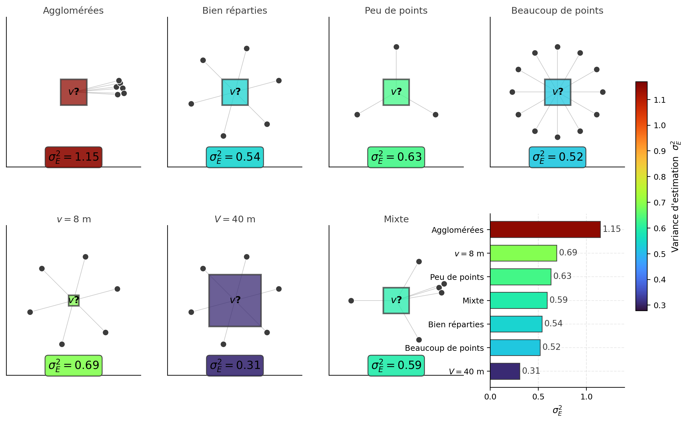
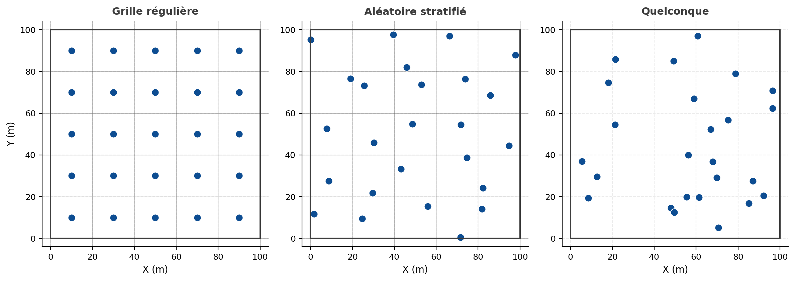
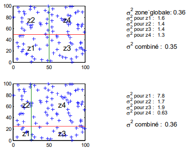

## Variance d’estimation

Quand on estime la teneur moyenne d'un bloc ou d'une zone à partir de quelques échantillons, on commet une erreur. Cette erreur est d'autant plus grande que les données sont rares, mal placées, ou que le gisement est erratique. Tout l'intérêt, en pratique, c'est de pouvoir chiffrer cette erreur avant même de connaître les teneurs, pour juger si une maille d'échantillonnage est suffisante. On cherche donc ici à mesurer la précision d'une estimation obtenue par une méthode quelconque, généralement linéaire.

Soit une variable aléatoire $Z_v$ qu'on veut estimer par une combinaison linéaire des valeurs observées :

$$
Z_v^* = \sum_{i=1}^n \lambda_i Z(\mathbf{x}_i) = \sum_{i=1}^n \lambda_i Z_i
$$

où $Z_i$ est la valeur observée au point $\mathbf{x}_i$, $Z_v^*$ l'estimateur de $Z_v$, et $\lambda_i$ le poids associé à la donnée $Z_i$.

L'erreur d'estimation est la différence entre la valeur estimée et la valeur réelle :
$$e = Z_v^* - Z_v$$

La variance de cette erreur, la **variance d'estimation**, se développe ainsi :
$$
\sigma_e^2 = \operatorname{Var}(e) = \operatorname{Var}(Z_v^* - Z_v) = \operatorname{Var}(Z_v^*) + \operatorname{Var}(Z_v) - 2\,\operatorname{Cov}(Z_v^*, Z_v)
$$

::: {.callout-note collapse="true"}
## Rappel : Propriété de la variance sur une combinaison linéaire

On rappelle que la variance d'une combinaison linéaire de variables aléatoires est donnée par :

$$
\operatorname{Var}\left( \sum_{i=1}^n \lambda_i Z_i \right)
= \sum_{i=1}^n \sum_{j=1}^n \lambda_i \lambda_j \, \operatorname{Cov}(Z_i, Z_j)
$$

et que

$$
\operatorname{Cov}(Z_i, Z_i) = \operatorname{Var}(Z_i)
$$

:::

En remplaçant $Z_v^*$ par son expression, on obtient :
$$
\sigma_e^2 = \operatorname{Var}(Z_v) + \sum_{i=1}^n \sum_{j=1}^n \lambda_i \lambda_j \operatorname{Cov}(Z_i, Z_j) - 2 \sum_{i=1}^n \lambda_i \operatorname{Cov}(Z_i, Z_v)
$$

### Interprétation

La variance d'estimation se compose donc de trois termes, et chacun a une interprétation très concrète.

a) $\operatorname{Var}(Z_v)$ : *le phénomène est-il variable en lui-même ?*
Plus le phénomène étudié est variable, plus les erreurs d'estimation le seront aussi. Estimer une teneur dans un champ constant est facile : la variance est nulle. Estimer dans un champ très erratique, proche d'un bruit blanc, est autrement plus difficile.

b) $\sum_i \sum_j \lambda_i \lambda_j \operatorname{Cov}(Z_i, Z_j)$ : *quelle est la redondance entre les observations ?*
Ce terme mesure la redondance des données. L'estimation est meilleure quand les données sont bien réparties (@fig-c8-proximite-redondance). Des données trop rapprochées ont une forte covariance entre elles : elles répètent la même information et n'aident pas autant à réduire la variance que des données espacées. Inutile d'avoir cent données concentrées dans la même zone.

c) $\sum_i \lambda_i \operatorname{Cov}(Z_i, Z_v)$ : *les observations sont-elles bien placées par rapport à la cible ?*
C'est le terme de proximité. Si les données sont proches du bloc à estimer, la covariance $\operatorname{Cov}(Z_i, Z_v)$ est élevée ; comme ce terme est soustrait, il fait chuter la variance d'estimation. À l'inverse, des données très éloignées n'apportent presque rien.

{#fig-c8-proximite-redondance fig-align="center" width="100%"}

### Remarques importantes

1. On reconnaît trois composantes : un terme lié au bloc ($\bar{\gamma}(v,v)$), un terme lié aux points ($\bar{\gamma}(\mathbf{x}_i, \mathbf{x}_j)$) et un terme croisé ($\bar{\gamma}(\mathbf{x}_i, v)$).
2. La variance d'estimation est une mesure de précision moyenne, pour une configuration géométrique donnée. Elle ne dépend pas des teneurs mesurées, seulement de la géométrie et du variogramme.
3. Le krigeage, justement, consiste à choisir les poids $\lambda_i$ qui minimisent cette variance $\sigma_e^2$.

### Formulation avec le variogramme

En utilisant la relation $\operatorname{Cov}(Z_i, Z_j) = \sigma^2 - \gamma(\mathbf{x}_i - \mathbf{x}_j)$, la variance d'estimation se réécrit avec le variogramme moyen $\bar{\gamma}$ introduit plus haut :
$$\sigma_e^2 = 2 \sum_i \lambda_i \bar{\gamma}(\mathbf{x}_i, v) - \sum_{i,j} \lambda_i \lambda_j \bar{\gamma}(\mathbf{x}_i, \mathbf{x}_j) - \bar{\gamma}(v, v)$$

### Variance d’extension

La **variance d'extension** est le cas particulier où l'on étend la valeur d'un support $v$ (point, segment, surface) à un volume supérieur $V$, sans optimiser les poids : on donne à $v$ un poids unitaire, au lieu de chercher les $\lambda_i$ du krigeage. L'expression précédente se réduit alors à
$$\sigma_e^2 = 2\,\bar{\gamma}(v, V) - \bar{\gamma}(v, v) - \bar{\gamma}(V, V),$$
une forme symétrique en $\bar{\gamma}$, qui ne dépend que de la géométrie des deux supports. Ces situations simples se prêtent bien à l'usage d'abaques pour évaluer rapidement la précision.

### Combinaison d’erreurs élémentaires

Pour estimer un grand volume $V$ à partir de nombreuses données, le calcul direct oblige à inverser un grand système de krigeage. L'idée de la combinaison d'erreurs est d'éviter ce calcul global : on découpe le domaine en $n$ sous-domaines $v_i$, on évalue l'erreur élémentaire sur chacun, et l'erreur globale s'obtient par simple somme, à condition que les erreurs élémentaires soient indépendantes. La forme de cette somme dépend du plan d'échantillonnage (@fig-c8-patrons).

{#fig-c8-patrons fig-align="center" width="90%"}

#### i. Grille régulière (*square grid*)
Si chaque point $Z_i$ représente un bloc de même taille, de variance d'erreur $\sigma_e^2$, alors :
$$\sigma_e^2(\text{globale}) = \frac{\sigma_e^2}{n}$$

#### ii. Échantillonnage aléatoire stratifié (*stratified random*)
Si le point est placé au hasard dans le bloc $v_i$ :
$$\sigma_e^2(\text{globale}) = \frac{D^2(\cdot \mid v)}{n}$$

#### iii. Échantillonnage quelconque
Pour un domaine $V$ découpé en parcelles $v_i$, chacune estimée avec ses propres données :
$$\sigma_e^2 = \frac{1}{V^2} \sum_{i=1}^n v_i^2 \sigma_{e_i}^2$$

#### Remarques

- La méthode d'estimation (krigeage, polygones, etc.) influence peu l'estimation globale d'un grand champ, mais elle est déterminante pour la précision locale.
- Pour que cette simplification tienne, il ne faut pas partager de données entre deux blocs voisins : sinon, les erreurs ne sont plus indépendantes.

#### Exemple

Une zone a été estimée directement par krigeage (variance de 0,36), puis par combinaison de 4 parcelles (@fig-VarEstimation). Les résultats par subdivision sont quasi identiques à ceux du calcul direct, ce qui valide l'approche par combinaison d'erreurs.

{#fig-VarEstimation fig-align="center"}

## 🧮 Atelier interactif 8.4 — Variance d'estimation d'un bloc {.unnumbered}

::: {.content-visible when-format="html"}
La variance d’estimation d’un bloc $V$ à partir de données situées aux positions $\mathbf{x}_i$ s’écrit :

$$
\sigma_e^2 = 2\sum_i \lambda_i\,\bar{\gamma}(\mathbf{x}_i, V) \;-\; \bar{\gamma}(V, V) \;-\; \sum_i\sum_j \lambda_i\lambda_j\,\bar{\gamma}(\mathbf{x}_i, \mathbf{x}_j),
$$

Cette variance correspond à la variance de krigeage du bloc. Elle dépend surtout de deux choses : la position des données par rapport au bloc, et la redondance entre les données. Une donnée proche du bloc réduit généralement la variance d’estimation. Par contre, deux données très proches l’une de l’autre apportent presque la même information ; la seconde ajoute donc peu.

Dans l’atelier, vous pouvez placer des données dans deux configurations, une rouge et une bleue, puis comparer la variance d’estimation obtenue pour le bloc. Vous pouvez aussi retirer un point en cliquant dessus. On voit alors qu’un point bien placé peut réduire fortement $\sigma_e^2$, alors qu’un point ajouté près d’un autre a souvent peu d’effet.

L’anisotropie peut aussi être modifiée. Dans la direction de forte continuité, une donnée reste utile même un peu plus loin du bloc. Dans la direction perpendiculaire, son influence diminue plus vite. C’est pour cette raison que la direction de l’échantillonnage doit rester cohérente avec la structure spatiale du gisement.

:::

::: {.content-visible unless-format="html"}
Cet atelier interactif n'est disponible que dans la version web du chapitre.
:::
