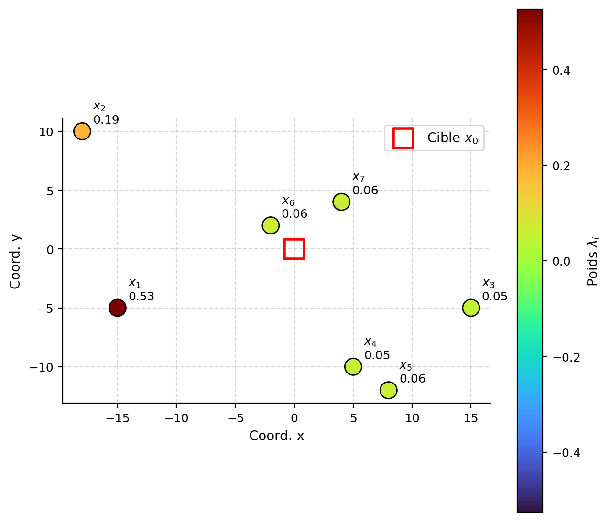

## Introduction

Une estimation peut être construite comme une combinaison pondérée des données voisines. La difficulté consiste alors à choisir les poids. Une donnée proche de la cible est généralement informative, mais sa contribution dépend aussi de la continuité spatiale et de sa redondance avec les autres observations. Deux données très proches ne fournissent pas nécessairement deux informations indépendantes (@fig-c9-poids-ko).

{#fig-c9-poids-ko fig-align="center" width="90%"}

Le krigeage utilise le variogramme ou la covariance pour déterminer les poids. Ceux-ci sont calculés de manière à satisfaire une condition d’absence de biais et à minimiser la variance de l’erreur d’estimation. Le krigeage est ainsi souvent présenté comme le meilleur estimateur linéaire sans biais, sous les hypothèses du modèle retenu.

Il fournit deux résultats :

- une estimation de la valeur ponctuelle ou de la teneur moyenne d’un bloc;
- une variance de krigeage, qui décrit la précision théorique associée à la configuration des données et au modèle spatial.

### Principales formes de krigeage

Les variantes du krigeage se distinguent principalement par le modèle attribué à la moyenne.

- **Krigeage simple (KS)** : la moyenne est connue et constante.

- **Krigeage ordinaire (KO)** : la moyenne est inconnue, mais supposée constante dans le voisinage de l’estimation.

- **Krigeage universel (KU)** : la moyenne varie dans l’espace selon une fonction des coordonnées.

- **Krigeage avec dérive externe (KED)** : la moyenne varie en fonction d’une ou de plusieurs variables auxiliaires.

Dans le krigeage universel et le krigeage avec dérive externe, la moyenne varie selon la localisation des données. Le variogramme décrit alors la continuité spatiale des résidus, qui ont, de facto, une moyenne nulle, autour de la tendance.

### Cadre du chapitre

Ce chapitre présente d’abord le krigeage simple et le krigeage ordinaire, qui permettent d’établir les principes fondamentaux de la méthode. Le krigeage de bloc, le choix du voisinage, le krigeage universel et le krigeage avec dérive externe sont ensuite abordés.

| Forme de krigeage | Modèle de moyenne | Structure spatiale requise |
|:---|:---|:---|
| Krigeage simple (KS) | Connue et constante | Covariance ou variogramme avec variance finie |
| Krigeage ordinaire (KO) | Inconnue et constante localement | Variogramme ou covariance |
| Krigeage universel (KU) | Fonction des coordonnées | Variogramme ou covariance des résidus |
| Krigeage avec dérive externe (KED) | Fonction de variables auxiliaires | Variogramme ou covariance des résidus |

### Étapes du krigeage

L'analyse de la continuité spatiale et l'ajustement d'un modèle de variogramme ont été traités précédemment; le krigeage s'appuie sur ce modèle pour déterminer les poids et réaliser l'estimation. La démarche complète comprend généralement les étapes suivantes :

1. calculer le variogramme expérimental;
2. ajuster un modèle de variogramme admissible;
3. définir le point ou le bloc à estimer;
4. choisir le type de krigeage et le voisinage;
5. construire et résoudre le système de krigeage pour obtenir les poids;
6. calculer l'estimation et la variance de krigeage;
7. valider le modèle et les paramètres, par exemple par validation croisée.

Les deux premières étapes étant acquises, ce chapitre porte sur la construction du système de krigeage, le calcul des poids, l'estimation et l'interprétation de la variance de krigeage.

