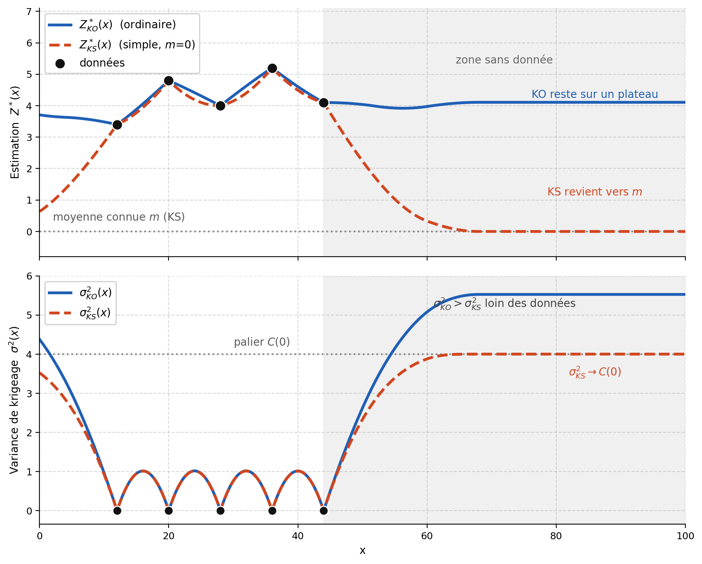

## Krigeage ordinaire

Le krigeage ordinaire s'applique lorsque la moyenne $m$ est inconnue, mais qu'on peut la supposer constante dans le voisinage du point à estimer. C'est l'hypothèse la plus réaliste dans la plupart des situations, ce qui fait du krigeage ordinaire la variante de loin la plus utilisée en pratique.

Ne pas connaître $m$ modifie la construction de l'estimateur. Dans le krigeage simple, on retranchait une moyenne connue pour travailler sur les résidus; ici, cette moyenne n'est plus disponible. On la remplace par une contrainte sur les poids, qui impose à l'estimateur de rester sans biais quelle que soit la valeur inconnue de la moyenne.

### Construction de l'estimateur

L'estimateur est une combinaison linéaire des données :

$$
Z_0^* = \sum_{i=1}^n \lambda_i \, Z_i
$$

où $Z_i = Z(\mathbf{x}_i)$ est la valeur observée au point $\mathbf{x}_i$ et $\lambda_i$ son poids.

### Condition de non-biais

Pour que l'estimateur soit sans biais, son espérance doit être égale à celle de la variable à estimer. Sous stationnarité, toutes les données ont la même moyenne $m$ :

$$
\mathbb{E}[Z_0^*] = \sum_{i=1}^n \lambda_i \, \mathbb{E}[Z_i] = m \sum_{i=1}^n \lambda_i
$$

Cette espérance doit valoir $\mathbb{E}[Z_0] = m$. En posant $\sum_{i=1}^n \lambda_i = 1$, on obtient bien que $\mathbb{E}[Z_0^*] = m$.

> **Remarque.** Sous la contrainte $\sum_i \lambda_i = 1$, on peut réécrire l'estimateur sous une forme semblable au krigeage simple :
> $$Z_0^* = m + \sum_{i=1}^n \lambda_i (Z_i - m)$$
> le terme en $m$ s'annule grâce à la contrainte. Le krigeage ordinaire agit donc comme si les données étaient corrigées autour d'une moyenne locale, sans qu'il faille fixer cette moyenne à l'avance.

### Dérivation du système par la méthode de Lagrange

On cherche les poids $\lambda_i$ qui minimisent la variance de l'erreur d'estimation,

$$
\operatorname{Var}(e) = \operatorname{Var}\!\left( Z_0 - \sum_{i=1}^n \lambda_i \, Z_i \right),
$$

cette fois sous la contrainte $\sum_{i=1}^n \lambda_i = 1$. En développant la variance comme en krigeage simple, on retrouve la même forme quadratique des poids :

$$
\operatorname{Var}(e) = C(\mathbf{0}) + \sum_{i=1}^n \sum_{j=1}^n \lambda_i \lambda_j \, C_{ij} - 2 \sum_{i=1}^n \lambda_i \, C_{i0}
$$

Cependant, cette forme ne tient pas compte de la contrainte de non-baise sur les poids. Il faut donc ajouter un terme dans l'équation pour s'assurer que les poids soient de somme unitaire. Ainsi, on introduit un multiplicateur de Lagrange $\nu$ et la fonctionnelle

$$
\mathcal{L}(\lambda_1, \dots, \lambda_n, \nu) = \operatorname{Var}(e) + 2\nu \left( \sum_{i=1}^n \lambda_i - 1 \right),
$$

le facteur 2 devant $\nu$ étant une convention qui allège les expressions finales. On annule les dérivées partielles par rapport à chaque poids $\lambda_k$. Rappel que le facteur 2 du terme croisé vient, comme dans le cas du krigeage simple, de la symétrie $C_{kj} = C_{jk}$ :

$$
\frac{\partial \mathcal{L}}{\partial \lambda_k} = 2 \sum_{j=1}^n \lambda_j \, C_{kj} + 2\nu - 2 \, C_{k0} = 0.
$$

La dérivée par rapport à $\nu$ redonne la contrainte et on obtient le système de krigeage ordinaire :

$$
\begin{cases}
\displaystyle\sum_{j=1}^n \lambda_j \, C_{kj} + \nu = C_{k0}, & k = 1, \dots, n \\[6pt]
\displaystyle\sum_{j=1}^n \lambda_j = 1
\end{cases}
$$

Il comporte $n + 1$ équations à $n + 1$ inconnues : les $n$ poids $\lambda_1, \dots, \lambda_n$ et le multiplicateur $\nu$.

Le système comporte $n + 1$ équations, une par donnée observée, plus celle du multiplicateur de Lagrange, et autant d'inconnues : les $n$ poids $\lambda_1, \dots, \lambda_n$ et le multiplicateur $\nu$. Dès que le modèle de covariance est admissible et que les points de données sont distincts, la matrice bordée du système est inversible : le système admet une solution unique. Contrairement au krigeage simple, cette matrice n'est pas définie positive, à cause de la ligne et de la colonne de contrainte; c'est toutefois la restriction de la variance $\sigma_K^2$ au sous-espace des poids vérifiant $\sum_i \lambda_i = 1$ qui reste strictement convexe, ce qui garantit que la solution du système en est bien le minimum.

### Variance de krigeage ordinaire

En reportant la solution dans l'expression de la variance, on obtient la variance de krigeage ordinaire :

$$
\sigma_{OK}^2 = C(\mathbf{0}) - \sum_{i=1}^n \lambda_i \, C_{i0}) - \nu
$$

Elle contient, par rapport au krigeage simple, un terme supplémentaire $-\nu$. Comme le krigeage ordinaire subit une contrainte de plus, sa variance est, à configuration égale, supérieure ou égale à celle du krigeage simple ($\sigma_{SK}^2 \leq \sigma_{OK}^2$). C'est simple à expliquer : il est plus facile d'estimer une donnée lorsque l'on connaît sa moyenne que lorsque celle-ci est inconnue.

> **Point clé.** La variance de krigeage ne dépend pas des valeurs observées. Elle est entièrement fixée par le modèle de variogramme (ou de covariance) et par la configuration géométrique des données par rapport au point (ou au bloc) à estimer. On peut donc la calculer avant même de collecter les données, ce qui est utile pour planifier les campagnes d'échantillonnage.

### Formulation en termes de variogramme

On préfère souvent exprimer le système à l'aide du variogramme plutôt que de la covariance. C'est pratique sous l'hypothèse intrinsèque. En utilisant $C(\mathbf{h}) = \sigma^2 - \gamma(\mathbf{h})$ et la contrainte $\sum_i \lambda_i = 1$ (qui fait disparaître les termes en $\sigma^2$), le système devient

$$
\begin{cases}
\displaystyle\sum_{j=1}^n \lambda_j \, \gamma_{kj} - \nu = \gamma{k0}, & k = 1, \dots, n \\[6pt]
\displaystyle\sum_{i=1}^n \lambda_i = 1
\end{cases}
$$

et la variance de krigeage :

$$
\sigma_{OK}^2 = \sum_{i=1}^n \lambda_i \, \gamma{i0} - \nu.
$$

Cette écriture ne fait intervenir que le variogramme, sans exiger la variance a priori $\sigma^2$. C'est pourquoi le krigeage ordinaire ne requiert que le variogramme et fonctionne tant sous l'hypothèse de stationnarité d'ordre 2 que sous l'hypothèse intrinsèque, alors que le krigeage simple requiert la fonction de covariance, donc la stationnarité d'ordre 2.

### Forme matricielle

Il est facile de passer de la forme matricielle du krigeage simple à celle du krigeage ordinaire : il suffit d'ajouter une ligne et une colonne de 1 à la matrice $\mathbf{C}$ pour tenir compte de la contrainte de non-biais (portée par le multiplicateur de Lagrange), avec un 0 dans le coin. On complète de même le vecteur $\mathbf{c}$ par un 1. Le système $\mathbf{A}\, \boldsymbol{\lambda}^+ = \mathbf{b}$ s'écrit alors :

$$
\underbrace{\begin{bmatrix}
C_{11} & C_{12} & \cdots & C_{1n} & 1 \\
C_{21} & C_{22} & \cdots & C_{2n} & 1 \\
\vdots & \vdots & \ddots & \vdots & \vdots \\
C_{n1} & C_{n2} & \cdots & C_{nn} & 1 \\
1 & 1 & \cdots & 1 & 0
\end{bmatrix}}_{\mathbf{A}}
\underbrace{\begin{bmatrix}
\lambda_1 \\ \lambda_2 \\ \vdots \\ \lambda_n \\ \nu
\end{bmatrix}}_{\boldsymbol{\lambda}^+}
=
\underbrace{\begin{bmatrix}
C_{10} \\ C_{20} \\ \vdots \\ C_{n0} \\ 1
\end{bmatrix}}_{\mathbf{b}}
$$

### Krigeage simple ou ordinaire?

{#fig-c9-profil-krigeage fig-align="center" width="90%"}

Les deux variantes ne diffèrent que par le statut de la moyenne, et tout le reste en découle (@fig-c9-profil-krigeage) :

| | Krigeage simple | Krigeage ordinaire |
|:---|:---|:---|
| Moyenne $m$ | connue (déterministe) | inconnue, constante |
| Contrainte sur les poids | aucune | $\sum_i \lambda_i = 1$ |
| Multiplicateur de Lagrange | — | $\nu$ |
| Prérequis | covariance $C(\mathbf{h})$ | variogramme $\gamma(\mathbf{h})$ |
| Système | $\mathbf{C}\boldsymbol{\lambda} = \mathbf{c}$ ($n$ équations) | $\mathbf{A}\boldsymbol{\lambda}^+ = \mathbf{b}$ ($n+1$ équations) |
| Variance | $\sigma_{SK}^2 = C(\mathbf{0}) - \sum_i \lambda_i\, C_{i0}$ | $\sigma_{OK}^2 = C(\mathbf{0}) - \sum_i \lambda_i\, C_{i0} - \nu$ |

## 🧮 Atelier interactif 9.2 — Krigeage ordinaire (KO) {.unnumbered}

::: {.content-visible when-format="html"}
La moyenne $m$ est inconnue. Ajustez la portée, l'effet de pépite et la position de la cible. Suivez la contrainte $\sum_i \lambda_i = 1$ et le multiplicateur $\nu$ qui s'ajuste pour la satisfaire, puis comparez avec le krigeage simple (option « Superposer KS ») : à configuration égale, $\sigma_{OK}^2 \ge \sigma_{SK}^2$, car le krigeage ordinaire « paie » l'estimation implicite de la moyenne.

:::

::: {.content-visible unless-format="html"}
Cet atelier interactif n'est disponible que dans la version web du chapitre.
:::

### Exemple de construction d'un système de krigeage simple et ordinaire

Construire un système de krigeage n'est pas complexe en soi : il suffit d'en suivre les étapes. Voici un atelier interactif, modifiable, qui montre comment résoudre un système de krigeage simple ou ordinaire, étape par étape :

1. calculer la matrice des distances entre les données, et entre chaque donnée et la cible;
2. en déduire la matrice de variogramme $\gamma(h)$;
3. convertir en matrice de covariance, $C(h) = \sigma^2 - \gamma(h)$;
4. assembler le système de krigeage (matrice $\mathbf{A}$ et second membre $\mathbf{b}$);
5. résoudre le système pour obtenir les poids $\boldsymbol{\lambda}$ et le multiplicateur $\nu$;
6. calculer l'estimation $Z_0^*$ et la variance de krigeage $\sigma_K^2$.

<!-- 9.3 : Système matriciel pas à pas -->
## 🧮 Atelier interactif 9.3 — Système de krigeage (exemple numérique) {.unnumbered}

::: {.content-visible when-format="html"}
Choisissez le krigeage simple ou ordinaire, réglez le modèle de variogramme, et suivez le calcul à chaque étape. Idéal pour vérifier vos calculs manuels.

:::

::: {.content-visible unless-format="html"}
Cet atelier interactif n'est disponible que dans la version web du chapitre.
:::