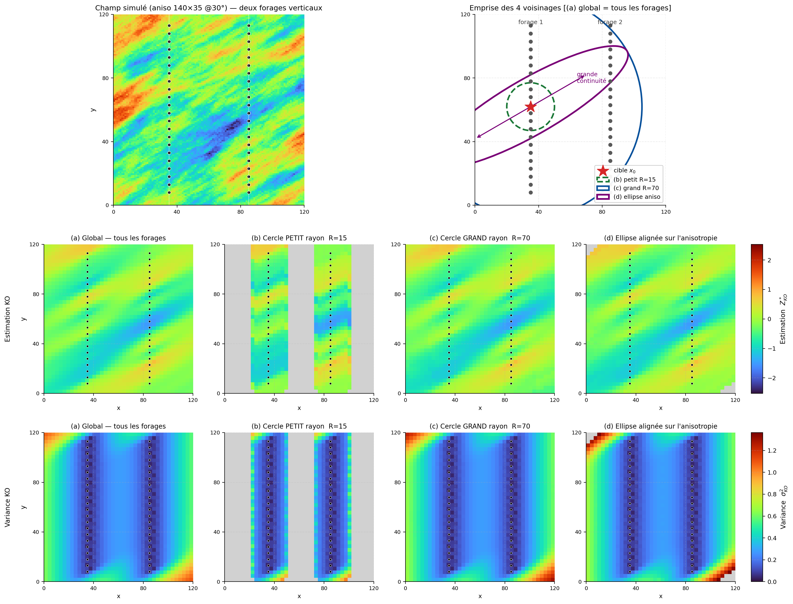

## Sélection du voisinage

La théorie du krigeage est formulée à partir de l'ensemble des $N$ données disponibles, ce qui correspond à un voisinage global. En pratique, on utilise presque toujours un voisinage local : un sous-ensemble de données choisi autour du point (ou du bloc) à estimer. Ce choix tient à des raisons numériques autant que géostatistiques.

La raison numérique est directe. Résoudre le système de krigeage suppose d'inverser sa matrice, une opération dont le coût croît comme $O(N^3)$. Avec plusieurs milliers de données, cette inversion devient trop lourde pour un ordinateur classique. En restreignant le calcul aux données proches du point à estimer, le voisinage local ramène la matrice à une taille $n \times n$, avec $n \ll N$, et rend le krigeage praticable.

### Voisinage global et voisinage local

Dans le voisinage global, toutes les données contribuent à chaque estimation. La cohérence de l'estimateur est optimale, mais trois difficultés apparaissent :

- Le système de krigeage a une taille $N \times N$ (ou $(N+1) \times (N+1)$ en krigeage ordinaire), ce qui devient vite prohibitif en calcul et en mémoire quand $N$ est grand.
- L'hypothèse de stationnarité est rarement vérifiée sur tout le domaine. Utiliser des données très éloignées du point à estimer peut introduire un biais si la moyenne ou la continuité spatiale varie à grande échelle.
- Les données éloignées reçoivent de toute façon des poids très faibles, voire nuls au-delà de la portée : leur contribution à l'estimation est négligeable.

En voisinage local, seules les $n$ données les plus proches (ou situées à l'intérieur d'un rayon de recherche) servent à estimer chaque point. Le système de krigeage est résolu séparément pour chaque cible, avec un jeu de données et des poids différents à chaque fois.

### Paramètres du voisinage

Les paramètres suivants définissent le voisinage utilisé pour chaque estimation.

**Rayon de recherche**. Le poids attribué à une donnée dépend de sa continuité spatiale avec le point à estimer. Pour un modèle à portée finie, les données situées au-delà de la portée ne sont plus corrélées avec la cible et apportent donc peu ou pas d’information. Le rayon de recherche délimite cette zone, généralement sous la forme d’un ellipsoïde centré sur le point à estimer. Ses dimensions sont souvent fixées à partir des portées du variogramme et peuvent être augmentées, par exemple jusqu’à deux fois la portée, dans les zones moins bien échantillonnées (@fig-c9-voisinage).

{#fig-c9-voisinage fig-align="center" width="100%"}

**Nombre de données**. Un nombre minimal de données est imposé afin d’éviter les estimations reposant sur une information trop limitée. Lorsque ce seuil, souvent fixé autour de huit données, n’est pas atteint, le point peut être laissé sans estimation. Un nombre maximal est également fixé, généralement autour de 30 données. Au-delà, les données supplémentaires apportent souvent peu d’information en raison de l’effet d’écran, tandis que la résolution du système de krigeage devient plus coûteuse.

**Recherche par secteurs**. Le nombre de données ne garantit pas qu’elles soient bien réparties autour de la cible. Dans un échantillonnage irrégulier, les données les plus proches peuvent toutes provenir d’une même direction, par exemple le long d’une ligne de forage. Pour limiter ce déséquilibre, le voisinage est divisé en secteurs, comme quatre quadrants ou huit octants, et un nombre maximal de données est retenu dans chacun d’eux. Cette approche favorise une meilleure couverture spatiale autour du point à estimer et réduit la redondance entre les données sélectionnées.

### Conséquences du voisinage local

L’utilisation d’un voisinage local introduit deux approximations par rapport à une estimation fondée sur l’ensemble des données :

1) Deux points voisins peuvent être estimés à partir de jeux de données différents et recevoir des poids différents. De légères discontinuités peuvent ainsi apparaître d’un point ou d’un bloc à l’autre, notamment lorsque la composition du voisinage change brusquement.
2) La variance de krigeage obtenue avec un voisinage local diffère de celle qui serait calculée avec un voisinage global. L’écart demeure généralement faible lorsque le voisinage couvre adéquatement la zone de continuité spatiale autour de la cible.

Malgré ces approximations, le voisinage local reste essentiel en pratique. Il réduit fortement le coût des calculs et permet de limiter l’estimation à une zone où l’hypothèse de stationnarité est plus plausible. D'une certaine manière, on vient relâcher l'hypothèse de stationnarité d'ordre deux, en la rendant obligatoire uniquement dans le voisinage de l'estimation.

## 🧮 Atelier interactif 9.5 — Sélection du voisinage et effet d'écran {.unnumbered}

::: {.content-visible when-format="html"}
Faites varier le nombre $k$ de plus proches voisins. Observez les discontionuités de l'estimation lorsque un voisin entre ou sort du voisinage, et la convergence vers la solution globale lorsque $k$ grandit. L'effet d'écran rend les voisins lointains presque inutiles : un point proche fait barrière aux données plus éloignées dans la même direction.

:::

::: {.content-visible unless-format="html"}
Cet atelier interactif n'est disponible que dans la version web du chapitre.
:::

### Validation croisée

La validation croisée (*cross-validation*) évalue la qualité du modèle de variogramme et des paramètres de voisinage. Le principe : on retire temporairement chaque donnée de l'échantillonnage, puis on l'estime par krigeage à partir des données restantes. On obtient ainsi, pour chaque point $\mathbf{x}_i$ :

- l'estimation par krigeage : $Z^*_{-i}(\mathbf{x}_i)$
- la variance de krigeage : $\sigma^2_{K,-i}(\mathbf{x}_i)$
- l'erreur de validation croisée : $e_i = Z(\mathbf{x}_i) - Z^*_{-i}(\mathbf{x}_i)$
- l'erreur standardisée : $e_i^s = e_i / \sigma_{K,-i}(\mathbf{x}_i)$

Un modèle bien calibré doit produire des erreurs sans biais systématique et compatibles avec l’incertitude annoncée par le krigeage. On examine notamment les critères suivants :

1) Moyenne des erreurs proche de zéro : $\bar{e}\approx 0$. Une valeur sensiblement différente de zéro indique une tendance à surestimer ou à sous-estimer les données.
2) Moyenne des erreurs standardisées proche de zéro : $\bar{e}^s\approx 0$. Ce critère vérifie l’absence de biais relativement à l’incertitude propre à chaque estimation.
3) Variance des erreurs standardisées proche de un : $\operatorname{Var}(e^s)\approx 1$. Une valeur inférieure à un suggère que la variance de krigeage est trop grande, tandis qu’une valeur supérieure à un indique qu’elle est probablement sous-estimée.
4) Absence de structure dans les erreurs : les erreurs ne devraient pas varier systématiquement selon la position, la valeur estimée, la densité des données ou la distance aux voisins.

Lorsque le modèle repose sur une hypothèse gaussienne, la distribution des erreurs standardisées peut également être comparée à une loi normale centrée réduite à l’aide d’un histogramme ou d’un graphique quantile-quantile. Cette normalité n’est toutefois pas une exigence générale du krigeage.

La validation croisée demeure un outil de diagnostic. Elle vérifie le comportement du modèle aux emplacements déjà échantillonnés, mais ne garantit pas sa validité dans les zones dépourvues de données. Elle sert surtout à comparer différents variogrammes ou voisinages et à repérer les problèmes de biais, de calibration de la variance ou de sélection des données.

## 🧮 Atelier interactif 9.6 — Validation croisée {.unnumbered}

::: {.content-visible when-format="html"}
Reprise de l'exemple simulé des notes de cours (diapo 53). Quatre vues : le **champ simulé** avec ses données ; la **surface de $\operatorname{Var}(e)$** (variance des erreurs de validation croisée leave-one-out) en fonction de la portée $a$ et du ratio $c_0/C$, dont le **minimum** donne le meilleur modèle ; le **variogramme** expérimental confronté au modèle courant ; et le **nuage de validation** $Z$ observé vs $Z^*$ (estimé en retirant la donnée). Réglez le modèle, ou cliquez « Ajuster aux données » pour amener le modèle courant sur le minimum de la surface. Cherchez $\overline{e^s} \approx 0$ et $\operatorname{Var}(e^s) \approx 1$.

:::

::: {.content-visible unless-format="html"}
Cet atelier interactif n'est disponible que dans la version web du chapitre.
:::
