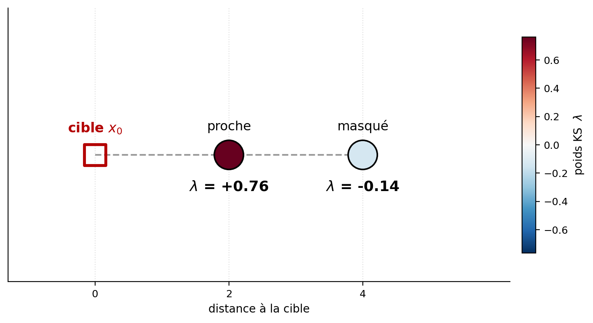
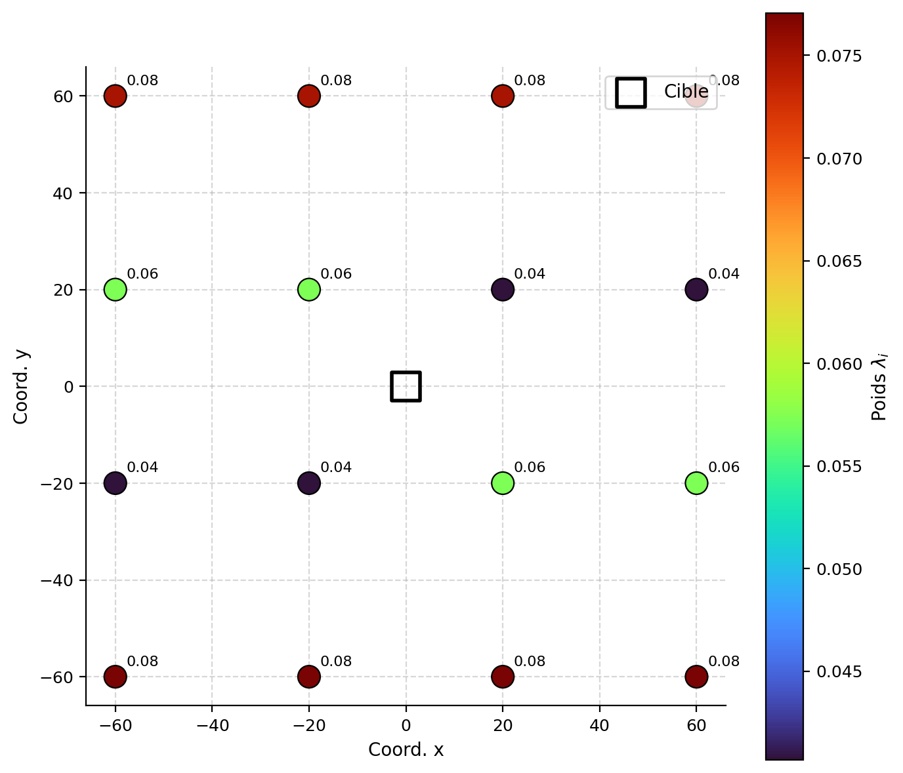
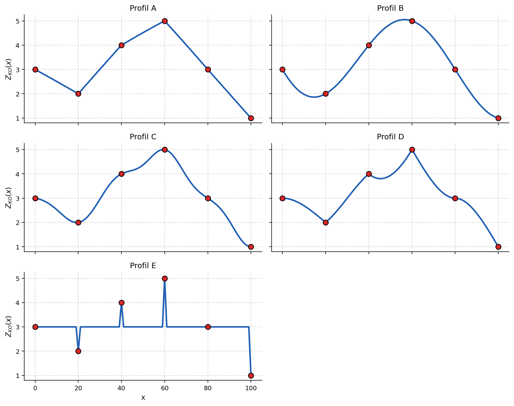

## Propriétés du krigeage

Au-delà du calcul des poids, le krigeage possède plusieurs propriétés qui expliquent sa place centrale parmi les méthodes d’estimation spatiale.

### Optimalité : linéarité, absence de biais et variance minimale

Le krigeage est un estimateur linéaire : la valeur recherchée est estimée à partir d’une combinaison linéaire des données ou, dans le cas du krigeage simple, de leurs écarts par rapport à la moyenne connue. Les poids ne sont toutefois pas déterminés uniquement en fonction de la distance. Ils tiennent également compte de la continuité spatiale et de la redondance entre les données.

Les poids sont calculés de manière à respecter deux propriétés : 1) l’absence de biais; 2) la minimisation de la variance de l’erreur d’estimation.

Le krigeage est ainsi qualifié de meilleur estimateur linéaire sans biais, ou *Best Linear Unbiased Estimator* (BLUE). Le terme « meilleur » doit cependant être interprété dans ce cadre précis : parmi les estimateurs linéaires sans biais construits avec le modèle de covariance ou de variogramme choisi, le krigeage fournit la plus petite variance d’estimation.

Cette optimalité ne garantit ni que le modèle de variogramme représente parfaitement la réalité ni que les estimations sont exactes partout. Elle signifie seulement que l’estimateur est optimal compte tenu des hypothèses retenues.

### Interpolation exacte

Le krigeage est un interpolateur exact. 

Lorsqu’une estimation ponctuelle est réalisée exactement à l’emplacement et sur le même support qu’une donnée connue, le krigeage reproduit cette donnée : $Z^*(\mathbf{x}_i) = Z(\mathbf{x}_i), \quad \forall \, \mathbf{x}_i \in S$ et les variances de krigeage en ces points sont nulles : $\sigma_K^2(\mathbf{x}_i) = 0, \quad \forall \, \mathbf{x}_i \in S$.

La présence d’un effet de pépite ne supprime pas nécessairement cette propriété. Lorsque la pépite représente une variabilité à très courte distance faisant partie de la variable étudiée, le krigeage demeure un interpolateur exact.

La situation est différente lorsque l'effet de pépite est interprétée comme une erreur de mesure ou comme un bruit que l’on souhaite filtrer. L’objectif consiste alors à estimer le signal sous-jacent plutôt que de reproduire fidèlement la valeur observée. Il existe ainsi une forme de krigeage, le krigeage avec erreur de mesure, qui permet de tenir compte de cette erreur ou de ce bruit dans les mesures et qui n’est donc plus un interpolateur exact, et dont la variance ne s’annule pas nécessairement aux points échantillonnés.

> **Remarque.** L’interpolation exacte consiste en une estimation effectuée sur le même support que la donnée. Une donnée ponctuelle et la teneur moyenne d’un bloc représentent deux supports différents : l’estimation du bloc n’est donc pas tenue de reproduire exactement la valeur ponctuelle, même si le point se trouve à l’intérieur du bloc.

### Effet d'écran

L’effet d’écran (*screening effect*) désigne la tendance des données proches de la cible à réduire l’influence des données plus éloignées qui apportent une information similaire.

Par exemple, lorsqu’une donnée éloignée se trouve derrière une donnée plus proche dans une même direction, son information est en partie redondante. Le krigeage tient compte de cette redondance et lui attribue généralement un poids plus faible que si elle était isolée (@fig-c9-effet-ecran).

{#fig-c9-effet-ecran fig-align="center" width="90%"}

L’intensité de l’effet d’écran dépend notamment :

* de la géométrie des données;
* du comportement du variogramme à courte distance;
* de l’importance de l’effet de pépite;
* du type de krigeage utilisé.

Un effet de pépite élevé réduit généralement l’effet d’écran, car les données proches deviennent moins fortement corrélées entre elles et avec la cible. Dans le cas limite d’un effet de pépite pur, les données ne présentent aucune continuité spatiale. En krigeage ordinaire, les données sélectionnées reçoivent alors des poids égaux. En krigeage simple, l’estimation revient plutôt vers la moyenne connue lorsque la cible ne coïncide avec aucune donnée.

L’effet d’écran justifie en partie l’utilisation d’un voisinage local : lorsque le voisinage couvre adéquatement la zone d’influence de la cible, l’exclusion des données très éloignées entraîne généralement une faible perte d’information tout en réduisant considérablement le coût des calculs.

### Prise en compte de la géométrie

Contrairement aux méthodes fondées uniquement sur la distance, comme l’inverse de la distance, le krigeage tient compte de la configuration spatiale de l’ensemble des données.

**Position relative des données.** Deux données proches l’une de l’autre fournissent une information partiellement redondante. Le krigeage ajuste leurs poids en fonction de leur position par rapport à la cible, mais également en fonction de leur position l’une par rapport à l’autre. Un regroupement de données dans une même zone ne reçoit donc pas automatiquement toute l’influence simplement parce qu’il contient plusieurs observations.

**Support à estimer.** Les poids dépendent également du support de la quantité recherchée. L’estimation d’un point et celle de la moyenne d’un bloc ne font pas intervenir les mêmes covariances. Lorsque la taille du bloc augmente, les poids tendent généralement à être répartis plus uniformément, puisque la quantité estimée représente une moyenne sur un volume plus important. La variance d’estimation tend également à diminuer, car une moyenne de bloc est moins variable qu’une valeur ponctuelle.

### Influence de la continuité spatiale

Le variogramme décrit la continuité spatiale utilisée par le krigeage. Ses principales caractéristiques influencent directement les poids et la variance d’estimation.

**Effet de pépite.** Un effet de pépite élevé indique une forte variabilité à courte distance ou une erreur de mesure importante. Il réduit l’influence des données proches, affaiblit l’effet d’écran et augmente généralement la variance d’estimation.

**Portée.** À palier comparable, une grande portée indique que la continuité se maintient sur de plus longues distances. Les données éloignées peuvent alors conserver une influence significative sur l’estimation. Pour les modèles sans portée finie, comme le modèle exponentiel, on utilise plutôt une portée pratique correspondant à une distance au-delà de laquelle la covariance devient négligeable.

**Anisotropie.** Lorsque la continuité varie selon la direction, les poids dépendent non seulement de la distance, mais également de l’orientation des données par rapport à la cible. Une donnée située dans une direction de forte continuité peut ainsi recevoir davantage de poids qu’une donnée située à la même distance dans une direction de faible continuité (@fig-c9-aniso-poids).

{#fig-c9-aniso-poids fig-align="center" width="90%"}

> **Remarque.** Le comportement du variogramme aux distances comparables à l’espacement des données influence souvent davantage les estimations que son comportement à grande distance. Deux modèles différents peuvent ainsi produire des résultats semblables s’ils représentent de manière comparable la continuité aux courtes distances pertinentes pour le voisinage utilisé (@fig-c9-assoc-profils).

{#fig-c9-assoc-profils fig-align="center" width="90%"}

### Effet de lissage

Le krigeage produit généralement des estimations moins dispersées que les valeurs réelles. Ce phénomène, appelé effet de lissage, provient du fait que chaque estimation combine l'information de plusieurs données. Les fluctuations locales et les valeurs extrêmes sont alors atténuées.

Cette propriété doit toutefois être interprétée avec prudence. La réduction de variance est garantie en krigeage simple, mais elle n'est pas automatiquement garantie pour toutes les configurations de krigeage ordinaire, notamment lorsque le voisinage est très restreint ou mal adapté.

#### Krigeage simple

Pour le krigeage simple, la relation suivante lie la variance des valeurs réelles, la variance des estimations et la variance de krigeage :

$$
\operatorname{Var}(Z_v) = \operatorname{Var}(Z_v^*) + \sigma_{SK}^2
$$

Cette décomposition montre que la variance des estimations est toujours inférieure à la variance des valeurs réelles, la différence étant exactement égale à la variance de krigeage.

#### Krigeage ordinaire

Pour le krigeage ordinaire, la relation est légèrement modifiée par le multiplicateur de Lagrange :

$$
\operatorname{Var}(Z_v) = \operatorname{Var}(Z_v^*) + \sigma_{OK}^2 + 2\nu
$$

**Exemple numérique.** Considérons un bloc de $10 \times 10$, estimé par ses 4 coins, avec un variogramme sphérique de palier 1 et de portée 20 :

- $\operatorname{Var}(Z_v) = 0{,}6278$
- $\sigma_{OK}^2 = 0{,}1311$
- $\operatorname{Var}(Z_v^*) = 0{,}4353$
- $\nu = 0{,}0307$

Vérification : $0{,}4353 + 0{,}1311 + 2 \times 0{,}0307 = 0{,}6278$

L'effet de lissage a des conséquences importantes en pratique : l'histogramme des valeurs krigées est plus resserré autour de la moyenne que l'histogramme des valeurs réelles. Les valeurs extrêmes (très élevées ou très faibles) sont systématiquement atténuées.

Sur une carte ou dans un modèle de blocs, l'effet de lissage se traduit visuellement par des valeurs krigées moins variables et plus lisses que celles du modèle de variogramme utilisé. Les teneurs très élevées sont atténuées, tandis que les teneurs très faibles sont ramenées vers la moyenne. Une carte krigée ne cherche donc pas à reproduire l'intégralité de la variabilité spatiale de la réalité; cet objectif relève plutôt des simulations géostatistiques.

### Biais conditionnel

L'absence de biais global signifie que l'erreur moyenne est nulle, $\mathbb{E}[Z_v-Z_v^*]=0$. Cette propriété ne suffit toutefois pas à décrire le comportement de l'estimateur pour différents niveaux de teneur. Le biais conditionnel examine plutôt l'espérance de la valeur réelle lorsque la valeur estimée est connue, $\mathbb{E}[Z_v\mid Z_v^*]$.

En contexte minier, cette distinction est importante puisque les décisions reposent souvent sur une teneur de coupure. Il faut alors vérifier si les blocs estimés comme riches ou pauvres présentent effectivement, en moyenne, les teneurs annoncées.

#### Krigeage simple

Sous l'hypothèse de multinormalité, le krigeage simple correspond à l'espérance conditionnelle linéaire de la valeur recherchée. Il est alors sans biais conditionnel :

$$
\mathbb{E}[Z_v\mid Z_v^*]=Z_v^*
$$

Ainsi, parmi tous les blocs ayant reçu une même estimation, la teneur réelle moyenne est égale à cette estimation.

Cette propriété demeure compatible avec l'effet de lissage. Le krigeage simple peut produire une distribution d'estimations moins variable que celle des valeurs réelles tout en demeurant sans biais conditionnel.

#### Krigeage ordinaire

Pour le krigeage ordinaire, la relation conditionnelle peut être approchée par une régression linéaire :

$$
\mathbb{E}[Z_v\mid Z_v^*] \approx a + b \, Z_v^*
$$

où

$$
b = \frac{\operatorname{Cov}(Z_v,Z_v^*)}{\operatorname{Var}(Z_v^*)}
$$

et, lorsque $Z_v$ et $Z_v^*$ ont la même moyenne $m$,

$$
a = (1-b)\,m
$$

Une pente $b=1$ correspond à l'absence de biais conditionnel linéaire. Lorsque $b<1$, les valeurs estimées élevées tendent à être trop élevées par rapport à la moyenne conditionnelle des valeurs réelles, tandis que les valeurs estimées faibles tendent à être trop faibles. Lorsque $b>1$, le comportement s'inverse.

Avec la convention adoptée précédemment pour le système de krigeage ordinaire,

$$
\operatorname{Cov}(Z_v,Z_v^*) = \operatorname{Var}(Z_v^*)+\nu
$$

et, par conséquent,

$$
b = 1+\frac{\nu}{\operatorname{Var}(Z_v^*)}
$$

Le signe du multiplicateur de Lagrange détermine donc si la pente est inférieure ou supérieure à un. Une pente inférieure à un est fréquemment observée avec des voisinages locaux restrictifs, mais elle ne constitue pas une propriété universelle du krigeage ordinaire.

Dans l'exemple numérique précédent,

$$
b = 1+\frac{0{,}0307}{0{,}4353} \approx 1{,}071
$$

La pente est donc légèrement supérieure à un dans ce cas particulier.

#### Lien entre lissage et biais conditionnel

En introduisant le coefficient de corrélation $\rho$ entre la valeur réelle et son estimation, la pente de régression s'écrit

$$
b = \rho \, \frac{\sigma_{Z_v}}{\sigma_{Z_v^*}}
$$

L'effet de lissage et le biais conditionnel sont donc liés, mais ils ne sont pas équivalents. La réduction de la variance des estimations ne suffit pas, à elle seule, à déterminer la valeur de $b$.

Le krigeage simple en fournit un exemple important : bien que

$$
\sigma_{Z_v^*}<\sigma_{Z_v},
$$

la corrélation vérifie

$$
\rho = \frac{\sigma_{Z_v^*}}{\sigma_{Z_v}},
$$

de sorte que

$$
b=1.
$$

Le krigeage simple est ainsi lissé tout en demeurant sans biais conditionnel sous l'hypothèse gaussienne.

En krigeage ordinaire, la pente peut s'éloigner de un lorsque le voisinage est trop restrictif ou que la configuration des données est défavorable. La pente de régression constitue donc un indicateur utile pour comparer différents voisinages, mais elle doit être interprétée conjointement avec la variance de krigeage, les poids et la géométrie des données.

### Transitivité

Le krigeage possède une propriété de transitivité. Supposons qu’une nouvelle observation soit recueillie à un point et que sa valeur coïncide exactement avec l’estimation obtenue à ce point à partir des données initiales. Si le même modèle et le même cadre de krigeage sont conservés, l’ajout de cette observation :

* ne modifie pas les estimations aux autres points;
* réduit toutefois les variances de krigeage, puisque la nouvelle observation apporte une contrainte supplémentaire.

Cette propriété s’explique par le fait que la nouvelle donnée ne produit aucun résidu par rapport à l’estimation précédente. Elle ne déplace donc pas la moyenne conditionnelle, mais elle réduit l’incertitude associée au champ.

De même, si l'on utilise les valeurs krigées comme si elles étaient de nouvelles données, les estimations de krigeage subséquentes restent inchangées (mais les variances de krigeage sont réduites). Cette propriété assure la cohérence interne du krigeage.

<!-- 9.7 : Effet de lissage et biais conditionnel -->
## 🧮 Atelier interactif 9.7 — Effet de lissage et biais conditionnel {.unnumbered}

::: {.content-visible when-format="html"}
On compare l'histogramme de la vérité $Z$ avec l'histogramme du krigeage $Z^*$ : $Z^*$ est plus resserré (les queues sont atténuées). Le nuage $(Z^*, Z)$ avec sa droite de régression montre une pente $b < 1$ (biais conditionnel) : une sélection minière fondée sur $Z^*$ surestime les blocs « riches ».

:::

::: {.content-visible unless-format="html"}
Cet atelier interactif n'est disponible que dans la version web du chapitre.
:::

