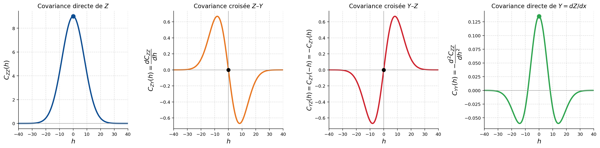

## Variables liées par un opérateur linéaire

Dans certains cas, la variable secondaire $Y$ est une transformation linéaire déterministe de la variable principale $Z$ : une dérivée, une intégrale, une combinaison linéaire. Il est alors inutile d'ajuster un modèle de covariance complet pour chaque variable. On part de la covariance de $Z$ et on lui applique l'opérateur; les covariances croisées suivent d'elles-mêmes.

### Principe général

Soit $L$ un opérateur linéaire appliqué à $Z$ (dérivée, intégrale, combinaison linéaire). Si la variable secondaire est définie par $Y(\mathbf{x}) = L[Z(\mathbf{x})]$, ses covariances croisée et directe se déduisent de celle de $Z$ :

$$
C_{ZY}(\mathbf{h}) = \operatorname{Cov}\big(Z(\mathbf{x}),\, L[Z(\mathbf{x}+\mathbf{h})]\big) = L\big[C_{ZZ}(\mathbf{h})\big]
$$

$$
C_{YY}(\mathbf{h}) = \operatorname{Cov}\big(L[Z(\mathbf{x})],\, L[Z(\mathbf{x}+\mathbf{h})]\big) = L \circ L\big[C_{ZZ}(\mathbf{h})\big]
$$

où l'opérateur $L$ agit sur la variable de séparation $\mathbf{h}$. Il suffit donc d'un modèle de covariance admissible pour $Z$ : les covariances croisées en découlent automatiquement, et l'admissibilité du modèle multivariable est garantie.

### Exemple en une dimension : $Y$ est la dérivée de $Z$

Supposons que la variable secondaire soit la dérivée spatiale de la variable principale, $Y(\mathbf{x}) = dZ(\mathbf{x})/dx$. Le cas se rencontre en géophysique, où la gravimétrie fournit une information liée à la dérivée du champ de densité. Les covariances s'écrivent alors :

$$
C_{ZY}(h) = \operatorname{Cov}\left(Z(\mathbf{x}), \frac{dZ(\mathbf{x}+h)}{d(x+h)}\right) = \frac{dC_{ZZ}(h)}{dh}
$$

$$
C_{YZ}(h) = \operatorname{Cov}\left(\frac{dZ(\mathbf{x})}{dx}, Z(\mathbf{x}+h)\right) = -\frac{dC_{ZZ}(h)}{dh} = -C_{ZY}(h)
$$

$$
C_{YY}(h) = \operatorname{Cov}\left(\frac{dZ(\mathbf{x})}{dx}, \frac{dZ(\mathbf{x}+h)}{d(x+h)}\right) = -\frac{d^2 C_{ZZ}(h)}{dh^2}
$$

Deux points méritent l'attention :

- La covariance croisée est antisymétrique, $C_{ZY}(h) = -C_{YZ}(h)$, donc $C_{ZY}(0) = 0$ (@fig-c10-cov-derivee). Autrement dit, $Z$ et sa dérivée ne sont pas corrélées au même point : la valeur d'une fonction en un point ne dit rien de sa pente locale.
- La covariance de la dérivée, $C_{YY}(h)$, est la dérivée seconde de $C_{ZZ}(h)$ changée de signe. Elle n'existe que si $C_{ZZ}(h)$ est deux fois dérivable, ce qui exclut les modèles à comportement linéaire à l'origine (sphérique, exponentiel). Le modèle gaussien, lui, est assez régulier.

{#fig-c10-cov-derivee fig-align="center" width="100%"}

### Extension aux dimensions supérieures

En deux ou trois dimensions, la variable secondaire peut être une dérivée partielle ou un gradient :

$$
Y_k(\mathbf{x}) = \frac{\partial Z(\mathbf{x})}{\partial x_k}
$$

Les covariances croisées s'obtiennent en dérivant $C_{ZZ}$ par rapport à la composante correspondante du vecteur de séparation $\mathbf{h}$. On traite de la même façon le cas où la variable secondaire est une intégrale de $Z$ sur un domaine : une mesure gravimétrique, par exemple, est une intégrale pondérée du champ de densité. Le principe ne change pas : on applique l'opérateur linéaire à la covariance de $Z$.

### Avantages de cette approche

Cette façon de faire a trois atouts. On garde un modèle cohérent entre variables, puisque toutes les covariances viennent du même modèle de départ. On évite d'ajuster séparément $C_{ZZ}$, $C_{ZY}$ et $C_{YY}$. Enfin, le lien entre variables reste ancré dans la physique du problème, plutôt que dans un ajustement purement statistique.

### Application : inversion gravimétrique

La gravimétrie en est l'exemple classique : les mesures gravimétriques en surface sont liées à la densité des roches en profondeur par une intégrale. Une fois la covariance du champ de densité modélisée, on en tire les covariances croisées avec les données gravimétriques. Ces données sont souvent bien plus nombreuses et moins coûteuses que les forages : elles servent alors de variable secondaire pour mieux estimer la densité en profondeur.
