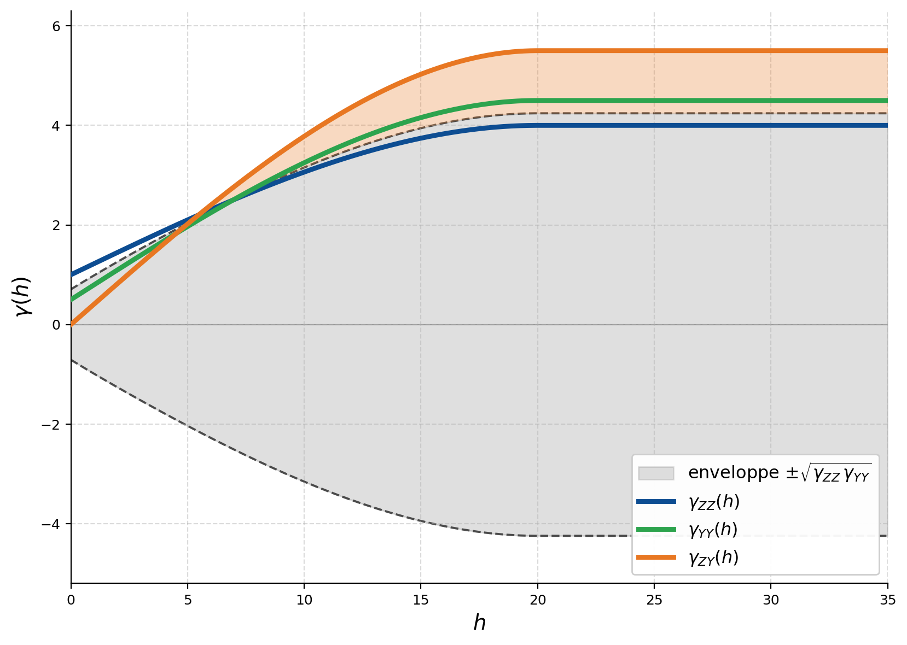
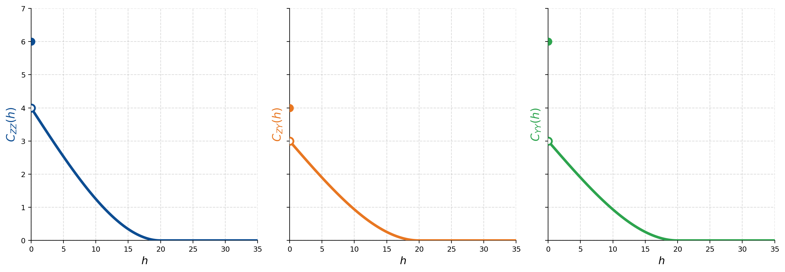

## Fonctions aléatoires multivariées

Le cokrigeage requiert un modèle de covariance pour chaque variable et les covariances croisées qui décrivent leurs liens. Ces fonctions ne se choisissent pas indépendamment : l'ensemble doit former un modèle admissible, dont la matrice de covariance reste valide pour toute configuration de points. Cette section pose les conditions d'un modèle multivariable admissible, présente les modèles utilisés en pratique, puis quelques propriétés importantes du cokrigeage.

### Conditions d'admissibilité

Les covariances directes et croisées ne se choisissent pas séparément : les fonctions $C_{ZZ}(h)$, $C_{YY}(h)$, $C_{ZY}(h)$ et $C_{YZ}(h)$ doivent former un tout cohérent. Concrètement, la matrice de covariance doit rester semi-définie positive, quelle que soit la position des points (@fig-c10-mlc-inadmissible). On vérifie cette condition dans le domaine spectral : pour chaque fréquence $\omega$, on forme la matrice des densités spectrales

$$
\mathbf{S}(\omega) =
\begin{pmatrix}
S_{ZZ}(\omega) & S_{ZY}(\omega) \\
S_{YZ}(\omega) & S_{YY}(\omega)
\end{pmatrix}
$$

Le modèle est admissible si cette matrice est semi-définie positive à toutes les fréquences, $\mathbf{S}(\omega) \succeq 0$, ce qui pour deux variables revient à

$$
|S_{ZY}(\omega)|^2 \leq S_{ZZ}(\omega)\,S_{YY}(\omega).
$$

La vérification est correcte en théorie, mais on ne l'applique presque jamais directement. Heureusement, certains modèles garantissent l'admissibilité par construction. En voici trois.

{#fig-c10-mlc-inadmissible fig-align="center" width="90%"}

### Modèle à covariances proportionnelles

Ici, toutes les fonctions de covariance sont proportionnelles à une même fonction de base $C(h)$ :

$$
\mathbf{C}(h) = \begin{bmatrix} C_{ZZ}(h) & C_{ZY}(h) \\ C_{YZ}(h) & C_{YY}(h) \end{bmatrix} = \mathbf{B} \, C(h)
$$

où $\mathbf{B}$ est la **matrice de corégionalisation**, symétrique et semi-définie positive ($\det \mathbf{B} \geq 0$), et $C(h)$ une fonction de covariance admissible. On l'appelle corégionalisation intrinsèque : elle revient à supposer que le lien entre variables reste le même à toutes les distances.

Un cas important est celui où les deux variables sont mesurées aux mêmes endroits. Le cokrigeage n'apporte alors rien de plus que le krigeage de la variable principale seule : on dit que la variable est autocrigeable. Si, en revanche, $Y$ est disponible ailleurs que $Z$, elle ajoute de l'information spatiale, et le cokrigeage peut améliorer l'estimation, pourvu que la corrélation entre $Z$ et $Y$ soit assez forte.

### Modèle linéaire de corégionalisation (MLC)

C'est le modèle multivariable le plus utilisé en géostatistique (@fig-c10-mlc-admissible). On décompose les fonctions de covariance en une somme de structures élémentaires partagées :

$$
\mathbf{C}(h) = \sum_{k=0}^{K} \mathbf{B}_k \, C_k(h)
$$

où chaque $C_k(h)$ est une fonction de covariance admissible de palier unitaire (effet de pépite, sphérique, exponentiel, gaussien, etc.) et chaque $\mathbf{B}_k$ une matrice $2 \times 2$ (dans le cas bivarié) de coefficients, symétrique et semi-définie positive.

Le modèle est admissible si et seulement si chaque matrice $\mathbf{B}_k$ est semi-définie positive, c'est-à-dire

$$
\det(\mathbf{B}_k) \geq 0 \quad \text{et} \quad \text{éléments diagonaux} \geq 0, \quad \forall \, k.
$$

Cette condition est facile à vérifier : c'est là tout l'intérêt du MLC. Si une matrice $\mathbf{B}_k$ n'est pas semi-définie positive, le modèle n'est pas nécessairement inadmissible (il faudrait alors une vérification spectrale complète); mais si c'est celle de l'effet de pépite qui échoue, le modèle est certainement inadmissible. Le MLC est très souple : chaque structure élémentaire $C_k(h)$ peut porter un effet différent (variabilité à courte portée, à longue portée), avec ses propres relations croisées à chaque échelle.

{#fig-c10-mlc-admissible fig-align="center" width="90%"}

> **Remarque.** Le modèle à covariances proportionnelles est un cas particulier du MLC à une seule structure ($K = 0$, sans effet de pépite, ou avec un effet de pépite proportionnel).

### Exemple de MLC et comparaison krigeage–cokrigeage

Déroulons un exemple complet : vérification de l'admissibilité, calcul de covariances, puis comparaison des performances du krigeage et du cokrigeage.

**Modèle.** On considère deux variables $Z$ et $Y$ décrites par le MLC suivant (effet de pépite et composante sphérique de portée 30) :

$$
\mathbf{C}(h) = \begin{bmatrix} 1 & 0 \\ 0 & 1 \end{bmatrix} \delta(h) + \begin{bmatrix} 2 & 2{,}4 \\ 2{,}4 & 4 \end{bmatrix} C_{\text{Sph}}(h;\,30)
$$

**Admissibilité.** On vérifie que chaque matrice $\mathbf{B}_k$ est semi-définie positive :

- $\mathbf{B}_0 = \begin{bmatrix} 1 & 0 \\ 0 & 1 \end{bmatrix}$ : $\det = 1 > 0$, admissible.
- $\mathbf{B}_1 = \begin{bmatrix} 2 & 2{,}4 \\ 2{,}4 & 4 \end{bmatrix}$ : $\det = 2 \times 4 - 2{,}4^2 = 2{,}24 > 0$, admissible.

Le modèle est donc un MLC admissible.

**Covariance croisée à $h = 10$.** À titre d'exemple :

$$
C_{ZY}(10) = 0 \cdot \delta(10) + 2{,}4 \times C_{\text{Sph}}(10;\,30) = 2{,}4 \times \left[1 - \frac{3}{2}\frac{10}{30} + \frac{1}{2}\left(\frac{10}{30}\right)^3\right] = 1{,}24
$$

**Corrélation globale.** À distance $h = 0$ :

$$
\rho_{ZY} = \frac{C_{ZY}(\mathbf{0})}{\sqrt{C_{ZZ}(\mathbf{0}) \, C_{YY}(\mathbf{0})}} = \frac{0 + 2{,}4}{\sqrt{(1+2)(1+4)}} = \frac{2{,}4}{\sqrt{15}} \approx 0{,}62
$$

Si l'on ne retient que le signal structuré (sans l'effet de pépite, vu comme du bruit de mesure), la corrélation monte à $\rho = 2{,}4 / \sqrt{2 \times 4} \approx 0{,}85$.

**Configuration de données.** On dispose de $Z_1$ et $Y_1$ en $\mathbf{x}_1 = 0$, de $Z_2$ en $\mathbf{x}_2 = 10$, et de $Y_0$ en $\mathbf{x}_0 = 5$. On estime $Z_0$ au point $\mathbf{x}_0 = 5$. Les moyennes sont supposées nulles.

### Ajustement d'un MLC

Ajuster un MLC, c'est déterminer les matrices $\mathbf{B}_k$ et les paramètres des structures $C_k(h)$ à partir des variogrammes et covariances croisés expérimentaux. La procédure typique :

1. calculer les variogrammes ou covariances directes et croisés expérimentaux;
2. choisir un ensemble de structures élémentaires (nombre, types, portées);
3. ajuster simultanément toutes les fonctions en optimisant les coefficients des matrices $\mathbf{B}_k$;
4. vérifier que chaque matrice $\mathbf{B}_k$ est semi-définie positive.

L'ajustement doit être mené simultanément sur toutes les fonctions : ajuster chaque variogramme séparément ne garantit pas l'admissibilité du modèle global.

### Comparaison krigeage–cokrigeage

Sur la configuration ci-dessus, par krigeage simple (avec seulement $Z_1$ et $Z_2$) :

$$
\lambda_1 = 0{,}3727, \quad \lambda_2 = 0{,}3727, \quad \sigma_{KS}^2 = 1{,}88
$$

Par cokrigeage simple (avec $Z_1$, $Z_2$, $Y_1$ et $Y_0$) :

$$
\lambda_{Z_1} = 0{,}2294, \quad \lambda_{Z_2} = 0{,}2336, \quad \alpha_{Y_1} = 0{,}0072, \quad \alpha_{Y_0} = 0{,}3085, \quad \sigma_{CS}^2 = 1{,}55
$$

On observe trois choses. La variable secondaire $Y_0$, posée pile au point à estimer, reçoit un poids important ($0{,}31$) : c'est l'effet d'écran transposé au cokrigeage, l'information la plus proche dominant. La symétrie des poids de $Z_1$ et $Z_2$, égaux en krigeage simple, est rompue, car $Y_1$ est colocalisé avec $Z_1$, pas avec $Z_2$. Enfin, la variance chute nettement, de $1{,}88$ (krigeage) à $1{,}55$ (cokrigeage), soit 18 % de mieux.

Par cokrigeage ordinaire, les contraintes $\sum \lambda_i = 1$ et $\sum \alpha_j = 0$ donnent :

$$
\lambda_{Z_1} = 0{,}5494, \quad \lambda_{Z_2} = 0{,}4506, \quad \alpha_{Y_1} = -0{,}1678, \quad \alpha_{Y_0} = 0{,}1678, \quad \sigma_{CO}^2 = 1{,}91
$$

La variance du cokrigeage ordinaire ($1{,}91$) dépasse à peine celle du krigeage ordinaire ($2{,}01$) : la contrainte $\sum \alpha_j = 0$ empêche la variable secondaire de contribuer pleinement. L'exemple illustre bien le changement de paradigme évoqué plus haut.

### Propriétés du cokrigeage

Le cokrigeage hérite de toutes les propriétés du krigeage (linéarité, absence de biais, variance minimale, interpolation exacte, effet d'écran, lissage). Il en gagne quelques-unes en propre.

**Variance toujours inférieure ou égale.** La variance de cokrigeage ne dépasse jamais celle du krigeage de $Z$ seul : ajouter de l'information ne peut qu'améliorer, ou maintenir, la précision.

**Linéarité des combinaisons estimées.** Estimer par cokrigeage une combinaison linéaire de variables (par exemple, épaisseur = sommet − base) donne le même résultat que la même combinaison appliquée aux estimations individuelles. Cette cohérence n'est pas vérifiée par le krigeage séparé de chaque variable.

> **Exemple.** Pour tracer le sommet et la base d'une formation, on peut estimer directement le sommet, la base et l'épaisseur. En krigeage séparé, (sommet estimé − base estimée) ne colle pas forcément à l'épaisseur estimée. En cokrigeage, les deux approches donnent exactement le même résultat.

**Cohérence avec les transformations linéaires.** Si l'on cokrige $Z$ et sa dérivée, la dérivée du cokrigeage de $Z$ égale le cokrigeage de la dérivée. C'est la généralisation de la propriété précédente.

**Autocrigeabilité dans le cas intrinsèque.** Si les covariances sont proportionnelles ($\mathbf{C}(h) = \mathbf{B}\, C(h)$, corégionalisation intrinsèque) et que les variables sont colocalisées (mêmes points, situation isotope), le cokrigeage se réduit exactement au krigeage : chaque variable est autocrigeable et le gain est nul. La condition exacte est un peu plus large que la proportionnalité de tout le modèle : il suffit que les covariances croisées avec la variable d'intérêt soient proportionnelles à sa covariance directe.

### Quand le cokrigeage est-il utile?

Le gain du cokrigeage sur le krigeage dépend de trois facteurs :

1. **La corrélation entre variables.** Une corrélation forte (typiquement $|\rho| > 0{,}5$, idéalement $> 0{,}7$) est nécessaire pour justifier l'effort.
2. **La différence de densité d'échantillonnage.** Le gain est maximal quand la variable secondaire est bien plus dense que la principale. Si les deux sont colocalisées, il est souvent négligeable.
3. **Le modèle de corégionalisation.** Avec des covariances proportionnelles et des données colocalisées, le gain est nul. Avec un MLC à plusieurs structures aux corrélations différentes, le gain potentiel grimpe.

En pratique, on compare krigeage et cokrigeage par validation croisée avant de se lancer dans une approche multivariable, nettement plus lourde à mettre en œuvre.

## 🧮 Atelier interactif 10.5 — Modèle linéaire de corégionalisation (MLC) {.unnumbered}

::: {.content-visible when-format="html"}
Le modèle s'écrit $\boldsymbol{\Gamma}(h) = \sum_k \mathbf{B}_k\,\gamma_k(h)$. Saisissez chaque matrice de corégionalisation $\mathbf{B}_k$ en forme matricielle ($B_{ZZ}$, $B_{ZY}$, $B_{YY}$; la cellule $B_{YZ}$ recopie $B_{ZY}$ pour la symétrie), ajoutez des structures imbriquées, et observez les variogrammes direct ($\gamma_{ZZ}$, $\gamma_{YY}$) et croisé ($\gamma_{ZY}$). L'exemple par défaut illustre une corrélation négative ($\gamma_{ZY} < 0$). Le variogramme croisé reste toujours dans l'enveloppe de Cauchy-Schwarz $|\gamma_{ZY}(h)| \le \sqrt{\gamma_{ZZ}(h)\,\gamma_{YY}(h)}$ (zone grisée) : c'est garanti dès que chaque $\mathbf{B}_k$ est semi-définie positive ($B_{ZY}^2 \le B_{ZZ}\,B_{YY}$).

:::

::: {.content-visible unless-format="html"}
Cet atelier interactif n'est disponible que dans la version web du chapitre.
:::

