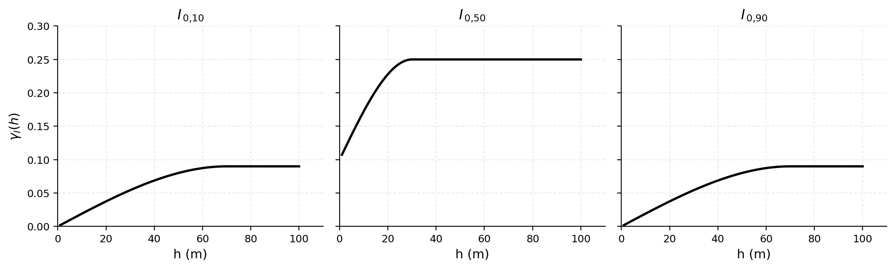
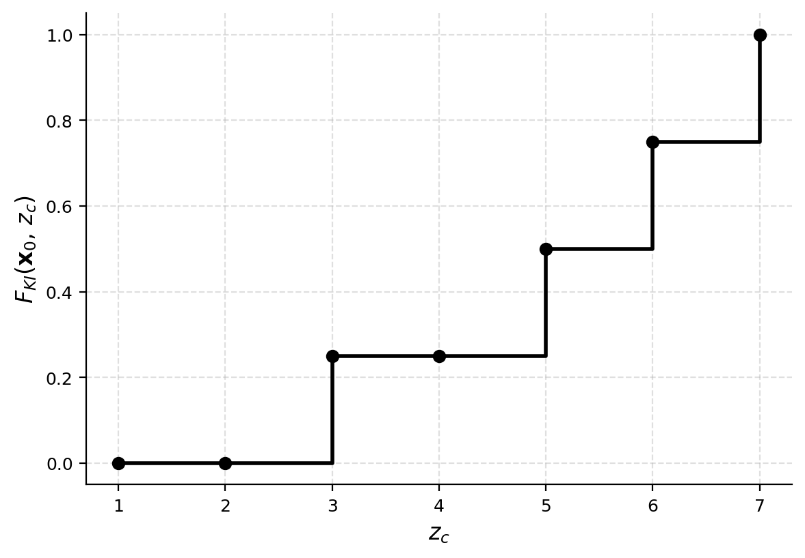

## Krigeage ordinaire d'indicatrices

Le krigeage fournit le meilleur estimateur linéaire sans biais d'une variable régionalisée, au sens où il minimise la variance de l'erreur d'estimation. Il ne correspond toutefois pas nécessairement à l'espérance conditionnelle, qui constitue l'estimateur optimal parmi toutes les fonctions possibles des données.

Le krigeage d'indicatrices consiste à appliquer ce principe à une variable binaire définie pour un seuil $z_c$. Pour un seuil fixé, on transforme $Z(\mathbf{x})$ en l'indicatrice suivante :

$$
I(\mathbf{x};z_c)=
\begin{cases}
1, & \text{si } Z(\mathbf{x}) \leq z_c, \\
0, & \text{si } Z(\mathbf{x}) > z_c.
\end{cases}
$$

Au point à estimer $\mathbf{x}_0$, l'espérance conditionnelle de cette indicatrice est exactement la probabilité recherchée :

$$
\mathbb{E}\left[I(\mathbf{x}_0;z_c)\mid \text{données}\right]
= \mathbb{P}\left(Z(\mathbf{x}_0)\leq z_c\mid \text{données}\right).
$$

Le krigeage d'indicatrices cherche donc à estimer cette probabilité à partir des indicatrices observées aux $n$ points d'échantillonnage :

$$
i(\mathbf{x}_i;z_c)=
\begin{cases}
1, & \text{si } Z(\mathbf{x}_i)\leq z_c, \\
0, & \text{si } Z(\mathbf{x}_i)>z_c.
\end{cases}
$$

Pour le krigeage ordinaire d'indicatrices, l'estimateur au point $\mathbf{x}_0$ s'écrit

$$
I^*(\mathbf{x}_0;z_c)
= \sum_{i=1}^{n}\lambda_i(z_c)\,i(\mathbf{x}_i;z_c),
$$

sous la contrainte

$$
\sum_{i=1}^{n}\lambda_i(z_c)=1.
$$

Les poids $\lambda_i(z_c)$ sont déterminés à partir du variogramme des indicatrices associé au seuil $z_c$. L'estimation obtenue est interprétée comme une estimation de la probabilité conditionnelle :

$$
I^*(\mathbf{x}_0;z_c)
\approx
\mathbb{P}\left(Z(\mathbf{x}_0)\leq z_c\mid \text{données}\right).
$$

Cette estimation demeure une approximation linéaire de l'espérance conditionnelle. Elle ne coïncide avec la probabilité conditionnelle exacte que dans les cas particuliers où cette probabilité est une fonction affine des indicatrices observées, la contrainte $\sum_i \lambda_i(z_c) = 1$ autorisant la reproduction du terme constant et assurant l'absence de biais.

### Procédure

Le KI se déroule en quatre étapes.

1. **Codage des observations.** Pour un seuil $z_c$, chaque observation $Z(\mathbf{x}_i)$ est transformée en une indicatrice : $I(\mathbf{x}_i; z_c)=1$ si $Z(\mathbf{x}_i)\leq z_c$, et $I(\mathbf{x}_i; z_c)=0$ sinon.

2. **Modélisation du variogramme d'indicatrices.** Pour le seuil $z_c$, on calcule le variogramme expérimental et on lui ajuste un modèle théorique admissible, qui décrit la continuité spatiale de la variable binaire $I(\mathbf{x}; z_c)$ (@fig-c11-variog-indicatrices).

3. **Krigeage de l'indicatrice.** L'indicatrice est krigée au point à estimer $\mathbf{x}_0$. La valeur obtenue, $I^*(\mathbf{x}_0; z_c)$, fournit une estimation de la probabilité conditionnelle $\mathbb{P}\left(Z(\mathbf{x}_0)\leq z_c \mid Z(\mathbf{x}_1),\ldots,Z(\mathbf{x}_n) \right)$.

4. **Répétition pour plusieurs seuils.** La procédure est répétée pour une série de seuils ordonnés $z_{c,1}<z_{c,2}<\cdots<z_{c,K}$. Les probabilités estimées à ces seuils construisent une approximation discrète de la fonction de répartition conditionnelle locale, notée $\widehat{F}_{KI}(\mathbf{x}_0; z)$.

{#fig-c11-variog-indicatrices fig-align="center" width="100%"}

### Calcul des quantités

Kriger l'indicatrice au seuil $z_c$ revient exactement à estimer la fonction de répartition conditionnelle à ce seuil. En notant $\mathcal{D}$ l'ensemble des données disponibles,

$$
\widehat{F}_{KI}(\mathbf{x}_0;z_{c,k})
= I^*(\mathbf{x}_0;z_{c,k})
\approx
\mathbb{P}\left(Z(\mathbf{x}_0)\leq z_{c,k}\mid \mathcal{D}\right),
$$

où le chapeau marque une quantité estimée et l'étoile de $I^*$ l'estimateur de krigeage dont elle provient. La probabilité conditionnelle de dépassement d'un seuil $z_c$ s'obtient par complémentarité :

$$
\widehat{\mathbb{P}}\left(Z(\mathbf{x}_0)>z_c\mid \mathcal{D}\right)
= 1-\widehat{F}_{KI}(\mathbf{x}_0;z_c).
$$

Le quantile conditionnel estimé d'ordre $p$ est défini par

$$
\widehat{q}_p(\mathbf{x}_0)
= \inf\left\{ z: \widehat{F}_{KI}(\mathbf{x}_0;z)\geq p \right\}.
$$

Après interpolation entre les seuils et modélisation des queues de distribution, l'espérance conditionnelle s'estime à partir de la fonction de répartition :

$$
\widehat{\mathbb{E}}_{KI}\left[Z(\mathbf{x}_0)\right]
= \int_{-\infty}^{+\infty} z\,\mathrm{d}\widehat{F}_{KI}(\mathbf{x}_0;z),
$$

et la variance conditionnelle par

$$
\widehat{\operatorname{Var}}_{KI}\left[Z(\mathbf{x}_0)\right]
= \int_{-\infty}^{+\infty} z^2\,\mathrm{d}\widehat{F}_{KI}(\mathbf{x}_0;z)
- \left( \int_{-\infty}^{+\infty} z\,\mathrm{d}\widehat{F}_{KI}(\mathbf{x}_0;z) \right)^2.
$$

En pratique, la fonction de répartition n'étant estimée qu'en un nombre fini de seuils, ces intégrales sont évaluées numériquement. En notant

$$
\widehat{p}_k(\mathbf{x}_0)
= \widehat{F}_{KI}(\mathbf{x}_0;z_{c,k}) - \widehat{F}_{KI}(\mathbf{x}_0;z_{c,k-1})
$$

la probabilité estimée de l'intervalle $]z_{c,k-1},z_{c,k}]$, l'espérance s'approxime par

$$
\widehat{\mathbb{E}}_{KI}\left[Z(\mathbf{x}_0)\right]
\approx
\sum_{k=1}^{K} \widetilde{z}_k\,\widehat{p}_k(\mathbf{x}_0),
$$

où $\widetilde{z}_k$ est une valeur représentative de l'intervalle, par exemple son centre. La variance s'approxime alors par

$$
\widehat{\operatorname{Var}}_{KI}\left[Z(\mathbf{x}_0)\right]
\approx
\sum_{k=1}^{K} \widetilde{z}_k^2\,\widehat{p}_k(\mathbf{x}_0)
- \left[ \sum_{k=1}^{K} \widetilde{z}_k\,\widehat{p}_k(\mathbf{x}_0) \right]^2.
$$

### Exemple de calcul

On considère quatre valeurs observées $Z_1, \ldots, Z_4$ aux positions $\mathbf{x}_1, \ldots, \mathbf{x}_4$, formant un rectangle. On veut un krigeage d'indicatrices au point $\mathbf{x}_0$, situé au centre :

| | | |
|:----------------:|:--------:|:---------------:|
| $Z_1 = 2{,}2$ | | $Z_2 = 5{,}1$ |
| | $\mathbf{x}_0$ | |
| $Z_3 = 6{,}4$ | | $Z_4 = 4{,}7$ |

On choisit les seuils $z_c = 1, 2, 3, 4, 5, 6, 7$. Par symétrie, le krigeage ordinaire donne les poids $\lambda_i = \tfrac{1}{4}$ pour tout $i$ et tout $z_c$. Le krigeage d'indicatrices donne alors $I^*(\mathbf{x}_0; z_c) = \sum_{i=1}^4 \tfrac{1}{4} I(\mathbf{x}_i; z_c)$ :

| $z_c$ | $I(\mathbf{x}_1; z_c)$ | $I(\mathbf{x}_2; z_c)$ | $I(\mathbf{x}_3; z_c)$ | $I(\mathbf{x}_4; z_c)$ | $I^*(\mathbf{x}_0; z_c) = \widehat{F}_{KI}(z_c)$ |
|:---:|:---:|:---:|:---:|:---:|:---:|
| 1 | 0 | 0 | 0 | 0 | 0 |
| 2 | 0 | 0 | 0 | 0 | 0 |
| 3 | 1 | 0 | 0 | 0 | 0,25 |
| 4 | 1 | 0 | 0 | 0 | 0,25 |
| 5 | 1 | 0 | 0 | 1 | 0,50 |
| 6 | 1 | 1 | 0 | 1 | 0,75 |
| 7 | 1 | 1 | 1 | 1 | 1 |

Cette table est une approximation discrète de la fonction de répartition conditionnelle $\widehat{F}_{KI}(\mathbf{x}_0; z_c) \approx \mathbb{P}(Z(\mathbf{x}_0) \leq z_c)$. La @fig-C11_KI la présente sous forme de graphique.

{#fig-C11_KI}

#### 1. Probabilités de dépassement

La probabilité estimée que $Z$ dépasse un seuil est $\widehat{\mathbb{P}}(Z_0 > z_c) = 1 - \widehat{F}_{KI}(\mathbf{x}_0; z_c)$.

Pour $z_c = 3{,}5$, la fonction de répartition est constante entre les seuils 3 et 4 ($\widehat{F}_{KI}(3) = \widehat{F}_{KI}(4) = 0{,}25$), donc par interpolation $\widehat{F}_{KI}(3{,}5) = 0{,}25$, et $\widehat{\mathbb{P}}(Z_0 > 3{,}5) = 1 - 0{,}25 = 0{,}75$.

Pour $z_c = 4{,}3$, on interpole linéairement entre les seuils 4 et 5 :

$$
\widehat{F}_{KI}(\mathbf{x}_0; 4{,}3) = 0{,}25 + \frac{4{,}3 - 4}{5 - 4}(0{,}50 - 0{,}25) = 0{,}25 + 0{,}3 \times 0{,}25 = 0{,}325,
$$

d'où $\widehat{\mathbb{P}}(Z_0 > 4{,}3) = 1 - 0{,}325 = 0{,}675$.

#### 2. Médiane et percentiles

La médiane estimée $\widehat{q}_{0{,}5}$ satisfait $\widehat{F}_{KI}(\mathbf{x}_0; \widehat{q}_{0{,}5}) = 0{,}5$. Comme $\widehat{F}_{KI}(\mathbf{x}_0; 5) = 0{,}5$, la médiane est $\widehat{q}_{0{,}5} = 5$. Pour le 65e percentile, on cherche $z$ tel que $\widehat{F}_{KI}(\mathbf{x}_0; z) = 0{,}65$, ce qui tombe entre les seuils 5 ($\widehat{F}_{KI} = 0{,}50$) et 6 ($\widehat{F}_{KI} = 0{,}75$) :

$$
\widehat{q}_{0{,}65} = 5 + \frac{0{,}65 - 0{,}50}{0{,}75 - 0{,}50}(6 - 5) = 5{,}6.
$$

#### 3. Espérance conditionnelle

La fonction de répartition discrétisée définit des classes de valeurs, chacune de probabilité estimée $\widehat{p}_k = \widehat{F}_{KI}(z_{c,k}) - \widehat{F}_{KI}(z_{c,k-1})$ et de milieu $m_k$ (la valeur représentative $\widetilde{z}_k$ des formules précédentes) :

| Classe $k$ | Intervalle | Milieu $m_k$ | $\widehat{F}_{KI}(z_{c,k-1})$ | $\widehat{F}_{KI}(z_{c,k})$ | $\widehat{p}_k$ |
|:---:|:---:|:---:|:---:|:---:|:---:|
| 1 | $(-\infty, 1]$ | 0,5 | 0 | 0 | 0 |
| 2 | $(1, 2]$ | 1,5 | 0 | 0 | 0 |
| 3 | $(2, 3]$ | 2,5 | 0 | 0,25 | 0,25 |
| 4 | $(3, 4]$ | 3,5 | 0,25 | 0,25 | 0 |
| 5 | $(4, 5]$ | 4,5 | 0,25 | 0,50 | 0,25 |
| 6 | $(5, 6]$ | 5,5 | 0,50 | 0,75 | 0,25 |
| 7 | $(6, 7]$ | 6,5 | 0,75 | 1 | 0,25 |

L'espérance conditionnelle estimée est

$$
\widehat{\mathbb{E}}_{KI}[Z_0] = \sum_{k=1}^{7} \widehat{p}_k \, m_k = 0{,}25 \times 2{,}5 + 0 \times 3{,}5 + 0{,}25 \times 4{,}5 + 0{,}25 \times 5{,}5 + 0{,}25 \times 6{,}5 = 4{,}75.
$$

À titre de comparaison, le krigeage ordinaire direct de la teneur donnerait $Z_0^* = \tfrac{1}{4}(2{,}2 + 5{,}1 + 6{,}4 + 4{,}7) = 4{,}6$. L'écart vient de ce que le KI interpole la distribution de façon non linéaire.

> **Remarque.** Le choix de la valeur représentative de la dernière classe (ici $m_7 = 6{,}5$) influence l'espérance. En pratique, on prend la valeur maximale des données ou la borne supérieure de la dernière classe.

#### 4. Variance conditionnelle

$$
\widehat{\mathbb{E}}_{KI}[Z_0^2] = \sum_{k} \widehat{p}_k \, m_k^2 = 0{,}25\,(2{,}5^2 + 4{,}5^2 + 5{,}5^2 + 6{,}5^2) = 24{,}75
$$

$$
\widehat{\operatorname{Var}}_{KI}[Z_0] = 24{,}75 - (4{,}75)^2 = 24{,}75 - 22{,}5625 = 2{,}1875
$$

#### 5. Espérance associée à un coût

Pour une fonction de coût $C(Z) = Z^2$, on a $\widehat{\mathbb{E}}[C(Z_0)] = \sum_k \widehat{p}_k \, C(m_k) = \widehat{\mathbb{E}}_{KI}[Z_0^2] = 24{,}75$.

### Considérations théoriques et pratiques

Le codage binaire entraîne une perte d'information : pour un seuil donné, deux valeurs situées du même côté du seuil reçoivent la même indicatrice, quelle que soit leur distance à celui-ci. Le cokrigeage simultané des indicatrices de tous les seuils tiendrait compte de leurs dépendances croisées et compenserait en partie cette perte, mais la modélisation de tous les variogrammes directs et croisés devient vite trop lourde en pratique.

Les variogrammes d'indicatrices sont peu sensibles à l'amplitude des valeurs extrêmes, puisque les données sont ramenées à 0 ou 1. Leur estimation peut toutefois devenir instable aux seuils extrêmes, lorsque très peu d'observations tombent dans l'une des deux classes. De plus, tous les modèles admissibles pour une variable continue ne le sont pas pour une indicatrice : le modèle gaussien, en particulier, est à éviter pour les variogrammes d'indicatrices.

En pratique, on utilise souvent de 5 à 10 seuils. Des quantiles comme les déciles répartissent les observations de façon relativement équilibrée entre les classes, mais le choix doit tenir compte de la taille de l'échantillon, de la forme de la distribution et des valeurs critiques du problème. Les quantiles très faibles ou très élevés sont à manier avec prudence, le faible effectif d'une classe rendant le variogramme difficile à estimer.

Un atout majeur du KI est sa souplesse structurale : chaque seuil peut recevoir une continuité spatiale propre — portée, anisotropie, effet de pépite —, ce qui permet de représenter une organisation différente pour les faibles et les fortes teneurs. Les modèles des différents seuils doivent néanmoins rester cohérents entre eux, pour limiter les violations des relations d'ordre.

C'est là le dernier point, et le plus contraignant. La fonction de répartition estimée doit rester bornée,

$$0 \leq \widehat{F}_{KI}(\mathbf{x}_0;z_c) \leq 1,$$

et non décroissante : pour $z_{c,k}<z_{c,k+1}$,

$$\widehat{F}_{KI}(\mathbf{x}_0;z_{c,k}) \leq \widehat{F}_{KI}(\mathbf{x}_0;z_{c,k+1}).$$

Or le krigeage se fait seuil par seuil, indépendamment : les probabilités krigées peuvent sortir de $[0,1]$ ou violer la monotonie, à cause de poids négatifs ou de variogrammes incompatibles d'un seuil à l'autre. Ces anomalies doivent être corrigées a posteriori.

