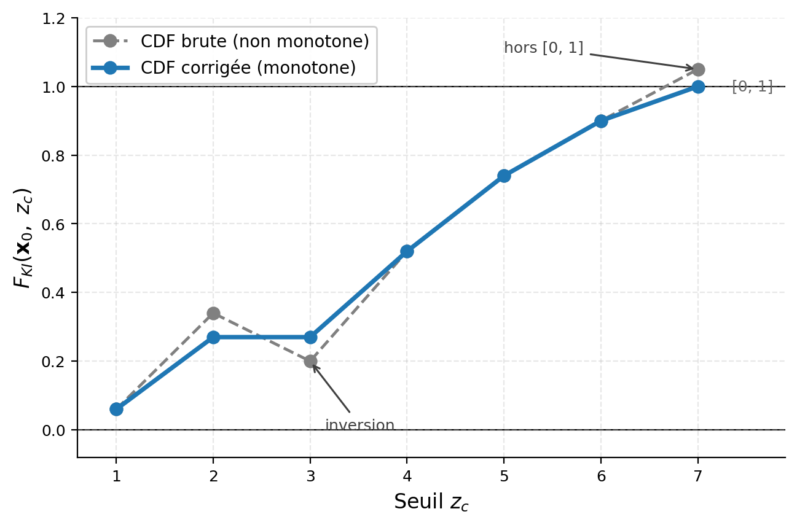
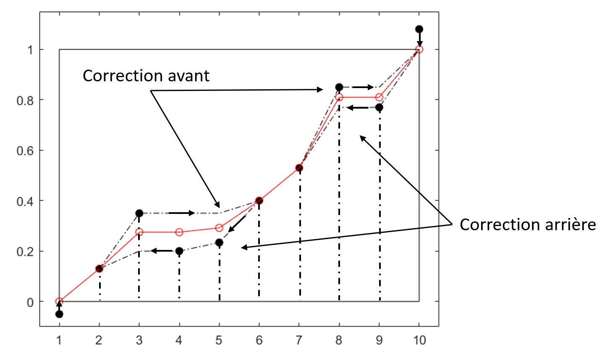

## Problèmes de relation d'ordre

Rien ne garantit que le krigeage d'indicatrices produise une fonction de répartition strictement croissante et bornée sur $[0,1]$. La fonction estimée $\widehat{F}_{KI}(\mathbf{x}_0; z)$ doit pourtant rester entre 0 et 1 ($0 \leq \widehat{F}_{KI} \leq 1$) et croître avec le seuil ($\widehat{F}_{KI}(\mathbf{x}_0; z) \leq \widehat{F}_{KI}(\mathbf{x}_0; z')$ si $z \leq z'$).

Il faut donc vérifier, avant tout calcul, que $\widehat{F}_{KI}(\mathbf{x}_0; z)$ respecte ces contraintes. En pratique, on utilise souvent l'heuristique simple décrite ci-dessous. La @fig-C11_RelationOrdre montre une violation marquée de ces propriétés.

{#fig-C11_RelationOrdre}

### Correction par moyenne des balayages croissant et décroissant

Cette heuristique régularise la fonction estimée en quatre étapes.

1. **Troncature des bornes.** On ramène à 0 les valeurs négatives de $\widehat{F}_{KI}(\mathbf{x}_0; z_c)$ et à 1 celles qui dépassent 1.

2. **Balayage vers l'avant.** Pour des seuils ordonnés $z_{c,1} < z_{c,2} < \cdots < z_{c,p}$ :

$$
\widehat{F}_{KI,\text{avant}}(\mathbf{x}_0; z_{c,1}) = \max\big(0,\, \widehat{F}_{KI}(\mathbf{x}_0; z_{c,1})\big),
$$

puis, pour $i = 2, \ldots, p$ :

$$
\widehat{F}_{KI,\text{avant}}(\mathbf{x}_0; z_{c,i}) = \max\big(\widehat{F}_{KI,\text{avant}}(\mathbf{x}_0; z_{c,i-1}),\, \widehat{F}_{KI}(\mathbf{x}_0; z_{c,i})\big).
$$

3. **Balayage vers l'arrière**, en partant du seuil le plus élevé :

$$
\widehat{F}_{KI,\text{arr}}(\mathbf{x}_0; z_{c,p}) = \min\big(1,\, \widehat{F}_{KI}(\mathbf{x}_0; z_{c,p})\big),
$$

puis, pour $i = p-1, \ldots, 1$ :

$$
\widehat{F}_{KI,\text{arr}}(\mathbf{x}_0; z_{c,i}) = \min\big(\widehat{F}_{KI}(\mathbf{x}_0; z_{c,i}),\, \widehat{F}_{KI,\text{arr}}(\mathbf{x}_0; z_{c,i+1})\big).
$$

4. **Moyenne des deux balayages.** La fonction corrigée finale est la moyenne arithmétique :

$$
\widehat{F}_{KI,\text{corr}}(\mathbf{x}_0; z_{c,i}) = \tfrac{1}{2} \big( \widehat{F}_{KI,\text{avant}}(\mathbf{x}_0; z_{c,i}) + \widehat{F}_{KI,\text{arr}}(\mathbf{x}_0; z_{c,i}) \big).
$$

La moyenne de deux suites non décroissantes l'est aussi : la fonction corrigée est donc bien monotone et comprise dans $[0, 1]$.

### Exemple de correction

Le tableau suivant applique ces corrections à une série présentant des anomalies de monotonie et de bornage :

| Seuil $z_c$ | $\widehat{F}_{KI}(\mathbf{x}_0; z_c)$ | $\widehat{F}_{KI,\text{avant}}$ | $\widehat{F}_{KI,\text{arr}}$ | $\widehat{F}_{KI,\text{corr}}$ |
|:---:|:---:|:---:|:---:|:---:|
| 1 | 0,00 | 0,00 | 0,00 | 0,00 |
| 2 | 0,13 | 0,13 | 0,13 | 0,13 |
| 3 | 0,24 | 0,24 | 0,234 | 0,237 |
| 4 | 0,238 | 0,24 | 0,234 | 0,237 |
| 5 | 0,234 | 0,24 | 0,234 | 0,237 |
| 6 | 0,237 | 0,24 | 0,237 | 0,2385 |
| 7 | 0,53 | 0,53 | 0,53 | 0,53 |
| 8 | 0,79 | 0,79 | 0,77 | 0,78 |
| 9 | 0,77 | 0,79 | 0,77 | 0,78 |
| 10 | 1,00 | 1,00 | 1,00 | 1,00 |

### Analyse visuelle

La @fig-C11_RelationOrdre_Correction illustre l'effet de ces ajustements. Le balayage avant impose une fonction croissante en remplaçant chaque valeur par le maximum rencontré jusqu'à présent; le balayage arrière fait l'inverse, en partant du seuil maximal. La moyenne des deux donne une fonction de répartition qui respecte à la fois les bornes $[0, 1]$ et la monotonie.

{#fig-C11_RelationOrdre_Correction}

## 🧮 Atelier interactif 11.2 — Correction de la relation d'ordre {.unnumbered}

::: {.content-visible when-format="html"}
Le KI krige chaque seuil indépendamment : la fonction de répartition locale brute (points noirs) peut sortir de $[0, 1]$ ou décroître. Observez la correction par moyenne des deux balayages, étape par étape : le balayage avant (montée, en rouge, flèches ↑) impose une fonction non décroissante du bas vers le haut; le balayage arrière (descente, en vert, flèches ↓) du haut vers le bas; la fonction corrigée (bleu) est la moyenne des deux, monotone et dans $[0, 1]$. Augmentez le « désordre » pour exagérer les violations.

:::
::: {.content-visible unless-format="html"}
Cet atelier n'est disponible que dans la version web.
:::