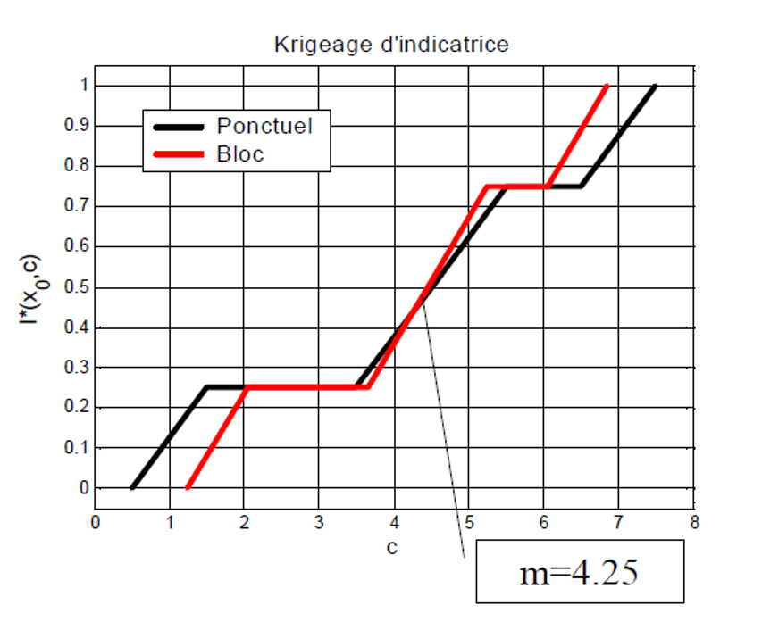

## Modèles de changement de support

Les décisions se prennent presque toujours sur un support différent de celui des données. Or, la fonction estimée $\widehat{F}_{KI}$ ne s'étend jusqu'ici que sur le support ponctuel des observations.

Prenons une mine. La probabilité qu'un bloc de 125 m³ atteigne une teneur de coupure n'est pas la même que pour une carotte de 1 m. La variance varie selon le support, donc les fonctions de répartition aussi. Il faut donc corriger $\widehat{F}_{KI}$ pour tenir compte du changement de support.

Une erreur classique consiste à remplacer le krigeage ponctuel du KI par un krigeage de bloc. Mais $I^*(\mathbf{x}_0; z_c)$ estime la probabilité *moyenne* que les points du bloc soient sous $z_c$, et non la probabilité que la *moyenne* du bloc soit sous $z_c$. La distinction est fondamentale : la probabilité n'est pas un opérateur linéaire de la moyenne, pas plus que le logarithme ne l'est ($\log(\text{moyenne}) \neq \text{moyenne des } \log$).

### Correction affine

La correction affine, la plus utilisée avec le KI, suppose que la distribution des blocs est celle des points, à une contraction près. Cette contraction est le rapport des écarts-types des blocs et des points :

$$
\widehat{F}_{Z_v}(z) = \widehat{F}_Z \left( m + \frac{z - m}{\sqrt{\dfrac{D^2(v \mid G)}{D^2(\cdot \mid G)}}} \right)
$$

où $m = \widehat{\mathbb{E}}_{KI}[Z_0]$ est la moyenne locale estimée par KI au support ponctuel, $D^2(v \mid G)$ la variance de dispersion au support du bloc, et $D^2(\cdot \mid G)$ celle au support ponctuel. Ici $\widehat{F}_Z$ est la fonction de répartition estimée au support ponctuel (le $\widehat{F}_{KI}$ des sections précédentes) et $\widehat{F}_{Z_v}$ son homologue au support du bloc.

### Exemple numérique

On reprend une distribution conditionnelle estimée par KI d'espérance $m = 6{,}33$, avec un rapport de variances $D^2(v \mid G)/D^2(\cdot \mid G) = 0{,}8$. On cherche la probabilité que le bloc dépasse 9. Le seuil ponctuel équivalent est :

$$
z_c' = \frac{1}{\sqrt{0{,}8}} (9 - 6{,}33) + 6{,}33 \approx 9{,}31.
$$

La probabilité de dépasser ce seuil au point vaut alors $\widehat{\mathbb{P}}(Z_v > 9) = 1 - (0{,}78 + 0{,}31 \times (1 - 0{,}78)) = 0{,}15$. La probabilité ponctuelle de dépasser 9, elle, est plus élevée : $\widehat{\mathbb{P}}(Z > 9) = 1 - 0{,}78 = 0{,}22$. Le bloc, plus lissé, dépasse le seuil moins souvent que le point.

### Limitations et remarques

La correction affine ne tient pas pour des changements de support trop importants. On la réserve aux cas où le rapport $D^2(v \mid G)/D^2(\cdot \mid G)$ reste de l'ordre de 0,7 ou plus. Au-delà, la forme de l'histogramme se déforme trop et la méthode perd en validité. La @fig-C11_CorrectionAfine montre son effet sur la fonction de répartition : l'écart entre la courbe noire et la courbe rouge n'est qu'une contraction d'amplitude, proportionnelle au rapport des variances.

Une mise en garde s'impose lorsqu'on applique la correction affine localement, en remplaçant le rapport global par le rapport local propre à chaque bloc. Il a été montré que le coefficient global est en moyenne supérieur au coefficient local : la distribution des teneurs de blocs paraît alors plus sélective qu'elle ne l'est, ce qui biaise l'évaluation des ressources récupérables. Plus fondamentalement, une méthode non paramétrique comme le KI ne reproduit pas, à elle seule, un changement de support, ce qui nécessite de modéliser explicitement les distributions bivariées.

La méthode ne convient pas non plus lorsque les blocs sont trop grands par rapport à la structure spatiale : le théorème central limite tire alors l'histogramme local vers la normale. Pour ces changements de support délicats, mieux vaut recourir à des simulations géostatistiques ponctuelles conditionnelles : en les agrégeant à l'échelle des blocs, on estime directement la fonction de répartition des supports volumétriques.

{#fig-C11_CorrectionAfine}

La correction affine reste malgré tout une solution simple et robuste pour adapter le KI aux cas où support d'observation et support d'estimation diffèrent.

## 🧮 Atelier interactif 11.3 — Changement de support affine {.unnumbered}

::: {.content-visible when-format="html"}
$Z_v = m + \sqrt{f}\,(Z_{\text{pt}} - m)$ avec $f = \operatorname{Var}(Z_v)/\operatorname{Var}(Z_{\text{pt}})$. La fonction de répartition du bloc est plus resserrée que celle des points (les queues sont atténuées).

:::
::: {.content-visible unless-format="html"}
Cet atelier n'est disponible que dans la version web.
:::