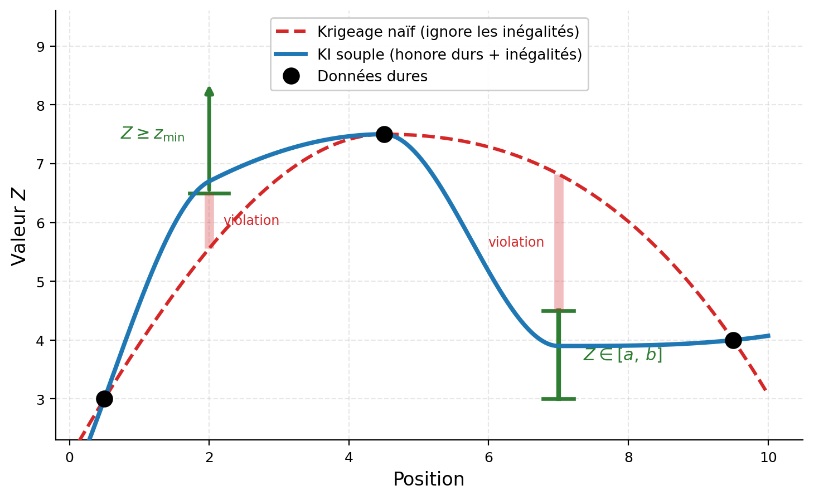
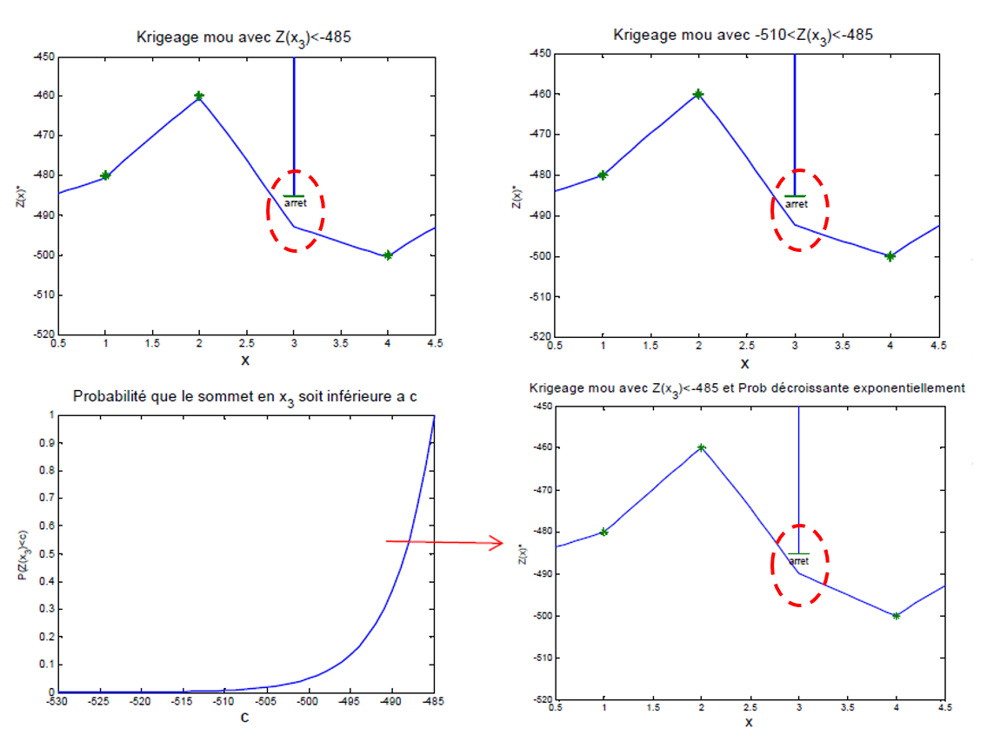

## Krigeage avec données d'inégalité, mesures bruitées et données souples

Un avantage important du krigeage d'indicatrices est sa capacité à intégrer des informations qui ne prennent pas nécessairement la forme d'une valeur exacte de $Z(\mathbf{x})$. Selon la nature des observations, on distingue les données d'inégalité, les mesures directes entachées d'une erreur et les données souples issues d'une source d'information indirecte.

Dans chaque cas, l'information est traitée au niveau des indicatrices associées aux différents seuils. Certaines indicatrices sont connues avec exactitude, tandis que d'autres demeurent inconnues ou sont remplacées par des probabilités comprises entre 0 et 1.

### Données d'inégalité

Une donnée d'inégalité ne fournit pas la valeur exacte de $Z(\mathbf{x}_i)$, mais impose une borne ou un intervalle. Par exemple, un forage réalisé jusqu'à 100 m sans rencontrer un contact géologique indique que la profondeur de ce contact est supérieure à 100 m :

$$
Z(\mathbf{x}_i)>100\text{ m}.
$$

Cette information est difficile à intégrer directement dans les formulations standards du krigeage ordinaire ou du krigeage simple, qui attendent une valeur numérique à chaque point. Le krigeage d'indicatrices permet toutefois d'utiliser la partie connue pour chacun des seuils.

De manière générale, supposons que l'on connaisse seulement l'intervalle :

$$
a_i<Z(\mathbf{x}_i)\leq b_i.
$$

Pour l'indicatrice définie par

$$
I(\mathbf{x};z_c)=
\begin{cases}
1 & \text{si } Z(\mathbf{x})\leq z_c, \\
0 & \text{si } Z(\mathbf{x})>z_c,
\end{cases}
$$

le codage est alors :

- $I(\mathbf{x}_i;z_c)=0$ lorsque $z_c\leq a_i$;
- $I(\mathbf{x}_i;z_c)=1$ lorsque $z_c\geq b_i$;
- $I(\mathbf{x}_i;z_c)$ demeure inconnu lorsque $a_i<z_c<b_i$.

Ainsi, la donnée d'inégalité fournit une information exacte pour certains seuils, mais aucune information pour les seuils situés à l'intérieur de l'intervalle d'incertitude.

Considérons, par exemple, la cartographie de la profondeur du toit d'un réservoir pétrolier. Les forages étant coûteux, les données sont rares. Certains forages peuvent être abandonnés après plusieurs centaines de mètres sans avoir atteint le toit du réservoir. Une estimation par krigeage ordinaire peut alors contredire cette information partielle en plaçant le toit à une profondeur inférieure à celle déjà forée sans rencontre, comme l'illustre la @fig-C11_SoftKriging.

Supposons que l'on sache que :

$$
Z(\mathbf{x}_i)>500\text{ m}.
$$

Pour tout seuil $z_c\leq500$ m, on peut coder :

$$
I(\mathbf{x}_i;z_c)=0,
$$

puisque la profondeur réelle est nécessairement supérieure au seuil. Pour les seuils $z_c>500$ m, l'information disponible ne permet plus de déterminer l'indicatrice, qui demeure alors inconnue.

Si quatre forages sont disponibles, dont un fournit uniquement cette inégalité, le krigeage utilise donc quatre indicatrices pour les seuils $z_c\leq500$ m, mais seulement les trois données exactes pour les seuils $z_c>500$ m. L'ensemble des données de conditionnement varie d'un seuil à l'autre.

Dans le cadran supérieur droit de la @fig-C11_SoftKriging_Result, la fonction de répartition estimée ne place plus de probabilité sous la profondeur minimale imposée au droit du forage. L'espérance reconstruite respecte donc la contrainte d'inégalité.

{#fig-C11_SoftKriging}

### Mesures incertaines ou bruitées

Une mesure bruitée fournit une observation directe de la variable, mais cette observation n'est pas considérée comme parfaitement exacte. On peut écrire :

$$
Y_i=Z(\mathbf{x}_i)+\varepsilon_i,
$$

où $Y_i$ est la valeur mesurée et $\varepsilon_i$ représente l'erreur de mesure.

Plutôt que de coder l'indicatrice uniquement à partir de la valeur observée $Y_i$, on décrit la valeur réelle par une distribution conditionnelle locale :

$$
G_i(z)=\mathbb{P}\left(Z(\mathbf{x}_i)\leq z\mid Y_i=y_i\right).
$$

Pour chaque seuil $z_c$, la valeur d'indicatrice associée à la mesure incertaine devient alors une probabilité :

$$
q_i(z_c)
= \mathbb{E}\left[I(\mathbf{x}_i;z_c)\mid Y_i=y_i\right]
= G_i(z_c).
$$

Contrairement à une indicatrice dure, qui vaut nécessairement 0 ou 1, cette indicatrice probabiliste peut prendre toute valeur dans l'intervalle $[0,1]$.

Par exemple, supposons que l'incertitude de mesure soit représentée par le modèle local :

$$
Z(\mathbf{x}_i)\mid Y_i=y_i\sim\mathcal{N}(y_i,\tau_i^2),
$$

où $\tau_i$ est l'écart-type associé à l'erreur de mesure. La probabilité d'indicatrice est alors :

$$
q_i(z_c)=\Phi\left(\frac{z_c-y_i}{\tau_i}\right),
$$

où $\Phi$ désigne la fonction de répartition de la loi normale centrée réduite.

Lorsque $\tau_i$ est faible, la fonction $q_i(z_c)$ se rapproche de l'indicatrice en escalier d'une donnée exacte. Lorsque $\tau_i$ augmente, la transition de 0 à 1 devient plus progressive, ce qui traduit une incertitude accrue quant à la valeur réelle.

Une mesure bruitée est donc une observation directe de $Z$, mais son codage tient compte d'un modèle explicite de l'erreur de mesure.

### Données souples

Les données souples proviennent généralement d'une source indirecte, comme un levé sismique, une mesure géophysique, une interprétation géologique, une estimation issue d'un autre modèle ou un jugement d'expert. Elles n'observent pas directement $Z(\mathbf{x}_i)$, mais fournissent une information probabiliste sur sa valeur.

Dans l'exemple du réservoir pétrolier, les données sismiques peuvent fournir une estimation approximative de la profondeur du toit. À partir d'une calibration entre les données sismiques et les profondeurs observées dans les forages, on construit une fonction de répartition locale :

$$
G_i(z\mid S_i)
= \mathbb{P}\left(Z(\mathbf{x}_i)\leq z\mid S_i\right),
$$

où $S_i$ représente l'information sismique disponible au point $\mathbf{x}_i$.

Pour chaque seuil $z_c$, la donnée souple fournit alors la probabilité :

$$
q_i(z_c)=G_i(z_c\mid S_i).
$$

Les données souples et les mesures bruitées conduisent donc toutes deux à des indicatrices probabilistes. La distinction porte sur l'origine de l'incertitude : dans le premier cas, l'information provient d'une variable secondaire ou d'une interprétation indirecte; dans le second, on dispose d'une mesure directe de $Z$ entachée d'une erreur.

Ces probabilités ne doivent pas être traitées comme des observations dures. Elles constituent des informations locales dont la combinaison avec les indicatrices exactes doit tenir compte de leur fiabilité et de leur relation avec la variable étudiée.

La @fig-C11_SoftKriging_Result illustre les différents traitements. Le cadran supérieur droit montre l'intégration de la donnée d'inégalité. Les deux cadrans inférieurs présentent l'utilisation d'une donnée souple : à gauche, la fonction de répartition locale déduite du levé géophysique; à droite, son effet sur l'espérance conditionnelle reconstruite par krigeage d'indicatrices.

{#fig-C11_SoftKriging_Result}

En résumé, une donnée d'inégalité détermine exactement certaines indicatrices et laisse les autres inconnues. Une mesure bruitée produit des probabilités d'indicatrices à partir d'un modèle d'erreur. Une donnée souple produit également des probabilités d'indicatrices, mais à partir d'une information indirecte ou secondaire.

## 🧮 Atelier interactif 11.5 — Donnée d'inégalité : toit d'un réservoir {.unnumbered}

::: {.content-visible when-format="html"}
Profil en coupe de la profondeur du toit d'un réservoir. Les forages qui atteignent le toit fournissent une profondeur exacte, représentée par des triangles. Un forage abandonné à la profondeur $d$ sans avoir atteint le toit ne fournit qu'une information d'inégalité, soit $Z>d$.

Le krigeage ordinaire ignore cette contrainte et peut estimer un toit à une profondeur inférieure à $d$, en contradiction avec l'observation du forage. Le krigeage d'indicatrices code au contraire l'inégalité par $I=0$ pour tous les seuils $z_c\leq d$. La fonction de répartition reconstruite ne place alors aucune masse de probabilité sous la profondeur minimale connue au droit du forage.

Faites varier la profondeur forée $d$ et la portée du variogramme.

:::
::: {.content-visible unless-format="html"}
Cet atelier n'est disponible que dans la version web.
:::