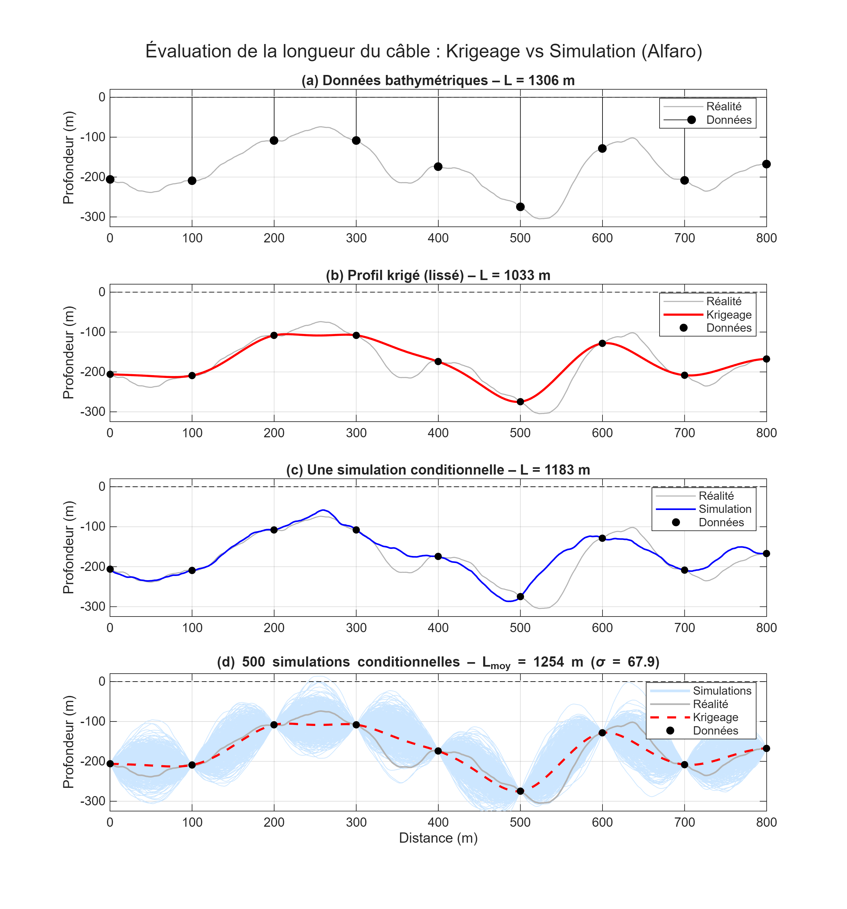
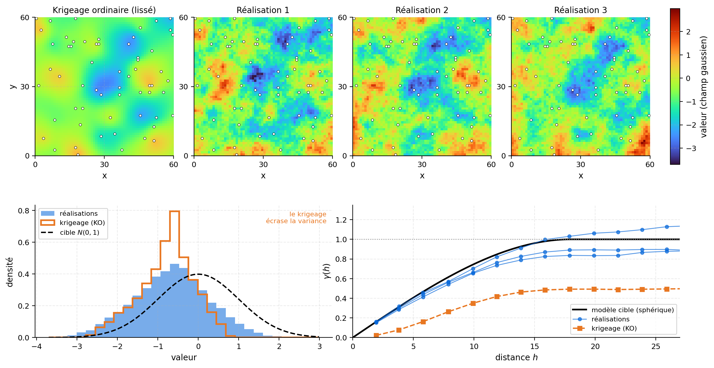

## Notations et hypothèses

On modélise la variable régionalisée par un champ stochastique ${Z(\mathbf{x}) : \mathbf{x}\in\mathcal{D}}$ défini sur un domaine $\mathcal{D}\subset\mathbb{R}^n$. Le krigeage et la simulation géostatistique reposent sur ce même modèle spatial, mais répondent à des objectifs différents : le krigeage cherche une estimation optimale, tandis que la simulation génère plusieurs configurations possibles du champ conditionnellement aux données.

### Problématique du câble sous-marin (Alfaro, 1979)

L’exemple proposé par Alfaro (1979) illustre directement cette distinction. Supposons que l’on cherche à estimer la longueur d’un câble posé sur le fond marin à partir de données bathymétriques mesurées tous les $100,\text{m}$ le long d’un profil.

Une première approche consiste à kriger la profondeur entre les observations, puis à calculer la longueur de la courbe estimée. On obtient alors :

$$
L_{\mathrm{krigeage}}=945,\text{m}.
$$

Un levé beaucoup plus dense, réalisé tous les $10,\text{m}$, révèle toutefois une longueur de :

$$
L_{\mathrm{réelle}}=1182,\text{m}.
$$

Cet écart résulte du lissage produit par le krigeage. Les variations de petite échelle et les valeurs extrêmes sont atténuées, de sorte que le profil estimé est plus régulier et, dans ce cas, artificiellement plus court. La longueur étant une fonctionnelle non linéaire du profil, elle ne peut généralement pas être évaluée correctement à partir de la seule estimation krigée.

La simulation conditionnelle propose une autre approche. Après avoir modélisé la loi marginale et la continuité spatiale de $Z(\mathbf{x})$, on génère plusieurs profils compatibles avec les observations et avec le modèle géostatistique. Chaque réalisation présente des détails différents entre les points mesurés, tout en demeurant plausible compte tenu des données disponibles.

La longueur est calculée séparément sur chaque réalisation :

$$
L^{(s)}=L\left(Z^{(s)}\right),
$$

puis son espérance conditionnelle est estimée par la moyenne des résultats :

$$
\mathbb{E}[L\mid\mathcal{D}]
\approx
\frac{1}{S}\sum_{s=1}^{S}L\left(Z^{(s)}\right),
$$

où $\mathcal{D}$ représente les données observées. La dispersion des valeurs $L^{(s)}$ permet également de quantifier l’incertitude associée à la longueur du câble.

{#fig-Alfaro fig-align="center" width="85%"}

### Estimation ou simulation

En estimation, la valeur krigée au point $\mathbf{x}_0$ est une combinaison linéaire des observations :

$$
Z^*(\mathbf{x}0)=\sum{i=1}^{n}\lambda_iZ(\mathbf{x}_i).
$$

Les poids sont déterminés de manière à minimiser la variance de l’erreur sous les contraintes propres au type de krigeage utilisé. Le résultat constitue le meilleur prédicteur linéaire sans biais, ou BLUP. Dans un cadre multigaussien avec moyenne connue, le krigeage simple coïncide avec l’espérance conditionnelle :

$$
\mathbb{E}\left[
Z(\mathbf{x}_0)
\mid
Z(\mathbf{x}_1),\ldots,Z(\mathbf{x}_n)
\right].
$$ {#eq-krigeage}

Cette moyenne conditionnelle fournit une estimation ponctuelle optimale, mais elle ne représente pas toute la distribution conditionnelle. Les valeurs extrêmes sont atténuées et la variabilité spatiale de la carte krigée est inférieure à celle du champ modélisé.

En simulation conditionnelle, une réalisation est plutôt tirée de la distribution du champ sachant les observations :

$$
Z^{(s)}(\mathbf{x})
\sim
p\left(
Z(\mathbf{x})
\mid
Z(\mathbf{x}_1),\ldots,Z(\mathbf{x}_n)
\right).
$$ {#eq-simulation}

Les réalisations ne cherchent pas à minimiser l’erreur en chaque point. Elles représentent différents scénarios possibles entre les observations. Considérées collectivement, elles reproduisent la loi marginale et la structure de dépendance spatiale du modèle (@fig-c12-krigeage-vs-realisations). En l’absence d’erreur de mesure, elles honorent également les valeurs observées aux points de conditionnement.

{#fig-c12-krigeage-vs-realisations fig-align="center" width="100%"}

Pour un grand nombre de simulations indépendantes, leur moyenne ponctuelle converge vers la moyenne conditionnelle. Dans le cadre multigaussien du krigeage simple :

$$
\lim_{S \to \infty} \frac{1}{S} \sum_{s=1}^S Z^{(s)}(\mathbf{x}) = Z^*_{\text{SK}}(\mathbf{x})
$$ {#eq-convergence}

Le krigeage simple est donc la « moyenne » de toutes les réalisations possibles, ce qui explique son caractère lissé. La relation est exacte pour le krigeage simple (moyenne connue), seulement approchée pour le krigeage ordinaire.

Le tableau suivant résume les propriétés comparées.

| Propriété | Krigeage $Z^*(\mathbf{x})$ | Simulation $Z^{(s)}(\mathbf{x})$ |
|---|---|---|
| Objectif | Fournir une estimation ponctuelle optimale | Générer des scénarios plausibles |
| Variance spatiale | $\operatorname{Var}[Z^*] < \operatorname{Var}[Z]$ (sous-estimée) | $\operatorname{Var}[Z^{(s)}] = \operatorname{Var}[Z]$ (préservée) |
| Variogramme | Partiellement reproduit (lissage) | Intégralement reproduit |
| Conditionnement | Exact aux observations | Exact aux observations |
| Valeurs extrêmes | Atténuées | Préservées |
| Erreur ponctuelle | Minimale (variance de krigeage) | Plus élevée qu'une estimation |
| Fonctionnelles non linéaires | Biaisées (effet de lissage) | Non biaisées (sur la moyenne des réalisations) |
| Quantification d'incertitude | Variance de krigeage (locale) | Dispersion des réalisations (globale) |
| Nombre de résultats | Une seule estimation | Multiples scénarios équiprobables |

Le choix dépend donc de la quantité recherchée. Le krigeage convient lorsque l’objectif principal est d’obtenir une estimation ponctuelle ou une carte moyenne. La simulation devient nécessaire lorsque l’on cherche à préserver l’hétérogénéité spatiale, à étudier la connectivité, à quantifier un risque ou à évaluer une fonctionnelle non linéaire, comme une longueur, un volume au-delà d’un seuil, un tonnage au-delà d’un seuil ou une réponse calculée par un modèle numérique.

Dans le cas du câble sous-marin (@fig-Alfaro), le krigeage produit un profil lissé qui sous-estime la longueur réelle ($L_{\text{krigeage}} = 945\,\text{m}$ contre $L_{\text{réel}} = 1182\,\text{m}$), tandis que la moyenne sur plusieurs simulations conditionnelles fournit une estimation non biaisée de cette fonctionnelle non linéaire,

$$
\mathbb{E}[L] \approx \frac{1}{S} \sum_{s=1}^S L\big(Z^{(s)}(\mathbf{x})\big),
$$ {#eq-longueur-moyenne}

où $L(\cdot)$ désigne la fonctionnelle longueur appliquée à chaque réalisation.