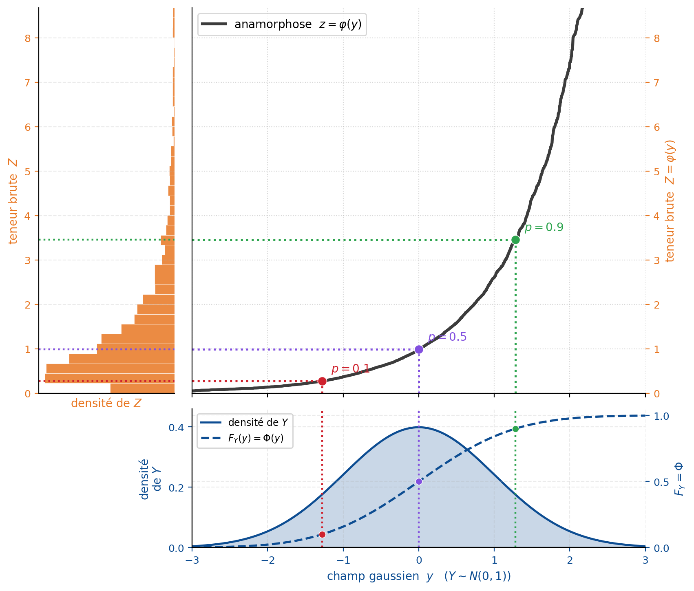

## Simulation non conditionnelle d'une variable continue

La simulation non conditionnelle génère des réalisations d'un champ aléatoire $\{Z(\mathbf{x}) : \mathbf{x} \in \mathcal{D}\}$ sans imposer de contrainte aux points d'observation. Chaque réalisation respecte les propriétés statistiques du modèle soit le variogramme (ou covariance) et la loi marginale, mais ne passe pas forcément par les données mesurées.

Plusieurs méthodes s'y prêtent : méthodes matricielles (décomposition de Cholesky, LU), moyennes mobiles, bandes tournantes, méthodes autorégressives et méthodes fréquentielles (FFT-MA). Les bandes tournantes ramènent une simulation à $n$ dimensions à des simulations 1D le long de droites, recombinées par projection; elles sont efficaces sur de grands domaines. Les méthodes fréquentielles, dont la FFT-MA (*Fast Fourier Transform — Moving Average*), simulent dans le domaine spectral et tirent parti de la transformée de Fourier rapide sur grille régulière. Ces méthodes sont détaillées à la section « Méthodes de simulation avancées » (voir plus loin dans ce chapitre); on renvoie aussi à Lantuéjoul (2002) et à Chilès et Delfiner (2012). On présente ici la méthode matricielle de décomposition de Cholesky, l'approche de référence pour les champs de taille modérée.

### Méthode de simulation matricielle (décomposition de Cholesky)

La méthode de Cholesky permet de simuler les valeurs du champ sur un ensemble fini de positions. On choisit d’abord $N$ points de simulation :

$$\mathcal{S}={\mathbf{x}_1,\mathbf{x}_2,\ldots,\mathbf{x}_N}\subset\mathcal{D},$$

où $\mathcal{D}\subset\mathbb{R}^d$ est le domaine spatial. Ces positions peuvent correspondre aux nœuds d’une grille régulière, aux centres de cellules d’un modèle ou à un ensemble quelconque de points irrégulièrement répartis.

La réalisation du champ sur cet ensemble est représentée par le vecteur :

$$\mathbf{Z}_{\mathcal{S}}=\left[Z(\mathbf{x}_1),Z(\mathbf{x}_2),\ldots,Z(\mathbf{x}_N)\right]^\top.$$

La simulation matricielle ne génère donc pas directement une fonction continue sur tout le domaine. Elle génère les valeurs de cette fonction aux positions de $\mathcal{S}$. La résolution spatiale de la réalisation dépend ainsi du nombre et de la disposition des points choisis.

Dans le cas d’un champ gaussien, on suppose :

$$\mathbf{Z}_{\mathcal{S}}\sim\mathcal{N}(\mathbf{m},\mathbf{K}),$$

où $\mathbf{m}$ est le vecteur des moyennes aux points de simulation :

$$\mathbf{m}=\left[m(\mathbf{x}_1),m(\mathbf{x}_2),\ldots,m(\mathbf{x}_N)\right]^\top,$$

et $\mathbf{K}$ est leur matrice de covariance.

#### Principe

Soient $n$ points à simuler pour un champ de covariance $C(h)$. On procède en trois étapes.

1. **Construction de la matrice de covariance.** 

Pour chaque paire de positions $\mathbf{x}_i$ et $\mathbf{x}_j$, on calcule :

$$K_{ij}=\operatorname{Cov}\left[Z(\mathbf{x}_i),Z(\mathbf{x}_j)\right].$$

Sous l’hypothèse de stationnarité, cette covariance dépend uniquement du vecteur de séparation :

$$K_{ij}=C(\mathbf{x}_i-\mathbf{x}_j),\qquad i,j=1,\ldots,N.$$ {#eq-matrice-cov}

La matrice obtenue s’écrit :

$$
\mathbf{K}=
\begin{bmatrix}
C(\mathbf{0}) & C(\mathbf{x}_1-\mathbf{x}_2) & \cdots & C(\mathbf{x}_1-\mathbf{x}_N) \\
C(\mathbf{x}_2-\mathbf{x}_1) & C(\mathbf{0}) & \cdots & C(\mathbf{x}_2-\mathbf{x}_N) \\
\vdots & \vdots & \ddots & \vdots \\
C(\mathbf{x}_N-\mathbf{x}_1) & C(\mathbf{x}_N-\mathbf{x}_2) & \cdots & C(\mathbf{0})
\end{bmatrix}.
$$

Elle est symétrique et doit être définie positive pour permettre une décomposition de Cholesky standard.

2. **Décomposition de Cholesky.** 

On factorise la matrice de covariance sous la forme :

$$\mathbf{K}=\mathbf{L}\mathbf{L}^\top,$$ {#eq-cholesky}

où $\mathbf{L}$ est une matrice triangulaire inférieure.

3. **Génération de la réalisation.** 

On génère un vecteur de $N$ variables normales indépendantes :

$$\mathbf{y}\sim\mathcal{N}(\mathbf{0},\mathbf{I}_N),$$

puis on construit la réalisation :

$$\mathbf{z}^{(s)}=\mathbf{m}+\mathbf{L}\mathbf{y}.$$ {#eq-simulation-nc}

Lorsque le champ est supposé centré, $\mathbf{m}=\mathbf{0}$, cette expression devient simplement :

$$\mathbf{z}^{(s)}=\mathbf{L}\mathbf{y}.$$

Chaque composante $z_i^{(s)}$ représente la valeur simulée au point $\mathbf{x}_i$ :

$$z_i^{(s)}=Z^{(s)}(\mathbf{x}_i).$$

#### Validation de la méthode

La réalisation a bien la covariance voulue :

$$
\operatorname{Cov}[\mathbf{z}] = \operatorname{Cov}[\mathbf{L} \mathbf{y}] = \mathbf{L} \, \operatorname{Cov}[\mathbf{y}] \, \mathbf{L}^\top = \mathbf{L} \, \mathbf{I} \, \mathbf{L}^\top = \mathbf{L} \mathbf{L}^\top = \mathbf{K}
$$ {#eq-validation-cov}

Le vecteur $\mathbf{z}$ est donc une réalisation non conditionnelle du champ gaussien de covariance $C(h)$.

#### Limitations

- **Taille du problème.** Le coût de la décomposition de Cholesky croît en $\mathcal{O}(n^3)$. En pratique, la méthode tient jusqu'à $n \lesssim 10\,000$ points.
- **Matrice non singulière.** $\mathbf{K}$ doit être définie positive, ce qui interdit deux points exactement confondus.
- **Effet de pépite.** Un effet de pépite $C_0$ peut être intégré directement à la matrice de covariance en ajoutant $C_0$ à ses termes diagonaux. Si l’on souhaite distinguer explicitement la composante spatialement structurée du bruit non corrélé, on peut aussi simuler d’abord le champ structuré, puis ajouter un bruit blanc indépendant : $\boldsymbol{\varepsilon}\sim\mathcal{N}(\mathbf{0},C_0\mathbf{I})$.
La réalisation finale s’écrit alors : $\mathbf{z}^{(s)}=\mathbf{m}+\mathbf{L}\mathbf{y}+\boldsymbol{\varepsilon}$.

#### Extensions

D'autres décompositions existent, notamment celle fondée sur les valeurs et vecteurs propres de $\mathbf{K}$ (décomposition spectrale), mais Cholesky reste la plus efficace quand elle s'applique.

### Cas des variables non gaussiennes : l'anamorphose

La décomposition de Cholesky, comme la SGS vue plus loin, suppose la variable gaussienne. Or les teneurs minières le sont rarement : elles sont asymétriques, souvent proches d'une loi log-normale. On contourne la difficulté par une **anamorphose gaussienne**, une fonction monotone $\varphi$ telle que

$$
Z(\mathbf{x}) = \varphi\big(Y(\mathbf{x})\big),
$$ {#eq-anamorphose}

où $Y(\mathbf{x})$ est un champ gaussien. On simule $Y$ — toute la théorie du chapitre s'y applique — puis on transforme chaque réalisation par $Z = \varphi(Y)$ pour revenir à la variable d'origine (@fig-c12-anamorphose). Le cas log-normal correspond à $Z = \exp(Y)$. En pratique, on estime $\varphi$ à partir de l'histogramme des données, de sorte que les réalisations finales reproduisent la loi marginale observée. C'est cette transformation qui sous-tend le cas log-normal de l'atelier 12.4.

{#fig-c12-anamorphose fig-align="center" width="90%"}

### Passage à la simulation conditionnelle

Une réalisation non conditionnelle devient conditionnelle de deux façons : par post-conditionnement par krigeage (voir plus loin) ou en étendant directement la décomposition matricielle pour intégrer les observations (section suivante).

## 🧮 Atelier interactif 12.1 — Reproduction du variogramme {.unnumbered}

::: {.content-visible when-format="html"}
La propriété fondamentale d'une simulation non conditionnelle : elle reproduit la structure spatiale imposée (le variogramme) en moyenne. Chaque réalisation possède un variogramme expérimental qui, pris isolément, fluctue autour du modèle sans y coller parfaitement. Mais la moyenne des variogrammes expérimentaux converge vers le modèle théorique à mesure qu'on accumule les réalisations — c'est l'illustration du profil de fond marin présenté en introduction (gris : simulations; noir pointillé : moyenne; rouge : modèle).

:::

::: {.content-visible unless-format="html"}
Cet atelier interactif n'est disponible que dans la version web du chapitre.
:::
