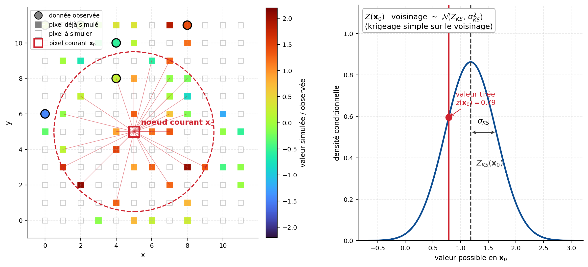

## Simulation conditionnelle d'une variable continue

La simulation conditionnelle génère des réalisations d'un champ aléatoire $\{Z(\mathbf{x}):\mathbf{x}\in\mathcal{D}\}$ qui honorent les valeurs observées aux points d'échantillonnage. Considérées collectivement, les réalisations reproduisent la distribution conditionnelle définie par le modèle géostatistique, notamment sa covariance et sa loi marginale.

Cette reproduction exacte des observations suppose un conditionnement dur, sans erreur de mesure. Lorsque les données sont incertaines ou bruitées, le conditionnement doit être adapté afin de tenir compte de leur erreur.

Pour les champs gaussiens, plusieurs méthodes peuvent être utilisées : l'extension conditionnelle des méthodes matricielles, la simulation séquentielle gaussienne ou le post-conditionnement par krigeage d'une simulation non conditionnelle. Cette dernière approche peut notamment s'appliquer aux simulations produites par bandes tournantes, moyennes mobiles, méthodes spectrales ou développement de Karhunen–Loève.

On présente ici les deux approches fondamentales : la simulation matricielle conditionnelle par décomposition de Cholesky et la simulation séquentielle gaussienne.

### Méthode de simulation matricielle conditionnelle par décomposition de Cholesky

La méthode prolonge directement la simulation matricielle non conditionnelle. Elle permet de simuler simultanément les valeurs du champ sur un ensemble fini de positions, tout en imposant les valeurs connues aux points de conditionnement.

#### Choix des points

On distingue deux ensembles de positions.

Les $N_d$ points de conditionnement sont regroupés dans :

$$
\mathcal{S}_d = \{\mathbf{x}_{d,1},\ldots,\mathbf{x}_{d,N_d}\}.
$$

Les valeurs du champ y sont observées et regroupées dans le vecteur :

$$
\mathbf{z}_d = \left[ Z(\mathbf{x}_{d,1}), \ldots, Z(\mathbf{x}_{d,N_d}) \right]^\top.
$$

Les $N_s$ points auxquels le champ doit être simulé sont regroupés dans :

$$
\mathcal{S}_s = \{\mathbf{x}_{s,1},\ldots,\mathbf{x}_{s,N_s}\}.
$$

Le vecteur des valeurs inconnues à ces positions est noté :

$$
\mathbf{Z}_s = \left[ Z(\mathbf{x}_{s,1}), \ldots, Z(\mathbf{x}_{s,N_s}) \right]^\top.
$$

Les positions de simulation peuvent correspondre aux nœuds d'une grille régulière, aux centres de cellules d'un modèle ou à un ensemble irrégulier de points.

#### Principe

Le vecteur regroupant les valeurs aux points de conditionnement et de simulation suit une distribution gaussienne jointe :

$$
\begin{bmatrix}
\mathbf{Z}_d \\
\mathbf{Z}_s
\end{bmatrix}
\sim
\mathcal{N}
\left(
\begin{bmatrix}
\mathbf{m}_d \\
\mathbf{m}_s
\end{bmatrix},
\begin{bmatrix}
\mathbf{K}_{dd} & \mathbf{K}_{ds} \\
\mathbf{K}_{sd} & \mathbf{K}_{ss}
\end{bmatrix}
\right),
$$

où $\mathbf{m}_d$ et $\mathbf{m}_s$ sont les vecteurs des moyennes aux deux ensembles de points.

La simulation se déroule en cinq étapes.

1. **Construction de la matrice de covariance globale.** Pour chaque paire de positions, on calcule la covariance définie par le modèle spatial. La matrice globale s'écrit :

$$
\mathbf{K} =
\begin{bmatrix}
\mathbf{K}_{dd} & \mathbf{K}_{ds} \\
\mathbf{K}_{sd} & \mathbf{K}_{ss}
\end{bmatrix},
$$ {#eq-matrice-globale}

avec :

- $\mathbf{K}_{dd}$, de taille $N_d\times N_d$, pour les covariances entre les points de conditionnement;
- $\mathbf{K}_{ss}$, de taille $N_s\times N_s$, pour les covariances entre les points à simuler;
- $\mathbf{K}_{ds}=\mathbf{K}_{sd}^\top$, pour les covariances croisées.

Sous l'hypothèse de stationnarité :

$$
K_{ij}=C(\mathbf{x}_i-\mathbf{x}_j).
$$

2. **Décomposition de Cholesky par blocs.** On factorise la matrice globale sous la forme :

$$
\mathbf{K} = \mathbf{L}\mathbf{L}^\top,
$$

avec :

$$
\mathbf{L} =
\begin{bmatrix}
\mathbf{L}_{dd} & \mathbf{0} \\
\mathbf{L}_{sd} & \mathbf{L}_{ss}
\end{bmatrix}.
$$

On obtient donc :

$$
\mathbf{K} =
\begin{bmatrix}
\mathbf{L}_{dd} & \mathbf{0} \\
\mathbf{L}_{sd} & \mathbf{L}_{ss}
\end{bmatrix}
\begin{bmatrix}
\mathbf{L}_{dd}^\top & \mathbf{L}_{sd}^\top \\
\mathbf{0} & \mathbf{L}_{ss}^\top
\end{bmatrix}.
$$ {#eq-cholesky-blocs}

Le bloc $\mathbf{L}_{dd}$ est associé aux points de conditionnement, tandis que $\mathbf{L}_{ss}$ représente la variabilité qui subsiste aux points à simuler après conditionnement.

3. **Détermination de la composante associée aux observations.** Dans la simulation non conditionnelle, le vecteur aux points de conditionnement s'écrirait :

$$
\mathbf{Z}_d = \mathbf{m}_d+\mathbf{L}_{dd}\mathbf{y}_d.
$$

Pour imposer les observations $\mathbf{Z}_d=\mathbf{z}_d$, on résout :

$$
\mathbf{z}_d = \mathbf{m}_d+\mathbf{L}_{dd}\mathbf{y}_d.
$$

On obtient :

$$
\mathbf{y}_d = \mathbf{L}_{dd}^{-1}\left( \mathbf{z}_d-\mathbf{m}_d \right).
$$ {#eq-yd-solution}

En pratique, ce système triangulaire est résolu directement, sans calculer explicitement l'inverse de $\mathbf{L}_{dd}$.

4. **Génération de la composante aléatoire.** On génère un vecteur de $N_s$ variables normales indépendantes :

$$
\mathbf{y}_s \sim \mathcal{N}\left( \mathbf{0}, \mathbf{I}_{N_s} \right).
$$

Un nouveau vecteur $\mathbf{y}_s$ est généré pour chaque réalisation.

5. **Génération de la réalisation conditionnelle.** La réalisation complète s'écrit :

$$
\begin{bmatrix}
\mathbf{z}_d \\
\mathbf{z}_s^{(r)}
\end{bmatrix}
=
\begin{bmatrix}
\mathbf{m}_d \\
\mathbf{m}_s
\end{bmatrix}
+
\begin{bmatrix}
\mathbf{L}_{dd} & \mathbf{0} \\
\mathbf{L}_{sd} & \mathbf{L}_{ss}
\end{bmatrix}
\begin{bmatrix}
\mathbf{y}_d \\
\mathbf{y}_s^{(r)}
\end{bmatrix}.
$$ {#eq-simulation-complete}

La partie simulée est donc :

$$
\mathbf{z}_s^{(r)} = \mathbf{m}_s + \mathbf{L}_{sd}\mathbf{y}_d + \mathbf{L}_{ss}\mathbf{y}_s^{(r)}.
$$ {#eq-simulation-conditionnelle}

En remplaçant $\mathbf{y}_d$ par son expression :

$$
\mathbf{z}_s^{(r)} = \mathbf{m}_s + \mathbf{L}_{sd}\mathbf{L}_{dd}^{-1}\left( \mathbf{z}_d-\mathbf{m}_d \right) + \mathbf{L}_{ss}\mathbf{y}_s^{(r)}.
$$

La réalisation conditionnelle se compose ainsi de deux parties : une moyenne conditionnelle déterminée par les observations et une composante aléatoire représentant l'incertitude résiduelle.

#### Validation de la méthode

La moyenne conditionnelle des valeurs simulées est :

$$
\mathbb{E}\left[ \mathbf{Z}_s \mid \mathbf{Z}_d=\mathbf{z}_d \right]
= \mathbf{m}_s + \mathbf{L}_{sd}\mathbf{L}_{dd}^{-1}\left( \mathbf{z}_d-\mathbf{m}_d \right).
$$

Les relations entre les blocs de la décomposition donnent :

$$
\mathbf{L}_{sd}\mathbf{L}_{dd}^{-1} = \mathbf{K}_{sd}\mathbf{K}_{dd}^{-1}.
$$

La moyenne conditionnelle devient donc :

$$
\mathbf{m}_{s\mid d} = \mathbf{m}_s + \mathbf{K}_{sd}\mathbf{K}_{dd}^{-1}\left( \mathbf{z}_d-\mathbf{m}_d \right).
$$ {#eq-moyenne-conditionnelle}

Cette expression correspond au krigeage simple simultané des valeurs aux points de simulation.

La covariance conditionnelle est :

$$
\mathbf{K}_{s\mid d} = \mathbf{K}_{ss} - \mathbf{K}_{sd}\mathbf{K}_{dd}^{-1}\mathbf{K}_{ds}.
$$ {#eq-covariance-conditionnelle}

Elle correspond au complément de Schur de $\mathbf{K}_{dd}$ dans la matrice globale. La décomposition par blocs garantit également que :

$$
\mathbf{L}_{ss}\mathbf{L}_{ss}^\top = \mathbf{K}_{s\mid d}.
$$

La simulation conditionnelle peut donc être résumée par :

$$
\mathbf{z}_s^{(r)} = \mathbf{m}_{s\mid d} + \mathbf{L}_{ss}\mathbf{y}_s^{(r)}.
$$

Le premier terme est la moyenne conditionnelle commune à toutes les réalisations. Le second varie d'une réalisation à l'autre et restitue la covariance conditionnelle résiduelle.

#### Efficacité computationnelle

La décomposition de Cholesky et le calcul de la moyenne conditionnelle ne sont effectués qu'une seule fois. Pour générer $M$ réalisations, on calcule d'abord :

$$
\mathbf{m}_{s\mid d} = \mathbf{m}_s + \mathbf{L}_{sd}\mathbf{y}_d.
$$

Pour chaque réalisation $r=1,\ldots,M$, on génère ensuite un nouveau vecteur $\mathbf{y}_s^{(r)}$ et on calcule :

$$
\mathbf{z}_s^{(r)} = \mathbf{m}_{s\mid d} + \mathbf{L}_{ss}\mathbf{y}_s^{(r)}.
$$

Le coût initial de la factorisation demeure élevé, mais sa réutilisation rend l'approche intéressante lorsqu'un grand nombre de réalisations doit être généré pour un ensemble fixe de points.

#### Limitations

- **Mémoire et temps de calcul.** La matrice globale contient $(N_d+N_s)^2$ termes et sa décomposition directe a un coût de l'ordre de $\mathcal{O}((N_d+N_s)^3)$. La méthode est donc réservée aux champs de taille modérée.
- **Matrice définie positive.** La matrice $\mathbf{K}$ doit être définie positive. Des points confondus, des modèles de covariance inadmissibles ou des problèmes de précision numérique peuvent empêcher la décomposition.
- **Conditionnement global.** Tous les points de conditionnement sont pris en compte simultanément. Cette propriété est avantageuse pour de petits ensembles, mais devient coûteuse lorsque le nombre de données est élevé.
- **Ensemble fixe de positions.** Toute modification des points de conditionnement ou des points de simulation exige généralement de reconstruire et de factoriser la matrice de covariance.

### Méthode de simulation séquentielle gaussienne (SGS)

La SGS construit une réalisation conditionnelle point par point, en tirant chaque valeur de la loi conditionnelle donnée par le krigeage simple.

#### Principe général

L'algorithme visite chaque point à simuler et tire une valeur de la loi gaussienne conditionnelle à l'information déjà disponible (observations initiales et valeurs déjà simulées). Cette valeur devient aussitôt une nouvelle donnée conditionnante (@fig-c12-pas-sgs).

{#fig-c12-pas-sgs fig-align="center" width="90%"}

#### Algorithme

On dispose de $N$ points conditionnants et on veut simuler $n$ points inconnus.

1. **Chemin de simulation aléatoire.** On fixe un ordre de visite $\{\mathbf{x}_{\pi(1)}, \ldots, \mathbf{x}_{\pi(n)}\}$. Cet ordre compte, car chaque valeur simulée pèse sur les suivantes.

2. **Parcours séquentiel.** Pour chaque point $\mathbf{x}_i$ selon le chemin :

   a) Sélectionner les données conditionnantes : les $N$ observations initiales et les valeurs déjà simulées aux points précédents. En pratique, on se restreint à un voisinage mobile (les $k$ points les plus proches) pour limiter le coût.

   b) Effectuer un krigeage simple au point $\mathbf{x}_i$ avec le modèle de covariance $C(h)$ (ou variogramme $\gamma(h)$). On obtient la moyenne conditionnelle $Z_i^* = \mathbb{E}[Z(\mathbf{x}_i) \mid \text{données connues}]$ et la variance conditionnelle $\sigma_{\text{SK}}^2(\mathbf{x}_i) = \operatorname{Var}[Z(\mathbf{x}_i) \mid \text{données connues}]$.

   c) Tirer une valeur de la loi gaussienne conditionnelle :

   $$
   Z(\mathbf{x}_i) \sim \mathcal{N}\big(Z_i^*, \sigma_{\text{SK}}^2(\mathbf{x}_i)\big).
   $$ {#eq-tirage-sgs}

   d) Ajouter la valeur simulée aux données conditionnantes pour la suite.

3. **Répéter** jusqu'à avoir visité tous les points du chemin.

#### Validation théorique

La SGS reproduit le variogramme cible, ce qu'on démontre par récurrence. Supposons que $n$ points simulés aient la bonne structure spatiale (covariance $\mathbf{K}_{nn}$). Au point $n+1$, la valeur krigée est

$$
Z_{n+1}^* = \boldsymbol{\lambda}^\top \mathbf{Z}_{ns},
$$ {#eq-krigeage-n1}

où $\boldsymbol{\lambda} = \mathbf{K}_{nn}^{-1} \mathbf{K}_{n1}$ et $\mathbf{K}_{n1}$ est la covariance entre les $n$ points déjà simulés et le point $n+1$. La valeur simulée est

$$
Z_{n+1} = Z_{n+1}^* + \varepsilon,
$$ {#eq-simulation-n1}

où $\varepsilon \sim \mathcal{N}(0, \sigma_{\text{SK}}^2)$ est indépendant de $\mathbf{Z}_{ns}$. La covariance avec les points précédents vaut

$$
\operatorname{Cov}[Z_{n+1}, \mathbf{Z}_{ns}] = \operatorname{Cov}[\boldsymbol{\lambda}^\top \mathbf{Z}_{ns}, \mathbf{Z}_{ns}] + \operatorname{Cov}[\varepsilon, \mathbf{Z}_{ns}] = \boldsymbol{\lambda}^\top \mathbf{K}_{nn} + \mathbf{0} = \mathbf{K}_{n1}^\top,
$$ {#eq-cov-n1}

et la variance au point $n+1$,

$$
\operatorname{Var}[Z_{n+1}] = \operatorname{Var}[\boldsymbol{\lambda}^\top \mathbf{Z}_{ns}] + \operatorname{Var}[\varepsilon] = \boldsymbol{\lambda}^\top \mathbf{K}_{nn} \boldsymbol{\lambda} + \sigma_{\text{SK}}^2 = C(0).
$$ {#eq-var-n1}

Les $n+1$ points ont donc bien la structure de covariance voulue.

La démonstration suppose un voisinage global : à chaque étape, le krigeage utilise toutes les données et toutes les valeurs déjà simulées, et la reproduction du variogramme est exacte. En pratique, on restreint le krigeage à un voisinage mobile (voir ci-dessous); la reproduction n'est plus qu'approchée. Le palier reste correct, mais le raccord aux distances intermédiaires est légèrement lissé.

#### Remarques importantes

**Voisinage mobile.** Pour ne pas alourdir les systèmes de krigeage, on se limite à une fenêtre locale. Les points éloignés pèsent peu (effet d'écran) et s'ignorent sans perte notable.

**Effet de pépite.** En non conditionnel, mieux vaut ajouter l'effet de pépite $C_0$ après la simulation, sous forme de bruit indépendant. En conditionnel, c'est impossible : les observations incluent déjà l'effet de pépite et doivent être reproduites exactement.

**Chemin de simulation.** Un parcours systématique peut créer des artefacts directionnels; on recommande un ordre aléatoire. Pour améliorer la qualité, on procède par passes multi-échelles (grossier vers fin), qui capturent les structures à différentes échelles.

**Généralité de la méthode.** La normalité est commode (le krigeage simple donne exactement la loi conditionnelle), mais la démonstration ne repose que sur la linéarité du krigeage. On peut donc simuler un bruit $\varepsilon$ non gaussien (moyenne nulle, variance $\sigma_{\text{SK}}^2$) : le variogramme sera respecté, mais l'histogramme tendra vers une forme plus gaussienne par le théorème central limite.

**Extension multivariée.** La SGS se combine facilement à la décomposition matricielle (LU) pour simuler plusieurs variables corrélées en de multiples points.

### Comparaison des deux méthodes

| Critère | Méthode matricielle | SGS |
|---|---|---|
| Taille maximale | $N+n \lesssim 10\,000$ | Quasi illimitée (voisinage mobile) |
| Coût pour 1 réalisation | $\mathcal{O}((N+n)^3)$ (décomposition) | $\mathcal{O}(n \times k^3)$ avec $k$ voisins |
| Coût pour $M$ réalisations | Décomposition une fois, puis $\mathcal{O}(n)$ par réalisation | $\mathcal{O}(M \times n \times k^3)$ |
| Voisinage mobile | Non | Oui |
| Effet de pépite | Traitement séparé recommandé | Inclus naturellement |
| Artefacts | Aucun | Possibles si chemin mal choisi |
| Flexibilité | Limitée | Haute (multi-échelle, multivariée) |

En résumé, on choisit la méthode matricielle pour générer plusieurs réalisations sur des champs de taille modérée, et la SGS pour des grands domaines avec voisinage mobile, ou quand des contraintes complexes doivent être intégrées.

### Méthode de recuit simulé

Le recuit simulé (*simulated annealing*) est une technique d'optimisation très souple, utile quand il faut reproduire, au-delà des moments d'ordre un et deux (histogramme, variogramme), des caractéristiques complexes du phénomène.

#### Principe général

On définit une fonction objectif $O$ à minimiser, qui mesure l'écart entre la réalisation simulée et les propriétés visées. Exemple classique :

$$
O = \sum_{h} \left[\gamma_{\text{sim}}(h) - \gamma_{\text{théo}}(h)\right]^2 + \alpha \sum_{z} \left[f_{\text{sim}}(z) - f_{\text{cible}}(z)\right]^2
$$ {#eq-fonction-objectif}

où $\gamma$ est le variogramme, $f$ l'histogramme, et $\alpha$ un poids. La fonction objectif peut aussi inclure des courbes tonnage–teneur (contexte minier), des relations déterministes entre variables, des contraintes géologiques (structures, contacts) ou des statistiques d'ordre supérieur (connectivité, proportions, asymétries spatiales).

#### Algorithme

1. **Initialisation.** Tirer aléatoirement une valeur pour chaque point à simuler en respectant l'histogramme désiré, placer les valeurs conditionnantes (points observés) dans le champ, calculer le variogramme expérimental et évaluer $O_0$.

2. **Itération** ($i = 1, 2, \ldots$).

   a) Tirer au hasard un point du champ : si c'est un point conditionnant, ne rien changer; sinon, tirer une nouvelle valeur $z'$ selon la distribution cible.

   b) Calculer la nouvelle fonction objectif $O_{i+1}$.

   c) Décider d'accepter ou non selon la règle de Metropolis :

   $$
   p_{\text{accept}} = \exp\left(-\frac{O_{i+1} - O_i}{T}\right),
   $$ {#eq-metropolis}

   où $T$ est la « température » : si $O_{i+1} < O_i$, on accepte toujours (amélioration); sinon, on accepte avec probabilité $p_{\text{accept}}$.

3. **Refroidissement.** La température $T$ diminue lentement selon un schéma défini (par exemple $T_{i+1} = \alpha T_i$ avec $\alpha \approx 0{,}95$) : en début de parcours, on explore largement l'espace des solutions (pour échapper aux minima locaux); en fin, on converge vers un optimum global.

4. **Critère d'arrêt.** On arrête lorsque $O < O_{\text{seuil}}$ ou après un nombre maximal d'itérations.

#### Remarques

**Initialisation.** Mieux vaut amorcer le recuit avec une réalisation SGS ou matricielle plutôt qu'avec un champ purement aléatoire : la convergence est plus rapide.

**Flexibilité.** La fonction objectif s'enrichit très facilement de contraintes spécifiques (géologiques, géométriques, statistiques).

**Coût computationnel.** Le recuit est généralement plus coûteux que les méthodes matricielles ou SGS, car il explore beaucoup de configurations avant d'en accepter une. On le réserve aux cas où les méthodes classiques ne satisfont pas toutes les contraintes à la fois, comme méthode de dernier recours.

La SGS construit la réalisation conditionnelle progressivement, point par point, chaque valeur simulée devenant donnée conditionnante pour les suivantes. Le post-conditionnement par krigeage (section suivante) procède autrement : il rend conditionnel en une seule fois un champ déjà entièrement simulé.

## 🧮 Atelier interactif 12.2 — Animation SGS {.unnumbered}

::: {.content-visible when-format="html"}
Lancez l'animation pour visualiser le remplissage séquentiel d'une simulation séquentielle gaussienne : chaque pixel est tiré de sa loi conditionnelle le long d'un chemin aléatoire. L'histogramme partiel reconstruit peu à peu la loi marginale gaussienne cible.

:::

::: {.content-visible unless-format="html"}
Cet atelier interactif n'est disponible que dans la version web du chapitre.
:::
