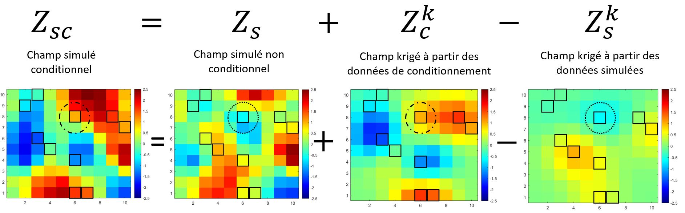

## Post-conditionnement par krigeage simple (ou ordinaire)

Certaines méthodes de simulation ne produisent pas directement des réalisations conditionnelles. Pour combler ce manque, on a recourt au post-conditionnement par krigeage.

L'idée consiste à transformer une réalisation non conditionnelle en lui ajoutant un terme correctif, obtenu par krigeage de l'écart entre les données observées et les valeurs simulées aux points d'échantillonnage. Le champ ajusté respecte alors exactement les données mesurées, tout en conservant la structure spatiale et statistique de la réalisation initiale.

### Principe du post-conditionnement par krigeage

On suppose que $Z(\mathbf{x})$ est gaussienne de moyenne nulle. La démarche se résume à trois étapes.

1. **Simulation non conditionnelle.** 

On génère une réalisation non conditionnelle $Z_{\text{nc}}(\mathbf{x})$ sur l'ensemble du domaine, couvrant les points de prédiction où l'on veut simuler la variable ainsi que les points d'échantillonnage $\mathbf{x}_i$ où des observations existent. On note $Z_{\text{nc}}(\mathbf{x}_i)$ les valeurs simulées aux points d'observation; elles ne coïncident pas avec les données réelles $Z_{\text{obs}}(\mathbf{x}_i)$.

2. **Krigeage des données observées et simulées.** 

On fait ensuite un krigeage simple (ou ordinaire) sur tout le domaine, avec deux jeux de données : $Z_{\text{kr,obs}}(\mathbf{x})$, estimation à partir des données observées $Z_{\text{obs}}(\mathbf{x}_i)$; et $Z_{\text{kr,nc}}(\mathbf{x})$, estimation à partir des valeurs simulées non conditionnelles aux points d'observation $Z_{\text{nc}}(\mathbf{x}_i)$. Ces deux champs krigés mesurent l'écart entre ce qui devrait être observé (données réelles) et ce qui est effectivement simulé.

3. **Correction additive.** 

La simulation conditionnelle s'obtient en corrigeant la réalisation non conditionnelle :

$$
Z_{\text{cond}}(\mathbf{x}) = Z_{\text{nc}}(\mathbf{x}) + \left[Z_{\text{kr,obs}}(\mathbf{x}) - Z_{\text{kr,nc}}(\mathbf{x})\right]
$$ {#eq-postcond}

Le terme correctif $[Z_{\text{kr,obs}}(\mathbf{x}) - Z_{\text{kr,nc}}(\mathbf{x})]$ est l'erreur de conditionnement à ajouter pour que la simulation respecte les données. Le résultat $Z_{\text{cond}}(\mathbf{x})$ reproduit alors les valeurs observées tout en préservant la structure de corrélation de la simulation initiale.

La @fig-postcond illustre le principe. Pour rendre conditionnelle une simulation qui ne l'était pas, il suffit de lui ajouter l'erreur de krigeage entre les observations et la simulation; la réalisation est alors contrainte de respecter exactement les valeurs échantillonnées.

{#fig-postcond fig-align="center"}

### Propriétés mathématiques

1. **Exactitude aux points d'observation.** 

Si un point $\mathbf{x}_0$ coïncide avec un point d'observation $\mathbf{x}_i$, le krigeage interpole exactement les données, donc

$$
Z_{\text{kr,obs}}(\mathbf{x}_i) = Z_{\text{obs}}(\mathbf{x}_i) \quad \text{et} \quad Z_{\text{kr,nc}}(\mathbf{x}_i) = Z_{\text{nc}}(\mathbf{x}_i),
$$ {#eq-exactitude-kr}

et par conséquent

$$
Z_{\text{cond}}(\mathbf{x}_i) = Z_{\text{nc}}(\mathbf{x}_i) + \left[Z_{\text{obs}}(\mathbf{x}_i) - Z_{\text{nc}}(\mathbf{x}_i)\right] = Z_{\text{obs}}(\mathbf{x}_i).
$$ {#eq-exactitude-cond}

La simulation post-conditionnée reproduit donc parfaitement les valeurs observées. À l'inverse, loin de toute donnée, l'influence du krigeage s'estompe et les deux champs krigés tendent vers la moyenne (nulle ici), de sorte que

$$
Z_{\text{kr,obs}}(\mathbf{x}) \approx Z_{\text{kr,nc}}(\mathbf{x}) \approx 0 \quad \Rightarrow \quad Z_{\text{cond}}(\mathbf{x}) \approx Z_{\text{nc}}(\mathbf{x}).
$$ {#eq-loin-obs}

Dans les zones non informées, la simulation conditionnée retrouve alors la simulation non conditionnelle initiale.

**Variance de l'erreur de conditionnement.** On peut montrer que la variance de l'erreur entre la simulation conditionnelle et la vraie valeur (inconnue) vérifie

$$
\operatorname{Var}\left[Z_{\text{cond}}(\mathbf{x}) - Z(\mathbf{x})\right] = 2\sigma_{\text{SK}}^2(\mathbf{x}),
$$ {#eq-var-erreur}

où $\sigma_{\text{SK}}^2(\mathbf{x})$ est la variance de krigeage simple au point $\mathbf{x}$. Autrement dit, une seule réalisation conditionnelle post-conditionnée a une variance d'erreur deux fois plus grande que l'estimateur de krigeage simple. Il ne faut donc jamais utiliser une seule simulation post-conditionnée comme estimateur ponctuel : on sous-estimerait l'incertitude.

2. **Convergence de la moyenne des simulations conditionnelles.** 

Pour $S$ simulations conditionnelles indépendantes $\{Z_{\text{cond}}^{(s)}(\mathbf{x})\}_{s=1}^S$, la moyenne

$$
\bar{Z}_{\text{cond}}(\mathbf{x}) = \frac{1}{S}\sum_{s=1}^S Z_{\text{cond}}^{(s)}(\mathbf{x})
$$ {#eq-moyenne-sim}

converge, quand $S \to \infty$, vers l'estimateur de krigeage simple :

$$
\bar{Z}_{\text{cond}}(\mathbf{x}) \xrightarrow[S \to \infty]{} Z_{\text{SK}}(\mathbf{x}).
$$ {#eq-convergence-ks}

De plus, la variance d'estimation de cette moyenne converge vers la variance de krigeage simple,

$$
\operatorname{Var}\left[\bar{Z}_{\text{cond}}(\mathbf{x})\right] \xrightarrow[S \to \infty]{} \sigma_{\text{SK}}^2(\mathbf{x}),
$$ {#eq-convergence-var}

et la dispersion des réalisations autour de cette moyenne (variance inter-réalisations) vaut elle aussi $\sigma_{\text{SK}}^2(\mathbf{x})$. Après moyennage d'un nombre suffisant de réalisations, le post-conditionnement reconstitue donc à la fois l'estimation optimale (krigeage simple) et l'incertitude associée (variance de krigeage), tout en fournissant des réalisations qui respectent la variabilité spatiale réelle du phénomène.