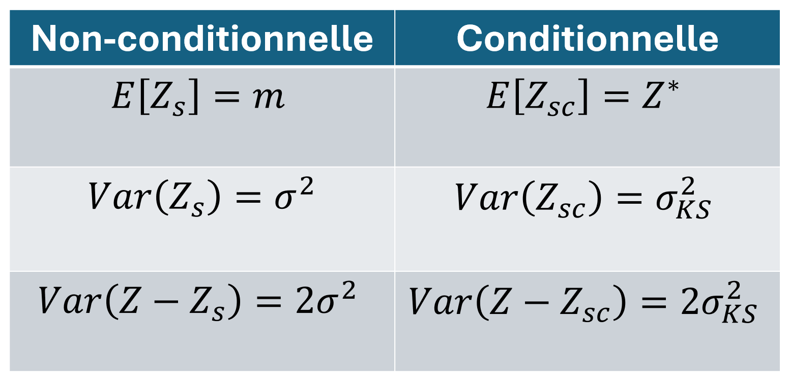
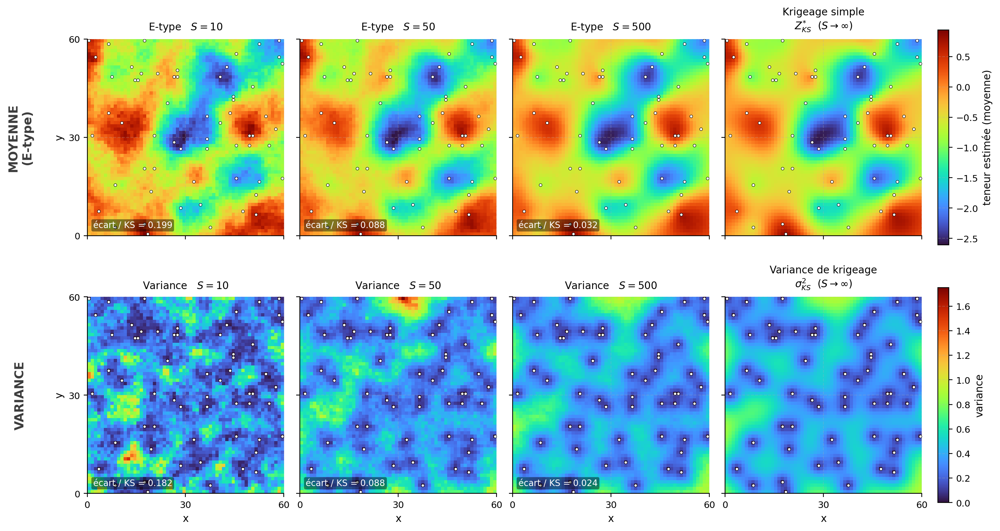
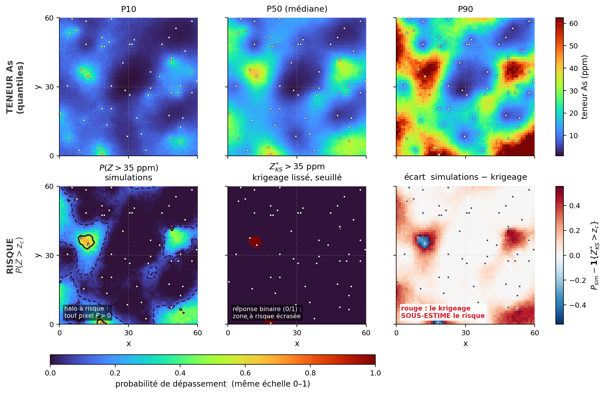

## Propriétés des simulations

Les propriétés statistiques d'une réalisation dépendent de son caractère conditionnel ou non. La @fig-proprietes illustre ces différences de comportement et le rapport aux observations.

{#fig-proprietes fig-align="center"}

Une simulation non conditionnelle $Z_s(\mathbf{x})$ a une espérance constante, égale à la moyenne globale du modèle $m$ : aucune information spatiale ne la contraint. Une simulation conditionnelle $Z_{sc}(\mathbf{x})$, elle, voit son espérance converger vers le krigeage simple $Z^*_{\text{SK}}(\mathbf{x})$. Son espérance varie donc dans l'espace selon la proximité et la configuration des observations, ce qui capte la structure d'information locale. Aux points d'observation, $Z^*_{\text{SK}}$ reproduit exactement les mesures; loin de toute donnée, elle revient vers la moyenne $m$ et rejoint le comportement non conditionnel.

La variance spatiale est l'autre contraste. Une simulation non conditionnelle conserve toute la variance *a priori* du phénomène ($\sigma^2$), sans contraindre la variabilité du champ. Le conditionnement, au contraire, la réduit à $\sigma_{\text{SK}}^2$, la variance de krigeage simple, qui mesure l'incertitude résiduelle une fois les données prises en compte. La réduction est maximale aux points d'observation (où $\sigma_{\text{SK}}^2 = 0$) et s'atténue avec la distance, jusqu'à retrouver la variance globale $\sigma^2$ dans les zones non informées. Le rapport $\sigma_{\text{SK}}^2 / \sigma^2$ mesure la part d'incertitude non résolue par les observations : plus il est faible, plus le conditionnement est informatif.

L'erreur de prédiction, l'écart entre la vraie valeur inconnue $Z(\mathbf{x})$ et la valeur simulée, a elle aussi une structure intéressante. Pour une simulation non conditionnelle, sa variance vaut $2\sigma^2$, le double de la variance du champ : $Z$ et $Z_s$ sont deux réalisations indépendantes du même processus, donc la variance de leur différence est la somme des variances, $\sigma^2 + \sigma^2 = 2\sigma^2$. Dans le cas conditionnel, même logique, mais avec la variance réduite : $\operatorname{Var}(Z - Z_{sc}) = 2\sigma_{\text{SK}}^2$. Une seule réalisation conditionnelle ne doit donc jamais servir d'estimateur ponctuel : son erreur quadratique moyenne est deux fois celle du krigeage simple. En revanche, la moyenne d'un grand nombre de simulations conditionnelles converge vers le krigeage, tout en mesurant l'incertitude globale par la dispersion des réalisations (@fig-c12-etype).

{#fig-c12-etype fig-align="center" width="100%"}

Le conditionnement modifie donc les propriétés statistiques des simulations en y injectant l'information issue des observations. Là où une simulation non conditionnelle ne reflète que le modèle *a priori* (moyenne $m$, variance $\sigma^2$), une simulation conditionnelle intègre la structure spatiale des données : espérance conditionnelle (le krigeage $Z^*_{\text{SK}}$) et variance conditionnelle ($\sigma_{\text{SK}}^2 \leq \sigma^2$). Cette réduction ne permet toutefois pas de réaliser des simulations conditionnelles des estimateurs plus précises qu'une réalisation isolée : leur variance d'erreur reste le double de celle du krigeage. Leur force réside ailleurs : générer de multiples scénarios équiprobables qui, ensemble, chiffrent l'incertitude tout en conservant la variabilité spatiale du phénomène, ce que le krigeage, par son lissage, ne peut pas garantir.

## 🧮 Atelier interactif 12.3 — Non conditionnel ou conditionnel {.unnumbered}

::: {.content-visible when-format="html"}
Cet atelier illustre en 1D les propriétés ci-dessus. En haut, des réalisations non conditionnelles : en accumulant les réalisations, la moyenne pixel à pixel converge vers 0 et la variance vers 1 ($\mathbb{E}[Z_s]=m$, $\operatorname{Var}[Z_s]=\sigma^2$). En bas, des réalisations conditionnelles (post-conditionnement) : la moyenne converge vers le krigeage simple $Z^*_{\text{SK}}$ (et passe exactement par les données) et la variance vers la variance de krigeage $\sigma^2_{\text{SK}}$. Activez l'affichage du krigeage simple pour superposer la cible de convergence, et montez jusqu'à 200 réalisations.

:::

::: {.content-visible unless-format="html"}
Cet atelier interactif n'est disponible que dans la version web du chapitre.
:::

La moyenne et la variance ne sont que les deux premiers moments. Le vrai intérêt des simulations se révèle dès qu'on cherche une quantité non linéaire de la teneur, un volume au-delà d'un seuil, un tonnage récupérable, que le krigeage, par son lissage, estime mal (@fig-c12-quantiles). Les deux ateliers suivants l'illustrent, l'un sur un site contaminé, puis l'autre sur un gisement minier.

{#fig-c12-quantiles fig-align="center" width="100%"}

## 🧮 Atelier interactif 12.4 — Site contaminé : krigeage ou simulations {.unnumbered}

::: {.content-visible when-format="html"}
On reprend l'atelier du krigeage d'indicatrices (site pollué), mais en remplaçant le KI par des simulations conditionnelles. En haut, la référence (vérité). Au milieu, le krigeage (KO) : teneur estimée $Z^*$ et variance $\sigma^2_{\text{OK}}$. En bas, les simulations conditionnelles : la moyenne E-type $\mathbb{E}[Z \mid \mathbf{x}]$ et la variance entre réalisations $\operatorname{Var}[Z \mid \mathbf{x}]$. Cliquez la carte de référence pour forer ou retirer un sondage. Le bilan compare la fraction de sol contaminé ($Z > z_c$) : vérité, seuillage du krigeage (biaisé par le lissage), et simulations. Basculez entre loi gaussienne et log-normale (anamorphose gaussienne).

:::

::: {.content-visible unless-format="html"}
Cet atelier interactif n'est disponible que dans la version web du chapitre.
:::

## 🧮 Atelier interactif 12.5 — Ressources minières : krigeage ou simulations {.unnumbered}

::: {.content-visible when-format="html"}
On applique la même logique à un gisement. Les cartes du haut comparent, sur une **même échelle de teneurs** et à partir des **mêmes sondages**, la *réalité* (le gisement complet, inconnu en pratique) et le *krigeage* : ce dernier restitue bien la position des zones riches et pauvres, mais **lisse** les contrastes — les fortes teneurs sont sous-estimées et les faibles surestimées. Les cartes du bas montrent plusieurs *simulations conditionnelles* : chacune honore exactement les sondages tout en reproduisant la **texture** et la **variabilité** réelles du gisement. Le sélecteur « Cartes de simulation » permet d'en afficher de 1 à 6 pour visualiser l'incertitude d'un tirage à l'autre.

Pour une teneur de coupure $z_c$, le tonnage récupérable $T(z_c)$ et le métal récupérable $Q(z_c)$ sont des fonctions non linéaires des teneurs. Estimés à partir du champ krigé (lissé), ils sont **biaisés**; estimés sur l'ensemble des simulations conditionnelles, ils sont restitués **sans biais** et assortis d'une **incertitude**. L'atelier trace $T(z_c)$ et $Q(z_c)$ pour la vérité (noir), le krigeage (bleu) et les simulations (médiane et fourchette P10–P90), et donne la distribution du métal à la coupure. Déplacez la coupure et comparez les trois approches.

:::

::: {.content-visible unless-format="html"}
Cet atelier interactif n'est disponible que dans la version web du chapitre.
:::
