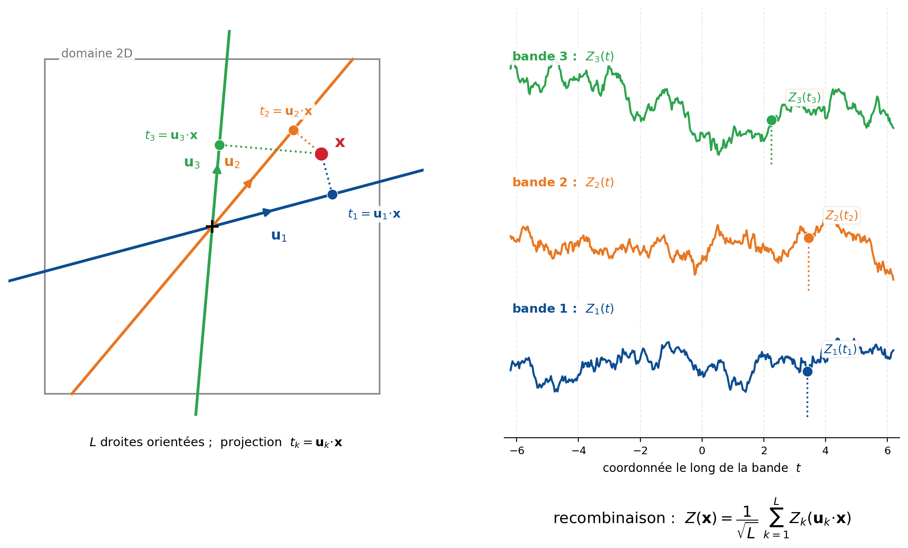

## Méthodes de simulation avancées

La décomposition de Cholesky des sections précédentes est simple et exacte, mais son coût en $\mathcal{O}(n^3)$ la limite à quelques milliers de points. Dès qu'on veut simuler sur de grandes grilles, il faut des générateurs plus efficaces. Cette section présente quatre méthodes classiques de simulation non conditionnelle d'un champ gaussien stationnaire de covariance $C(\mathbf{h})$ : les bandes tournantes, leur variante spectrale, la FFT-MA et la décomposition de Karhunen–Loève. Chacune a un atout propre — passage à l'échelle pour les trois premières, paramétrisation réduite pour la dernière.

Toutes produisent une réalisation *non conditionnelle*. Pour honorer des données, on les combine au post-conditionnement par krigeage (section précédente). Et comme la décomposition de Cholesky, elles supposent la variable gaussienne : une variable asymétrique se traite par anamorphose (voir la section sur la simulation non conditionnelle).

Plusieurs de ces méthodes s'expriment dans le domaine spectral. On y utilise la **densité spectrale** $f(\boldsymbol{\omega})$ de la covariance, définie par le théorème de Bochner :

$$
C(\mathbf{h}) = \int_{\mathbb{R}^d} e^{\,i\,\langle \boldsymbol{\omega},\, \mathbf{h}\rangle}\, f(\boldsymbol{\omega})\, \mathrm{d}\boldsymbol{\omega}, \qquad \int_{\mathbb{R}^d} f(\boldsymbol{\omega})\, \mathrm{d}\boldsymbol{\omega} = C(\mathbf{0}) = \sigma^2 .
$$

Une covariance admissible a une densité spectrale positive. Normalisée par $\sigma^2$, elle devient une densité de probabilité, ce dont les méthodes spectrales tirent parti.

### Bandes tournantes

La méthode des bandes tournantes (Matheron) ramène une simulation en dimension $d$ à une somme de simulations unidimensionnelles le long de droites (@fig-c12-bandes-tournantes). On tire $L$ directions unitaires $\mathbf{u}_1, \dots, \mathbf{u}_L$ réparties sur la sphère. Sur chaque droite $\ell$, on simule un processus 1D indépendant $X_\ell(t)$ de covariance $C_1$, puis on projette et on somme :

$$
Z(\mathbf{x}) = \frac{1}{\sqrt{L}} \sum_{\ell=1}^{L} X_\ell\big(\langle \mathbf{x},\, \mathbf{u}_\ell\rangle\big),
$$

où $\langle \mathbf{x}, \mathbf{u}_\ell\rangle$ est l'abscisse de la projection de $\mathbf{x}$ sur la droite $\ell$. Chaque droite n'apporte qu'une structure « en bandes » perpendiculaires à sa direction; c'est leur superposition sur des directions bien réparties qui reconstruit l'isotropie (ou l'anisotropie voulue), et le théorème central limite rend le champ gaussien lorsque $L \to \infty$.

{#fig-c12-bandes-tournantes fig-align="center" width="90%"}

Le point clé est le lien entre la covariance 1D à simuler et la covariance cible. En trois dimensions, pour des directions uniformes sur la sphère et une covariance isotrope $C_3(r)$, ce lien est particulièrement simple :

$$
C_3(r) = \frac{1}{r} \int_0^r C_1(s)\, \mathrm{d}s
\qquad \Longleftrightarrow \qquad
C_1(r) = \frac{\mathrm{d}}{\mathrm{d}r}\big[\, r\, C_3(r)\,\big].
$$

On déduit donc la covariance des processus de droite de la covariance 3D visée; elle admet une forme explicite pour les modèles usuels (sphérique, exponentiel, etc.). En deux dimensions, la relation fait intervenir une transformée intégrale moins commode : en pratique, on simule alors en 3D et on prélève une section plane, ou on recourt à la variante spectrale ci-dessous.

Les processus 1D se simulent par n'importe quelle méthode unidimensionnelle (discrétisation de la droite, ou approche spectrale). Le coût total croît essentiellement comme $\mathcal{O}(L\, n)$, linéaire en nombre de points : c'est ce qui rend la méthode efficace sur de grands domaines. Sa faiblesse est visuelle : trop peu de droites laissent apparaître des artefacts de bandes (des stries dans le champ simulé). On emploie donc un grand nombre de directions, réparties de façon régulière (suites quasi aléatoires) plutôt que purement aléatoires, pour lisser ces artefacts.

### Bandes tournantes spectrales

La variante spectrale simule chaque processus de droite non pas en discrétisant la droite, mais par une représentation en cosinus. Un processus 1D stationnaire s'obtient en effet en tirant une fréquence dans sa densité spectrale et une phase aléatoire. En combinant la direction de bande $\mathbf{u}_\ell$ et la fréquence 1D, on aboutit directement à la méthode spectrale en dimension $d$ :

$$
Z(\mathbf{x}) = \sqrt{\frac{2}{L}} \sum_{\ell=1}^{L} \cos\big(\langle \boldsymbol{\omega}_\ell,\, \mathbf{x}\rangle + \phi_\ell\big),
$$

où le champ est pris centré réduit ($\sigma^2 = 1$), les vecteurs de fréquence $\boldsymbol{\omega}_\ell = \omega_\ell\, \mathbf{u}_\ell$ sont tirés selon la densité spectrale normalisée $f(\boldsymbol{\omega})/\sigma^2$, et les phases $\phi_\ell \sim U[0, 2\pi]$ sont indépendantes.

La méthode reproduit la covariance de façon remarquablement directe. Pour un seul mode, l'espérance sur la phase donne

$$
\mathbb{E}\big[\, 2\cos(\langle \boldsymbol{\omega}, \mathbf{x}\rangle + \phi)\,\cos(\langle \boldsymbol{\omega}, \mathbf{x}+\mathbf{h}\rangle + \phi)\,\big] = \cos\big(\langle \boldsymbol{\omega}, \mathbf{h}\rangle\big),
$$

et l'espérance sur la fréquence, comme $f$ est symétrique, redonne exactement $\mathbb{E}[\cos\langle \boldsymbol{\omega}, \mathbf{h}\rangle] = C(\mathbf{h})$. Un seul mode a donc déjà la bonne covariance; la somme sur $L$ modes réduit la variance de la covariance empirique et, par le théorème central limite, rend le champ gaussien.

Cette approche a deux avantages sur les bandes tournantes discrétisées. Elle est *continue* : on évalue $Z(\mathbf{x})$ en n'importe quel point, sans grille ni discrétisation des droites. Et elle reproduit la covariance sans biais, mode par mode. Elle suppose en revanche de savoir échantillonner la densité spectrale — connue en forme close pour les modèles courants (au modèle gaussien correspond une densité spectrale gaussienne, à l'exponentiel une densité de type Cauchy) — et reste sujette, comme toute méthode à $L$ fini, à un léger bruit résiduel si $L$ est trop petit.

### FFT-MA

La FFT-MA (*Fast Fourier Transform — Moving Average*, Le Ravalec, Noetinger et Hu) simule sur une grille régulière en exploitant la transformée de Fourier rapide. Elle repose sur l'écriture d'un champ gaussien stationnaire comme une convolution (moyenne mobile) d'un bruit blanc $\varepsilon$ par un noyau $g$ :

$$
Z = g * \varepsilon .
$$

La covariance d'une convolution est l'autocorrélation du noyau; dans le domaine spectral, cela impose $|\hat{g}(\boldsymbol{\omega})|^2 = \hat{C}(\boldsymbol{\omega}) = f(\boldsymbol{\omega})$. Il suffit donc de prendre pour noyau la racine de la densité spectrale, $\hat{g} = \sqrt{\hat{C}}$. Comme une convolution devient un produit en Fourier, l'algorithme est immédiat :

1. évaluer la covariance sur la grille (périodisée) et en calculer la transformée de Fourier $\hat{C}$;
2. poser $\hat{g} = \sqrt{\hat{C}}$;
3. générer un bruit blanc $\varepsilon$ sur la grille et le transformer, $\hat{\varepsilon}$;
4. multiplier terme à terme, $\hat{Z} = \sqrt{\hat{C}}\; \hat{\varepsilon}$;
5. transformer en sens inverse pour obtenir $Z$.

Le coût est celui de la FFT, $\mathcal{O}(N \log N)$ pour $N$ nœuds : la méthode traite sans peine des grilles de plusieurs millions de cellules. Deux conditions l'encadrent. La grille doit être régulière. Et la transformée de la covariance périodisée doit rester positive ($\hat{C} \ge 0$) pour que sa racine ait un sens; on l'assure en rembourrant le domaine (en l'agrandissant) de sorte que la covariance décroisse jusqu'à être négligeable dans la zone ajoutée, ce qui évite du même coup les artefacts de périodicité (le champ qui « se recolle » d'un bord à l'autre). La méthode est en cela une cousine de l'immersion circulante (*circulant embedding*).

Un atout distingue la FFT-MA : elle sépare le bruit blanc $\varepsilon$ — la « graine » aléatoire — de la structure de covariance. Perturber légèrement le bruit perturbe continûment la réalisation, ce qui rend la méthode précieuse pour le calage d'historique et les problèmes inverses, où l'on cherche à déformer une réalisation pour l'ajuster à des observations.

### Décomposition de Karhunen–Loève

La décomposition de Karhunen–Loève (KL) représente le champ comme une série de fonctions spatiales déterministes pondérées par des coefficients aléatoires décorrélés. Pour un champ centré de covariance $C(\mathbf{x}, \mathbf{y})$ sur un domaine $\mathcal{D}$ :

$$
Z(\mathbf{x}) = \sum_{k=1}^{\infty} \sqrt{\lambda_k}\; \xi_k\; \phi_k(\mathbf{x}),
$$

où les couples $(\lambda_k, \phi_k)$ sont les valeurs et fonctions propres de l'opérateur de covariance, solutions de l'équation intégrale de Fredholm

$$
\int_{\mathcal{D}} C(\mathbf{x}, \mathbf{y})\, \phi_k(\mathbf{y})\, \mathrm{d}\mathbf{y} = \lambda_k\, \phi_k(\mathbf{x}),
$$

les fonctions propres $\phi_k$ étant orthonormées, les valeurs propres ordonnées $\lambda_1 \ge \lambda_2 \ge \cdots \ge 0$, et les coefficients $\xi_k$ décorrélés, de moyenne nulle et de variance unité. Pour un champ gaussien, les $\xi_k$ sont indépendants et suivent $\mathcal{N}(0,1)$.

La décomposition est optimale au sens suivant : parmi toutes les représentations linéaires tronquées à $M$ termes, celle de KL minimise l'erreur quadratique moyenne intégrée $\mathbb{E}\!\int_{\mathcal{D}} (Z - Z_M)^2\, \mathrm{d}\mathbf{x}$. C'est donc la représentation la plus parcimonieuse. On tronque en gardant les $M$ plus grandes valeurs propres; la fraction de variance restituée est $\sum_{k=1}^{M} \lambda_k \big/ \sum_{k=1}^{\infty} \lambda_k$. La décroissance des valeurs propres commande le nombre de termes utiles : rapide pour un champ très continu (covariance gaussienne), lente pour un champ irrégulier.

Sur une grille, l'équation de Fredholm se ramène à la décomposition en valeurs propres de la matrice de covariance $\mathbf{K} = \boldsymbol{\Phi}\, \boldsymbol{\Lambda}\, \boldsymbol{\Phi}^\top$, et la réalisation s'écrit $\mathbf{z} = \boldsymbol{\Phi}\, \boldsymbol{\Lambda}^{1/2}\, \mathbf{y}$ avec $\mathbf{y}$ gaussien centré réduit : c'est la décomposition spectrale évoquée comme extension de la méthode matricielle. Le calcul complet des vecteurs propres coûte $\mathcal{O}(N^3)$, comme Cholesky, mais on peut ne calculer que les $M$ premiers modes. Le véritable intérêt de KL n'est donc pas la vitesse, mais la *paramétrisation réduite* : le champ est décrit par $M \ll N$ coefficients, ce qui sert en quantification d'incertitude, en éléments finis stochastiques (chaos polynomial) et en problèmes inverses. Son conditionnement aux données est en revanche moins direct que le post-conditionnement.

### Comparaison

| Méthode | Support | Coût | Atout principal | Limite |
|:---|:---|:---|:---|:---|
| Bandes tournantes | points ou grille | $\mathcal{O}(L\,n)$ | rapide, tout support | artefacts de bandes si $L$ faible; relation 1D–3D simple surtout en 3D |
| Bandes tournantes spectrales | points ou grille | $\mathcal{O}(L\,n)$ | continu, évaluable partout | requiert la densité spectrale |
| FFT-MA | grille régulière | $\mathcal{O}(N \log N)$ | très rapide; découple bruit et structure | grille et rembourrage; $\hat{C} \ge 0$ |
| Karhunen–Loève | points ou grille | $\mathcal{O}(N^3)$, ou $M$ modes | paramétrisation réduite ($M$ coefficients) | coût de la décomposition; conditionnement indirect |

Le choix dépend du contexte : FFT-MA pour de très grandes grilles régulières, bandes tournantes (spectrales) pour un support quelconque ou une évaluation en des points isolés, Karhunen–Loève quand une représentation réduite du champ est recherchée. Dans tous les cas, la réalisation produite est non conditionnelle et se rend conditionnelle par post-conditionnement.
