## Modélisation de faciès basée sur des cellules

La modélisation par cellules, ou approche *pixel-based*, découpe l'espace en une grille régulière et attribue à chaque cellule une catégorie : le faciès. L'étape est déterminante, car les propriétés physiques du milieu sont corrélées à ces unités. Un faciès argileux porte une conductivité faible, un faciès sableux une conductivité élevée. En fixant d'abord l'architecture des faciès, on contraint la distribution des paramètres physiques, puis on simule, plus finement, l'écoulement dans un aquifère, par exemple.

L'approche s'appuie sur le variogramme pour décrire la structure spatiale. Elle s'organise autour de deux méthodes : la simulation séquentielle d'indicatrices (*sequential indicator simulation*, SIS) et la simulation gaussienne tronquée (*truncated Gaussian simulation*, TGS).

### Simulation séquentielle d'indicatrices (SIS)

La SIS modélise la présence ou l'absence de faciès à partir de variables binaires (0 ou 1). Le principe reprend celui de la simulation séquentielle gaussienne (*sequential Gaussian simulation*, SGS) des variables continues, mais l'adapte aux variables catégorielles.

#### Algorithme

C'est l'équivalent catégoriel de la SGS. On visite les points de la grille dans un ordre aléatoire et, à chaque emplacement, on simule un faciès parmi les $K$ possibles. Seule la loi de tirage change : au lieu d'une gaussienne conditionnelle, on tire dans une distribution catégorielle obtenue par krigeage d'indicatrices. Concrètement, on krige l'indicatrice de chaque faciès pour estimer sa probabilité de présence au point courant. Les $K$ probabilités forment un vecteur qu'on normalise à somme 1, puis on tire un faciès selon cette loi. Comme en SGS, le faciès simulé rejoint aussitôt les données conditionnantes, et on passe au point suivant du chemin.

Soit un champ aléatoire catégoriel $Z(\mathbf{x})$ prenant $K$ états discrets $\{s_1, s_2, \dots, s_K\}$, soit les $K$ faciès possibles. On dispose de $N$ observations $z(\mathbf{x}_i)$, avec $i = 1, \dots, N$, et on veut simuler le champ aux nœuds d'une grille $\{\mathbf{x}_j, j = 1, \dots, n\}$ conditionnellement aux données. Le processus se déroule ainsi.

1. **Codage en indicatrices.** 

Transformer les données catégorielles en indicatrices $i(\mathbf{x}_i; s_k)$ pour chaque faciès $s_k$ :
   $$i(\mathbf{x}_i; s_k) = \begin{cases} 1 & \text{si } z(\mathbf{x}_i) = s_k, \\ 0 & \text{sinon.} \end{cases}$$

2. **Chemin aléatoire.** 

Définir un chemin qui visite chaque nœud $\mathbf{x}_j$ une seule fois.

3. **Estimation des probabilités locales.** 

Au nœud courant $\mathbf{x}_j$, estimer la probabilité conditionnelle de chaque faciès par krigeage des indicatrices,
   $$p^*(\mathbf{x}_j; s_k \mid (n)) = \mathbb{P}(Z(\mathbf{x}_j) = s_k \mid \text{données observées et simulées}),$$
   soit l'estimateur de krigeage de l'indicatrice du faciès,
   $$p^*(\mathbf{x}_j; s_k) = \sum_{\alpha=1}^{n} \lambda_\alpha^{(k)}\, i(\mathbf{x}_\alpha; s_k),$$
   où les poids $\lambda_\alpha^{(k)}$ résolvent le système de krigeage construit sur le variogramme de l'indicatrice du faciès $s_k$ (krigeage d'indicatrices, voir le chapitre correspondant).

4. **Correction et normalisation.** 

Le krigeage des indicatrices ne garantit pas que les $p^*$ respectent les axiomes de probabilité — certaines valeurs sortent de $[0,1]$, leur somme s'écarte de 1. On impose donc
   $$\sum_{k=1}^{K} p^*(\mathbf{x}_j; s_k) = 1 \quad \text{et} \quad p^*(\mathbf{x}_j; s_k) \in [0, 1]$$
   par une correction des relations d'ordre : les probabilités négatives passent à 0, celles au-delà de 1 à 1, puis on renormalise pour que la somme vaille 1. Cette correction déforme un peu la structure imposée par les variogrammes d'indicatrices : c'est pourquoi la SIS ne les reproduit en général pas exactement (voir les remarques plus bas).

5. **Tirage de Monte-Carlo.** 

Construire la fonction de répartition locale et tirer selon la loi uniforme $U[0, 1]$. Le faciès $s_k$ dont l'intervalle contient le tirage est attribué au nœud $\mathbf{x}_j$.

6. **Mise à jour.** 

Ajouter la valeur simulée $z(\mathbf{x}_j)$ aux données conditionnantes des nœuds restants, puis reprendre à l'étape 3.

La @fig-sis-anim illustre le déroulement séquentiel sur un cas simplifié. Le modèle comporte deux faciès dont la continuité spatiale suit un variogramme sphérique isotrope de portée 10 pixels, sur une grille de $40 \times 40$. L'animation rend visible la nature séquentielle : les cellules sont simulées l'une après l'autre le long d'un chemin aléatoire, chaque nouvelle valeur s'ajoutant aux données de conditionnement. La probabilité globale du faciès rouge est de 40 %, celle du faciès vert de 60 %. À gauche, la construction séquentielle du champ de faciès; à droite, la probabilité conditionnelle de chaque catégorie. À chaque étape, une valeur est tirée selon $U[0, 1]$, et le faciès dont l'intervalle de probabilité cumulée contient ce tirage est affecté à la cellule.

:::: {.content-visible when-format="html"}
::: {#fig-sis-anim}
```{=html}
<video controls autoplay muted loop playsinline preload="metadata"
       style="max-width: 85%; height: auto; border-radius: 4px; display: block; margin: 0 auto;"
       poster="images/C13_SIS_animation_poster.png">
  <source src="images/C13_SIS_animation.webm" type="video/webm">
  Votre navigateur ne supporte pas la lecture vidéo HTML5.
</video>
```

Animation de la simulation séquentielle d'indicatrices (SIS). À gauche : construction séquentielle du champ de faciès; à droite : évolution des probabilités locales de présence.
:::
::::

::: {.content-visible unless-format="html"}
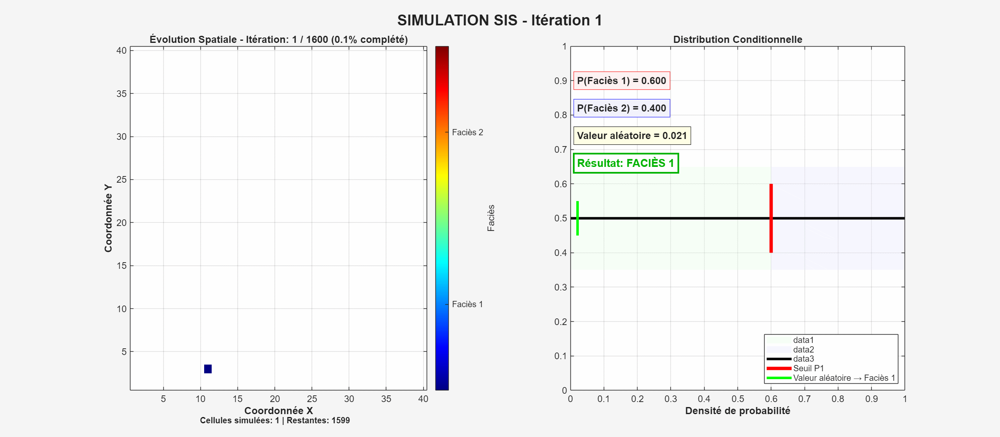{#fig-sis-anim fig-align="center" width="85%"}
:::

#### Remarques sur la méthode

Sur le plan spatial, la SIS autorise toutes les transitions entre faciès, car les probabilités de transition entre deux catégories $s_k$ et $s_{k'}$ ne sont soumises à aucune règle géologique. La probabilité de transition à une distance $\mathbf{h}$,

$$\mathbb{P}(Z(\mathbf{x} + \mathbf{h}) = s_{k'} \mid Z(\mathbf{x}) = s_k),$$

ne dépend que des variogrammes des indicatrices et des données locales. Rien n'interdit un contact : des faciès géologiquement incompatibles peuvent se retrouver côte à côte.

De plus, la méthode reproduit les variogrammes des indicatrices de chaque faciès $s_k$ pris isolément, mais ignore les covariances croisées entre les indicatrices. L'estimation des probabilités suppose en effet l'indépendance des fonctions indicatrices, alors qu'elles sont spatialement corrélées :

$$\operatorname{Cov}[i(\mathbf{x}; s_k), i(\mathbf{x} + \mathbf{h}; s_{k'})] \approx 0, \quad \forall k \neq k'.$$

Les relations spatiales asymétriques ou complexes — dépôt préférentiel d'un faciès sur un autre, intrusion mafique dans un encaissant — échappent donc à la SIS. Un voisinage restreint peut également freiner la reproduction des structures à longue portée. Enfin, la nature discrète de la simulation empêche la formation de frontières lisses entre les unités. Le krigeage d'indicatrices donne des probabilités qui sortent parfois de $[0, 1]$; la correction qui les y ramène altère la structure imposée, si bien que la covariance des indicatrices n'est en général pas fidèlement reproduite. Les seules exceptions sont l'effet de pépite pur et la covariance exponentielle en une dimension. Certains modèles, notamment le modèle gaussien, très régulier à l'origine, ne peuvent donc pas être respectés. Malgré ces limites, la SIS reste un standard pour les environnements à géométrie incertaine ou lorsque les données sont rares.

#### Exemples d'application

La @fig-sis-2d-iso présente une réalisation avec les probabilités $p_1 = 1/3$ (bleu), $p_2 = 1/2$ (vert) et $p_3 = 1/6$ (brun), pour un variogramme sphérique de portée $a = 50$. Toutes les transitions possibles s'y produisent, de façon isotrope.

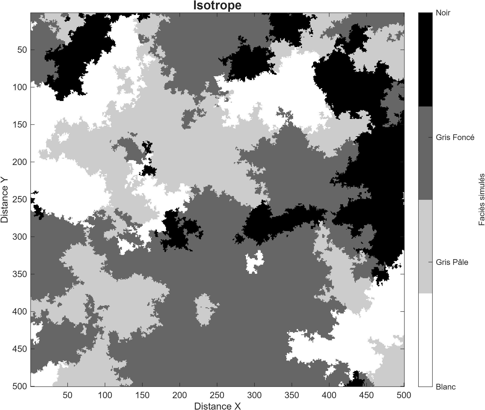{#fig-sis-2d-iso fig-align="center"}

La @fig-sis-2d-aniso montre une simulation à variogramme sphérique anisotrope ($a_x = 200$, $a_y = 10$). L'étirement des formes rapproche l'image d'unités sédimentaires réalistes, mais les transitions entre faciès restent celles du cas précédent.

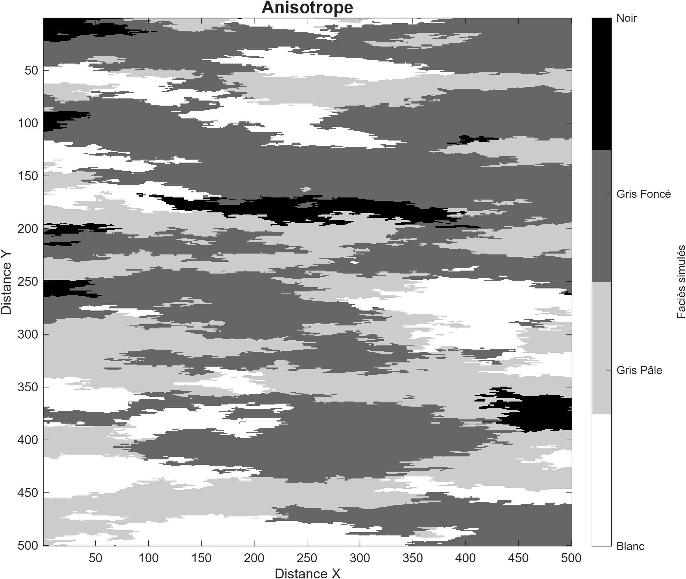{#fig-sis-2d-aniso fig-align="center"}

Enfin, la @fig-sis-3d présente une réalisation 3D plus complexe. La méthode brille là où les forages (lignes noires) sont rares et où la géométrie exacte des corps est difficile à poser *a priori*. C'est un exemple qui reproduit un réservoir pétrolier.

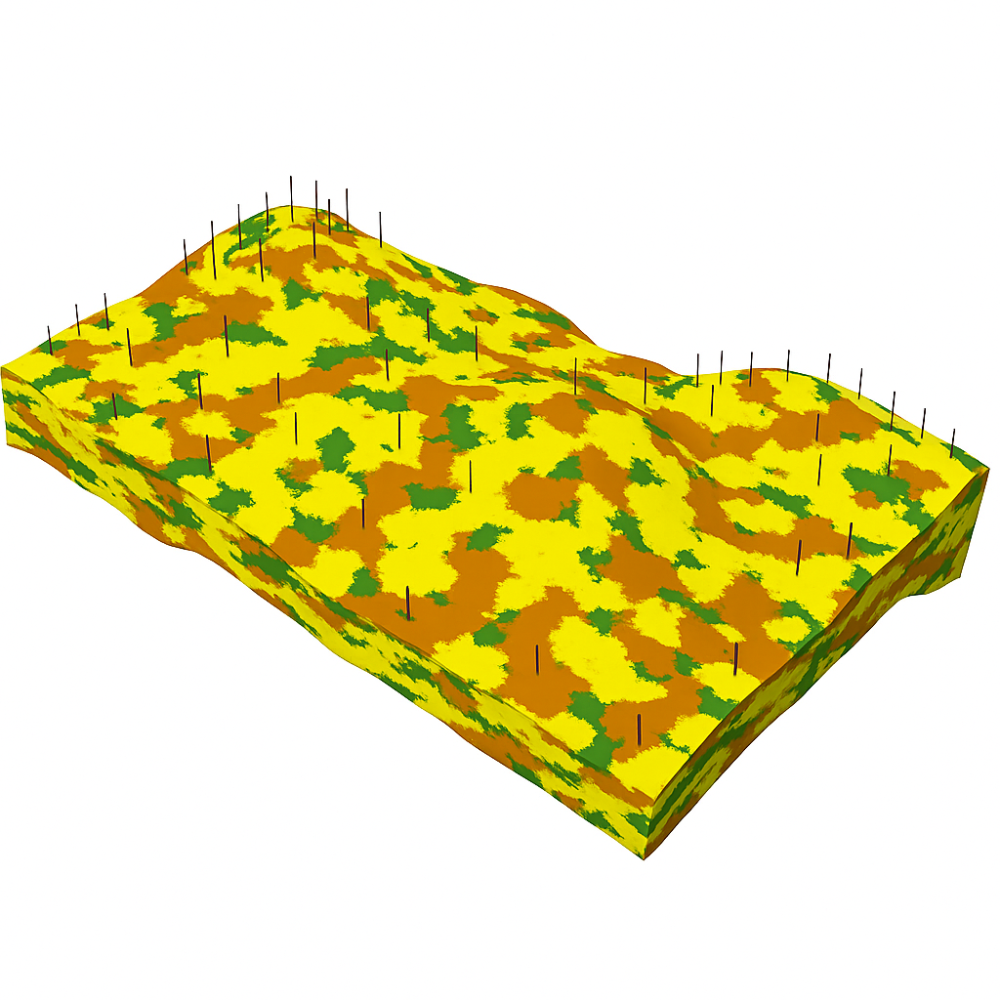{#fig-sis-3d fig-align="center"}

## 🧮 Atelier interactif 13.1 — Animation SIS {.unnumbered}

::: {.content-visible when-format="html"}
Lancez l'animation : la grille se remplit pixel par pixel le long d'un chemin aléatoire. Chaque pixel est échantillonné à partir de la loi locale obtenue par krigeage des indicatrices des voisins déjà simulés. Les proportions réalisées convergent vers les cibles au fil du remplissage.

:::

::: {.content-visible unless-format="html"}
Cet atelier n'est disponible que dans la version web.
:::

### Méthode par simulations tronquées

Les simulations tronquées génèrent des variables catégorielles à partir de champs continus gaussiens. Le principe est simple : on simule d'abord un ou plusieurs champs gaussiens par une méthode classique (LU, SGS, FFT-MA, bandes tournantes), puis on découpe ces champs continus en catégories à l'aide de seuils ou de zones de codage. On contrôle ainsi les proportions de chaque catégorie, on reproduit la continuité spatiale via le variogramme du champ gaussien, et — selon le modèle — on impose certaines relations spatiales entre faciès (transitions permises ou interdites, proportions variables).

Il y a deux variantes principales : la simulation gaussienne tronquée, qui découpe un seul champ gaussien en intervalles ordonnés; et la simulation plurigaussienne, plus souple, qui combine plusieurs champs gaussiens pour des organisations spatiales plus riches.

#### Simulation gaussienne tronquée

L'algorithme non conditionnel est assez simple.

1. **Ordonnancement des faciès.** 

Les faciès doivent être ordonnés (par exemple F1 < F2 < F3). Cet ordre fixe les transitions possibles : seuls les faciès successifs peuvent être contigus, ce qui interdit une transition directe F1–F3.

2. **Détermination des seuils gaussiens.** 

À partir des proportions globales, on calcule les seuils comme quantiles d'une loi normale standard $\mathcal{N}(0,1)$. Pour $K$ faciès ordonnés de proportions $p_1, \dots, p_K$, le seuil séparant le faciès $k$ du faciès $k+1$ est
   $$s_k = \Phi^{-1}\!\left( \sum_{j=1}^{k} p_j \right), \qquad s_0 = -\infty, \quad s_K = +\infty,$$
   où $\Phi$ est la fonction de répartition de $\mathcal{N}(0,1)$. Le faciès $k$ occupe l'intervalle $(s_{k-1}, s_k]$ du champ latent, que l'on prend de moyenne nulle et de variance unitaire.

3. **Application des seuils de codage.** 

On génère une simulation gaussienne non conditionnelle par une méthode classique (LU, SGS, FFT-MA, bandes tournantes). Chaque valeur du champ continu est comparée aux seuils de l'étape 2 : si elle tombe dans l'intervalle du faciès $k$, la cellule prend ce faciès. Le champ gaussien devient un champ catégoriel, aux proportions voulues et aux relations spatiales dictées par le modèle.

La @fig-C13_TGS1 présente un exemple à trois faciès $F_1$, $F_2$, $F_3$, de probabilités $p_1 = \frac{1}{3}$, $p_2 = \frac{1}{2}$, $p_3 = \frac{1}{6}$. Les seuils viennent de la fonction de répartition $\Phi$ de $\mathcal{N}(0,1)$. Le premier, $s_1$, à la transition $F_1$–$F_2$, vaut $s_1 = \Phi^{-1}(p_1) = \Phi^{-1}\!\left(\frac{1}{3}\right) = -0{,}43073$. Le second, $s_2$, à la transition $F_2$–$F_3$, cumule les deux premières proportions : $s_2 = \Phi^{-1}(p_1 + p_2) = \Phi^{-1}\!\left(\frac{5}{6}\right) = 0{,}96742$. Toute valeur gaussienne inférieure à $s_1$ est codée $F_1$, entre $s_1$ et $s_2$ codée $F_2$, au-delà de $s_2$ codée $F_3$. Avec un variogramme gaussien de portée 50 et ces proportions, on obtient le champ de la @fig-C13_TGS2 : la transition de $F_1$ (bleu) à $F_3$ (rouge) passe obligatoirement par $F_2$ (vert), donc $F_1$ et $F_3$ ne sont jamais contigus. L'ordre des faciès doit donc respecter les relations observées.

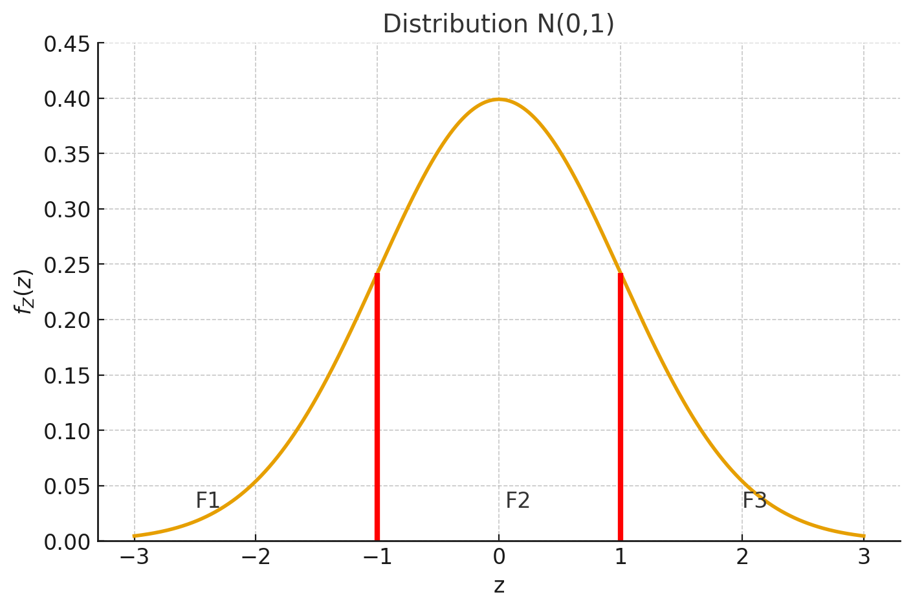{#fig-C13_TGS1 fig-align="center"}

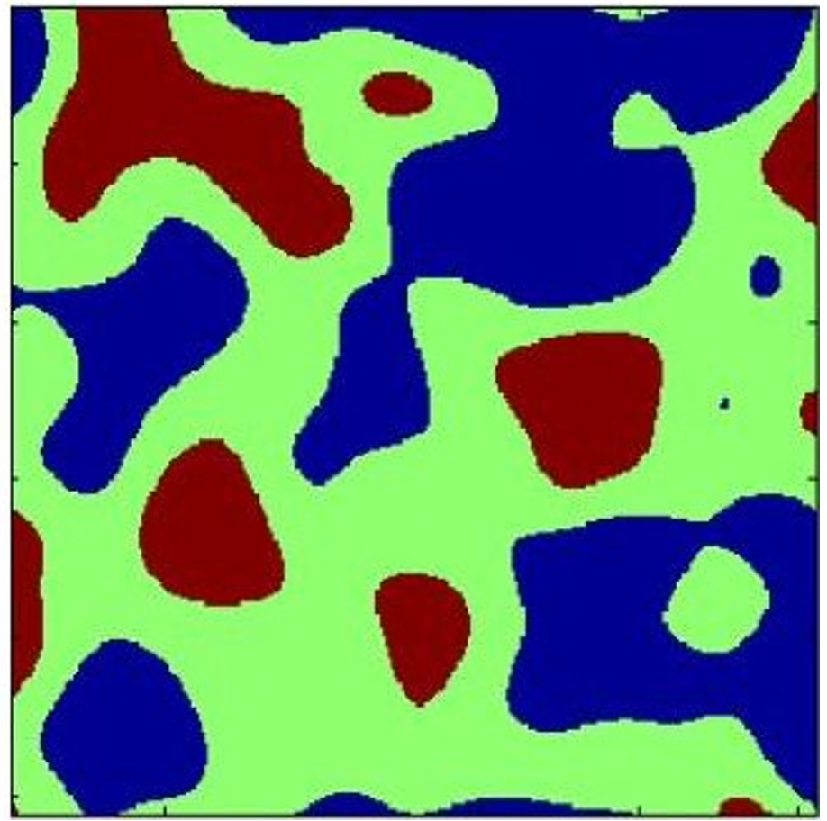{#fig-C13_TGS2 fig-align="center"}

##### Comment déterminer le variogramme de la variable latente gaussienne?

Une difficulté de la TGS réside dans l'identification de la structure spatiale du champ latent. Les données ne sont que des faciès, des variables catégorielles : on n'a donc aucune variable continue pour estimer directement le variogramme du champ gaussien latent. Tout ce qu'on a, ce sont les variogrammes des indicatrices, qui ne fournissent pas un variogramme latent unique. Il faut effectuer quelques manipulations pour relier les variogrammes des indicateurs à la structure latente continue.

Pour contourner l'obstacle, la TGS s'appuie sur une calibration indirecte, fondée sur les probabilités conjointes estimables à partir des faciès. Ces probabilités sont des intégrales de la loi binormale définie par la covariance latente inconnue. La stratégie consiste à ajuster la covariance (ou le variogramme) du champ latent pour que les probabilités binormales collent au mieux aux probabilités expérimentales.

On note $W(\mathbf{x})$ le faciès observé et $Z(\mathbf{x})$ le champ gaussien latent, le premier obtenu par troncature du second. Soit
$$
p_{ij}(\mathbf{h}) = \mathbb{P}\big( W(\mathbf{x})=i,\; W(\mathbf{x}+\mathbf{h})=j \big) = \mathbb{E}\!\left[ I_i(\mathbf{x})\, I_j(\mathbf{x}+\mathbf{h}) \right]
$$
la probabilité d'observer le faciès $i$ en $\mathbf{x}$ et le faciès $j$ en $\mathbf{x}+\mathbf{h}$. Elle s'estime directement : pour chaque séparation $\mathbf{h}$, on compte les paires $(\mathbf{x}, \mathbf{x}+\mathbf{h})$ où l'on observe à la fois $W(\mathbf{x})=i$ et $W(\mathbf{x}+\mathbf{h})=j$, puis on normalise par le nombre total de paires. $p_{ij}(\mathbf{h})$ est donc une simple fréquence relative observée :

$$
\hat p_{ij}(\mathbf{h}) = \frac{1}{N(\mathbf{h})} \sum_{(\mathbf{x},\,\mathbf{x}+\mathbf{h})} \mathbb{1}\{ W(\mathbf{x})=i \}\,\mathbb{1}\{ W(\mathbf{x}+\mathbf{h})=j \},
$$

où $N(\mathbf{h})$ est le nombre de paires séparées de $\mathbf{h}$ et $\mathbb{1}\{\cdot\}$ la fonction indicatrice. Comme chaque faciès $i$ correspond à l'intervalle de troncature $[s_{i-1}, s_i]$ du champ latent,
$$
W(\mathbf{x})=i \quad \Longleftrightarrow \quad s_{i-1} < Z(\mathbf{x}) \le s_i,
$$
la probabilité conjointe s'écrit aussi
$$
p_{ij}(\mathbf{h})
= \mathbb{P}\left( s_{i-1} < Z(\mathbf{x}) \le s_i,\; s_{j-1} < Z(\mathbf{x}+\mathbf{h}) \le s_j \right).
$$

Or cette probabilité se calcule théoriquement comme l'intégrale de la densité binormale définie par la covariance latente $C(\mathbf{h})$. Pour chaque séparation $\mathbf{h}$, les probabilités expérimentales $p_{ij}(\mathbf{h})$ imposent donc une contrainte sur la covariance $C(\mathbf{h})$. L'objectif est alors d'identifier la covariance $C(\mathbf{h})$ qui minimise l'écart entre les probabilités théoriques $p_{ij}(\mathbf{h})$ du modèle binormal et leurs estimations empiriques $\hat p_{ij}(\mathbf{h})$. La relation entre $C(\mathbf{h})$ et les probabilités conjointes n'est en général pas inversible analytiquement; on l'ajuste numériquement, sauf dans le cas particulier d'un seuil placé à $y = 0$, où l'inversion devient directe.

La @fig-C13_TGS3 présente le calcul théorique du modèle binormal. La surface colorée est la densité de la loi normale bidimensionnelle du couple gaussien corrélé $(Z(\mathbf{x}), Z(\mathbf{x}+\mathbf{h}))$. Les lignes rouges marquent les seuils $(s_{i-1}, s_i)$ et $(s_{j-1}, s_j)$ des faciès $i$ et $j$. La probabilité conjointe $p_{ij}(\mathbf{h})$ est l'intégrale de cette densité sur le rectangle délimité par ces seuils :
$$
p_{ij}(\mathbf{h})
= \iint_{\substack{s_{i-1} < u \le s_i \\[2pt] s_{j-1} < v \le s_j}}
f_{Z(\mathbf{x}),Z(\mathbf{x}+\mathbf{h})}(u,v)\,\mathrm{d}u\,\mathrm{d}v,
$$
où $f_{Z(\mathbf{x}),Z(\mathbf{x}+\mathbf{h})}(u,v)$ est la densité normale bidimensionnelle de moyenne nulle, de variance unitaire et de covariance $C(\mathbf{h})$.

La @fig-C13_TGS4 présente les probabilités $p_{ij}(\mathbf{h})=\mathbb{E}[ I_i\, I_j ]$ du modèle TGS considéré (rappel : $p_1 = \tfrac{1}{3}$, $p_2 = \tfrac{1}{2}$, $p_3 = \tfrac{1}{6}$). Les probabilités de la diagonale décroissent : plus la séparation $\lVert\mathbf{h}\rVert$ augmente, moins il est probable de tomber sur deux points du même faciès. Hors diagonale, l'inverse : les transitions entre faciès distincts deviennent plus probables avec la distance. Pour $\mathbf{h} = \mathbf{0}$, on retrouve bien $p_{ii}(\mathbf{0})=p_i$ pour $i=1,\ldots,3$, tandis que les probabilités entre faciès différents ($i \neq j$) sont nulles. Et lorsque $\lVert\mathbf{h}\rVert \to \infty$, elles convergent vers $p_{ij}(\mathbf{h})=p_i\,p_j$.

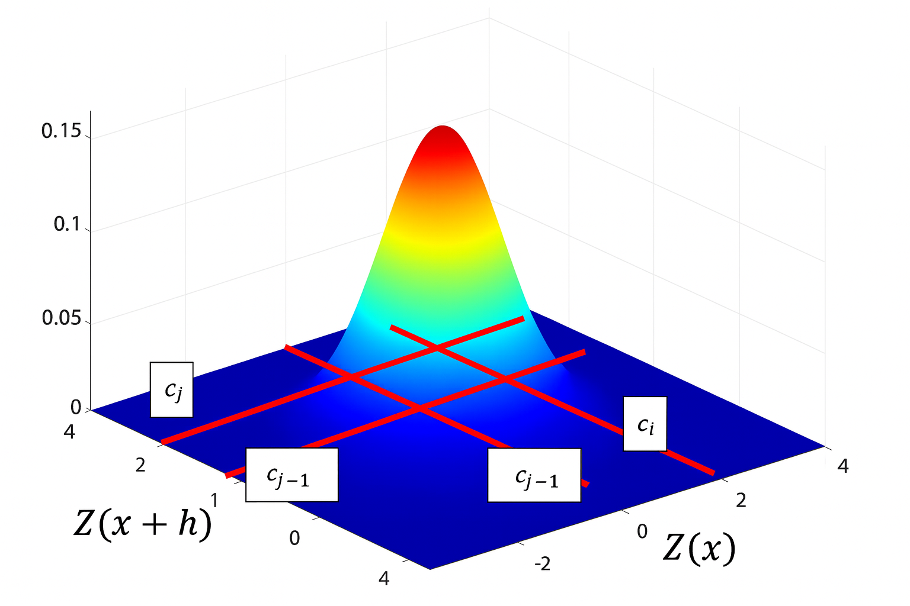{#fig-C13_TGS3 fig-align="center"}

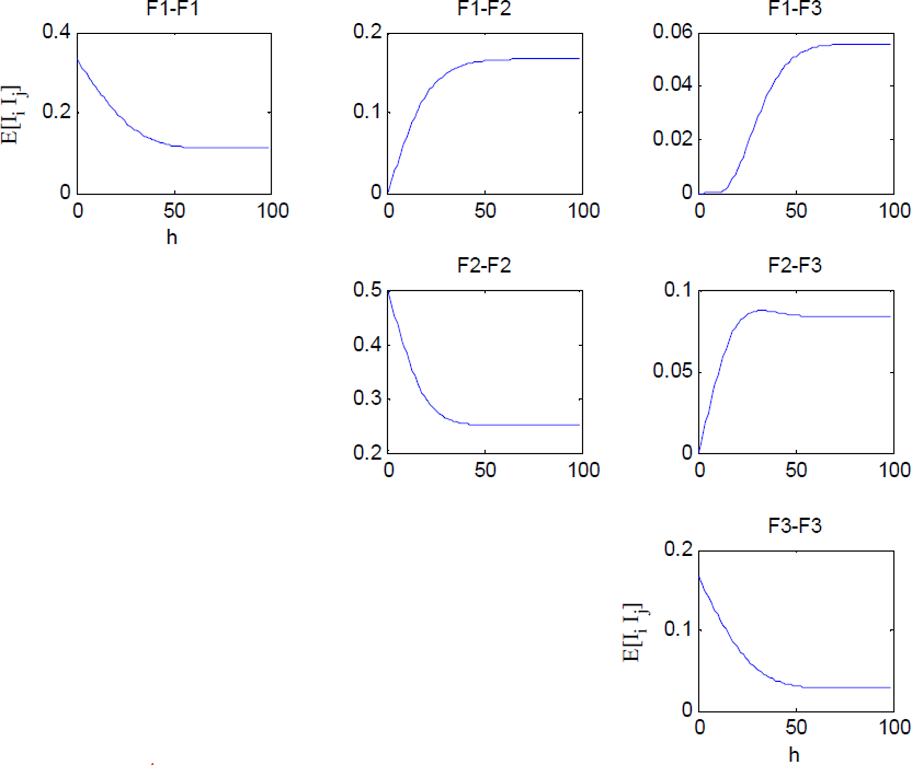{#fig-C13_TGS4 fig-align="center"}

##### Comment tenir compte des faciès observés aux points d'échantillonnage?

Pour tenir compte des faciès observés, on utilise un échantillonnage de Gibbs. C'est une méthode de Monte-Carlo par chaînes de Markov (MCMC) qui échantillonne une distribution en construisant une chaîne de Markov dont la loi stationnaire est justement la loi cible. Pour une loi $\pi$ sur un espace $\Omega$, l'algorithme produit une suite d'échantillons dont la loi limite est $\pi$.

En TGS, le Gibbs est nécessaire, car les valeurs latentes $Z(\mathbf{x})$ ne sont pas observables : seules les catégories $W(\mathbf{x})$, issues de la troncature, le sont. Chaque faciès $i$ correspond à un intervalle $[s_{i-1}, s_i]$ : si $\mathbf{x}_\alpha$ appartient au faciès $i$, alors la valeur latente vérifie forcément $s_{i-1} < Z(\mathbf{x}_\alpha) \le s_i$. Le Gibbs échantillonne donc, en chaque point observé, une valeur latente $Z(\mathbf{x}_\alpha)$ compatible à la fois avec la covariance $C(\mathbf{h})$ et avec les contraintes de troncature des faciès observés.

L'algorithme repose sur des krigeages simples successifs, qui fournissent la loi conditionnelle d'une variable gaussienne en un point. À chaque itération, on met à jour une valeur latente à partir des autres. Les itérations se déroulent ainsi.

**Initialisation.** 

Pour chaque point échantillonné $\mathbf{x}_i$, tirer au hasard une valeur gaussienne $Z(\mathbf{x}_i)$ dans l'intervalle du faciès observé :
$$
W(\mathbf{x}_i)=k \quad \Longrightarrow \quad Z(\mathbf{x}_i) \in (s_{k-1}, s_k].
$$
L'initialisation respecte donc le codage.

1. **Sélection d'un point.** 

Choisir un point $\mathbf{x}_i$ au hasard parmi les $N$ points à conditionner. Retirer temporairement sa valeur courante $Z(\mathbf{x}_i)$.

2. **Estimation de la loi conditionnelle.** 

Estimer la loi conditionnelle de $Z(\mathbf{x}_i)$ compte tenu des autres valeurs latentes,
   $$
   Z(\mathbf{x}_i)\,\mid\,Z(\text{reste}) \sim \mathcal{N}(\hat Z(\mathbf{x}_i),\sigma_i^2),
   $$
   où $(\hat Z(\mathbf{x}_i),\sigma_i^2)$ viennent du krigeage simple.

3. **Échantillonnage tronqué.** 

Comme $W(\mathbf{x}_i)=k$, tirer une nouvelle valeur de $Z(\mathbf{x}_i)$ dans la loi normale tronquée à l'intervalle du patron de codage,
   $$
   Z(\mathbf{x}_i) \sim \mathcal{N}(\hat Z(\mathbf{x}_i),\sigma_i^2)\;\text{tronquée à}\;(s_{k-1},s_k].
   $$

4. **Mise à jour.** 

Remplacer l'ancienne valeur de $Z(\mathbf{x}_i)$ par la nouvelle.

5. **Critère d'arrêt.** 

Vérifier un critère de convergence (nombre d'itérations, stabilité des moments, autocorrélation). Si le critère est satisfait, arrêter; sinon, retourner à l'étape 1.

Au terme des itérations, on obtient des valeurs gaussiennes corrélées selon $C(\mathbf{h})$ et satisfaisant aux seuils. Le Gibbs produit ainsi un champ latent $Z(\mathbf{x})$ qui respecte à la fois la structure spatiale imposée par le variogramme et les faciès observés à travers les intervalles de codage.

#### Simulations plurigaussiennes

Le modèle plurigaussien étend le modèle gaussien tronqué en combinant plusieurs variables gaussiennes corrélées, pour des faciès aux relations spatiales plus complexes. Pour simplifier, on s'en tient à deux champs latents. L'algorithme se résume ainsi.

1. **Simulation de deux champs gaussiens.** 

Simuler deux variables gaussiennes $Z_1$ et $Z_2$ avec la matrice de covariance
   $$\mathbf{C}(\mathbf{h})=\begin{bmatrix} C_{11}(\mathbf{h}) & C_{12}(\mathbf{h}) \\ C_{21}(\mathbf{h}) & C_{22}(\mathbf{h}) \end{bmatrix}.$$
   Chaque champ a son propre variogramme direct, et les deux peuvent être corrélés via les covariances croisées $C_{12}(\mathbf{h})$ et $C_{21}(\mathbf{h})$.

2. **Définition du plan de codage des faciès.** 

Associer chaque faciès à une zone (rectangle ou autre forme) du plan $(Z_1, Z_2)$. Ce plan encode les relations spatiales voulues (exclusions, transitions obligatoires, voisinages imposés). Les proportions des faciès sont l'intégrale de la densité gaussienne bivariée sur les zones définies.

3. **Inférence des paramètres.** 

Calculer les covariances expérimentales des indicatrices et leurs covariances croisées, puis ajuster les modèles de covariance des deux champs latents et leur corrélation pour reproduire au mieux les structures observées.

4. **Conditionnement aux données observées (échantillonneur de Gibbs).** 

Pour chaque point d'observation $\mathbf{x}_i$, appliquer un Gibbs où la loi conditionnelle de $(Z_1(\mathbf{x}_i), Z_2(\mathbf{x}_i))$ vient d'un cokrigeage simple, conditionnellement aux valeurs latentes déjà fixées : calculer la loi normale conjointe conditionnelle $(Z_1, Z_2)\,\mid\,\text{reste}$ par cokrigeage simple; tirer une paire $(z_1, z_2)$ dans cette loi; vérifier qu'elle appartient à la zone du faciès observé; sinon, retirer jusqu'à obtenir une paire compatible; mettre à jour la valeur latente et passer au point suivant. On répète le balayage jusqu'à convergence du Gibbs.

5. **Simulation conditionnelle finale.** 

Réaliser une simulation gaussienne conditionnelle complète des champs $Z_1$ et $Z_2$ à partir des valeurs obtenues au conditionnement, puis convertir en faciès à l'aide du plan de codage.

La @fig-C13_TGS5 présente un patron de codage complexe. Si l'on observe par exemple $Z_1 = -1$ et $Z_2 = 1$, le couple $(-1, 1)$ tombe dans le rectangle du faciès $F_1$, qui est donc attribué. La @fig-C13_TGS6 applique ce patron à deux champs gaussiens indépendants. Le champ $Z_1(\mathbf{x})$ suit un variogramme sphérique isotrope de portée 150 pixels, le champ $Z_2(\mathbf{x})$ un variogramme sphérique isotrope de portée 260 pixels, sur une grille de 500 × 500. Quand les deux champs sont indépendants, comme ici, la proportion d'un faciès se lit directement comme l'aire de sa zone dans le plan $(Z_1, Z_2)$, pondérée par la densité gaussienne bivariée; une corrélation entre $Z_1$ et $Z_2$ déforme cette correspondance.

Les relations spatiales entre faciès sont très complexes, mais le patron impose clairement certaines structures : le faciès $F_4$ est entièrement contenu dans $F_3$, tandis que $F_1$, $F_2$ et $F_3$ baignent dans $F_0$ et ne peuvent donc jamais se toucher.

La @fig-C13_TGS7 présente quatre images : une image réelle aux rayons X des pores d'un grès, et trois réalisations PGS qui en reproduisent la structure. Laquelle est la vraie? Celle en haut à gauche. Les simulations sont assez réalistes pour rendre la distinction difficile, voire impossible.

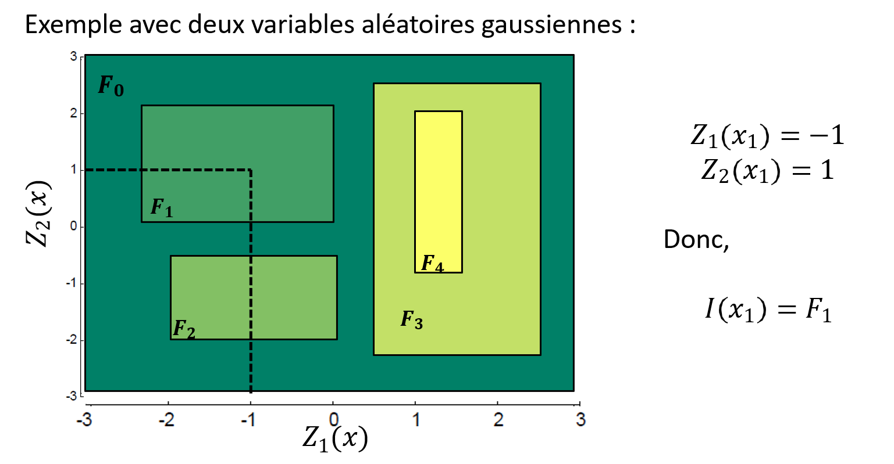{#fig-C13_TGS5 fig-align="center"}

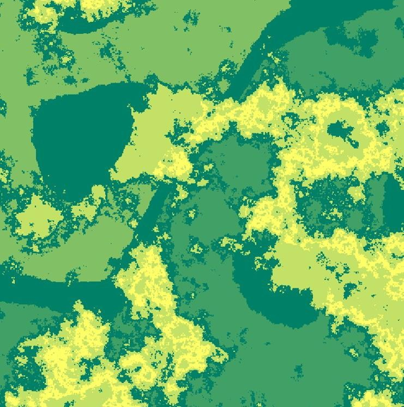{#fig-C13_TGS6 fig-align="center"}

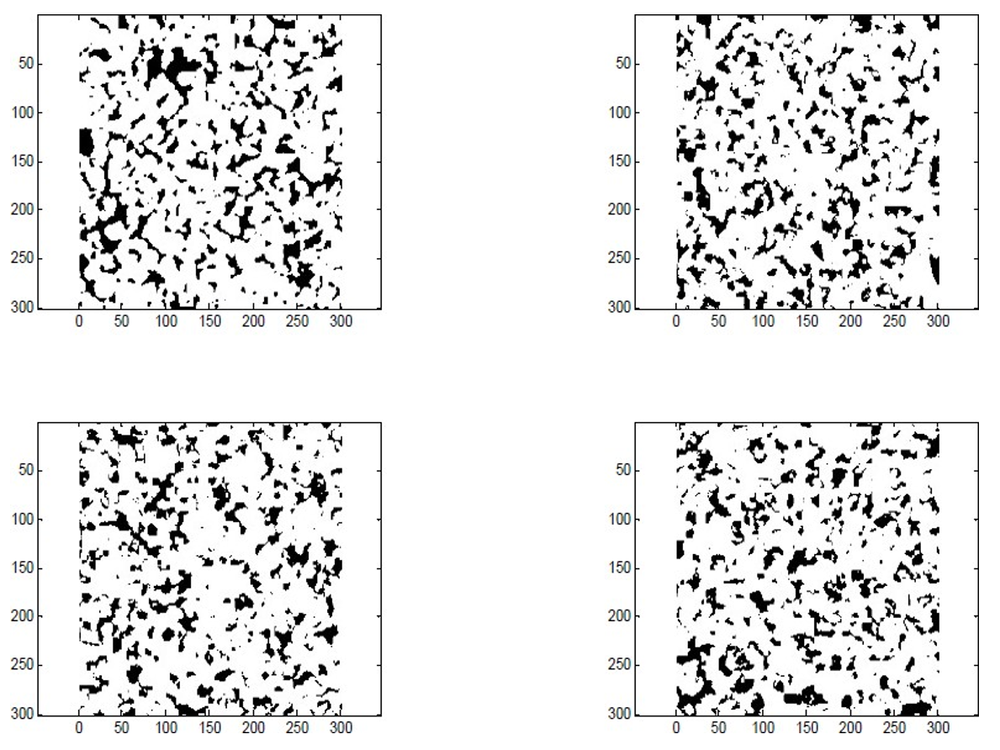{#fig-C13_TGS7 fig-align="center"}

## 🧮 Atelier interactif 13.2 — Simulations tronquées : TGS et PGS {.unnumbered}

::: {.content-visible when-format="html"}
Un seul atelier pour les deux variantes (bouton de bascule). En TGS, un seul champ gaussien $Y_1$ : le patron de codage se réduit à des seuils sur $Y_1$ (bandes verticales). En PGS, deux champs $Y_1, Y_2$ : le patron est une carte 2D du plan $(Y_1, Y_2)$, qui autorise des relations spatiales bien plus riches. Dessinez le patron à la main (cliquez-glissez) : le champ de faciès se recode instantanément. Observez qu'en TGS deux faciès non adjacents ne peuvent jamais se toucher, alors qu'en PGS on peut imposer qu'un faciès en enveloppe un autre.

:::
::: {.content-visible unless-format="html"}
Cet atelier n'est disponible que dans la version web.
:::

