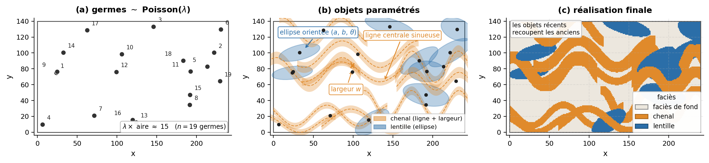

## Modélisation de faciès basée sur des objets

La modélisation basée sur des objets représente les unités géologiques sous la forme de géométries paramétrées, plutôt que d’attribuer directement une catégorie à chaque cellule du modèle. Elle se distingue ainsi des approches pixelisées ou par cellules, comme les simulations fondées sur des indicatrices et certaines méthodes multipoints. Les méthodes basées sur les processus constituent une famille apparentée, mais distincte : elles cherchent à reproduire les mécanismes de formation ou d’évolution des structures géologiques, plutôt qu’à placer directement des objets dont la géométrie est prescrite.

Dans une approche par objets, des formes représentant des corps géologiques sont introduites successivement dans un faciès de fond. Leur position, leur orientation, leurs dimensions et leur géométrie sont tirées de distributions définies à partir des connaissances géologiques et des données disponibles. Le processus se poursuit jusqu’à satisfaire des critères tels que les proportions de faciès visées, les règles d’interaction entre les objets et le conditionnement aux observations.

Les objets peuvent représenter, par exemple, des chenaux, des lobes, des dunes, des lentilles, des veines ou des corps intrusifs. Leur paramétrisation s’appuie généralement sur des observations d’affleurements, des environnements actuels, des données sismiques ou des modèles conceptuels du système géologique étudié.

L’intérêt principal de cette approche réside dans sa capacité à reproduire explicitement la géométrie et la continuité des corps géologiques. Les réalisations peuvent présenter des limites nettes, des formes curvilignes, des rapports particuliers entre longueur, largeur et épaisseur, ainsi que des règles de superposition, d’érosion ou d’intersection. Ces caractéristiques sont difficiles à contrôler à partir des seules statistiques à deux points utilisées par les méthodes géostatistiques classiques.

Le réalisme visuel ne garantit toutefois pas que le modèle soit géologiquement ou statistiquement adéquat. Les résultats dépendent fortement du choix des familles d’objets, de leurs paramètres géométriques et des règles qui régissent leurs interactions. Le conditionnement à des données nombreuses peut également devenir difficile, puisqu’un objet doit généralement être déplacé, redimensionné ou rejeté lorsqu’il contredit une observation.

La présente section expose les principes de base de la modélisation par objets, ses principaux paramètres, ses méthodes de conditionnement et ses limites, sans chercher à couvrir l’ensemble de ses variantes.

### Concepts

Le principe consiste à imposer directement la géométrie des corps géologiques. On part d'un faciès de fond, puis on dépose des objets paramétrés jusqu'à atteindre les proportions visées. Les objets récents recoupent les plus anciens, ce qui reproduit des relations de superposition réalistes. La vraie difficulté réside dans le conditionnement aux données, qui contraint le placement des objets.

### Le modèle booléen

Le cadre le plus courant est le modèle booléen (*Boolean model*), également appelé processus ponctuel marqué (*marked point process*). On tire d'abord des points dans l'espace selon un processus de Poisson d'intensité $\lambda$ : ces points, les germes, déterminent l'emplacement des objets. À chaque germe $\mathbf{x}_i$, on attache un objet $A_i$, un compact (chenal, lentille, ellipsoïde), tiré indépendamment selon la même loi de forme. L'ensemble simulé est l'union de ces objets translatés sur leurs germes,
$$
X = \bigcup_i \tau_{\mathbf{x}_i} A_i,
$$
où $\tau_{\mathbf{x}_i}$ est la translation au point $\mathbf{x}_i$. Les objets peuvent se recouper; l'espace se partage alors en deux phases, les objets et le faciès de fond qui les entoure (@fig-c13-modele-booleen).

{#fig-c13-modele-booleen fig-align="center" width="100%"}

Le modèle dépend de deux jeux de paramètres. L'intensité $\lambda$ du processus de Poisson détermine le nombre d'objets, donc la proportion du faciès de fond. La loi des objets décrit la distribution de leurs formes, de leurs tailles et de leurs orientations. On la calibre sur l'interprétation géologique : largeur et sinuosité des chenaux mesurées sur des analogues d'affleurement, épaisseur des lentilles, direction du paléocourant.

### Conditionnement aux données

Le conditionnement aux forages se fait par acceptation–rejet : on génère des réalisations non conditionnelles et on ne conserve que celles qui respectent les faciès observés. Tant que peu d'objets sont contraints, cela reste praticable. Mais dès qu'un même objet doit recouper plusieurs points imposés, ou que la densité de forages augmente, le taux de rejet explose et l'algorithme converge très lentement, voire pas du tout. C'est la faiblesse majeure de l'approche, et la raison pour laquelle on lui préfère parfois les méthodes par cellules quand les données abondent.

La modélisation par objets produit donc des géométries nettes et géologiquement réalistes, difficiles à obtenir autrement, mais au prix d'un conditionnement délicat. Elle convient surtout aux contextes où les corps ont des formes bien identifiées et où les données restent rares, par exemple un réservoir fluviatile reconnu par quelques puits.

## 🧮 Atelier interactif 13.3 — Modélisation par objets : chenaux et lentilles {.unnumbered}

::: {.content-visible when-format="html"}
Déposez des chenaux (rubans sinueux) et des lentilles (ellipses) sur un fond argileux, et réglez leur géométrie (nombre, largeur, sinuosité, longueur d'onde, pente, taille des lentilles). On obtient des formes réalistes — chenaux sinueux qui se recoupent, lentilles — que les méthodes pixel (SIS, TGS/PGS) reproduisent difficilement.

:::
::: {.content-visible unless-format="html"}
Cet atelier n'est disponible que dans la version web.
:::
