## Modélisation de faciès par simulation multipoints

Les méthodes de simulation multipoints (*Multiple-Point Statistics*, MPS) ont été développées pour représenter des structures spatiales qui ne sont pas suffisamment décrites par les statistiques à deux points. Un variogramme mesure la dépendance entre les valeurs prises en deux positions séparées par un vecteur donné. Il renseigne ainsi sur la portée, l’anisotropie et l’intensité de la continuité spatiale, mais pas directement sur l’organisation conjointe de plusieurs points.

Cette limite est illustrée à la @fig-C13_MPS1. Trois champs de faciès présentant des géométries nettement différentes peuvent produire des variogrammes expérimentaux très semblables dans leurs directions principales. Des structures distinctes peuvent donc partager des statistiques à deux points comparables sans présenter la même connectivité, la même géométrie ni la même organisation spatiale.

{#fig-C13_MPS1 fig-align="center"}

Les méthodes multipoints décrivent plutôt la fréquence d’apparition de configurations formées par plusieurs cellules. Cette information est extraite d’une image d’entraînement (*training image*, TI), qui représente un modèle conceptuel de l’organisation spatiale attendue. La TI ne constitue pas nécessairement une reproduction du site étudié : elle doit surtout représenter les géométries, les proportions, les relations entre faciès et les styles de continuité jugés plausibles.

En parcourant l’image d’entraînement à l’aide d’un gabarit spatial, on recense les configurations de faciès observées et leur fréquence. Ces statistiques multipoints permettent notamment de représenter des formes curvilignes, des objets connectés, des terminaisons, des bifurcations ou des relations spatiales entre plusieurs unités, qui ne sont pas déterminées par le seul variogramme.

Les méthodes MPS sont particulièrement utiles lorsque les propriétés importantes du modèle concernent la géométrie et la connectivité des faciès, lorsque des structures différentes présentent des statistiques à deux points similaires, ou lorsqu’aucun modèle géométrique paramétrique simple ne permet de représenter adéquatement l’organisation géologique. Leur pertinence dépend toutefois fortement de la qualité et de la représentativité de l’image d’entraînement.

#### Principe général : reproduire les motifs d’une image d’entraînement

L’image d’entraînement peut provenir d’une interprétation géologique, d’un analogue, d’une carte, d’une image de télédétection, d’un modèle fondé sur des objets ou d’une simulation de processus. Elle fournit un exemple exhaustif du type d’organisation spatiale que l’on souhaite reproduire, mais elle n’est généralement pas conditionnée aux données du site.

La simulation est ensuite construite sur une grille cible, cellule par cellule ou par groupes de cellules. À chaque étape, la configuration déjà connue autour de la position à simuler est comparée aux motifs observés dans la TI. La valeur attribuée provient de la distribution conditionnelle associée aux configurations similaires.

La réalisation obtenue ne constitue donc pas une copie de l’image d’entraînement. Elle représente une nouvelle configuration qui respecte les données de conditionnement tout en reproduisant, de manière statistique, les motifs et les relations spatiales présents dans la TI.

#### Méthode 1 : la simulation point par point (pixel par pixel)

La simulation multipoints, point par point, construit le modèle séquentiellement, un emplacement à la fois, à partir des informations déjà simulées dans un voisinage local. À chaque nouveau point, on prend la configuration (le *pattern*) déjà présente autour de lui et on cherche dans la TI les motifs semblables. De ces motifs, on tire une loi conditionnelle empirique pour la catégorie à simuler. Le processus se décrit ainsi.

1. **Initialisation du modèle.** 

Le champ simulé démarre avec les valeurs connues (données observées) et des cellules encore vides.

2. **Définition du voisinage de simulation.** 

Pour un point non simulé, on considère un voisinage structuré (fenêtre ou gabarit) qui contient les valeurs déjà simulées, utilisées comme condition.

3. **Recherche de motifs similaires dans la TI.** 

On compare le voisinage partiellement rempli à toutes les occurrences semblables de la TI. On repère ainsi les positions où le motif correspond, exactement ou à une tolérance près.

4. **Construction de la distribution conditionnelle.** 

Des occurrences repérées, on extrait la catégorie présente au centre du motif dans la TI. La distribution des catégories possibles approche la loi conditionnelle multipoints.

5. **Attribution d'une catégorie.** 

On tire une catégorie au hasard selon cette loi empirique, et on l'attribue au point courant.

6. **Répétition séquentielle.** 

On répète pour tous les points du domaine, selon un chemin de visite (souvent aléatoire), jusqu'à ce que la grille soit remplie.

La @fig-C13_MPS2 illustre la méthode pixel par pixel dans un cas simple. On veut simuler le faciès du carré rouge. On cherche dans la TI les occurrences où la même configuration de trois faciès déjà simulés apparaît autour d'un point, et on relève la catégorie du centre de chacun d'eux. Si le motif apparaît 7 fois dans la TI, dont 2 avec un centre bleu et 5 avec un centre jaune, la loi conditionnelle estimée est $\hat p(\text{bleu}) = 2/7 \approx 29\,\%$, $\hat p(\text{jaune}) = 5/7 \approx 71\,\%$, $\hat p(\text{vert}) = 0$. On tire alors le faciès du point selon cette loi. Sur une vraie image d'entraînement, le décompte porte sur bien plus de répliques, ce qui stabilise les proportions.

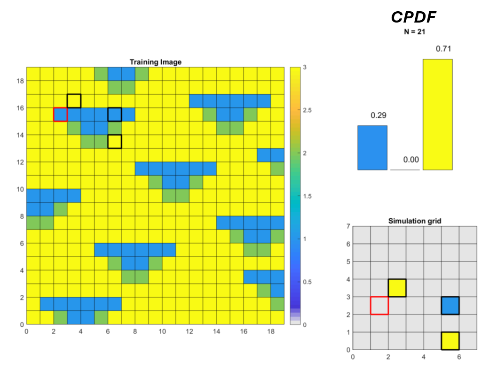{#fig-C13_MPS2 fig-align="center"}

La méthode pixel par pixel suppose que la TI fournisse suffisamment d'exemples pour représenter les motifs de voisinage rencontrés. Quand le motif recherché est absent ou trop rare, deux stratégies : réduire la taille du voisinage pour augmenter les chances de trouver des occurrences (au prix d'une perte d'information contextuelle); ou autoriser des correspondances approximatives (distance de similarité non nulle), au prix d'un compromis entre fidélité géologique et robustesse.

L'approche est conceptuellement simple et fonde l'algorithme **SNESIM** [@Strebelle2002], qui stocke au préalable les configurations de la TI dans un arbre de recherche (*search tree*) pour accélérer la recherche. Elle peut devenir coûteuse quand la TI est importante ou les motifs rares. On passe alors au *Direct Sampling* [@MariethozRenard2010] : une simulation point par point qui parcourt la TI selon un chemin aléatoire et s'arrête au premier motif dont la distance au voisinage tombe en deçà d'un seuil, ce qui évite de balayer toute la TI.

#### Méthode 2 : la simulation par morceaux (*patch-based*)

La simulation multipoints par morceaux reproduit les structures en copiant-collant des blocs (patchs) extraits de la TI, plutôt que de simuler pixel par pixel. Elle convient aux objets géologiques à formes continues ou à textures complexes, difficiles à générer point par point. Il y a deux grandes variantes : **FilterSim** [@ZhangFilterSim2006], qui décrit chaque patch par un jeu de filtres avant de le comparer au voisinage, et l'*image quilting* [@EfrosFreeman2001], qui assemble les patchs en cherchant une couture optimale sur leur recouvrement. La démarche générale se déroule ainsi.

1. **Définition d'un ensemble de patchs.** On extrait de la TI des blocs de taille fixe (par exemple 8×8 ou 16×16 pixels), qui serviront de motifs de référence.

2. **Caractérisation des patchs.** Chaque patch est décrit par des mesures spatiales (textures, gradients, statistiques locales) pour faciliter la comparaison (@fig-C13_MPS3).

3. **Regroupement des patchs.** On regroupe les patchs similaires (*clustering*) pour accélérer la recherche de motifs compatibles.

4. **Simulation par collage adaptatif.** Au remplissage de la grille, on compare le voisinage déjà simulé aux patchs candidats, on choisit le patch qui minimise une mesure de dissimilarité, et on le colle à l'emplacement courant en conservant les pixels déjà simulés.

5. **Gestion du recouvrement.** Pour éviter les artefacts aux frontières des patchs, certaines variantes utilisent des zones de transition lissées, un chemin de coupure optimal (méthode *image quilting*) ou une fusion statistique locale.

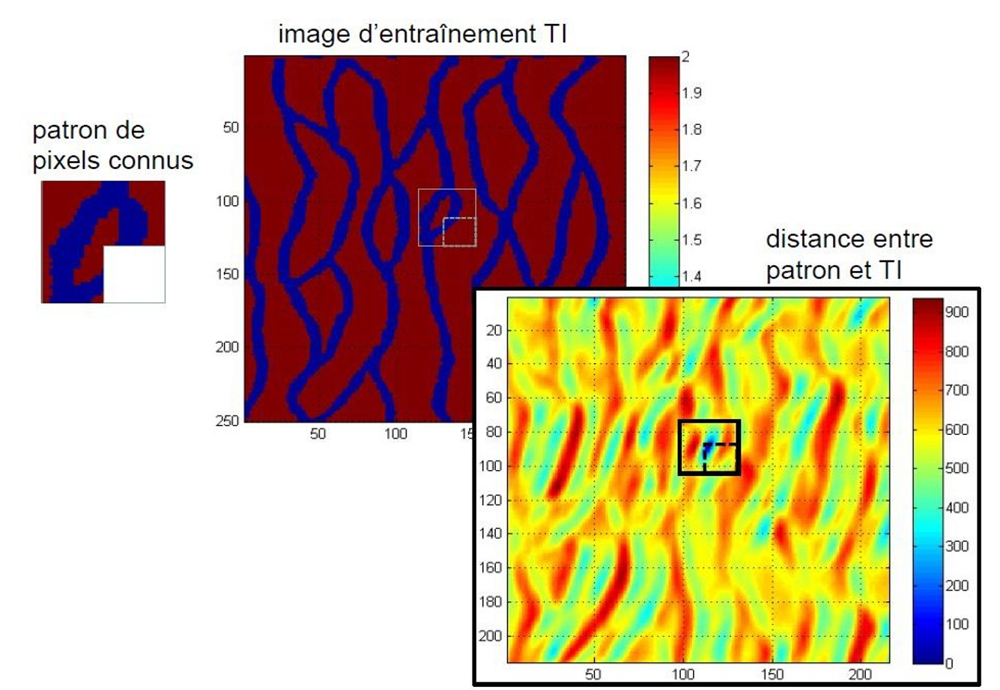{#fig-C13_MPS3 fig-align="center"}

Les méthodes par patchs ont plusieurs atouts (@fig-C13_MPS4). Elles reproduisent très fidèlement les motifs structuraux de la TI, ce qui en fait un outil efficace pour les géométries complexes. Elles sont robustes pour les architectures à grande échelle, où la continuité des objets compte. Et elles s'adaptent bien aux textures non stationnaires ou multi-échelles, car les patchs captent directement les variations locales de structure. Elles ont aussi une limite nette : des discontinuités peuvent apparaître aux jonctions entre patchs si la fusion n'est pas optimale. La qualité de la transition dépend beaucoup de la taille des patchs, de leur similarité avec le voisinage et de la technique de couture; une fusion inadéquate laisse des « coutures » visibles, qui nuisent au réalisme.

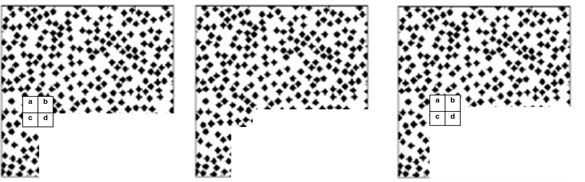{#fig-C13_MPS4 fig-align="center"}

#### Exemples d'images d'entraînement et de réalisations

Les exemples qui suivent donnent un aperçu de la diversité des structures qu'une simulation multipoints peut reproduire à partir d'une image d'entraînement. Celle-ci vient soit d'une interprétation 2D (carte satellite, photo d'affleurement), soit d'un modèle d'objets simulé en 3D (@fig-C13_MPS5). Selon le motif visé, on obtient des chenaux sinueux, des réseaux dendritiques, des réseaux de fractures ou des textures rocheuses. Les derniers exemples illustrent deux propriétés importantes : une même image d'entraînement produit des réalisations toutes différentes mais statistiquement équivalentes (@fig-C13_MPS11), et la grille simulée peut dépasser la taille de l'image d'entraînement (@fig-C13_MPS12) ou faire varier localement l'orientation et la taille des motifs (@fig-C13_MPS14).

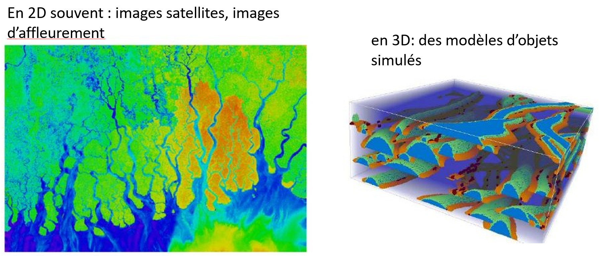{#fig-C13_MPS5 fig-align="center"}

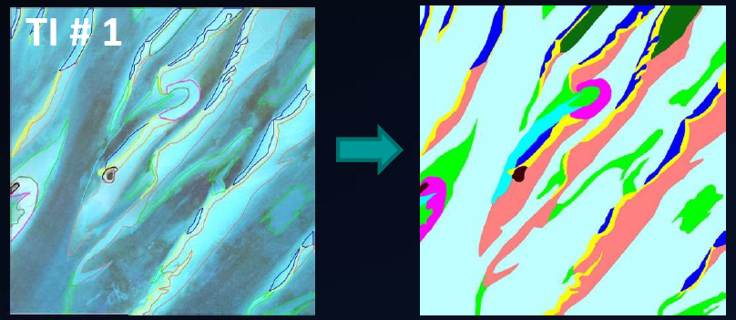{#fig-C13_MPS6 fig-align="center"}

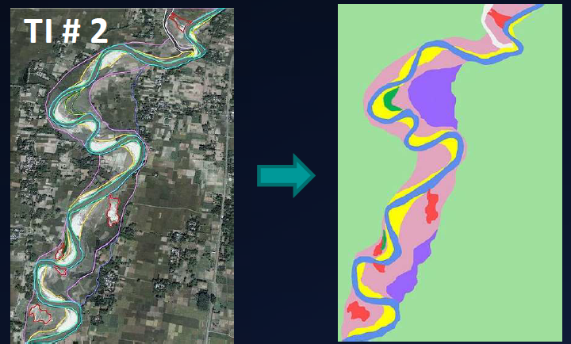{#fig-C13_MPS7 fig-align="center"}

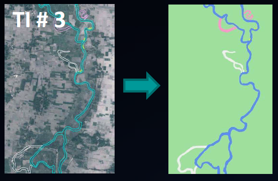{#fig-C13_MPS8 fig-align="center"}

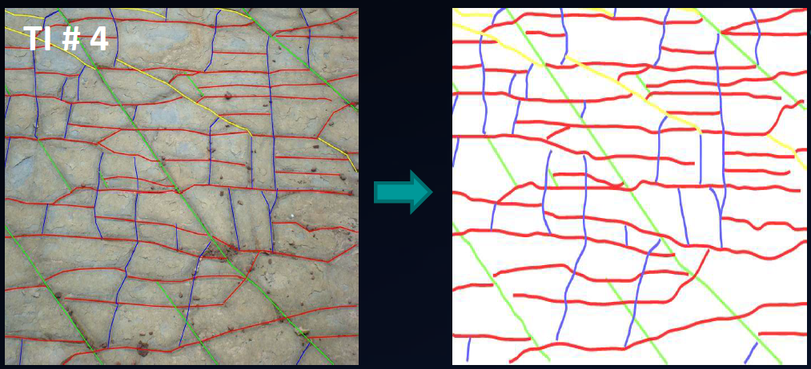{#fig-C13_MPS9 fig-align="center"}

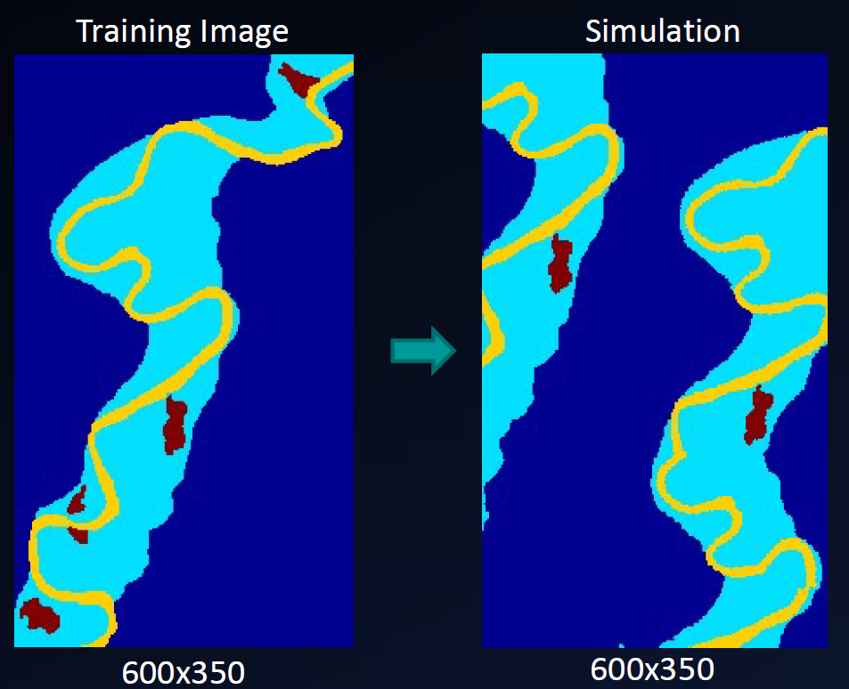{#fig-C13_MPS10 fig-align="center"}

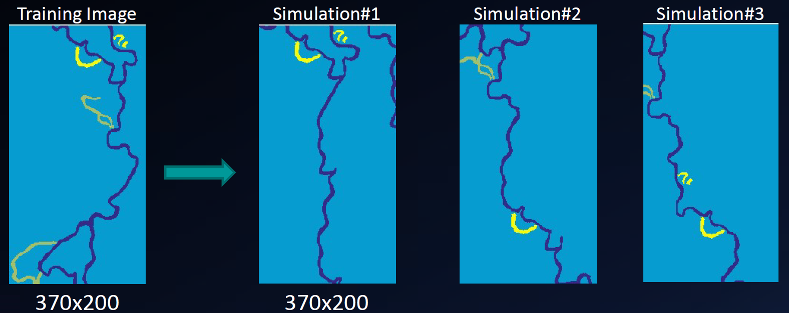{#fig-C13_MPS11 fig-align="center"}

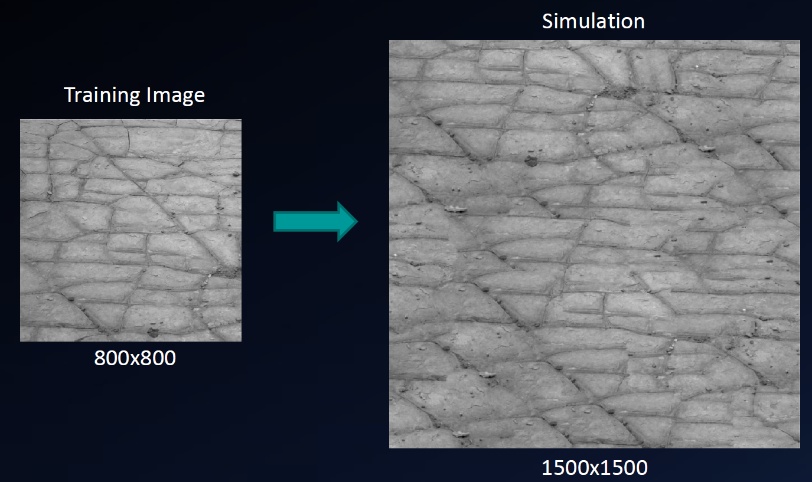{#fig-C13_MPS12 fig-align="center"}

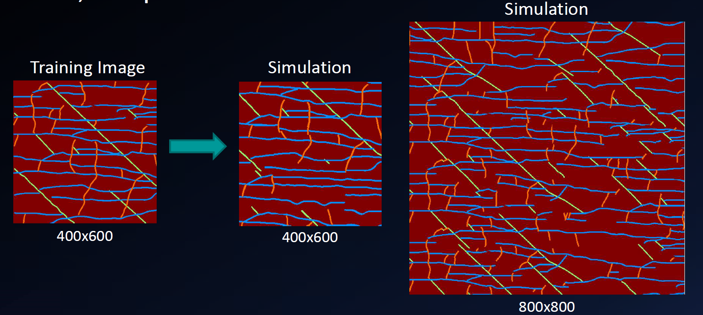{#fig-C13_MPS13 fig-align="center"}

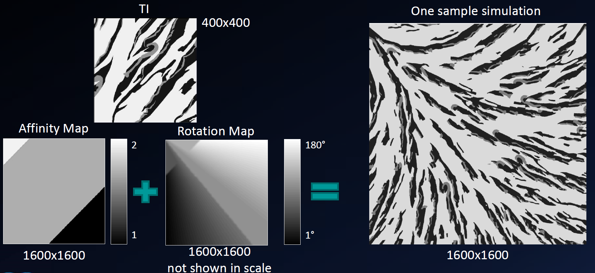{#fig-C13_MPS14 fig-align="center"}

## 🧮 Atelier interactif 13.4 — Animation MPS : DeeSse et FilterSim {.unnumbered}

::: {.content-visible when-format="html"}
Deux familles d'algorithmes multipoints, à comparer via le bouton de bascule. DeeSse (échantillonnage direct, par point) : pour chaque pixel d'un chemin aléatoire, on cherche dans la TI un emplacement dont le voisinage correspond aux voisins déjà simulés, puis on recopie la valeur centrale. FilterSim (par patch) : la grille se remplit par morceaux, chaque patch étant choisi dans la TI pour raccorder au mieux les bords déjà placés. Plusieurs images d'entraînement au choix, inspirées des motifs classiques de la littérature MPS (chenaux sinueux à la Strebelle, méandres, lentilles, disques, fractures, strates plissées). Lancez l'animation et observez la réalisation reproduire les motifs.

:::
::: {.content-visible unless-format="html"}
Cet atelier n'est disponible que dans la version web.
:::