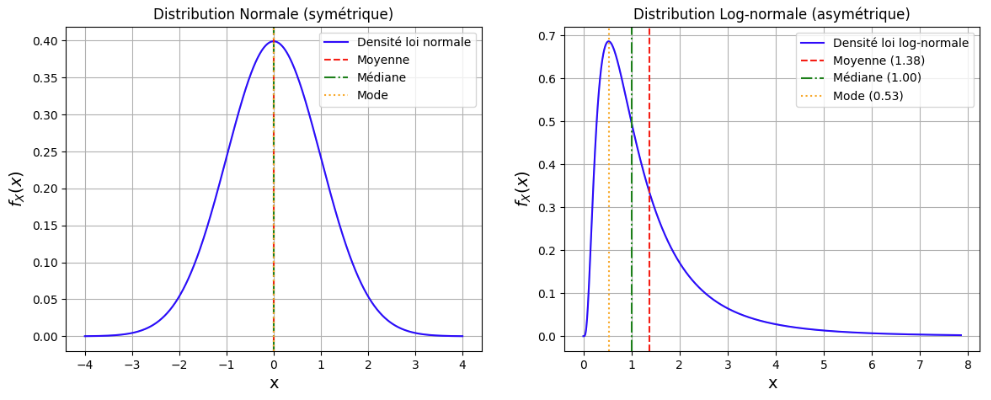
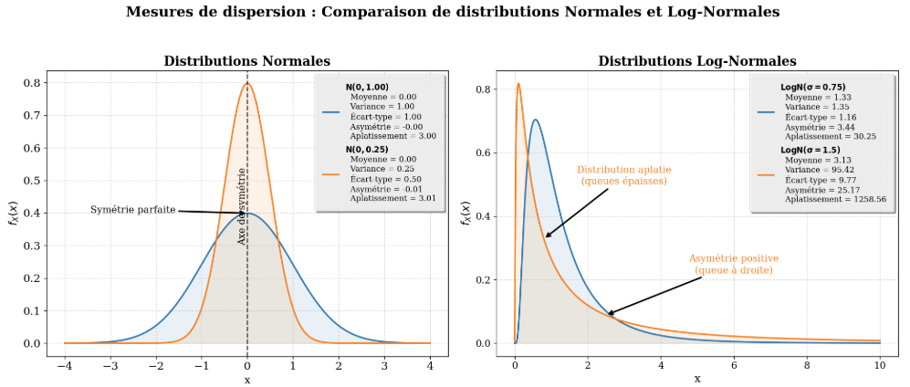
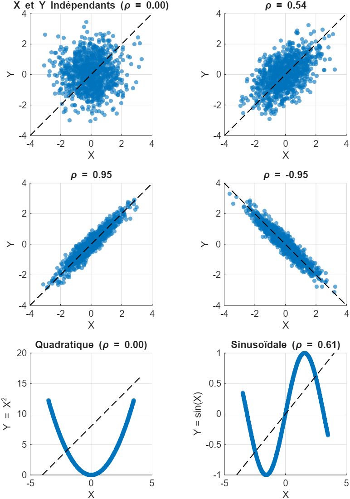

Cette annexe regroupe les notions de probabilités et de statistiques nécessaires à la compréhension des modèles et des méthodes d’estimation présentés dans les chapitres principaux.

## Variables aléatoires et fonctions de densité

### Variable aléatoire

Une variable aléatoire (v.a.) est une fonction mathématique qui associe un résultat numérique à chaque issue possible d'une expérience aléatoire. Bien que les valeurs possibles de la v.a. soient connues, sa réalisation précise ne peut être déterminée *a priori* sans observation directe. 

En géosciences, des exemples typiques de variables aléatoires incluent :

- La teneur en cuivre d'une carotte de forage de 1 mètre
- L'épaisseur d'une veine minéralisée à un endroit donné
- La concentration d'un polluant dans une nappe phréatique
- Le pH de l'eau de pluie à une station de mesure

On distingue deux types de variables aléatoires :

- **Variables discrètes** : prennent un nombre fini ou dénombrable de valeurs (ex: nombre de fractures dans une carotte)
- **Variables continues** : peuvent prendre n'importe quelle valeur dans un intervalle (ex: teneur en minerai)

Dans le cadre de ce cours, nous nous concentrerons principalement sur les variables aléatoires continues.

### Fonction de densité de probabilité

Même si la valeur exacte que prendra une variable aléatoire n'est pas connue avant l'observation, il est possible de décrire la probabilité qu'elle prenne certaines valeurs. Cette information est décrite par la fonction de densité de probabilité $f_X(x)$.

La fonction de densité vérifie deux propriétés essentielles :

1. **Positivité** : Elle est positive ou nulle partout
$$
f_X(x) \geq 0 \quad \text{pour tout } x \in \mathbb{R}
$$

2. **Normalisation** : L'aire totale sous la courbe est égale à 1
$$
\int_{-\infty}^{\infty} f_X(x)\,dx = 1
$$

La probabilité que la variable aléatoire prenne une valeur comprise entre deux bornes $a$ et $b$ est donnée par l'intégrale de la fonction de densité sur cet intervalle :
$$
\mathbb{P}(a \leq X \leq b) = \int_a^b f_X(x)\,dx
$$

::: {.callout-important title="Remarque importante"}
Pour une variable continue, la probabilité d’un point précis est toujours nulle : $\mathbb{P}(X = x) = 0$. On ne peut calculer que la probabilité d'appartenir à un intervalle.
:::

Dans l'atelier suivant, l'aire sous la courbe d'une fonction de densité $f_X(x)$, entre deux bornes $a$ et $b$, se manipule directement pour retrouver la probabilité $\mathbb{P}(a \leq X \leq b)$.



L'aire sous la courbe ainsi calculée correspond en fait à une valeur particulière de la fonction de répartition, présentée à la section suivante : elle cumule cette probabilité depuis $-\infty$ jusqu'à $x$.

### Fonction de répartition

La fonction de répartition (ou fonction de distribution cumulative) $F_X(x)$ donne la probabilité que la variable aléatoire soit inférieure ou égale à une valeur $x$ :
$$
F_X(x) = \mathbb{P}(X \leq x) = \int_{-\infty}^{x} f_X(t)\,dt
$$

Cette fonction possède les propriétés suivantes :

- Elle est monotone croissante : $F_X(x_1) \leq F_X(x_2)$ si $x_1 \leq x_2$
- $\lim_{x \to -\infty} F_X(x) = 0$ et $\lim_{x \to +\infty} F_X(x) = 1$
- La densité est la dérivée de la fonction de répartition : $f_X(x) = \frac{dF_X(x)}{dx}$

L'atelier ci-dessous construit $F_X(x)$ par accumulation progressive de la densité $f_X(x)$ ; son caractère monotone croissant y apparaît clairement.



La densité et la fonction de répartition décrivent la distribution dans son ensemble. On peut toutefois en résumer la forme par un petit nombre d'indicateurs numériques, les moments statistiques, présentés à la section suivante.

## Moments statistiques et paramètres de population

Les moments statistiques permettent de caractériser la forme et les propriétés d'une distribution de probabilité. Il faut distinguer les **paramètres théoriques** de la population (notation grecque) des **statistiques échantillonnales** (notation latine) qui les estiment.

### Espérance mathématique (moyenne théorique)

L'**espérance mathématique** ou **moyenne théorique** d'une variable aléatoire $X$, notée $\mu$ ou $\mathbb{E}[X]$, représente la valeur centrale autour de laquelle les observations tendent à se répartir :
$$
\mu = \mathbb{E}[X] = \int_{-\infty}^{\infty} x \cdot f_X(x)\,dx
$$

L'espérance possède les propriétés suivantes :

- **Linéarité** : $\mathbb{E}[aX + b] = a\mathbb{E}[X] + b$
- **Additivité** : $\mathbb{E}[X + Y] = \mathbb{E}[X] + \mathbb{E}[Y]$ (toujours vraie, même si $X$ et $Y$ ne sont pas indépendantes)

### Variance et écart-type théoriques

La **variance** $\sigma^2$ mesure la dispersion des valeurs autour de la moyenne :
$$
\sigma^2 = \operatorname{Var}(X) = \mathbb{E}[(X - \mu)^2] = \int_{-\infty}^{\infty} (x - \mu)^2 \cdot f_X(x)\,dx
$$

Forme alternative pratique pour les calculs :
$$
\sigma^2 = \mathbb{E}[X^2] - (\mathbb{E}[X])^2
$$

L'**écart-type** $\sigma$ est la racine carrée de la variance et s'exprime dans les mêmes unités que la variable :
$$
\sigma = \sqrt{\sigma^2}
$$

Propriétés de la variance :

- $\operatorname{Var}(aX + b) = a^2 \operatorname{Var}(X)$ (la constante $b$ disparaît)
- $\operatorname{Var}(X + Y) = \operatorname{Var}(X) + \operatorname{Var}(Y) + 2\operatorname{Cov}(X,Y)$

### Covariance et corrélation

Pour deux variables aléatoires $X$ et $Y$, la **covariance** mesure leur degré de dépendance linéaire :
$$
\operatorname{Cov}(X,Y) = \mathbb{E}[(X - \mathbb{E}[X])(Y - \mathbb{E}[Y])] = \mathbb{E}[XY] - \mathbb{E}[X]\mathbb{E}[Y]
$$

La **corrélation** $\rho_{XY}$ est la version normalisée de la covariance, comprise entre -1 et 1 :
$$
\rho_{XY} = \frac{\operatorname{Cov}(X,Y)}{\sigma_X \sigma_Y}
$$

Interprétation :

- $\rho = 1$ : corrélation linéaire positive parfaite
- $\rho = 0$ : absence de corrélation linéaire (mais pas nécessairement indépendance)
- $\rho = -1$ : corrélation linéaire négative parfaite

::: {.callout-warning}
**Attention** : Une corrélation nulle n'implique pas nécessairement l'indépendance entre les variables. Il peut exister une relation non linéaire.
:::

### Autres mesures de tendance centrale

Outre la moyenne, deux autres mesures caractérisent le centre d'une distribution :

- **Mode** : La valeur la plus probable
$$
\operatorname{Mode} = \arg\max_x f_X(x)
$$

- **Médiane** : La valeur $x$ qui divise la distribution en deux parties égales
$$
F_X(x) = 0.5 \quad \Leftrightarrow \quad \int_{-\infty}^{x} f_X(t)\,dt = 0.5
$$

Comme illustré à la @fig-tendance, ces trois mesures coïncident pour une distribution symétrique (comme la loi normale) mais diffèrent pour une distribution asymétrique (comme la loi log-normale).

{#fig-tendance fig-align="center"}

### Moments d'ordre supérieur

Les moments d'ordre supérieur caractérisent plus finement la forme de la distribution :

- **Coefficient d'asymétrie** (skewness) : mesure la dissymétrie de la distribution
$$
\gamma_1 = \frac{\mathbb{E}[(X-\mu)^3]}{\sigma^3}
$$
  - $\gamma_1 = 0$ : distribution symétrique
  - $\gamma_1 > 0$ : asymétrie positive (queue à droite)
  - $\gamma_1 < 0$ : asymétrie négative (queue à gauche)

- **Coefficient d'aplatissement** (kurtosis) : mesure l'épaisseur des queues de distribution
$$
\gamma_2 = \frac{\mathbb{E}[(X-\mu)^4]}{\sigma^4}
$$
  - $\gamma_2 = 3$ : distribution normale (référence)
  - $\gamma_2 > 3$ : distribution leptokurtique (queues épaisses)
  - $\gamma_2 < 3$ : distribution platykurtique (queues minces)

La @fig-dispersion illustre ces notions pour deux distributions différentes.

{#fig-dispersion fig-align="center"}

## Statistiques échantillonnales

Dans la pratique, nous ne connaissons jamais les paramètres théoriques de la population. Nous devons les **estimer** à partir d'un échantillon de taille finie $n$. Les formules diffèrent légèrement de leurs équivalents théoriques.

### Moyenne échantillonnale

La **moyenne d'un échantillon** de $n$ observations $\{x_1, x_2, \ldots, x_n\}$ est notée $\bar{x}$ :
$$
\bar{x} = \frac{1}{n}\sum_{i=1}^n x_i
$$

C'est un **estimateur sans biais** de $\mu$ : $\mathbb{E}[\bar{x}] = \mu$

### Variance échantillonnale

La **variance d'un échantillon** est notée $s^2$ :
$$
s^2 = \frac{1}{n-1}\sum_{i=1}^n (x_i - \bar{x})^2
$$

::: {.callout-note title="Pourquoi $n-1$ ?"}
Le diviseur est $n-1$ (et non $n$) pour obtenir un estimateur **sans biais** de $\sigma^2$. On perd un degré de liberté car nous devons d'abord estimer $\mu$ par $\bar{x}$. Cette correction s'appelle la **correction de Bessel**.
:::

L'**écart-type échantillonnal** est :
$$
s = \sqrt{s^2}
$$

### Covariance et corrélation échantillonnales

Pour deux échantillons $(x_1, \ldots, x_n)$ et $(y_1, \ldots, y_n)$ :

**Covariance échantillonnale** :
$$
s_{xy} = \frac{1}{n-1}\sum_{i=1}^n (x_i - \bar{x})(y_i - \bar{y})
$$

**Coefficient de corrélation échantillonnal** :
$$
r_{xy} = \frac{s_{xy}}{s_x s_y}
$$

La @fig-correlation montre différents scénarios de corrélation entre deux variables.

{#fig-correlation fig-align="center"}

## Statistiques d'une variable régionalisée

En géostatistique, nous travaillons avec des **variables régionalisées**, c'est-à-dire des variables dont la valeur dépend de la position dans l'espace. Une variable régionalisée $Z(\mathbf{x})$ est observée en $n$ localisations $\{\mathbf{x}_1, \mathbf{x}_2, \ldots, \mathbf{x}_n\}$.

### Moyenne spatiale

La **moyenne spatiale** d'une variable régionalisée sur un domaine $D$ est :
$$
m = \mathbb{E}[Z(\mathbf{x})] = \int_D z \cdot f_Z(z)\,dz
$$

En pratique, elle est estimée par la **moyenne échantillonnale** :
$$
\bar{z} = \frac{1}{n}\sum_{i=1}^n z(\mathbf{x}_i)
$$

### Variance spatiale

La **variance spatiale** caractérise la dispersion globale de la variable dans l'espace :
$$
\sigma^2 = \operatorname{Var}[Z(\mathbf{x})] = \mathbb{E}[(Z(\mathbf{x}) - m)^2]
$$

Estimée par :
$$
s^2 = \frac{1}{n-1}\sum_{i=1}^n [z(\mathbf{x}_i) - \bar{z}]^2
$$

## Lois de distribution courantes

### Loi normale (gaussienne)

La **loi normale** $\mathcal{N}(\mu, \sigma^2)$ est la distribution la plus importante en statistiques. Sa fonction de densité est :
$$
f_X(x) = \frac{1}{\sigma\sqrt{2\pi}} \exp\left(-\frac{(x-\mu)^2}{2\sigma^2}\right)
$$

Propriétés :

- Symétrique autour de $\mu$
- Mode = médiane = moyenne = $\mu$
- 68% des valeurs dans $[\mu - \sigma, \mu + \sigma]$
- 95% des valeurs dans $[\mu - 2\sigma, \mu + 2\sigma]$
- 99.7% des valeurs dans $[\mu - 3\sigma, \mu + 3\sigma]$

### Loi log-normale

Une variable $Y$ suit une **loi log-normale** si $X = \ln(Y)$ suit une loi normale. Cette distribution est fréquente en géosciences car :

- Elle est toujours positive ($Y > 0$)
- Elle est asymétrique positive
- Elle modélise bien les teneurs en minerai, les concentrations de polluants, etc.

Si $X \sim \mathcal{N}(\mu_X, \sigma_X^2)$, alors pour $Y = e^X$ :

**Paramètres de la log-normale** :
$$
\mathbb{E}[Y] = \exp\left(\mu_X + \frac{\sigma_X^2}{2}\right)
$$
$$
\operatorname{Var}(Y) = \exp(2\mu_X + \sigma_X^2)\left[\exp(\sigma_X^2) - 1\right]
$$

**Transformation inverse** : Si $Y$ suit une loi log-normale avec moyenne $m_Y$ et variance $s_Y^2$ :
$$
\mu_X = \ln\left(\frac{m_Y^2}{\sqrt{m_Y^2 + s_Y^2}}\right)
$$
$$
\sigma_X^2 = \ln\left(1 + \frac{s_Y^2}{m_Y^2}\right)
$$

::: {.callout-important title="Application en géostatistique"}
De nombreuses variables géologiques (teneurs, perméabilités) suivent des lois log-normales. Il est souvent nécessaire de travailler dans l'espace logarithmique pour :

- Respecter les hypothèses de normalité des méthodes géostatistiques
- Éviter d'obtenir des valeurs négatives lors de l'estimation
- Mieux modéliser la structure spatiale
:::

## Biais dans l'estimation

### Biais systématique

Un **estimateur biaisé** est un estimateur dont l'espérance ne correspond pas au paramètre qu'il est censé estimer. Le **biais** est défini par :
$$
\operatorname{Biais}(\hat{\theta}) = \mathbb{E}[\hat{\theta}] - \theta
$$

où $\hat{\theta}$ est l'estimateur et $\theta$ le paramètre théorique.

**Exemple** : Si on utilisait $n$ au lieu de $n-1$ dans la variance échantillonnale :
$$
\tilde{s}^2 = \frac{1}{n}\sum_{i=1}^n (x_i - \bar{x})^2
$$

Cet estimateur serait biaisé : $\mathbb{E}[\tilde{s}^2] = \frac{n-1}{n}\sigma^2 \neq \sigma^2$

En géostatistique, le **biais systématique** se manifeste lorsqu'une méthode d'estimation surestime ou sous-estime systématiquement les valeurs réelles, indépendamment des données locales.

### Biais conditionnel

Le **biais conditionnel** est plus subtil. Il désigne une erreur d'estimation qui dépend de la valeur estimée elle-même. C'est un phénomène omniprésent en géostatistique.

**Caractéristiques du biais conditionnel** :

- Les hautes valeurs estimées tendent à **surestimer** les hautes valeurs réelles
- Les basses valeurs estimées tendent à **sous-estimer** les basses valeurs réelles
- Globalement, l'estimateur peut être sans biais ($\mathbb{E}[\hat{Z}] = \mathbb{E}[Z]$)
- Mais conditionnellement à une estimation donnée, il y a un biais systématique

**Conséquence pratique** : Ce biais explique pourquoi, comme illustré à la @fig-information, nous récupérons systématiquement moins de métal que prévu lorsque nous exploitons les blocs classés comme "riches" selon nos estimations.

Mathématiquement, pour un estimateur $\hat{Z}$ :

- Biais global (espéré) : $\mathbb{E}[\hat{Z} - Z] = 0$ (pas de biais systématique)
- Biais conditionnel (espéré) : $\mathbb{E}[Z | \hat{Z} = z] = z$ (pas de biais conditionnel)

## Théorème central limite

Le **théorème central limite** (TCL) est l'un des résultats les plus importants de la théorie des probabilités. Il justifie l'utilisation omniprésente de la loi normale en statistiques et en géostatistique.

### Énoncé

Soit $X_1, X_2, \ldots, X_n$ une suite de variables aléatoires **indépendantes et identiquement distribuées** (i.i.d.) de moyenne $\mu$ et de variance finie $\sigma^2$. 

La moyenne échantillonnale :
$$
\bar{X}_n = \frac{1}{n}\sum_{i=1}^n X_i
$$

converge en distribution vers une loi normale lorsque $n \to \infty$ :
$$
\frac{\bar{X}_n - \mu}{\sigma/\sqrt{n}} \xrightarrow{d} \mathcal{N}(0, 1)
$$

Ou de manière équivalente :
$$
\bar{X}_n \sim \mathcal{N}\left(\mu, \frac{\sigma^2}{n}\right) \quad \text{pour } n \text{ suffisamment grand}
$$

### Conséquences importantes

1. **Universalité** : Quelle que soit la distribution initiale des $X_i$ (uniforme, exponentielle, log-normale, etc.), leur moyenne suit approximativement une loi normale pour $n$ suffisamment grand.

2. **Réduction de la variance** : La variance de la moyenne décroît de $1/n$, ce qui signifie que l'écart-type décroît de $1/\sqrt{n}$.

3. **Inférence statistique** : Le TCL permet de construire des intervalles de confiance et de mener des tests d'hypothèses, même lorsque la distribution initiale est inconnue.

## Propriétés fondamentales de la variance

Les propriétés suivantes sont essentielles en géostatistiques, sûrement les relations les plus utilisées :

**Variance d'une somme** :
$$
\operatorname{Var}(X + Y) = \operatorname{Var}(X) + \operatorname{Var}(Y) + 2\operatorname{Cov}(X,Y)
$$

Cas particulier (variables indépendantes) : $\operatorname{Cov}(X,Y) = 0 \Rightarrow \operatorname{Var}(X+Y) = \operatorname{Var}(X) + \operatorname{Var}(Y)$

**Variance d'une combinaison linéaire** :
$$
\operatorname{Var}(aX + bY) = a^2\operatorname{Var}(X) + b^2\operatorname{Var}(Y) + 2ab\operatorname{Cov}(X,Y)
$$

**Généralisation à $n$ variables** :
$$
\operatorname{Var}\left(\sum_{i=1}^n a_i X_i\right) = \sum_{i=1}^n a_i^2 \operatorname{Var}(X_i) + 2\sum_{i=1}^n\sum_{j>i}^n a_i a_j \operatorname{Cov}(X_i,X_j)
$$

Forme matricielle compacte :
$$
\operatorname{Var}\left(\sum_{i=1}^n a_i X_i\right) = \mathbf{a}^T \mathbf{C} \mathbf{a}
$$

où $\mathbf{a} = [a_1, \ldots, a_n]^T$ et $\mathbf{C}$ est la matrice de covariance :
$$
\mathbf{C} = \begin{bmatrix}
\operatorname{Var}(X_1) & \operatorname{Cov}(X_1,X_2) & \cdots & \operatorname{Cov}(X_1,X_n) \\
\operatorname{Cov}(X_2,X_1) & \operatorname{Var}(X_2) & \cdots & \operatorname{Cov}(X_2,X_n) \\
\vdots & \vdots & \ddots & \vdots \\
\operatorname{Cov}(X_n,X_1) & \operatorname{Cov}(X_n,X_2) & \cdots & \operatorname{Var}(X_n)
\end{bmatrix}
$$

::: {.callout-tip title="Application en géostatistique"}
Ces relations sont fondamentales pour :

- **Calculer la variance d'estimation** : une estimation par krigeage est une combinaison linéaire de valeurs observées
- **Quantifier l'incertitude** : la variance d'erreur dépend des covariances entre données et avec le point à estimer
- **Optimiser les poids** : les poids de krigeage minimisent la variance d'erreur sous contrainte de non-biais
:::

