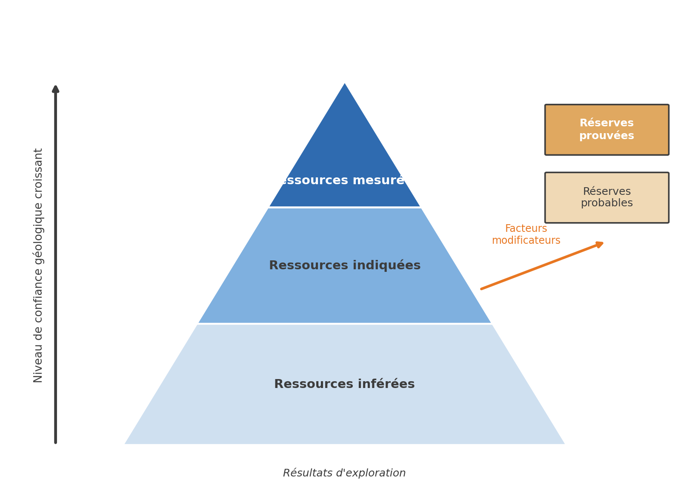

## Rapport technique NI 43-101 et Loi sur les mines {#sec-ex-ch01 .recueil}
### Exercice 1 — Ressources et réserves selon la NI 43-101

Définissez, avec vos propres mots, ce que l'on entend par ressources **inférées**, **indiquées** et **mesurées**, ainsi que par réserves **probables** et **prouvées** dans un rapport technique NI 43-101. Vous devez vous appuyer sur une illustration.

{#fig-ex01-cone_ressources_reserves fig-align="center" width="80%"}

::: {.callout-note collapse="true"}
## Solution

**Ressources inférées** — Elles reposent sur des données limitées (forages espacés, peu de contrôle géologique). Elles donnent une idée du potentiel du gisement, mais avec une forte incertitude.

**Ressources indiquées** — Elles sont appuyées par davantage de données (forages plus rapprochés, meilleure compréhension de la géologie). L'estimation est plus fiable et permet certaines évaluations économiques préliminaires.

**Ressources mesurées** — Elles sont fondées sur un grand nombre de données de qualité, bien distribuées. Le degré de confiance est très élevé et ces ressources peuvent servir directement à planifier l'exploitation minière.

**Réserves probables** — Les réserves minérales probables constituent la partie économiquement exploitable des ressources minérales indiquées et, dans certains cas, mesurées. Le degré de confiance accordé aux facteurs modificateurs s'appliquant à une réserve minérale probable est inférieur à celui s'appliquant à une réserve minérale prouvée.

**Réserves prouvées** — Les réserves minérales prouvées constituent la partie économiquement exploitable des ressources minérales mesurées. Une réserve minérale prouvée implique un degré de confiance élevé dans les facteurs modificateurs.
:::
