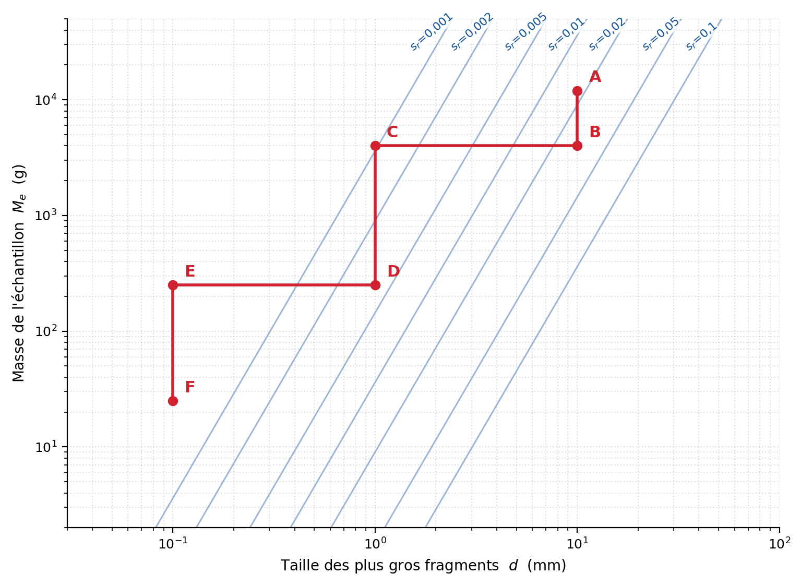
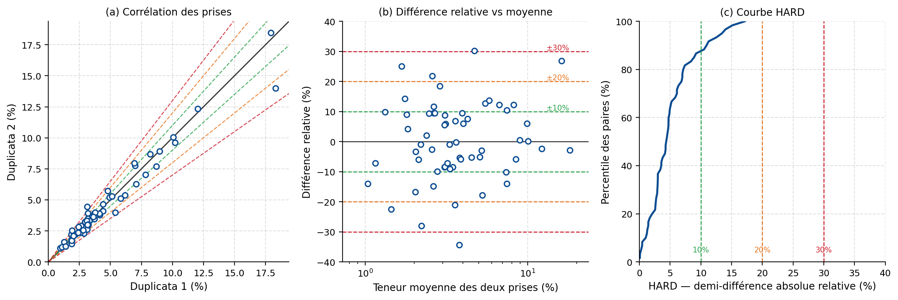

## Théorie de Gy et contrôle qualité {#sec-ex-ch03 .recueil}
### Exercice 1 — Lecture d'un abaque de Gy (procédure multistage)

Une mine de cuivre (le Cu est contenu dans la chalcopyrite) utilise la procédure illustrée sur la figure suivante pour déterminer les teneurs en Cu de carottes de forage. La procédure est représentée sur un abaque de Gy : chaque étape de broyage correspond à un segment horizontal (réduction de la taille des plus gros fragments $d$) et chaque étape de sous-échantillonnage à un segment vertical (réduction de la masse $M_e$).

{#fig-ex03-gy_abaque fig-align="center" width="80%"}

La carotte est d'abord broyée à $1\,\text{cm}$. La procédure passe ensuite par les points B, C, D, E et F de l'abaque, avec les prélèvements et broyages suivants :

| Étape | Type | Description |
|-------|------|-------------|
| A → B | sous-échantillonnage | prélèvement de $4\,\text{kg}$ parmi $12\,\text{kg}$ ($d = 1\,\text{cm}$) |
| B → C | broyage | $1\,\text{cm} \rightarrow 1\,\text{mm}$ |
| C → D | sous-échantillonnage | prélèvement de $250\,\text{g}$ parmi $4\,\text{kg}$ |
| D → E | broyage | $1\,\text{mm} \rightarrow 0{,}1\,\text{mm}$ |
| E → F | sous-échantillonnage | prélèvement de $25\,\text{g}$ parmi $250\,\text{g}$ |

**a)** Combien y a-t-il d'étapes de broyage et d'étapes de sous-échantillonnage ?

**b)** À l'aide de l'abaque, estimez l'écart-type relatif global $s_r$ de la procédure d'échantillonnage.

**c)** Que pourrait-on faire pour améliorer la précision ?

::: {.callout-note collapse="true"}
## Solution

**a)** Sur l'abaque, on dénombre **deux étapes de broyage** (en excluant le broyage initial de la carotte à $1\,\text{cm}$) : le broyage B→C qui réduit les fragments de $1\,\text{cm}$ à $1\,\text{mm}$, et le broyage D→E qui les réduit de $1\,\text{mm}$ à $0{,}1\,\text{mm}$.

Il y a **trois étapes de sous-échantillonnage** (B, D et F) : en B on prélève $4\,\text{kg}$ parmi $12\,\text{kg}$, en D on prélève $250\,\text{g}$ parmi $4\,\text{kg}$, et en F on prélève $25\,\text{g}$ parmi $250\,\text{g}$.

**b)** En lisant les isocontours de l'abaque, on obtient approximativement :
$$s_{r}(B) = 0{,}03, \qquad s_{r}(D) = 0{,}008, \qquad s_{r}(F) = 0{,}002.$$

Les variances relatives s'additionnent (et non les écarts-types). L'écart-type relatif global est donc :
$$s_{r,\text{global}} = \left( 0{,}03^2 + 0{,}008^2 + 0{,}002^2 \right)^{0.5} \approx 0{,}03.$$

L'écart-type relatif global correspond donc essentiellement à celui de l'étape B (le maillon faible).

**c)** L'erreur la plus importante est commise à l'étape B. On pourrait y prélever une masse plus importante que $4\,\text{kg}$. Par exemple, on pourrait conserver les $12\,\text{kg}$ au complet jusqu'à la taille $1\,\text{mm}$.
:::

### Exercice 2 — Calcul détaillé de l'écart-type relatif

Reprenez l'étape B de l'exercice 1 et faites le calcul complet de l'écart-type relatif. On dispose des données suivantes :

| Paramètre | Symbole | Valeur |
|-----------|---------|--------|
| Masse du lot | $M_L$ | $12\,\text{kg}$ |
| Masse de l'échantillon prélevé | $M_e$ | $4\,\text{kg}$ |
| Taille de libération de la chalcopyrite | $d_0$ | $0{,}01\,\text{cm}$ |
| Diamètre des plus gros fragments | $d$ | $1\,\text{cm}$ |
| Teneur en chalcopyrite | $a_L$ | $1\,\%$ (soit $0{,}35\,\%$ en Cu) |
| Masse spécifique de la chalcopyrite | $\delta_a$ | $4{,}1\,\text{g/cm}^3$ |
| Masse spécifique de la gangue | $\delta_g$ | $3\,\text{g/cm}^3$ |
| Facteur de forme | $f$ | $0{,}5$ |
| Facteur de distribution | $g$ | $0{,}25$ |

::: {.callout-note collapse="true"}
## Solution

**Facteur de libération** (puisque $d = 1\,\text{cm} > d_0 = 0{,}01\,\text{cm}$) :
$$l = \left( \frac{d_0}{d} \right)^{0.5} = \left( \frac{0{,}01}{1} \right)^{0.5} = 0{,}1.$$

**Facteur $\mu\delta$** (avec $a_L = 0{,}01$) :
$$\mu\delta = \frac{1-a_L}{a_L}\Big[(1-a_L)\,\delta_a + a_L\,\delta_g\Big]
= \frac{1-0{,}01}{0{,}01}\big[0{,}99 \times 4{,}1 + 0{,}01 \times 3\big] \approx 405.$$

**Constante $K$** :
$$K = \mu\delta \cdot f \cdot g = 405 \times 0{,}5 \times 0{,}25 = 50{,}6~\text{g/cm}^3,$$
et donc $K\,l = 50{,}6 \times 0{,}1 = 5{,}06~\text{g/cm}^3$.

**Variance relative** (avec $M_e = 4000\,\text{g}$, $M_L = 12000\,\text{g}$) :
$$s_r^2 = K\,l\,\frac{d^3}{M_e}\left(1 - \frac{M_e}{M_L}\right)
= 5{,}06 \times \frac{1^3}{4000}\left(1 - \frac{4000}{12000}\right) = 0{,}00084.$$

**Écart-type relatif** :
$$s_r = \sqrt{0{,}00084} \approx 0{,}029,$$
soit environ $2{,}9\,\%$, en accord avec la lecture sur l'abaque ($s_r(B) \approx 0{,}03$).
:::

### Exercice 3 — Assurance Qualité / Contrôle Qualité (QA/QC)

Le contrôle de qualité des analyses géochimiques dans une mine est un élément essentiel de l'estimation des ressources. La procédure de préparation du laboratoire principal comprend **deux étapes de sous-échantillonnage** : à $1\,\text{mm}$ et à $80\,\mu\text{m}$ (poudre). Les analyses portent sur la teneur des demi-carottes.

On observe plusieurs utilités possibles des contrôles de qualité :

- **A** — Déterminer la variation totale (manque de précision incluant la variabilité spatiale à très courte distance ainsi que celle due à la préparation et à l'analyse).
- **B** — Détecter un problème éventuel de calibration (biais) de l'appareil d'analyse.
- **C** — Identifier une contamination entre échantillons.
- **D** — Évaluer le manque de précision de l'ensemble de la procédure de préparation.
- **E** — Mettre en évidence un biais causé par la méthode de préparation des échantillons.
- **F** — Évaluer le manque de précision lié au sous-échantillonnage de la poudre et à son analyse.

**Consigne.** Pour chaque élément de contrôle du tableau ci-dessous, indiquez l'utilité principale en choisissant **une seule** lettre parmi A à F. Une même lettre peut être associée à plusieurs éléments, et certaines lettres peuvent ne pas être utilisées.

{#fig-ex03-duplicatas fig-align="center" width="80%"}

| Élément de contrôle | Utilité (A–F) |
|---------------------|:-------------:|
| Duplicata de terrain (deuxième demi-carotte, prélevée et analysée indépendamment) | |
| Duplicata de préparation (rejet du sous-échantillonnage à $1\,\text{mm}$, repris dans la chaîne) | |
| Duplicata de pulpe (deuxième prise de la poudre à $80\,\mu\text{m}$, ré-analysée) | |
| Standard certifié (matériau de référence de teneur connue) | |
| Blanc (matériau exempt de l'élément d'intérêt) | |

::: {.callout-note collapse="true"}
## Solution

Le principe directeur : chaque type de contrôle isole une portion différente de la chaîne d'erreur (terrain → préparation → pulpe → analyse). Plus le duplicata est prélevé tôt dans la chaîne, plus il englobe de sources d'erreur.

| Élément de contrôle | Utilité | Justification |
|---------------------|:-------:|---------------|
| Duplicata de terrain | **A** | Englobe tout : variabilité spatiale à très courte distance + préparation + analyse → variation totale. |
| Duplicata de préparation | **D** | Repris dès le sous-échantillonnage à $1\,\text{mm}$ : mesure la précision de l'ensemble de la procédure de préparation. |
| Duplicata de pulpe | **F** | Deuxième prise de la poudre à $80\,\mu\text{m}$ : isole le sous-échantillonnage de la poudre et son analyse. |
| Standard certifié | **B** | Teneur connue → détecte un biais (problème de calibration) de l'appareil d'analyse. |
| Blanc | **C** | Matériau exempt de l'élément : toute teneur mesurée révèle une contamination entre échantillons. |

L'utilité **E** (biais dû à la méthode de préparation) ne serait associée à aucun de ces éléments : la mettre en évidence requiert une comparaison entre deux méthodes de préparation, et non un duplicata, un standard ou un blanc.
:::

### Exercice 4 — Théorie de Gy : masse à prélever et taille de broyage

Vous voulez obtenir des analyses fiables pour le Cu présent dans des demi-carottes de $3\,\text{m}$ de long. Le cuivre est contenu dans la chalcopyrite ($\text{CuFeS}_2$). On dispose des données suivantes :

| Paramètre | Symbole | Valeur |
|-----------|---------|--------|
| Masse de la demi-carotte (lot) | $M_L$ | $10\,\text{kg}$ |
| Masse spécifique de la gangue | $\delta_g$ | $3\,\text{g/cm}^3$ |
| Masse spécifique de la chalcopyrite | $\delta_a$ | $4{,}1\,\text{g/cm}^3$ |
| Taille de libération de la chalcopyrite | $d_0$ | $2\,\text{mm}$ |
| Concentration du Cu dans la chalcopyrite | — | $35\,\%$ |
| Facteur de forme | $f$ | $0{,}5$ |
| Facteur de distribution | $g$ | $0{,}25$ |

**a)** Quelle masse doit-on prélever lors du sous-échantillonnage, si les plus gros fragments font $0{,}5\,\text{cm}$, pour fournir un écart-type relatif de $1\,\%$ sur la vraie teneur en Cu lorsque celle-ci est de $0{,}5\,\%$ ? Effectuez les calculs au long.

**b)** À quelle taille $d$ devrait-on broyer la roche si l'on veut un écart-type relatif de $1\,\%$ avec une masse prélevée de $1\,\text{kg}$ et une vraie teneur de $0{,}5\,\%$ Cu dans le lot initial ?

**c)** Si le minéral fournissant le $0{,}5\,\%$ de Cu était la chalcocite ($\text{Cu}_2\text{S}$) plutôt que la chalcopyrite ($\text{CuFeS}_2$), aurait-on les mêmes réponses ? Justifier sans faire de calcul.

**d)** Si la teneur du lot est en réalité supérieure à $0{,}5\,\%$ Cu, est-ce que l'écart-type relatif réellement obtenu sera supérieur, égal ou inférieur à celui calculé ? Justifiez.

**e)** Pourquoi Gy recommande-t-il d'utiliser des outils de prélèvement ayant des ouvertures au moins trois fois plus grandes que les plus grosses particules du lot échantillonné ? Justifiez.

::: {.callout-note collapse="true"}
## Solution

**a)** On convertit d'abord la teneur en Cu en teneur en chalcopyrite :
$$a_L = \frac{0{,}005}{0{,}35} = 0{,}0143, \qquad \frac{1-a_L}{a_L} = 69.$$

Facteur $\mu\delta$ :
$$\mu\delta = \frac{1-a_L}{a_L}\Big[(1-a_L)\,\delta_a + a_L\,\delta_g\Big]
= 69 \times \big[0{,}9857 \times 4{,}1 + 0{,}0143 \times 3\big] = 69 \times 4{,}084.$$

Facteur de libération (ici $d = 0{,}5\,\text{cm} > d_0 = 0{,}2\,\text{cm}$) :
$$l = \left( \frac{d_0}{d} \right)^{0.5} = \left( \frac{0{,}2}{0{,}5} \right)^{0.5} = 0{,}6325.$$

Constante :
$$K = \mu\delta \cdot f \cdot g = 69 \times 4{,}084 \times 0{,}5 \times 0{,}25 = 35{,}22~\text{g/cm}^3.$$

On impose $s_r = 0{,}01 \Rightarrow s_r^2 = 10^{-4}$ et on résout pour $M_e$ à partir de
$$s_r^2 = K\,l\,\frac{d^3}{M_e}\left(1 - \frac{M_e}{M_L}\right), \qquad M_L = 10\,000~\text{g}.$$

En isolant $M_e = \dfrac{K\,l\,d^3}{s_r^2 + K\,l\,d^3/M_L}$ avec $K\,l\,d^3 = 35{,}22 \times 0{,}6325 \times 0{,}5^3 = 2{,}785$, on obtient :
$$M_e \approx 7{,}36~\text{kg}.$$

Il faut donc prélever environ $7{,}36\,\text{kg}$ : à $d = 0{,}5\,\text{cm}$, une masse importante est nécessaire pour atteindre $1\,\%$ de précision.

**b)** Comme à $d = 0{,}5\,\text{cm}$ il fallait $7{,}36\,\text{kg}$, on sait qu'avec seulement $1\,\text{kg}$ il faudra broyer plus finement que $0{,}5\,\text{cm}$. Supposons $d < d_0$, donc $l = 1$, et résolvons :
$$d^3 = \frac{s_r^2\,M_e}{K\left(1 - M_e/M_L\right)}
= \frac{10^{-4} \times 1000}{35{,}22 \times (1 - 1000/10000)} \Rightarrow d \approx 0{,}147~\text{cm} \approx 1{,}5~\text{mm}.$$

Comme la réponse ($\approx 0{,}15\,\text{cm}$) est inférieure à $d_0 = 0{,}2\,\text{cm}$, l'hypothèse $d < d_0$ ($l = 1$) est bien la bonne formule.

**c)** **Non.** Comme le minéral d'intérêt change, sa teneur (rapport massique du Cu dans le minéral), sa masse spécifique $\delta_a$ et sa taille de libération $d_0$ changent aussi. Ces trois paramètres entrent dans le calcul, donc les réponses seraient différentes.

**d)** L'écart-type relatif réellement obtenu serait **inférieur** à celui calculé. En effet, plus la teneur $a_L$ du lot est élevée, plus le facteur $\mu\delta$ — et donc la variance relative $s_r^2 = K\,l\,d^3/M_e$ — est faible. Il suffit de regarder l'équation de $\mu\delta$ : le terme $(1-a_L)/a_L$ décroît quand $a_L$ augmente.

**e)** Pour éviter un biais d'échantillonnage envers les petites particules. Si l'ouverture de l'outil n'est pas suffisamment grande, les plus gros fragments ne peuvent pas être prélevés : ils ont une probabilité nulle d'être sélectionnés, ce qui viole la condition d'échantillon probabiliste et rend l'échantillon non représentatif du lot.
:::
