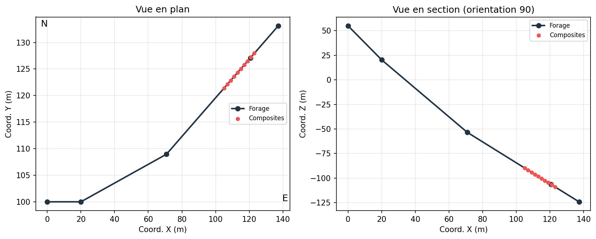

## Traitement et analyse statistique des données de forage {#sec-ex-ch04 .recueil}
### Exercice 1 — Échantillonnage de la roche en place : sources de biais

Pour chacune des situations d'échantillonnage de la roche **en place**, identifiez les problèmes possibles et les risques de biais.

a) **Écailles** — on détache des écailles de roche le long d'une paroi.

b) **Cannelures** (rainures) — on creuse une rainure de section théoriquement constante le long d'un profil.

c) **Forage destructif** (forage de production).

d) **Forage carotté (DDH)** lorsque le taux de récupération est inférieur à $100\,\%$.

::: {.callout-note collapse="true"}
## Solution

a) **Écailles** — Chaque écaille a un volume différent et il peut exister un lien entre le volume de l'écaille et la dureté de la roche. Or, la dureté est souvent corrélée à la composition de la roche : il y a donc un **risque de biais**.

b) **Cannelures** — Mieux que les écailles, mais on ne contrôle pas bien la profondeur de la cannelure, d'où un **risque de biais** pour les mêmes raisons que les écailles (lien dureté–composition).

c) **Forage destructif** — Voir les notes de cours (contamination le long du trou, mélange et remontée des fines, perte sélective, etc.).

d) **Forage carotté (DDH)** — On devrait viser $100\,\%$ de récupération. Même à $95\,\%$, le $5\,\%$ non récupéré pourrait être particulièrement riche ou particulièrement pauvre. La partie non récupérée correspond souvent à des portions plus fracturées, et rien ne garantit que la teneur y soit équivalente au reste de la roche : **risque de biais**.
:::

### Exercice 2 — Échantillonnage de roches fragmentées et outils de séparation

Identifiez, dans chaque cas, les procédures **biaisées** et justifiez.

a) **Déblais de forages de production** (vue en plan) — parmi les quatre découpages proposés (a–d) du tas de déblais, lequel est *certainement* biaisé ?

b) **Godet de chargeuse-transporteuse (LHD)** — peut-on échantillonner directement dans le godet ?

c) **Convoyeur** — parmi les modes de prélèvement proposés, lequel n'est pas acceptable, et pourquoi ?

d) **Choix des outils de séparation** — quelle colonne d'outils est la mieux adaptée compte tenu de la taille des fragments ?

e) **Échantillonnage sans biais d'un convoyeur** — parmi les méthodes a) à d), lesquelles permettent un échantillonnage *sans biais* ?

::: {.callout-note collapse="true"}
## Solution

a) **Déblais** — La procédure **a)** est inadéquate à cause de la **ségrégation des particules** : on retrouve davantage de grosses particules en périphérie du tas. Comme il peut facilement exister un lien entre teneur et taille des particules, le découpage proposé ne prend pas assez de bordure par rapport à l'ensemble. (Analogie : pour partager une pizza équitablement, la croûte doit être répartie proportionnellement à la taille du morceau.) Les options b), c) et d) sont bonnes pourvu que l'on minimise les pertes de fines (b) et que l'on dépose lentement le matériau pour ne pas saturer les chutes (c). **Réponse : a)**.

b) **Godet de LHD** — **Non.** D'abord, c'est très dangereux de circuler dans l'environnement de production pour échantillonner. Ensuite, l'échantillon serait très mauvais et presque sûrement biaisé : (i) les gros blocs trop lourds ne seront pas pris, et (ii) les particules fines migrent vers le fond du godet. Biais quasi assuré.

c) **Convoyeur** — La procédure **c)** échantillonne davantage un côté de la courroie. Selon le mode de chargement, les granulométries de gauche et de droite sont probablement différentes ; il faut donc un dispositif qui prélève autant les deux côtés.

d) **Outils** — La **colonne de droite** (règle du facteur 3 de Gy : ouverture des outils $\geq 3\times$ la taille du plus gros fragment).

e) **Sans biais** — Les méthodes **a) et c) seulement**. Les méthodes b) et d) n'échantillonnent pas le flot de matériau pendant le même temps pour chaque position sur la courroie, d'où un biais probable.
:::

### Exercice 3 — Dégroupement (declustering) des données de forage

a) Quatre échantillonnages distincts d'un même gisement sont illustrés. Complétez le tableau en associant les **statistiques appropriées** (moyenne, variance) à chacun des cas représentés.

b) À partir des statistiques de dégroupement obtenues pour différentes tailles de cellule, quelle **taille de cellule** retenir pour assurer un bon dégroupement lié au **suréchantillonnage des fortes valeurs** ? Justifiez.

{#fig-c04-degroupement fig-align="center" width="80%"}

::: {.callout-note collapse="true"}
## Solution

a) On associe à chaque configuration d'échantillonnage la moyenne et la variance correspondantes, en tenant compte du fait qu'un échantillonnage qui privilégie les zones riches (suréchantillonnage des fortes valeurs) gonfle à la fois la moyenne et la variance par rapport à un échantillonnage régulier représentatif.

b) **Environ $15$ pixels.** À cette taille, on obtient la **moyenne la plus basse** ainsi que la **variance la plus faible**. Dans le cas d'un suréchantillonnage des fortes valeurs, la moyenne est généralement trop élevée et la variance trop importante ; il est donc naturel de chercher à les réduire en choisissant la taille de cellule qui minimise ces deux statistiques.
:::

### Exercice 4 — Erreur fondamentale : le modèle binomial

> *Note de renvoi : ce concept d'**erreur fondamentale** est partagé avec le ch. 3 — théorie de Gy.*

On adopte un modèle (volontairement) simple : le **modèle binomial**. Les grains sont tous de même taille et de même densité et il existe deux types de grains : le minéral d'intérêt (p. ex. la chalcopyrite) ou *autre*. La teneur du lot est $p$, la taille du lot est infinie (très grande). On prélève un échantillon aléatoire de taille $n$.

Soit $n_1$ le nombre de grains du minéral d'intérêt dans l'échantillon. On a
$$
\mathbb{E}[n_1] = n\,p \qquad \text{et} \qquad \operatorname{Var}(n_1) = n\,p\,(1-p).
$$

a) Quelle est la teneur de l'échantillon $p_e$ ?

b) Que vaut $\operatorname{Var}(p_e - p)$ ?

c) En déduire la **variance relative** de l'erreur, $\dfrac{\operatorname{Var}(p_e - p)}{p^2}$, et interpréter le résultat.

d) En vous basant sur l'équation obtenue en c), que doit-on faire pour diminuer la variance relative de l'erreur, sachant que l'on ne peut pas contrôler $p$ ? Comment ?

e) Considérons le cas de l'**or**. Cela change-t-il quelque chose que l'or soit sous forme **native** ou sous forme d'**inclusion** dans la pyrite (à une teneur constante de $0.001\ \text{g/g}$) pour une même teneur de lot $p$ ? Pourquoi ?

::: {.callout-note collapse="true"}
## Solution

a) La teneur de l'échantillon est la proportion de grains d'intérêt :
$$
p_e = \frac{n_1}{n}.
$$

b) Comme $p$ est une constante,
$$
\operatorname{Var}(p_e - p) = \operatorname{Var}(p_e) = \operatorname{Var}\!\left(\frac{n_1}{n}\right) = \frac{1}{n^2}\,\operatorname{Var}(n_1) = \frac{n\,p\,(1-p)}{n^2} = \frac{p\,(1-p)}{n}.
$$

c) La variance relative vaut
$$
\frac{\operatorname{Var}(p_e - p)}{p^2} = \frac{p\,(1-p)}{n\,p^2} = \frac{1-p}{n\,p}.
$$
Le terme $n$ est directement relié à la **masse de l'échantillon** (et inversement relié au cube du diamètre des grains, $d^3$). Le terme $\dfrac{1-p}{p}$ indique qu'une **faible teneur** entraîne une variance relative bien plus grande qu'une forte teneur. On retrouve tous ces éléments dans la formule de Gy.

d) Puisqu'on ne contrôle pas $p$, il faut **augmenter $n$** : soit **augmenter la masse de l'échantillon**, soit **broyer plus finement** les particules (ce qui, à masse constante, augmente fortement le nombre de grains $n$, car $n \propto 1/d^3$). Le broyage plus fin est de loin l'action la plus efficace.

e) **Oui, cela change tout.** D'après la loi binomiale, la variance relative sera environ $1000$ fois plus petite avec l'or **inclus** dans la pyrite (à $0.001\ \text{g/g}$) plutôt que sous forme **native**. Avec la formule de Gy, on retrouve le même ordre de grandeur. Le problème pratique de l'or : il n'est pas à teneur constante dans la pyrite, et il y a presque toujours aussi de l'or natif associé. Il suffit de très peu d'or natif pour qu'il domine le calcul de la variance relative.
:::

### Exercice 5 — Sondages et composites

Vous êtes ingénieur(e) CPI en estimation des ressources au sein de l'équipe du projet *NioVar*, qui explore une veine de niobium dans le nord du Québec. On vous confie une section de la base de données de forage.

**Forage F-12**

| Paramètre | Valeur |
|:---|:---|
| Collet | $(50,\ 60,\ 20)$ |
| Orientation au départ ($0\ \text{m}$) | azimut $= 255^\circ$, plongée $= 60^\circ$ |
| Orientation à $60\ \text{m}$ | azimut $= 275^\circ$, plongée $= 75^\circ$ |

{#fig-c04-deviation fig-align="center" width="80%"}

a) Votre superviseur vous demande de préparer des **composites de $3\ \text{m}$** entre $74\ \text{m}$ et $86\ \text{m}$ de profondeur. Un composite est valide seulement si au moins $2/3$ des carottes sont analysées. Identifiez les composites valides et calculez leurs teneurs en Nb.

b) Pour la modélisation 3D, vous devez attribuer des coordonnées $(x, y, z)$ aux composites. Calculez les coordonnées du **centre du composite le plus profond** par la **méthode du point milieu**.

c) Le forage F-12 a intersecté la veine minéralisée à $74\ \text{m}$, aux coordonnées approximatives $\mathbf{x} = (24.17,\ 57.11,\ -48.48)$. Cette veine, observée en surface, a été mesurée (convention géologique) avec un azimut de $230^\circ$ et un pendage de $40^\circ$. Évaluez si le nouveau forage **F-15** — collet $(40,\ 50,\ 25)$, azimut $30^\circ$, plongée $50^\circ$ — intersectera la veine ; si oui, à quelle distance du collet ?

d) Proposez une **orientation optimale** pour que F-15 (même collet) intersecte la veine **le plus rapidement possible**. Indiquez l'azimut et la plongée, et estimez la distance jusqu'au croisement.

::: {.callout-note collapse="true"}
## Solution

a) On calcule la teneur pondérée par la longueur des carottes analysées ; un composite est rejeté si le recouvrement analysé est insuffisant ($< 2/3$).

$$
\begin{aligned}
\text{Composite 1} &: \frac{1.2\times 0.42 + 0.8\times 0.58}{2} = 0.48\ \% \text{ Nb}\\[4pt]
\text{Composite 2} &: \frac{0.5\times 1.05 + 1.8\times 0.73}{2.3} = 0.80\ \% \text{ Nb}\\[4pt]
\text{Composite 3} &: \text{N/A — recouvrement de seulement } 50\,\% \ (< 2/3)\\[4pt]
\text{Composite 4} &: \frac{0.5\times 2.01 + 1.5\times 1.20 + 1\times 0.95}{3} = 1.25\ \% \text{ Nb}
\end{aligned}
$$

b) On cherche le point à $84.5\ \text{m}$ le long du trou (centre du composite allant de $83\ \text{m}$ à $86\ \text{m}$). Cosinus directeurs aux deux stations :

- **Station 1** ($M_1 = 0.0$) : azimut $255.0^\circ$, plongée $60.0^\circ$
$$
\mathbf{l}_1 = (l_x, l_y, l_z) = (-0.4830,\ -0.1294,\ -0.8660)
$$
- **Station 2** ($M_2 = 60.0$) : azimut $275.0^\circ$, plongée $75.0^\circ$
$$
\mathbf{l}_2 = (l_x, l_y, l_z) = (-0.2578,\ 0.0226,\ -0.9659)
$$

On découpe le trajet en deux segments : $L_1 = 30\ \text{m}$ (avec $\mathbf{l}_1$) puis $L_2 = 30 + (84.5 - 60) = 54.5\ \text{m}$ (avec $\mathbf{l}_2$), et on cumule les déplacements à partir du collet pour obtenir les coordonnées $(x, y, z)$ du centre du composite le plus profond (méthode du point milieu, station par station).

c) On exprime le **pôle** $\mathbf{n}$ de la veine à partir de la convention géologique $\mathbf{v}_g = (230,\ 40)$ :
$$
\mathbf{n} = (140,\ 50) = (230 + 270 - 360,\ \ 90 - 40),
$$
soit, en cosinus directeurs,
$$
\mathbf{n} = (0.4132,\ -0.4924,\ -0.7660).
$$
Direction du forage F-15 (azimut $30^\circ$, plongée $50^\circ$) :
$$
\mathbf{s} = (0.3214,\ 0.5567,\ -0.7660).
$$
Avec $\mathbf{p}_0$ le point connu de la veine et $\mathbf{s}_0$ le collet de F-15 :
$$
\mathbf{p}_0 - \mathbf{s}_0 = (-15.8300,\ 7.1100,\ -73.4800).
$$
La distance le long du forage jusqu'à l'intersection du plan de la veine est
$$
e = \frac{\mathbf{n}\cdot(\mathbf{p}_0 - \mathbf{s}_0)}{\mathbf{n}\cdot\mathbf{s}} = 103.81\ \text{m}.
$$
Le forage **intersecte** donc la veine à environ $103.81\ \text{m}$ du collet.

d) Pour minimiser la distance, on oriente le forage **perpendiculairement** au plan de la veine, c.-à-d. selon le pôle : on pose $\mathbf{s} = \mathbf{n}$. La distance devient alors
$$
e = \frac{\mathbf{n}\cdot(\mathbf{p}_0 - \mathbf{s}_0)}{\mathbf{n}\cdot\mathbf{n}} = 46.24\ \text{m},
$$
avec un azimut et une plongée correspondant au vecteur $\mathbf{n}$.
:::

### Exercice 6 — Analyse chimique : composition minéralogique et masse volumique

> *Note : exercice à la **frontière des ch. 3 et 4** (composition minéralogique vs densité de la roche). Rattachement ch. 3/4 à valider.*

Une roche d'un gisement montre une teneur de $4\,\%$ de Cu, $2\,\%$ de Pb, $2\,\%$ de Fe et $5\,\%$ de S. Le Cu est contenu **uniquement** dans la bornite ($\text{Cu}_5\text{FeS}_4$ ; $63.3\,\%$ Cu, $11.1\,\%$ Fe, $25.6\,\%$ S ; densité $5.1$) et le Pb **uniquement** dans la galène ($\text{PbS}$ ; $86.6\,\%$ Pb, $13.4\,\%$ S ; densité $7.5$). On retrouve aussi de la pyrite ($\text{FeS}_2$ ; $46.5\,\%$ Fe, $53.5\,\%$ S ; densité $5.0$). Le Ba n'a pas été analysé, mais l'analyse de la gangue indique une présence possible de Ba. Le Ba est uniquement présent dans la barite ($\text{BaSO}_4$ ; $58.84\,\%$ Ba, $13.74\,\%$ S, $27.42\,\%$ O ; densité $4.5$). La densité de la gangue est $3.2$ ; la gangue ne contient aucun des éléments chimiques analysés. La porosité de la roche est $3\,\%$.

a) Construire et résoudre le système d'équations linéaires permettant de déterminer les teneurs en **pyrite, bornite, barite, galène** et **gangue**. (On peut résoudre le système sans inverser la matrice.)

b) Déterminer la **masse volumique de la roche** en tenant compte de l'effet de la porosité. (Si vous n'avez pas pu répondre à a), supposez que chaque minéral est présent à $2\,\%$ et que la gangue représente $92\,\%$.)

::: {.callout-note collapse="true"}
## Solution

a) On écrit le bilan de chaque élément en fonction des proportions minérales. Le système est **triangulaire en pratique** : les deux premières équations se résolvent directement. On ne peut pas utiliser la barite pour fermer le bilan de Ba, car la quantité de Ba dans la gangue est inconnue.

**Cuivre** (uniquement dans la bornite) :
$$
0.633 \times \text{Bornite} = 0.04 \;\Rightarrow\; \text{Bornite} = \frac{0.04}{0.633} = 0.0632 \;\Rightarrow\; \boxed{6.32\,\% \text{ bornite}}
$$

**Plomb** (uniquement dans la galène) :
$$
0.866 \times \text{Galène} = 0.02 \;\Rightarrow\; \text{Galène} = \frac{0.02}{0.866} = 0.0231 \;\Rightarrow\; \boxed{2.31\,\% \text{ galène}}
$$

**Fer** (pyrite + bornite) :
$$
0.465\,\text{Pyrite} + 0.111\,\text{Bornite} = 0.02 \;\Rightarrow\; \text{Pyrite} = \frac{0.02 - 0.111\times 0.0632}{0.465} = 0.0279 \;\Rightarrow\; \boxed{2.79\,\% \text{ pyrite}}
$$

**Soufre** (pyrite + bornite + barite + galène) — on isole la barite :
$$
\text{Barite} = \frac{0.05 - 0.535\,\text{Pyrite} - 0.256\,\text{Bornite} - 0.134\,\text{Galène}}{0.5884}
$$
$$
= \frac{0.05 - 0.535\times 0.0279 - 0.256\times 0.0632 - 0.134\times 0.0231}{0.1374} \approx \boxed{11.52\,\% \text{ barite}}
$$

La **gangue** complète le bilan massique à $100\,\%$.

b) On pose une base de $100\ \text{g}$ de roche, on calcule le **volume** occupé par chaque minéral à partir de sa densité ($V_i = m_i / \rho_i$), on somme les volumes solides, puis on tient compte de la **porosité** de $3\,\%$ (volume de vide) pour obtenir le volume total et donc la masse volumique de la roche :
$$
\rho_\text{roche} = \frac{m_\text{totale}}{V_\text{solide} / (1 - \phi)}, \qquad \phi = 0.03.
$$
(En l'absence de la solution chiffrée de a), on utilise l'hypothèse : chaque minéral à $2\,\%$ et gangue à $92\,\%$.)
:::
