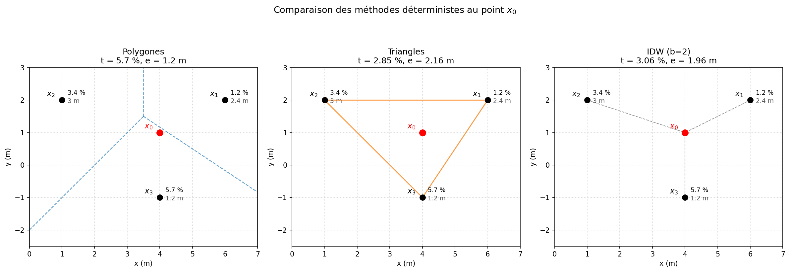
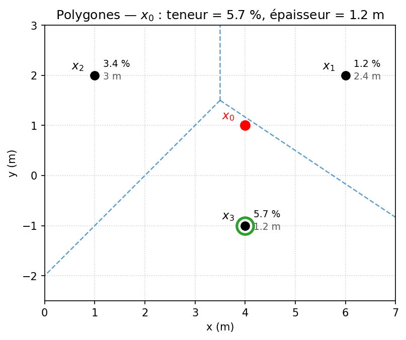
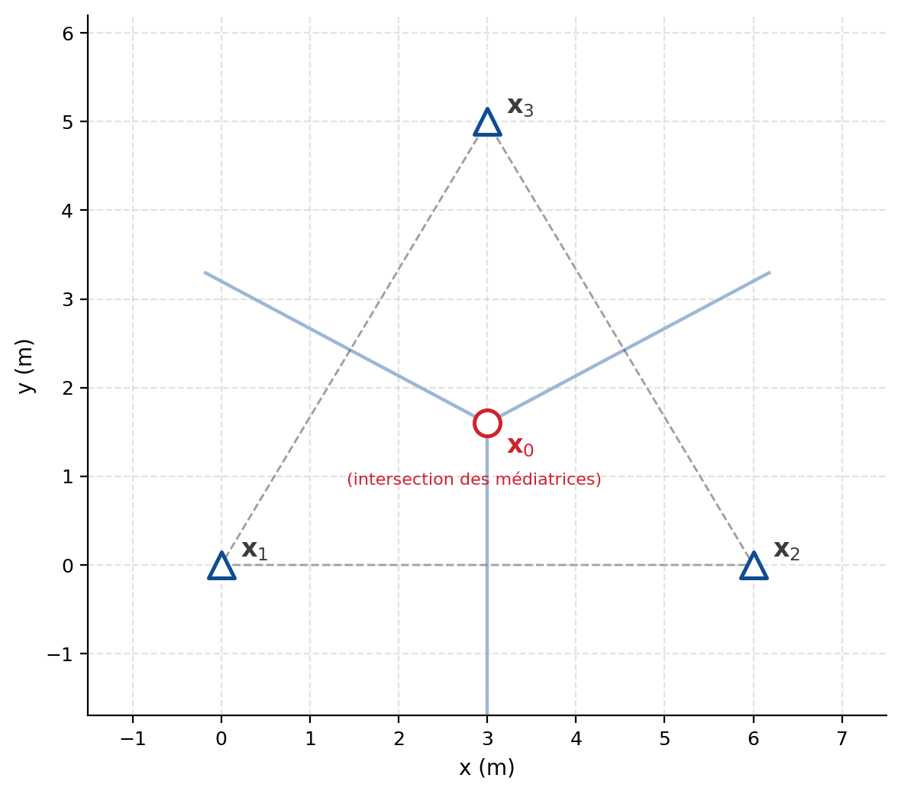
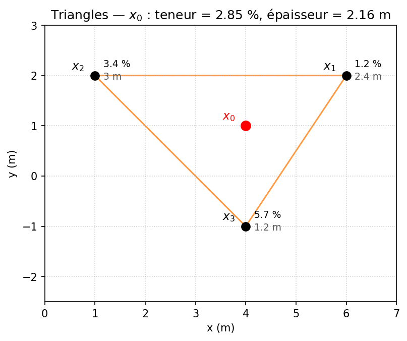
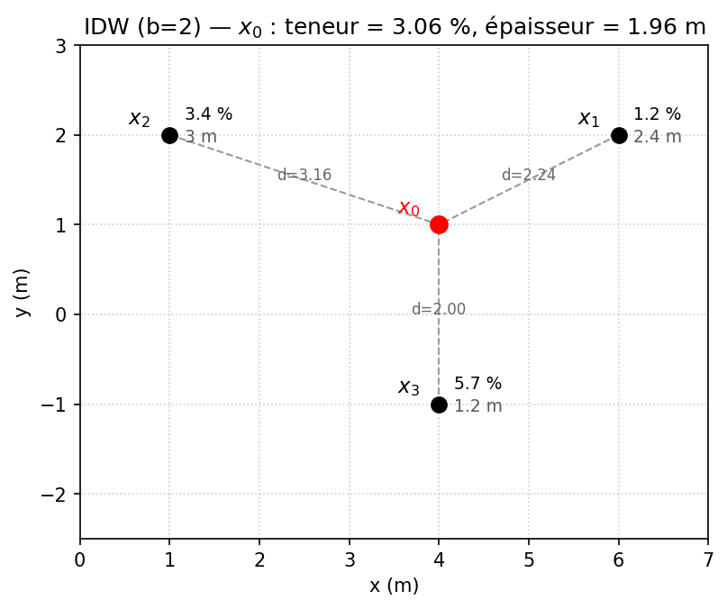

## Méthodes déterministes d’estimation des ressources {#sec-ex-ch05 .recueil}
Les exercices ci-dessous portent sur les méthodes déterministes d'estimation : méthode des polygones (plus proche voisin), méthode des triangles et inverse de la distance (IDW). Ils sont ordonnés du plus simple (lecture du plus proche voisin) au plus complexe (IDW multi-points avec critère de recherche, anisotropie et choix de l'exposant). Tous proviennent des examens « méthode conventionnelle » du cours.

{#fig-c05-comparaison fig-align="center" width="100%"}

---

### Exercice 1 — Plus proche voisin (méthode des polygones)

On dispose de trois sondages recoupant une veine minéralisée. Pour chacun, on connaît la teneur $t_i$ et l'épaisseur $w_i$ de la veine :

| Sondage | Teneur $t_i$ (%) | Épaisseur $w_i$ (m) |
|---------|------------------:|---------------------:|
| $\mathbf{x}_1$ | 2,4 | — |
| $\mathbf{x}_2$ | 3,4 | — |
| $\mathbf{x}_3$ | 5,7 | 1,2 |

Le point à estimer $\mathbf{x}_0$ est situé à une distance $d_1 = 2{,}24$ m de $\mathbf{x}_1$, $d_2 = 3{,}16$ m de $\mathbf{x}_2$ et $d_3 = 2{,}00$ m de $\mathbf{x}_3$.

À l'aide de la méthode des polygones (plus proche voisin), estimez la teneur et l'épaisseur en $\mathbf{x}_0$.

{#fig-c05-polygones fig-align="center" width="70%"}

::: {.callout-note collapse="true"}
## Solution

La méthode des polygones attribue à $\mathbf{x}_0$ la valeur de l'échantillon le plus proche. On compare les distances :

$$
d_1 = 2{,}24\text{ m}, \qquad d_2 = 3{,}16\text{ m}, \qquad d_3 = 2{,}00\text{ m}.
$$

Le plus proche voisin est $\mathbf{x}_3$ ($d_3 = 2{,}00$ m). Les poids sont donc

$$
\lambda_3 = 1, \qquad \lambda_1 = \lambda_2 = 0,
$$

et l'estimation est

$$
Z^*(\mathbf{x}_0) = Z(\mathbf{x}_3) = [\,5{,}7\;\%,\; 1{,}2\;\text{m}\,].
$$

La valeur estimée est constante à l'intérieur du polygone de Voronoï entourant $\mathbf{x}_3$ et ne dépend que du patron géométrique des échantillons.
:::

---

### Exercice 2 — Polygones de Thiessen : point sur une frontière

La figure suivante présente un patron d'échantillonnage. Le point à estimer $\mathbf{x}_0$ tombe exactement au point médian commun des trois polygones de Thiessen qui l'entourent (intersection des médiatrices).

{#fig-ex05-thiessen_frontiere fig-align="center" width="62%"}

**a)** Quelle difficulté pose l'estimation de $\mathbf{x}_0$ par la méthode des polygones lorsque $\mathbf{x}_0$ tombe exactement sur une frontière ?

**b)** Proposez une façon raisonnable d'attribuer une valeur à $\mathbf{x}_0$ dans ce cas.

::: {.callout-note collapse="true"}
## Solution

**a)** L'estimation par polygones est **discontinue** aux frontières : la valeur attribuée change brusquement selon le polygone dans lequel se trouve $\mathbf{x}_0$. Quand $\mathbf{x}_0$ tombe exactement sur le point médian commun des trois polygones l'entourant, il n'appartient à aucun polygone de façon univoque : il faut faire un choix.

**b)** Une solution simple consiste à prendre la **moyenne** des valeurs des polygones (échantillons) qui se partagent cette frontière, par exemple la moyenne des trois polygones adjacents. Ce choix reste arbitraire, ce qui illustre la limite de discontinuité de la méthode.
:::

---

### Exercice 3 — Méthode des triangles : interpolation aux arêtes

Sur un plan de localisation, on doit estimer un point $\mathbf{x}_0$ situé à l'intérieur d'un réseau de triangles. Les teneurs aux points d'échantillonnage voisins sont :

| Point | Teneur (ppm) |
|-------|-------------:|
| $\mathbf{x}_1$ | 12 |
| $\mathbf{x}_2$ | 7 |
| $\mathbf{x}_3$ | 5 |

On procède par interpolations linéaires successives le long des segments :

- la projection de $\mathbf{x}_0$ sur le segment $\mathbf{x}_2\text{–}\mathbf{x}_3$ tombe **au centre** du segment ;
- le point $\mathbf{x}_0$ se trouve **au 1/3–2/3** sur le segment reliant $\mathbf{x}_1$ au point précédent (noté $\mathbf{x}_{23}$).

Estimez la teneur en $\mathbf{x}_0$.

::: {.callout-note collapse="true"}
## Solution

**Étape 1 — interpolation sur le segment $\mathbf{x}_2\text{–}\mathbf{x}_3$.** La projection tombe au centre, donc on prend la moyenne :

$$
t_{23} = \frac{t_2 + t_3}{2} = \frac{7 + 5}{2} = 6 \text{ ppm}.
$$

**Étape 2 — interpolation entre $\mathbf{x}_1$ et $\mathbf{x}_{23}$.** Le point $\mathbf{x}_0$ se situe au 1/3 depuis $\mathbf{x}_{23}$ (et 2/3 depuis $\mathbf{x}_1$) :

$$
t_0 = t_{23} + \tfrac{1}{3}\,(t_1 - t_{23}) = 6 + \tfrac{1}{3}\,(12 - 6) = 6 + 2 = 8 \text{ ppm}.
$$

L'estimation en $\mathbf{x}_0$ est donc **8 ppm**. Cette interpolation linéaire par morceaux assure la continuité aux arêtes partagées entre triangles.
:::

---

### Exercice 4 — Méthode des triangles sur une veine (épaisseur variable)

Trois sondages recoupent une veine. On connaît la teneur $t_i$ et l'épaisseur $w_i$ à chaque sommet d'un triangle :

| Sommet | Teneur $t_i$ (%) | Épaisseur $w_i$ (m) |
|--------|------------------:|---------------------:|
| $\mathbf{x}_1$ | 1,2 | 2,4 |
| $\mathbf{x}_2$ | 3,0 | 3,4 |
| $\mathbf{x}_3$ | 5,7 | 1,2 |

Le point à estimer $\mathbf{x}_0$ se projette à 2/5 du segment $\mathbf{x}_1\text{–}\mathbf{x}_2$ (depuis $\mathbf{x}_1$), puis se trouve à 1/3 du segment reliant ce point projeté ($\mathbf{x}_{12}$) au sommet $\mathbf{x}_3$ (depuis $\mathbf{x}_{12}$).

Estimez la teneur et l'épaisseur en $\mathbf{x}_0$ par interpolations linéaires successives sur l'**accumulation** $a = t\cdot w$ et sur l'épaisseur.

{#fig-c05-triangles fig-align="center" width="70%"}

> **Note.** Le calcul de l'accumulation $a = t \cdot w$ (teneur × épaisseur) relève du chapitre 4. On le rappelle ici seulement comme grandeur d'entrée de l'interpolation par triangles ; l'objet de l'exercice est l'interpolation linéaire elle-même.

::: {.callout-note collapse="true"}
## Solution

**Accumulations aux sommets** ($a_i = t_i \, w_i$, rappel du ch. 4) :

$$
a_1 = 1{,}2 \times 2{,}4 = 2{,}88, \qquad
a_2 = 3{,}0 \times 3{,}4 = 10{,}2, \qquad
a_3 = 5{,}7 \times 1{,}2 = 6{,}84.
$$

**Étape 1 — segment $\mathbf{x}_1\text{–}\mathbf{x}_2$, à 2/5 depuis $\mathbf{x}_1$.** On interpole linéairement l'accumulation et l'épaisseur :

$$
a_{12} = a_1 + \tfrac{2}{5}\,(a_2 - a_1) = 2{,}88 + \tfrac{2}{5}\,(10{,}2 - 2{,}88) = 5{,}808,
$$

$$
w_{12} = w_1 + \tfrac{2}{5}\,(w_2 - w_1) = 2{,}4 + \tfrac{2}{5}\,(3{,}0 - 2{,}4) = 2{,}64 \text{ m}.
$$

**Étape 2 — segment $\mathbf{x}_{12}\text{–}\mathbf{x}_3$, à 1/3 depuis $\mathbf{x}_{12}$.**

$$
a_{0} = a_{12} + \tfrac{1}{3}\,(a_3 - a_{12}) = 5{,}808 + \tfrac{1}{3}\,(6{,}84 - 5{,}808) = 6{,}152,
$$

$$
w_{0} = w_{12} + \tfrac{1}{3}\,(w_3 - w_{12}) = 2{,}64 + \tfrac{1}{3}\,(1{,}2 - 2{,}64) = 2{,}16 \text{ m}.
$$

**Teneur estimée** (accumulation divisée par l'épaisseur) :

$$
t_0 = \frac{a_0}{w_0} = \frac{6{,}152}{2{,}16} = 2{,}85\;\%.
$$

L'estimation en $\mathbf{x}_0$ est donc $[\,2{,}85\;\%,\; 2{,}16\;\text{m}\,]$.
:::

---

### Exercice 5 — Inverse de la distance sur une veine ($b = 2$)

On reprend les trois sondages de l'exercice 4 :

| Sondage | Teneur $t_i$ (%) | Épaisseur $w_i$ (m) | Distance $d_i$ (m) |
|---------|------------------:|---------------------:|--------------------:|
| $\mathbf{x}_1$ | 1,2 | 2,4 | 2,24 |
| $\mathbf{x}_2$ | 3,0 | 3,4 | 3,16 |
| $\mathbf{x}_3$ | 5,7 | 1,2 | 2,00 |

Estimez l'épaisseur, l'accumulation puis la teneur en $\mathbf{x}_0$ par la méthode de l'inverse de la distance avec exposant $b = 2$.

{#fig-c05-idw fig-align="center" width="70%"}

> **Note.** L'accumulation $a = t\cdot w$ est une grandeur du chapitre 4 ; on l'utilise ici uniquement comme variable interpolée. On estime séparément l'épaisseur et l'accumulation par IDW, puis on en déduit la teneur $t_0 = a_0 / w_0$.

::: {.callout-note collapse="true"}
## Solution

**Poids IDW** ($\lambda_i \propto 1/d_i^{\,2}$) :

$$
\frac{1}{d_1^2} = \frac{1}{2{,}24^2} \approx 0{,}20, \quad
\frac{1}{d_2^2} = \frac{1}{3{,}16^2} \approx 0{,}10, \quad
\frac{1}{d_3^2} = \frac{1}{2{,}00^2} = 0{,}25.
$$

La somme des poids non normalisés vaut $0{,}20 + 0{,}10 + 0{,}25 = 0{,}55$.

**Épaisseur estimée :**

$$
w_0 = \frac{\sum_i \dfrac{w_i}{d_i^2}}{\sum_i \dfrac{1}{d_i^2}}
= \frac{0{,}20\times 2{,}4 + 0{,}10\times 3{,}0 + 0{,}25\times 1{,}2}{0{,}55}
= 1{,}96\ \text{m}.
$$

**Accumulation estimée** ($a_i = t_i w_i$ : $a_1 = 2{,}88$, $a_2 = 10{,}2$, $a_3 = 6{,}84$) :

$$
a_0 = \frac{0{,}20\times 2{,}88 + 0{,}10\times 10{,}2 + 0{,}25\times 6{,}84}{0{,}55}
= 6{,}01.
$$

**Teneur :**

$$
t_0 = \frac{a_0}{w_0} = \frac{6{,}01}{1{,}96} = 3{,}06\;\%.
$$

L'estimation en $\mathbf{x}_0$ est donc $[\,3{,}06\;\%,\; 1{,}96\;\text{m}\,]$. On remarque que le sondage $\mathbf{x}_3$, le plus proche ($d_3 = 2{,}00$ m), reçoit le poids le plus élevé.
:::

---

### Exercice 6 — Inverse de la distance multi-points : critère de recherche, anisotropie et exposant

Sur un plan de localisation, on veut estimer la teneur au point $\mathbf{x}_0$. Les écarts de coordonnées $(\Delta x, \Delta y)$ entre $\mathbf{x}_0$ et chacun des cinq échantillons voisins, ainsi que leurs teneurs, sont :

| Échantillon | $\Delta x$ (m) | $\Delta y$ (m) | Teneur (ppm) |
|-------------|---------------:|---------------:|-------------:|
| $\mathbf{x}_1$ | 20 | 20 | 12 |
| $\mathbf{x}_2$ | 10 | 30 | 5 |
| $\mathbf{x}_3$ | 30 | 10 | 7 |
| $\mathbf{x}_4$ | 60 | 40 | — |
| $\mathbf{x}_5$ | 70 | 20 | — |

On retient un **critère de recherche** ne conservant que les **trois** échantillons les plus proches.

**a)** Calculez les distances euclidiennes $d_i$ et identifiez les trois échantillons retenus.

**b)** Estimez la teneur en $\mathbf{x}_0$ par IDW avec exposant $b = 2$.

**c)** On souhaite maintenant introduire une anisotropie de la forme $d = \sqrt{\Delta x^2 + r^2\,\Delta y^2}$ avec un rapport d'anisotropie tel que $r^2 = 16$. Quel est l'effet de ce choix sur l'estimation ?

**d)** Les données sont peu précises (faible reproductibilité analytique). Faut-il privilégier un exposant $b$ faible ou élevé ? Justifiez.

::: {.callout-note collapse="true"}
## Solution

**a) Distances et critère de recherche.**

$$
d_1 = \sqrt{20^2 + 20^2} = 28{,}28\text{ m}, \quad
d_2 = \sqrt{10^2 + 30^2} = 31{,}62\text{ m}, \quad
d_3 = \sqrt{30^2 + 10^2} = 31{,}62\text{ m},
$$

$$
d_4 = \sqrt{60^2 + 40^2} = 72{,}11\text{ m}, \quad
d_5 = \sqrt{70^2 + 20^2} = 72{,}80\text{ m}.
$$

Les trois plus proches sont $\mathbf{x}_1$, $\mathbf{x}_2$ et $\mathbf{x}_3$ ; les échantillons $\mathbf{x}_4$ et $\mathbf{x}_5$ sont exclus par le critère de recherche.

**b) Estimation IDW ($b = 2$).** Poids non normalisés $1/d_i^2$ :

$$
\frac{1}{28{,}28^2} = 1{,}250\times 10^{-3}, \quad
\frac{1}{31{,}62^2} = 1{,}000\times 10^{-3}, \quad
\frac{1}{31{,}62^2} = 1{,}000\times 10^{-3}.
$$

Somme : $W = 3{,}251\times 10^{-3}$. Poids normalisés :

$$
\lambda_1 = 0{,}3846, \qquad \lambda_2 = 0{,}3077, \qquad \lambda_3 = 0{,}3077.
$$

$$
Z^*(\mathbf{x}_0) = 0{,}3846 \times 12 + 0{,}3077 \times 5 + 0{,}3077 \times 7 = 8{,}31\ \text{ppm}.
$$

**c) Anisotropie.** Avec $d = \sqrt{\Delta x^2 + r^2 \Delta y^2}$ et $r^2 = 16$ (soit $r = 4$), les écarts en $y$ sont multipliés par 4 dans le calcul de la distance : les points éloignés dans la direction $y$ sont perçus comme beaucoup plus éloignés et **perdent de l'influence** sur l'estimation. On favorise ainsi la continuité dans la direction $x$.

**d) Choix de l'exposant.** Comme les données sont **peu précises**, il faut **privilégier un exposant $b$ faible**. Un $b$ élevé concentre le poids sur le ou les points les plus proches ; or, si ces données sont entachées d'erreur, on ne devrait pas leur accorder un poids dominant. Un $b$ faible répartit davantage les poids et produit un estimateur plus lissé, moins sensible aux erreurs individuelles.
:::
